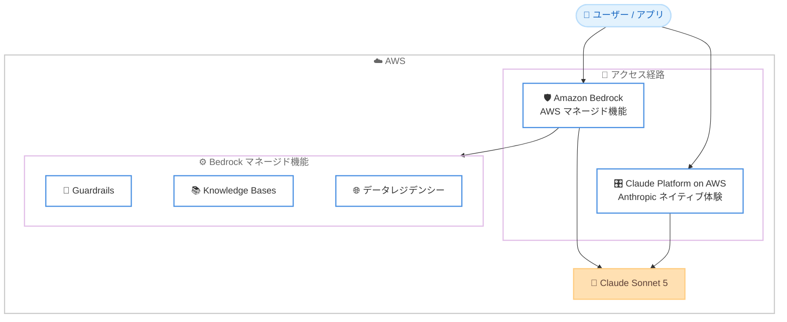

# Amazon Bedrock / Claude Platform on AWS - Claude Sonnet 5

**リリース日**: 2026 年 6 月 30 日
**サービス**: Amazon Bedrock、Claude Platform on AWS
**機能**: Anthropic Claude Sonnet 5 モデルの提供開始

📊 [このアップデートのインフォグラフィックを見る](https://takech9203.github.io/aws-news-summary/20260630-claude-sonnet-5-now-available-on-aws.html)

## 概要

AWS は、Anthropic の Claude Sonnet 5 の提供を開始しました。Claude Sonnet 5 は、Anthropic の Sonnet ファミリーで最も高性能なモデルであり、Anthropic の最新世代における初の Sonnet モデルです。Sonnet の価格帯を維持しながら、コーディング、エージェント、日常的な専門業務において最上位レベルの知能を大規模に提供します。

Claude Sonnet 5 は、能力、コスト、速度のバランスを保ちながら、コーディング、専門業務、エージェントタスクにわたって高い性能を発揮します。コーディングでは、大規模なコードベースを把握し、複数ファイルにまたがる変更を実装し、デバッグやリファクタリングのタスクを、修正の往復を減らしながら完遂します。エージェント用途では、ツールを正確に呼び出し、多数のステップにわたって状態を保持し、エラーから回復します。ナレッジワークでは、スプレッドシートの作成、ドキュメントの起草、非構造化データの構造化分析への変換を行います。

お客様は 2 つの方法で Claude Sonnet 5 にアクセスできます。1 つは Amazon Bedrock であり、データを AWS インフラストラクチャ内に保持し、Guardrails、Knowledge Bases、リージョン別データレジデンシーといった AWS マネージド機能を備えた統合サービスを通じてアクセスを提供します。もう 1 つは Claude Platform on AWS であり、AWS マネジメントコンソールを通じて Anthropic ネイティブのプラットフォーム体験に直接アクセスでき、AWS による統合された請求と認証を利用できます。

**アップデート前の課題**

このアップデート以前は、Sonnet ファミリーの最新世代モデルを AWS 上で利用できませんでした。

- 以前は、最新世代の Sonnet モデルを AWS 上で利用できなかった
- 以前は、Sonnet の価格帯で最上位レベルの知能を大規模に活用することが難しかった
- 以前は、複数ファイルにまたがるコード変更やエージェントタスクで、修正の往復が多く発生していた

**アップデート後の改善**

今回のアップデートにより、Claude Sonnet 5 を AWS 上の 2 つのアクセス経路から利用できるようになりました。

- 今回のアップデートにより、Anthropic 最新世代の Sonnet モデルを AWS 上で利用できるようになった
- 今回のアップデートにより、Sonnet の価格帯で最上位レベルの知能をコーディング、エージェント、専門業務に活用できるようになった
- 今回のアップデートにより、Amazon Bedrock と Claude Platform on AWS という用途に応じた 2 つのアクセス方法を選択できるようになった

## アーキテクチャ図



上図は、ユーザーやアプリケーションが Amazon Bedrock または Claude Platform on AWS のいずれかの経路で Claude Sonnet 5 にアクセスする構成を示しています。Amazon Bedrock 経由では Guardrails、Knowledge Bases、データレジデンシーなどの AWS マネージド機能を併用できます。

## サービスアップデートの詳細

### 主要機能

1. **コーディング能力**
   - 大規模なコードベースを把握して操作する
   - 複数ファイルにまたがる変更を実装する
   - デバッグやリファクタリングのタスクを、修正の往復を減らしながら完遂する

2. **エージェント能力**
   - ツールを正確に呼び出す
   - 多数のステップにわたって状態を保持する
   - エラーから回復する

3. **ナレッジワーク能力**
   - スプレッドシートを作成する
   - ドキュメントを起草する
   - 非構造化データを構造化された分析に変換する

## 技術仕様

### アクセス経路の比較

| 項目 | 詳細 |
|------|------|
| Amazon Bedrock | データを AWS インフラストラクチャ内に保持し、Guardrails、Knowledge Bases、リージョン別データレジデンシーなどの AWS マネージド機能を統合サービスとして提供 |
| Claude Platform on AWS | AWS マネジメントコンソールを通じて Anthropic ネイティブのプラットフォーム体験に直接アクセスし、AWS による統合された請求と認証を利用 |

### モデルへのアクセス方法の違い

| アクセス経路 | クライアント / モデル ID の例 |
|------|------|
| Amazon Bedrock | Mantle クライアント (例: Python `AnthropicBedrockMantle`) を使用し、モデル ID は `anthropic.` プレフィックス付き |
| Claude Platform on AWS | AWS 向けクライアント (例: Python `AnthropicAWS`) を使用し、モデル ID はプレフィックスなしのファーストパーティ文字列 |

## 設定方法

### 前提条件

1. AWS アカウントと、Amazon Bedrock または Claude Platform on AWS へのアクセス権限
2. 利用するリージョンでの Claude Sonnet 5 へのモデルアクセスの有効化
3. アプリケーションから呼び出す場合は、適切な IAM 権限と AWS 認証情報の設定

### 手順

#### ステップ 1: モデルアクセスの確認

Amazon Bedrock マネジメントコンソールのモデルアクセス画面で、Claude Sonnet 5 へのアクセスを有効化します。利用可能なリージョンは、Bedrock のモデルリージョン対応ドキュメントで確認してください。

#### ステップ 2: Amazon Bedrock 経由での呼び出し

Amazon Bedrock で利用する場合は、Mantle クライアントを使用し、`anthropic.` プレフィックス付きのモデル ID を指定します。

```python
from anthropic import AnthropicBedrockMantle

client = AnthropicBedrockMantle(aws_region="us-east-1")

response = client.messages.create(
    model="anthropic.claude-sonnet-5",
    max_tokens=16000,
    messages=[{"role": "user", "content": "リファクタリング対象のコードを分析してください"}],
)
```

上記は、Amazon Bedrock の Messages API エンドポイント (Mantle クライアント) を通じて Claude Sonnet 5 を呼び出す例です。`aws_region` の指定は必須です。

#### ステップ 3: Claude Platform on AWS 経由での呼び出し

Claude Platform on AWS で利用する場合は、AWS 向けクライアントを使用し、プレフィックスなしのモデル ID を指定します。リージョンとワークスペース ID の指定が必要です。

```python
from anthropic import AnthropicAWS

# AWS_REGION と ANTHROPIC_AWS_WORKSPACE_ID は環境変数から取得
client = AnthropicAWS()

response = client.messages.create(
    model="claude-sonnet-5",
    max_tokens=16000,
    messages=[{"role": "user", "content": "リファクタリング対象のコードを分析してください"}],
)
```

上記は、Claude Platform on AWS を通じて Claude Sonnet 5 を呼び出す例です。認証は AWS の SigV4 と IAM に基づきます。

## メリット

### ビジネス面

- **コスト効率**: Sonnet の価格帯で最上位レベルの知能を利用でき、大規模な展開に適している
- **柔軟なアクセス**: Amazon Bedrock と Claude Platform on AWS のどちらを選んでも、AWS の請求や認証と統合される
- **幅広い適用範囲**: コーディング、エージェント、日常的な専門業務という複数のユースケースを 1 つのモデルでカバーできる

### 技術面

- **マルチファイル変更とリファクタリング**: 大規模なコードベースでの変更を、修正の往復を減らしながら完遂できる
- **エージェントの信頼性**: ツールの正確な呼び出し、多数ステップにわたる状態保持、エラーからの回復に対応する
- **AWS マネージド機能との統合**: Amazon Bedrock 経由では Guardrails や Knowledge Bases などと組み合わせて利用できる

## デメリット・制約事項

### 制限事項

- 利用可能なリージョンは限定されており、Bedrock のモデルリージョン対応ドキュメントで確認する必要がある
- 料金の具体的な数値は本発表では明示されておらず、別途料金ページの確認が必要となる
- Fast Mode や Message Batches などの一部機能は、アクセス経路 (Amazon Bedrock / Claude Platform on AWS) によって対応状況が異なる場合がある

### 考慮すべき点

- データレジデンシーやデータ保持の要件に応じて、Amazon Bedrock と Claude Platform on AWS のどちらが適しているかを評価する必要がある
- 既存のアプリケーションを移行する場合は、アクセス経路に応じてクライアントクラスとモデル ID のプレフィックスを正しく使い分ける必要がある

## ユースケース

### ユースケース 1: 大規模コードベースのリファクタリング

**シナリオ**: 複数ファイルにまたがる変更が必要なレガシーアプリケーションのリファクタリングを、開発チームが効率化したい。

**実装例**:
```
Amazon Bedrock 経由で Claude Sonnet 5 を呼び出し、
対象コードベースの構造を把握させたうえで、
複数ファイルにまたがる変更案を生成し、デバッグまで完遂させる
```

**効果**: 修正の往復が減り、リファクタリングやデバッグの所要時間を短縮できます。

### ユースケース 2: ツールを活用するエージェントの構築

**シナリオ**: 社内システムと連携し、多数のステップを自律的に実行するエージェントを構築したい。

**実装例**:
```
Claude Sonnet 5 にツール定義を渡し、
ツールの呼び出しと結果の処理を多数のステップにわたって実行させ、
途中でエラーが発生しても回復しながらタスクを完了させる
```

**効果**: 状態保持とエラー回復により、長い手順のエージェントワークフローを安定して実行できます。

### ユースケース 3: 非構造化データの構造化分析

**シナリオ**: 散在する非構造化のドキュメントやメモから、意思決定に使える構造化データを作成したい。

**実装例**:
```
非構造化の素材を Claude Sonnet 5 に入力し、
スプレッドシートやレポートとして整理された分析結果を生成させる
```

**効果**: 手作業による整理の負担を減らし、専門業務の生産性を高められます。

## 料金

Claude Sonnet 5 は Sonnet の価格帯で提供されます。本発表では具体的な料金の数値は示されていないため、最新の料金は Amazon Bedrock の料金ページおよび Claude Platform on AWS の料金情報で確認してください。Amazon Bedrock では、入力トークンと出力トークンに基づく従量課金が適用されます。

## 利用可能リージョン

本発表では具体的なリージョンの一覧は示されていません。利用可能なリージョンは、Amazon Bedrock のモデルリージョン対応ドキュメント (Anthropic モデルのセクション) で確認してください。

## 関連サービス・機能

- **Amazon Bedrock Guardrails**: Claude Sonnet 5 の入出力に対して安全性ポリシーを適用できる
- **Amazon Bedrock Knowledge Bases**: 独自のデータソースと連携し、検索拡張生成 (RAG) を実現できる
- **Claude Platform on AWS**: Anthropic ネイティブのプラットフォーム体験に AWS の請求・認証で直接アクセスできる

## 参考リンク

- 📊 [インフォグラフィック](https://takech9203.github.io/aws-news-summary/20260630-claude-sonnet-5-now-available-on-aws.html)
- [公式発表 (What's New)](https://aws.amazon.com/about-aws/whats-new/2026/06/claude-sonnet-5-now-available-on-aws)
- [Amazon Bedrock モデルカード (Claude Sonnet 5)](https://docs.aws.amazon.com/bedrock/latest/userguide/model-card-anthropic-claude-sonnet-5.html)
- [Amazon Bedrock リージョン対応 (Anthropic モデル)](https://docs.aws.amazon.com/bedrock/latest/userguide/models-region-compatibility.html#model-regions-anthropic)
- [Claude Platform on AWS セットアップ](https://docs.aws.amazon.com/claude-platform/latest/userguide/setup.html)

## まとめ

Claude Sonnet 5 が Amazon Bedrock と Claude Platform on AWS の両方で利用可能になり、Anthropic 最新世代の Sonnet モデルを AWS 上で活用できるようになりました。コーディング、エージェント、ナレッジワークを Sonnet の価格帯で大規模に実行したいお客様にとって有力な選択肢です。まずは利用リージョンでモデルアクセスを有効化し、データレジデンシーや認証の要件に応じて Amazon Bedrock と Claude Platform on AWS のどちらの経路が適しているかを評価することを推奨します。
