# Amazon CloudWatch pipelines - OpenTelemetry メトリクスの処理とエンリッチメント対応

**リリース日**: 2026 年 6 月 30 日
**サービス**: Amazon CloudWatch
**機能**: CloudWatch pipelines による OpenTelemetry (OTel) メトリクスの処理・エンリッチメント

📊 [このアップデートのインフォグラフィックを見る](https://takech9203.github.io/aws-news-summary/20260630-cloudwatch-pipelines-otel-metrics.html)
<!-- INFOGRAPHIC_BASE_URL は環境変数から取得 -->

## 概要

Amazon CloudWatch pipelines が、取り込み (インジェスト) 時に OpenTelemetry (OTel) メトリクスを処理・エンリッチする機能をサポートしました。CloudWatch pipelines は、テレメトリデータを取り込み、変換し、CloudWatch にルーティングするフルマネージドサービスであり、ユーザーがインフラストラクチャを管理する必要はありません。

今回のアップデートにより、OTel メトリクスの変換をインジェストパスの一部として一元的に適用できるようになりました。新しいインフラストラクチャは不要で、アプリケーションの計装 (instrumentation) を変更することなく、一致したメトリクスに対して透過的に処理が適用されます。これにより、変更できないソースから送られてくるメトリクスに対しても、チーム所有者、コストセンター、環境タグといったビジネスコンテキストを付与できます。

この機能は、監視・オブザーバビリティを担当するプラットフォームエンジニアや SRE、コスト最適化を進めたい運用チームを対象としています。処理された OTel メトリクスは Query Studio で PromQL を使ってクエリでき、CloudWatch アラームや異常検出とも互換性があります。

**アップデート前の課題**

このアップデート以前は、OTel メトリクスを保存前にエンリッチまたは変換する必要がある場合、独自の対応が求められました。

- 以前は OTel メトリクスをエンリッチ・変換するために、カスタムの処理レイヤーを構築する必要があった
- 以前はアプリケーション側の計装をソースで変更する必要があり、変更できないソースには対応できなかった
- 以前は高カーディナリティのラベルを削減してストレージコストを抑える仕組みを自前で用意する必要があった

**アップデート後の改善**

今回のアップデートにより、追加のインフラストラクチャなしでインジェストパス上でメトリクスを一元的に処理できるようになりました。

- 今回のアップデートにより、新しいインフラストラクチャなしでメトリクス変換をインジェストパスの一部として一元的に適用できるようになった
- 今回のアップデートにより、変更できないソースのメトリクスにもビジネスコンテキスト (チーム、コストセンター、環境タグなど) を付与できるようになった
- 今回のアップデートにより、高カーディナリティのラベル削除によるストレージコスト削減や、命名規則統一のためのメトリクス・属性のリネームがマネージドで実現できるようになった

## アーキテクチャ図

```mermaid
flowchart LR
    subgraph Sources["📡 メトリクスソース"]
        direction LR
        App1["🖥️ アプリケーション A"]
        App2["🖥️ 変更不可のソース"]
        App1 ~~~ App2
    end

    subgraph Pipeline["⚙️ CloudWatch pipelines"]
        direction LR
        Source["📥 Source<br/>CloudWatch Metrics OTel"]
        Proc["🔧 Processors<br/>エンリッチ / リネーム / ラベル削除"]
        Sink["📤 Sink<br/>cloudwatch_metrics"]
        Source --> Proc --> Sink
    end

    subgraph CW["☁️ Amazon CloudWatch"]
        direction LR
        Store["🗄️ メトリクスストア"]
        Query["🔍 Query Studio PromQL"]
        Alarm["🔔 アラーム / 異常検出"]
        Store ~~~ Query ~~~ Alarm
    end

    App1 -->|OTLP| Source
    App2 -->|OTLP| Source
    Sink --> Store

    classDef input fill:#E9F7EC,stroke:#66BB6A,stroke-width:2px,color:#333333
    classDef process fill:#FFFFFF,stroke:#4A90E2,stroke-width:2px,color:#333333
    classDef internal fill:#E8F1FF,stroke:#4A90E2,stroke-width:2px,color:#333333
    classDef cloud fill:none,stroke:#CCCCCC,stroke-width:2px,color:#666666

    class Sources,Pipeline,CW cloud
    class App1,App2 input
    class Source,Sink internal
    class Proc process
    class Store,Query,Alarm internal
```



OTLP 経由で取り込まれた OTel メトリクスが、CloudWatch pipelines の Source、Processors、Sink を順に通過し、変換・エンリッチされたうえで CloudWatch に格納される流れを示しています。

## サービスアップデートの詳細

### 主要機能

1. **メトリクスのエンリッチメント**
   - チーム所有者、コストセンター、環境タグなどのビジネスコンテキストをメトリクスに付与できる
   - 変更できないソースから送られてくるメトリクスにも属性を追加できる
   - アプリケーションの計装を変更する必要がない

2. **高カーディナリティラベルの削除**
   - カスタムワークロードから送られる高カーディナリティのラベルを削除できる
   - 保存されるメトリクス量を減らし、ストレージコストを削減できる

3. **メトリクス・属性のリネームによる標準化**
   - メトリクス名や属性名をリネームして、組織全体で一貫した命名規則を強制できる
   - インジェストパス上で透過的に適用され、一致したメトリクスにのみ処理が適用される

## 技術仕様

### パイプラインの構成要素

| 項目 | 詳細 |
|------|------|
| Source | データの発生元を定義。メトリクスパイプラインでは CloudWatch Metrics (OTel) を選択し、OTLP インジェストパス上で処理する。パイプラインごとに 1 つ必須 |
| Processors | データをフローする過程で変換・エンリッチ。定義した順に逐次適用される。メトリクスパイプラインは OTel メトリクス属性向けに最適化されたプロセッサーをサポート |
| Sink | 処理済みデータの送信先を定義。メトリクスでは `cloudwatch_metrics` を使用。パイプラインごとに 1 つ必須 |
| Extensions | AWS Secrets Manager 連携などの追加機能を提供 (任意) |

### 主なクォータ

| 項目 | 詳細 |
|------|------|
| メトリクスパイプライン数 | アカウントあたり最大 300 |
| プロセッサー数 | パイプラインあたり最大 20 (ログ・メトリクス共通) |
| メトリクスのインジェストパス | OTLP のみサポート |

### API変更履歴

該当する API 変更履歴は確認できませんでした。

## 設定方法

### 前提条件

1. CloudWatch pipelines および CloudWatch ネイティブ OpenTelemetry メトリクスがサポートされているリージョンを利用していること
2. OTLP 経由で OTel メトリクスを CloudWatch に送信できる構成になっていること
3. CloudWatch pipelines を操作するための適切な IAM 権限があること

### 手順

#### ステップ1: CloudWatch コンソールで pipelines を開く

```text
CloudWatch コンソール > Ingestion > pipelines
```

CloudWatch コンソールのインジェスト設定内にある pipelines のページを開きます。ここからメトリクスパイプラインの作成を開始します。

#### ステップ2: ソースとして OTel メトリクスを選択

```text
Source: CloudWatch Metrics (OTel)
```

パイプラインのソースとして CloudWatch Metrics (OTel) を選択します。これにより、OTLP インジェストパス上の OTel メトリクスが処理対象になります。

#### ステップ3: プロセッサーとシンクを設定

エンリッチメント、ラベル削除、リネームなどのプロセッサーを必要な順序で追加し、シンクとして `cloudwatch_metrics` を指定します。プロセッサーは定義した順に逐次適用されます。設定後、一致したメトリクスに透過的に処理が適用されます。

## メリット

### ビジネス面

- **コスト削減**: 高カーディナリティラベルの削除により、保存メトリクス量とストレージコストを削減できる
- **運用コストの低減**: カスタム処理レイヤーの構築・運用が不要になり、開発・保守の負担を下げられる
- **コスト配賦の明確化**: コストセンターやチームのタグを付与することで、メトリクスをビジネス単位で整理できる

### 技術面

- **インフラ不要**: 新しいインフラストラクチャを管理せずにインジェストパスで変換を適用できる
- **アプリ非改変**: アプリケーションの計装を変更せずに、変更できないソースのメトリクスも処理できる
- **一貫性の確保**: メトリクス・属性のリネームにより、組織全体で一貫した命名規則を強制できる

## デメリット・制約事項

### 制限事項

- メトリクスのインジェストパスは OTLP のみサポートされる
- プロセッサーはパイプラインあたり最大 20 個まで
- メトリクスパイプラインはアカウントあたり最大 300 個まで
- パイプライン定義はカスタマー提供のキーで暗号化されないため、パスワードや API キー、PII などの機微情報を含めてはならない

### 考慮すべき点

- プロセッサーはメトリクスを変換するため、処理内容によっては元の値と異なる形で保存される点を理解しておく必要がある
- 処理は一致したメトリクスにのみ透過的に適用されるため、マッチ条件の設計を確認する

## ユースケース

### ユースケース1: 変更できないソースへのビジネスコンテキスト付与

**シナリオ**: サードパーティ製ソフトウェアや共通基盤から送られる OTel メトリクスに、アプリケーションを改変せずにチームやコストセンターのタグを付与したい。

**実装例**:
```text
Processor: add-attributes
  team = platform-team
  cost_center = 12345
  environment = production
```

**効果**: 変更できないソースのメトリクスも、ビジネス単位で分類・集計できるようになる。

### ユースケース2: 高カーディナリティラベルの削除によるコスト最適化

**シナリオ**: カスタムワークロードが request_id のような高カーディナリティ属性を大量に付与しており、ストレージコストが増大している。

**実装例**:
```text
Processor: delete-attributes
  remove = request_id, session_id
```

**効果**: 不要な高カーディナリティラベルを削除し、保存されるメトリクス量とコストを削減できる。

### ユースケース3: 命名規則の統一

**シナリオ**: 複数チームがそれぞれ異なる命名規則でメトリクスを送っており、組織全体で統一したい。

**実装例**:
```text
Processor: rename
  from = svc.req.latency
  to   = service.request.latency
```

**効果**: メトリクス名・属性名を統一し、クエリやダッシュボードの一貫性を高められる。

## 料金

OTel メトリクスの pipelines による処理は追加料金なしで提供されます。ただし、OTel メトリクスのインジェストには標準の CloudWatch 料金が適用されます。料金の詳細は CloudWatch の料金ページを参照してください。

### 料金例

| 使用量 | 月額料金 (概算) |
|--------|------------------|
| pipelines による OTel メトリクス処理 | 追加料金なし |
| OTel メトリクスのインジェスト・保存 | 標準の CloudWatch 料金が適用 |

## 利用可能リージョン

CloudWatch pipelines および CloudWatch ネイティブ OpenTelemetry メトリクスがサポートされているすべての AWS リージョンで利用できます。CloudWatch pipelines は、米国 (バージニア北部、オハイオ)、米国西部 (北カリフォルニア、オレゴン)、アジアパシフィック (東京、大阪、ソウル、ムンバイ、シンガポール、シドニーなど)、欧州 (フランクフルト、アイルランド、ロンドン、スペインなど) を含む多数のリージョンで提供されています。

## 関連サービス・機能

- **Amazon CloudWatch**: 処理済みメトリクスの格納・アラーム・異常検出の基盤
- **OpenTelemetry (OTel)**: メトリクスの計装・送信に使用する標準規格 (OTLP でインジェスト)
- **CloudWatch Query Studio (PromQL)**: 処理済みメトリクスを PromQL でクエリするための機能
- **AWS Secrets Manager**: パイプラインの Extensions を通じた認証情報管理

## 参考リンク

- 📊 [インフォグラフィック](https://takech9203.github.io/aws-news-summary/20260630-cloudwatch-pipelines-otel-metrics.html)
- [公式発表 (What's New)](https://aws.amazon.com/about-aws/whats-new/2026/06/cloudwatch-pipelines-otel-metrics)
- [ドキュメント (CloudWatch pipelines)](https://docs.aws.amazon.com/AmazonCloudWatch/latest/monitoring/cloudwatch-pipelines.html)
- [ドキュメント (CloudWatch native OpenTelemetry metrics)](https://docs.aws.amazon.com/AmazonCloudWatch/latest/monitoring/metrics-otel-recommended.html)
- [料金ページ](https://aws.amazon.com/cloudwatch/pricing/)

## まとめ

今回のアップデートにより、OTel メトリクスのエンリッチメント、ラベル削除、リネームといった変換を、追加のインフラやアプリ改変なしにインジェストパス上で一元的に適用できるようになりました。特に、変更できないソースへのビジネスコンテキスト付与やコスト最適化を検討しているチームにとって有用です。まずは対象リージョンで CloudWatch コンソールから CloudWatch Metrics (OTel) をソースとするメトリクスパイプラインを作成し、既存の OTel メトリクスに対する処理設計を検討することをおすすめします。
