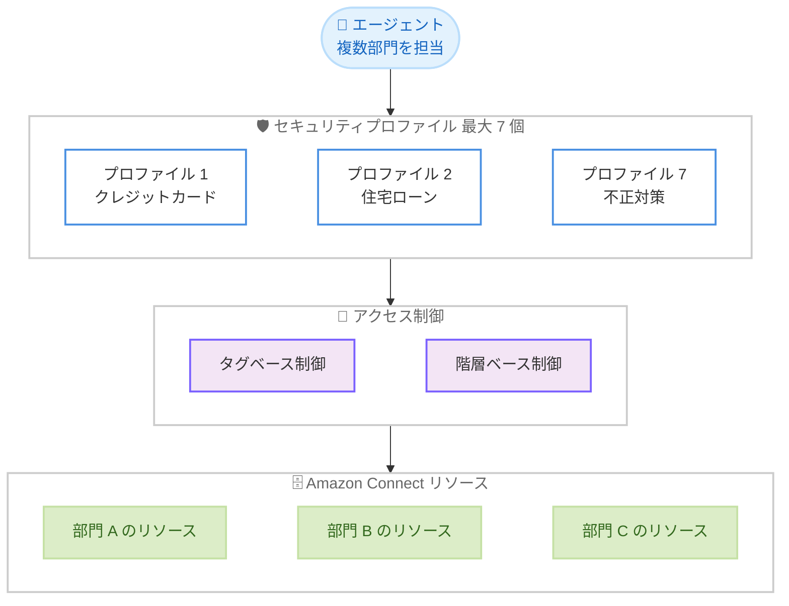

# Amazon Connect - ユーザーあたり最大 7 個のセキュリティプロファイル割り当て

**リリース日**: 2026年6月30日
**サービス**: Amazon Connect
**機能**: ユーザーあたりのセキュリティプロファイル割り当て上限の拡張 (最大 7 個)

📊 [このアップデートのインフォグラフィックを見る](https://takech9203.github.io/aws-news-summary/20260630-connect-7-security-profiles-user.html)
<!-- INFOGRAPHIC_BASE_URL は環境変数から取得 -->

## 概要

Amazon Connect Customer において、1 ユーザーに割り当て可能なセキュリティプロファイルの上限が、従来の 2 個から 7 個に拡張されました。これにより、複数の事業部門 (ライン オブ ビジネス) を担当するエージェントに対して、部門ごとに個別かつスコープを絞った権限セットを付与できるようになります。各権限セットは、タグベースまたは階層 (ハイエラルキー) ベースのアクセス制御によって適用されます。

この拡張により、組織構造に合わせてセキュリティモデルを柔軟に構成できます。たとえば、クレジットカード、住宅ローン、自動車ローン、個人向け銀行業務、投資、保険、不正対策といった 7 つの独立した事業部門を持つ金融サービス企業では、1 人のエージェントに対して事業部門ごとに 1 つずつ、合計 7 個のセキュリティプロファイルを割り当てられます。各プロファイルは、その部門向けにタグ付けされたリソースへのアクセスのみを許可します。

このアプローチにより、過度に広範な単一プロファイルを用意することなく、最小権限 (least privilege) の原則を維持したままアクセス制御を実現できます。本機能は、Amazon Connect が提供されているすべての AWS リージョンで利用可能です。

**アップデート前の課題**

- 1 ユーザーに割り当てられるセキュリティプロファイルは最大 2 個までという制限があった
- 複数の事業部門を担当するエージェントに対して、部門ごとに細かく権限を分けることが難しかった
- 制限を回避するために、複数部門の権限をまとめた過度に広範な単一プロファイルを作成せざるを得ないケースがあり、最小権限の原則に反する構成になりやすかった

**アップデート後の改善**

- 1 ユーザーに最大 7 個のセキュリティプロファイルを割り当て可能になった
- 事業部門ごとにスコープを絞った権限セットを個別に付与できるようになった
- タグベースまたは階層ベースのアクセス制御を活用し、最小権限を維持しながら組織構造に合致したアクセス制御を構成できるようになった

## アーキテクチャ図



1 人のエージェントに部門ごとのセキュリティプロファイルを最大 7 個割り当て、タグベースまたは階層ベースのアクセス制御を通じて、各部門のリソースへ最小権限でアクセスさせる構成を示しています。

## サービスアップデートの詳細

### 主要機能

1. **セキュリティプロファイル割り当て上限の拡張**
   - 1 ユーザーあたりのセキュリティプロファイル割り当て上限が 2 個から 7 個に増加
   - 複数の事業部門を担当するエージェントに、部門ごとに独立した権限セットを割り当て可能

2. **タグベース / 階層ベースのアクセス制御との連携**
   - 各セキュリティプロファイルの権限は、タグベースまたは階層ベースのアクセス制御によって適用される
   - 部門向けにタグ付けされたリソースへのアクセスのみを許可し、スコープを厳密に限定できる

3. **最小権限の原則の維持**
   - 過度に広範な単一プロファイルを作成する必要がなくなる
   - 組織構造に直接対応したセキュリティモデルを、最小権限を保ちながら構成できる

## 技術仕様

### セキュリティプロファイル割り当ての上限比較

| 項目 | アップデート前 | アップデート後 |
|------|----------------|----------------|
| ユーザーあたりの割り当て上限 | 2 個 | 7 個 |
| アクセス制御方式 | タグベース / 階層ベース | タグベース / 階層ベース |
| 対象 | Amazon Connect Customer | Amazon Connect Customer |

### アクセス制御の考え方

| 制御方式 | 概要 |
|----------|------|
| タグベースアクセス制御 | リソースに付与されたタグに基づき、アクセス可能な範囲を制限する |
| 階層ベースアクセス制御 | エージェント階層 (ハイエラルキー) に基づき、アクセス可能な範囲を制限する |

## 設定方法

### 前提条件

1. Amazon Connect インスタンスが作成済みであること
2. セキュリティプロファイルおよびユーザーを管理する権限を持っていること
3. タグベースアクセス制御を利用する場合は、対象リソースへ適切にタグが付与されていること

### 手順

#### ステップ1: セキュリティプロファイルの作成

Amazon Connect 管理者ページで、事業部門ごとにセキュリティプロファイルを作成します。各プロファイルには、その部門で必要な権限のみを付与します。タグベースアクセス制御を利用する場合は、プロファイルの適用対象を該当部門のタグに限定します。

#### ステップ2: ユーザーへのプロファイル割り当て

対象ユーザー (エージェント) の編集画面で、担当する事業部門に対応するセキュリティプロファイルを割り当てます。今回のアップデートにより、最大 7 個まで割り当て可能です。

#### ステップ3: アクセス範囲の検証

割り当て後、各プロファイルのタグベースまたは階層ベースのアクセス制御が意図したとおりに機能し、各部門のリソースに対して最小権限でアクセスできることを確認します。設定上の制約事項については Amazon Connect 管理者ガイドを参照してください。

## メリット

### ビジネス面

- **組織構造への適合**: 事業部門ごとの権限分離を、実際の組織構造に合わせて柔軟に構成できる
- **コンプライアンス強化**: 最小権限の原則を維持しやすくなり、監査やガバナンス要件への対応が容易になる
- **運用効率の向上**: 複数部門を兼務するエージェントを、追加ユーザーを作成せずに一元的に管理できる

### 技術面

- **最小権限の実現**: 過度に広範な単一プロファイルを避け、部門単位でスコープを絞った権限設計が可能
- **既存の制御方式を活用**: タグベース / 階層ベースアクセス制御という既存の仕組みをそのまま利用できる
- **追加設定の簡素化**: 割り当て上限の拡張のみで、新たな仕組みを導入せずに権限の細分化を実現できる

## デメリット・制約事項

### 制限事項

- 1 ユーザーあたりの割り当て上限は 7 個まで
- 詳細な設定上の制約事項は Amazon Connect 管理者ガイドのタグベースアクセス制御のセクションに従う

### 考慮すべき点

- 複数プロファイルを割り当てる場合、各プロファイルの権限が重複または競合しないよう設計を整理する必要がある
- タグベースアクセス制御を有効に機能させるには、リソースへのタグ付けを一貫して運用する必要がある

## ユースケース

### ユースケース1: 複数事業部門を兼務する金融機関のエージェント

**シナリオ**: クレジットカード、住宅ローン、自動車ローン、個人向け銀行業務、投資、保険、不正対策という 7 つの事業部門を持つ金融サービス企業で、1 人のエージェントが複数部門を担当している。

**実装例**:
```
エージェント A に対して
  - セキュリティプロファイル 1: クレジットカード部門のタグ付きリソースのみ
  - セキュリティプロファイル 2: 住宅ローン部門のタグ付きリソースのみ
  - ...
  - セキュリティプロファイル 7: 不正対策部門のタグ付きリソースのみ
```

**効果**: 部門ごとに厳密にスコープを絞った権限を維持しつつ、1 ユーザーで複数部門の業務を担当できる。

### ユースケース2: 過度に広範なプロファイルの解消

**シナリオ**: 従来 2 個の上限を回避するために、複数部門の権限をまとめた広範なセキュリティプロファイルを 1 つ作成して運用していた。

**実装例**:
```
Before: 広範な単一プロファイル (複数部門の権限を包含)
After:  部門ごとに分割した複数のプロファイルを割り当て (最大 7 個)
```

**効果**: 最小権限の原則に沿った構成へ移行でき、不要な権限の付与を排除できる。

### ユースケース3: 組織階層に基づくアクセス制御

**シナリオ**: エージェント階層 (ハイエラルキー) に基づいて、担当範囲を制御したい。

**実装例**:
```
階層ベースアクセス制御を適用したセキュリティプロファイルを
複数割り当て、階層ごとにアクセス範囲を限定
```

**効果**: 組織階層に沿ったアクセス範囲を、複数プロファイルで柔軟に表現できる。

## 料金

本機能は Amazon Connect のセキュリティプロファイル機能の拡張であり、追加料金に関する記載は公式発表にはありません。Amazon Connect の料金は利用した機能・使用量に基づきます。詳細は Amazon Connect の料金ページを参照してください。

## 利用可能リージョン

本機能は、Amazon Connect が提供されているすべての AWS リージョンで利用可能です。

## 関連サービス・機能

- **Amazon Connect セキュリティプロファイル**: ユーザーの権限セットを定義する基盤機能。今回、割り当て上限が拡張された
- **タグベースアクセス制御**: リソースのタグに基づいてアクセス範囲を制限する仕組み。各プロファイルの適用に利用される
- **エージェント階層 (ハイエラルキー)**: 組織階層に基づくアクセス制御を実現する仕組み

## 参考リンク

- 📊 [インフォグラフィック](https://takech9203.github.io/aws-news-summary/20260630-connect-7-security-profiles-user.html)
- [公式発表 (What's New)](https://aws.amazon.com/about-aws/whats-new/2026/06/connect-7-security-profiles-user)
- [タグベースアクセス制御 (Amazon Connect 管理者ガイド)](https://docs.aws.amazon.com/connect/latest/adminguide/tag-based-access-control.html#tag-based-access-control-config-limitations)
- [Amazon Connect (公式サイト)](https://aws.amazon.com/connect/)

## まとめ

このアップデートにより、1 ユーザーに割り当てられる Amazon Connect のセキュリティプロファイルが最大 7 個へと拡張され、複数の事業部門を兼務するエージェントに対して最小権限を維持したままきめ細かなアクセス制御を構成できるようになりました。従来 2 個の制限を回避するために広範なプロファイルを運用していた組織は、部門単位のプロファイルへの再設計を検討することを推奨します。まずは自組織のセキュリティモデルと事業部門構造を整理し、タグベースまたは階層ベースのアクセス制御と組み合わせた権限設計を見直すとよいでしょう。
