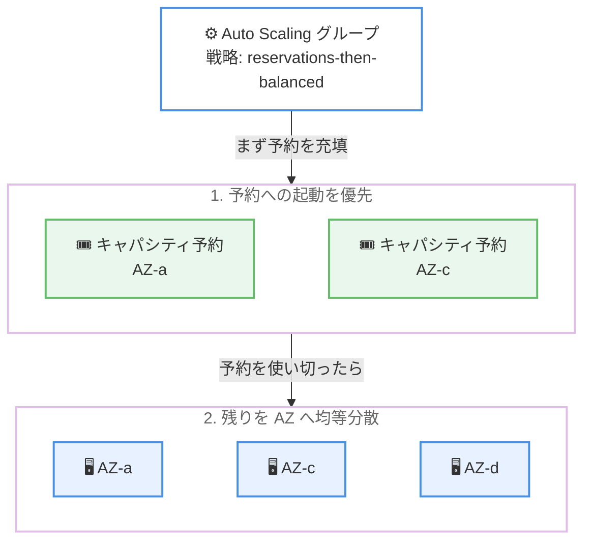

# Amazon EC2 Auto Scaling - Reservations Then Balanced

**リリース日**: 2026 年 6 月 30 日
**サービス**: Amazon EC2 Auto Scaling
**機能**: Reservations Then Balanced (キャパシティ予約優先のアベイラビリティゾーン分散戦略)

📊 [このアップデートのインフォグラフィックを見る](https://takech9203.github.io/aws-news-summary/20260630-ec2-auto-scaling-res-then-balanced.html)
<!-- INFOGRAPHIC_BASE_URL は環境変数から取得 -->

## 概要

Amazon EC2 Auto Scaling に、新しいアベイラビリティゾーン (AZ) 分散戦略である reservations-then-balanced が追加されました。この戦略は、Auto Scaling グループのインスタンスを起動する際に、まず関連付けられたキャパシティ予約への起動を優先し、予約が満たされた後に残りのキャパシティを各 AZ へ均等に分散します。

これにより、On-Demand Capacity Reservations (ODCR)、Capacity Blocks、Interruptible Capacity Reservations といった事前購入済みキャパシティの利用率を最大化しつつ、Auto Scaling が提供する運用のシンプルさと回復性を維持できます。GPU、ハイパフォーマンスコンピューティング (HPC)、機械学習といった、キャパシティ予約を利用するコスト重視のワークロードでの活用が想定されています。

設定は Auto Scaling グループの `AvailabilityZoneDistribution` 構成でキャパシティ分散戦略を指定し、Capacity Reservation Group ARN または個別の Capacity Reservation ID で対象の予約を指定することで行います。追加料金はなく、標準の EC2 料金が適用されます。すべての AWS 商用リージョンで利用可能です。

**アップデート前の課題**

- 従来の Auto Scaling は AZ 間でインスタンス数を均等に保つことを優先するため、特定の AZ に存在するキャパシティ予約を十分に活用しきれない場合があった
- 事前購入したキャパシティ予約 (ODCR や Capacity Blocks など) を使い切れず、未使用の予約コストが発生するリスクがあった
- 予約利用率を高めるには、AZ ごとにグループを分けるなど運用が煩雑になりがちだった

**アップデート後の改善**

- 今回のアップデートにより、キャパシティ予約への起動を最優先する分散戦略を Auto Scaling グループに対して宣言的に指定できるようになった
- 予約を使い切った後に残りを各 AZ へ均等分散するため、予約利用率の最大化と AZ 分散の両立が可能になった
- スケールインの動作も予約利用率を保つよう最適化され、予約外のインスタンスから優先的に削除されるようになった

## アーキテクチャ図



Auto Scaling はまずキャパシティ予約への起動を優先し、予約を使い切った後に残りのキャパシティを各 AZ へ均等に分散します。

## サービスアップデートの詳細

### 主要機能

1. **キャパシティ予約優先の起動**
   - Auto Scaling グループに関連付けられたキャパシティ予約への起動を、AZ 間の均等分散よりも優先する
   - 事前購入済みの予約キャパシティを最大限活用できる
   - On-Demand Capacity Reservations、Capacity Blocks、Interruptible Capacity Reservations に対応

2. **予約充填後の均等分散**
   - 利用可能なすべての予約が満たされた後、残りのキャパシティを有効化された各 AZ へ均等に分散する
   - 予約利用率の最大化と AZ 分散による回復性の両立を図る

3. **予約利用率を保つスケールイン動作**
   - スケールイン時には、まず予約に含まれないインスタンスから削除し、予約利用率を維持する
   - さらにスケールインが必要な場合は、予約インスタンスのうち予約インスタンス数が最も多い AZ から削除する

## 技術仕様

### AZ 分散戦略の比較

| 戦略 | 動作 | 主な用途 |
|------|------|----------|
| balanced-best-effort | 各 AZ へ均等にインスタンスを維持。起動失敗時は他の正常な AZ で起動を試行 | AZ 冗長性が必要で、グループの偏りを許容できるアプリケーション |
| balanced-only | 各 AZ へ均等にインスタンスを維持。起動失敗時も同じ AZ で起動を試行し続ける | クォーラムベースのワークロードなど、特定の要件を満たす必要がある場合 |
| reservations-then-balanced | まずキャパシティ予約へ起動し、予約充填後に残りを各 AZ へ均等分散 | キャパシティ予約を使う GPU、HPC、機械学習などコスト重視のワークロード |

### 主な構成項目

| 項目 | 詳細 |
|------|------|
| 設定箇所 | Auto Scaling グループの `AvailabilityZoneDistribution` 構成 |
| 予約の指定方法 | Capacity Reservation Group ARN、または個別の Capacity Reservation ID |
| 予約の指定場所 | 起動テンプレート (複数の予約を優先する場合は予約ごとに別の起動テンプレートを使用) |
| 対応予約タイプ | ODCR、Capacity Blocks、Interruptible Capacity Reservations |
| 追加料金 | なし (標準の EC2 料金) |

## 設定方法

### 前提条件

1. 対象のキャパシティ予約 (ODCR、Capacity Blocks、または Interruptible Capacity Reservations) が作成済みであること
2. 起動テンプレートでキャパシティ予約を指定していること (Capacity Reservation Group または個別の Capacity Reservation ID)
3. Auto Scaling グループが該当する AZ で有効化されていること

### 手順

#### ステップ 1: AWS マネジメントコンソールでの設定

Auto Scaling グループ作成または更新時の [Network] セクションで、AZ 分散戦略として [Reservations then balanced] を選択します。あわせて優先するキャパシティ予約を Capacity Reservation group または個別の Capacity Reservation ID で指定します。

#### ステップ 2: AWS CLI での設定

```bash
aws autoscaling update-auto-scaling-group \
  --auto-scaling-group-name my-asg \
  --availability-zone-distribution CapacityDistributionStrategy=reservations-then-balanced
```

`update-auto-scaling-group` コマンドで既存の Auto Scaling グループに reservations-then-balanced 戦略を適用しています。新規作成時は `create-auto-scaling-group` コマンドで同様に指定できます。

#### ステップ 3: 起動テンプレートでの予約指定

複数のキャパシティ予約を優先したい場合は、予約ごとに個別の起動テンプレートを用意し、それぞれで対象の Capacity Reservation Group または Capacity Reservation ID を指定します。

## メリット

### ビジネス面

- **予約コストの最大活用**: 事前購入したキャパシティ予約 (ODCR や Capacity Blocks など) の利用率を高め、未使用予約による無駄なコストを削減できる
- **運用のシンプルさ維持**: 予約利用率の最大化を、Auto Scaling の標準的な運用フローの中で宣言的に実現できる
- **コスト重視ワークロードへの最適化**: GPU や機械学習など高コストなリソースを使うワークロードで効果が高い

### 技術面

- **予約と AZ 分散の両立**: 予約を優先しつつ、余剰分は AZ へ均等分散して回復性を確保できる
- **柔軟な予約指定**: Capacity Reservation Group ARN と個別 ID の両方で対象を指定できる
- **スマートなスケールイン**: 予約利用率を保つよう、予約外インスタンスから優先的に削除される

## デメリット・制約事項

### 制限事項

- この戦略では、予約利用率の最大化が AZ 間の均等分散よりも優先されるため、予約が特定の AZ に偏っている場合はインスタンス配置も偏る可能性がある
- 複数のキャパシティ予約を優先する場合、予約ごとに個別の起動テンプレートを用意する必要がある

### 考慮すべき点

- AZ の均等分散よりも予約充填を優先する設計のため、厳密な AZ 冗長性が必須のワークロードでは balanced-best-effort や balanced-only との比較検討が必要
- 予約が枯渇した後にのみ残りが均等分散されるため、予約のキャパシティ計画が配置結果に直接影響する

## ユースケース

### ユースケース 1: GPU を利用する機械学習トレーニング

**シナリオ**: 機械学習トレーニング用に GPU インスタンスの Capacity Blocks を事前購入しており、その予約を確実に使い切りたい。

**実装例**:
```
戦略: reservations-then-balanced
予約指定: Capacity Reservation Group ARN (GPU 予約をグループ化)
```

**効果**: 高コストな GPU 予約を優先的に充填し、予約利用率を最大化できる。

### ユースケース 2: HPC クラスターのコスト最適化

**シナリオ**: HPC ワークロード向けに ODCR を確保しているが、需要変動に応じて Auto Scaling でスケールしたい。

**実装例**:
```
戦略: reservations-then-balanced
予約指定: 個別の Capacity Reservation ID
スケールアウト分: 予約充填後に各 AZ へ均等分散
```

**効果**: 予約分を優先消費しつつ、超過分は AZ へ分散して回復性を維持できる。

### ユースケース 3: Interruptible Capacity Reservations の活用

**シナリオ**: 中断耐性のあるバッチ処理で Interruptible Capacity Reservations を活用し、コストを抑えたい。

**実装例**:
```
戦略: reservations-then-balanced
予約指定: Interruptible Capacity Reservations
```

**効果**: 割安な中断可能予約を優先的に使い切り、処理コストを削減できる。

## 料金

この機能の利用に追加料金はありません。標準の EC2 料金が適用され、キャパシティ予約分の料金に加え、グループが起動するオンデマンドまたはスポットインスタンスの料金を支払います。

## 利用可能リージョン

すべての AWS 商用リージョンで利用可能です。

## 関連サービス・機能

- **On-Demand Capacity Reservations (ODCR)**: 特定の AZ でキャパシティを予約する機能。本戦略の優先対象となる
- **Capacity Blocks for ML**: 機械学習向けに GPU キャパシティを期間指定で予約する機能。本戦略で優先充填できる
- **EC2 起動テンプレート**: 優先するキャパシティ予約の指定に使用する

## 参考リンク

- 📊 [インフォグラフィック](https://takech9203.github.io/aws-news-summary/20260630-ec2-auto-scaling-res-then-balanced.html)
- [公式発表 (What's New)](https://aws.amazon.com/about-aws/whats-new/2026/06/ec2-auto-scaling-res-then-balanced/)
- [ドキュメント (Auto Scaling group Availability Zone distribution)](https://docs.aws.amazon.com/autoscaling/ec2/userguide/ec2-auto-scaling-availability-zone-balanced.html)
- [Amazon EC2 料金](https://aws.amazon.com/ec2/pricing/)

## まとめ

reservations-then-balanced は、キャパシティ予約への起動を最優先しつつ余剰分を AZ へ均等分散する新しい分散戦略であり、GPU や HPC、機械学習といったコスト重視のワークロードで事前購入済みキャパシティの利用率を最大化できます。追加料金なくすべての商用リージョンで利用可能なため、ODCR や Capacity Blocks を活用している場合は、Auto Scaling グループの AZ 分散戦略として本戦略の適用を検討してください。
