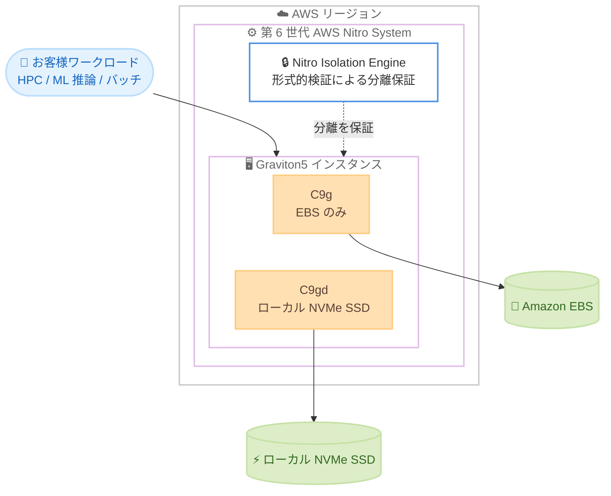

# Amazon EC2 - C9g および C9gd インスタンス (AWS Graviton5)

**リリース日**: 2026 年 6 月 30 日
**サービス**: Amazon Elastic Compute Cloud (Amazon EC2)
**機能**: AWS Graviton5 プロセッサ搭載 C9g / C9gd コンピューティング最適化インスタンス

📊 [このアップデートのインフォグラフィックを見る](https://takech9203.github.io/aws-news-summary/20260630-ec2-c9g-c9gd-instances-graviton5-processors-available.html)
<!-- INFOGRAPHIC_BASE_URL は環境変数から取得 -->

## 概要

AWS は、第 5 世代のカスタム設計 CPU である AWS Graviton5 プロセッサを搭載した Amazon EC2 C9g および C9gd インスタンスの一般提供 (GA) を開始しました。これらはコンピューティング最適化 (Compute Optimized) ファミリーに属し、コンピューティング負荷の高いワークロード向けに、Amazon EC2 上で最高のコストパフォーマンスを提供します。

C9g インスタンスは、ハイパフォーマンスコンピューティング (HPC)、バッチ処理、ゲーミング、動画エンコーディング、科学技術モデリング、分散分析、CPU ベースの機械学習 (ML) 推論、リアルタイム分析、広告配信などのワークロードに適しています。C9gd インスタンスはこれらに加えて、スクラッチ領域、一時ファイル、キャッシュなど高速かつ低レイテンシーのローカルストレージを必要とするワークロード向けに、ローカル NVMe ベースの SSD ブロックレベルストレージを提供します。

C9g / C9gd インスタンスは、AWS Graviton4 ベースの C8g / C8gd インスタンスと比較して最大 25% 優れたコンピューティング性能を実現します。データベースで最大 30% 、Web アプリケーションで最大 35% 、機械学習で最大 35% の高速化を達成します。また、クラウド上のプロセッサインスタンスとして最大の 5 倍のキャッシュと最速のメモリを備えています。これらのインスタンスは第 6 世代 AWS Nitro System 上に構築され、Nitro Isolation Engine を初めて搭載したインスタンスです。Nitro Isolation Engine は形式的検証 (formal verification) を活用し、お客様のワークロードが相互に、および AWS オペレーターから隔離されていることを数学的に保証します。

**アップデート前の課題**

- コンピューティング負荷の高いワークロードでは、Graviton4 ベースの C8g / C8gd インスタンスが最新の選択肢であり、さらなるコストパフォーマンスの向上余地があった
- キャッシュ容量やメモリ帯域がボトルネックとなるワークロードでは、性能向上に限界があった
- ワークロード分離のセキュリティ保証は運用上のコントロールに依存しており、数学的な証明による保証は提供されていなかった

**アップデート後の改善**

- Graviton5 の採用により、C8g / C8gd 比で最大 25% のコンピューティング性能向上を実現
- 5 倍のキャッシュとクラウド最速クラスのメモリにより、キャッシュ・メモリ律速のワークロードで大幅な性能改善
- Nitro Isolation Engine により、形式的検証に基づく数学的なワークロード分離の保証を提供

## アーキテクチャ図

Graviton5 搭載の C9g / C9gd インスタンスは第 6 世代 Nitro System 上に構築され、Nitro Isolation Engine が形式的検証によってワークロード間の分離を保証します。C9g は Amazon EBS を、C9gd はローカル NVMe SSD を利用できます。

## サービスアップデートの詳細

### 主要機能

1. **AWS Graviton5 プロセッサ**
   - AWS がカスタム設計した第 5 世代 CPU
   - コンピューティング負荷の高いワークロードで Amazon EC2 上最高のコストパフォーマンスを提供
   - 常時オンのメモリ暗号化、vCPU ごとの専用キャッシュ、ポインタ認証をサポート

2. **C8g / C8gd 比での性能向上**
   - コンピューティング性能が最大 25% 向上
   - データベースで最大 30% 、Web アプリケーションで最大 35% 、機械学習で最大 35% 高速化
   - 5 倍のキャッシュとクラウド最速クラスのメモリを搭載

3. **Nitro Isolation Engine**
   - 第 6 世代 AWS Nitro System 上に構築された初のインスタンス
   - 形式的検証により、ワークロードが相互に、および AWS オペレーターから分離されていることを数学的に保証
   - 数学的に証明されたクラウドセキュリティの新たな標準を切り拓く

4. **C9gd のローカル NVMe ストレージ**
   - スクラッチ領域、一時ファイル、キャッシュ向けの高速・低レイテンシーなローカル NVMe SSD ブロックレベルストレージを提供

## 技術仕様

### C9g インスタンス (EBS のみ)

| サイズ | vCPU | メモリ (GiB) | ネットワーク帯域 (Gbps) | EBS 帯域 (Gbps) |
|------|------|------|------|------|
| medium | 1 | 2 | 最大 15 | 最大 12 |
| large | 2 | 4 | 最大 15 | 最大 12 |
| xlarge | 4 | 8 | 最大 15 | 最大 12 |
| 2xlarge | 8 | 16 | 最大 17 | 最大 12 |
| 4xlarge | 16 | 32 | 最大 17 | 最大 12 |
| 8xlarge | 32 | 64 | 17 | 12 |
| 12xlarge | 48 | 96 | 25 | 18 |
| 16xlarge | 64 | 128 | 34 | 24 |
| 24xlarge | 96 | 192 | 50 | 36 |
| 48xlarge | 192 | 384 | 100 | 72 |
| metal-48xl | 192 | 384 | 100 | 72 |

### C9gd インスタンス (ローカル NVMe SSD)

vCPU 、メモリ、帯域は C9g と同一で、以下のローカル NVMe ストレージを備えます。

| サイズ | vCPU | メモリ (GiB) | ローカル NVMe ストレージ |
|------|------|------|------|
| medium | 1 | 2 | 1 x 59 GB |
| large | 2 | 4 | 1 x 118 GB |
| xlarge | 4 | 8 | 1 x 237 GB |
| 2xlarge | 8 | 16 | 1 x 474 GB |
| 4xlarge | 16 | 32 | 1 x 950 GB |
| 8xlarge | 32 | 64 | 1 x 1900 GB |
| 12xlarge | 48 | 96 | 3 x 950 GB |
| 16xlarge | 64 | 128 | 1 x 3800 GB |
| 24xlarge | 96 | 192 | 3 x 1900 GB |
| 48xlarge | 192 | 384 | 3 x 3800 GB |
| metal-48xl | 192 | 384 | 3 x 3800 GB |

### 購入オプション

| 項目 | 詳細 |
|------|------|
| 購入モデル | Savings Plans 、オンデマンド、スポットインスタンス、Dedicated Instances 、Dedicated Hosts |
| ストレージ | C9g: Amazon EBS のみ / C9gd: ローカル NVMe SSD + EBS |
| Nitro System | 第 6 世代 (Nitro Isolation Engine 搭載) |

## メリット

### ビジネス面

- **コストパフォーマンスの向上**: C8g / C8gd 比で最大 25% のコンピューティング性能向上により、同一ワークロードをより低コストで実行できる
- **幅広いワークロードへの適合**: HPC 、バッチ処理、ゲーミング、動画エンコーディング、ML 推論、リアルタイム分析など多様な用途に対応
- **柔軟な購入オプション**: Savings Plans やスポットインスタンスなど複数の購入モデルにより、コスト最適化の選択肢が広い

### 技術面

- **大容量キャッシュと高速メモリ**: 5 倍のキャッシュとクラウド最速クラスのメモリにより、キャッシュ・メモリ律速のワークロードで高い性能を発揮
- **数学的に保証された分離**: Nitro Isolation Engine の形式的検証により、ワークロード間および AWS オペレーターからの分離を数学的に保証
- **ローカル NVMe による低レイテンシー**: C9gd はスクラッチや一時ファイル、キャッシュ用途で高速なローカルストレージを利用可能

## デメリット・制約事項

### 制限事項

- 提供リージョンが米国東部 (バージニア北部、オハイオ)、米国西部 (オレゴン)、欧州 (フランクフルト) に限定されており、東京リージョンなどでは未提供
- Arm アーキテクチャ (AWS Graviton) ベースであるため、x86 依存のバイナリやソフトウェアは Arm 向けのビルド・検証が必要

### 考慮すべき点

- C9gd のローカル NVMe ストレージはインスタンス停止・終了時にデータが失われるため、永続化が必要なデータには Amazon EBS や Amazon S3 を併用する
- 既存の x86 ベースワークロードから移行する場合は、性能・互換性の検証を事前に実施することが推奨される

## ユースケース

### ユースケース1: HPC / 科学技術モデリング

**シナリオ**: 大規模な数値シミュレーションや科学技術計算をコスト効率よく実行したい研究機関やエンジニアリング部門。

**効果**: Graviton5 の高いコンピューティング性能と大容量キャッシュにより、演算集約型ジョブのスループットを向上しつつコストを抑制できます。

### ユースケース2: CPU ベースの ML 推論

**シナリオ**: 低コストで大量の推論リクエストをさばく必要がある機械学習アプリケーション。

**効果**: 機械学習で最大 35% の高速化により、同一スループットをより少ないインスタンス数で処理でき、推論コストを削減できます。

### ユースケース3: 動画エンコーディング / バッチ処理

**シナリオ**: 一時ファイルや中間データを多用する動画トランスコードや大規模バッチ処理パイプライン。

**効果**: C9gd のローカル NVMe SSD により、スクラッチ領域への高速な読み書きが可能となり、パイプライン全体の処理時間を短縮できます。

## 料金

C9g / C9gd インスタンスは、Savings Plans 、オンデマンド、スポットインスタンス、Dedicated Instances 、Dedicated Hosts で購入できます。具体的な料金はリージョンおよびインスタンスサイズによって異なるため、最新の価格は Amazon EC2 の料金ページを参照してください。

## 利用可能リージョン

C9g および C9gd インスタンスは、米国東部 (バージニア北部、オハイオ)、米国西部 (オレゴン)、欧州 (フランクフルト) の各リージョンで利用可能です。

## 関連サービス・機能

- **AWS Graviton**: C9g / C9gd を支える AWS カスタム設計 CPU ファミリー。第 5 世代の Graviton5 を搭載
- **AWS Nitro System**: 第 6 世代 Nitro System 上に構築。Nitro Isolation Engine による形式的検証ベースの分離を提供
- **Amazon EBS**: C9g / C9gd のブロックストレージとして利用。永続化が必要なデータの保存先
- **Amazon EC2 Savings Plans**: C9g / C9gd のコスト最適化に活用できる柔軟な料金モデル

## 参考リンク

- 📊 [インフォグラフィック](https://takech9203.github.io/aws-news-summary/20260630-ec2-c9g-c9gd-instances-graviton5-processors-available.html)
- [公式発表 (What's New)](https://aws.amazon.com/about-aws/whats-new/2026/06/ec2-c9g-c9gd-instances-graviton5-processors-available/)
- [C9g / C9gd インスタンスの製品ページ](https://aws.amazon.com/ec2/instance-types/c9g/)
- [AWS Graviton](https://aws.amazon.com/ec2/graviton/level-up-with-graviton/)
- [AWS Nitro System](https://aws.amazon.com/ec2/nitro/)
- [Nitro Isolation Engine のブログ](https://aws.amazon.com/blogs/compute/aws-nitro-isolation-engine-formally-verifying-the-hypervisor-in-the-aws-nitro-system/)

## まとめ

Amazon EC2 C9g / C9gd インスタンスは、AWS Graviton5 と第 6 世代 Nitro System により、コンピューティング負荷の高いワークロード向けに最大 25% の性能向上と数学的に保証された分離を提供します。HPC 、ML 推論、バッチ処理などのワークロードを対象リージョンで運用しているお客様は、C8g / C8gd からの移行によるコストパフォーマンス改善を検証することを推奨します。まずは対象リージョンでインスタンスを起動し、既存ワークロードとの互換性と性能を評価してみてください。
