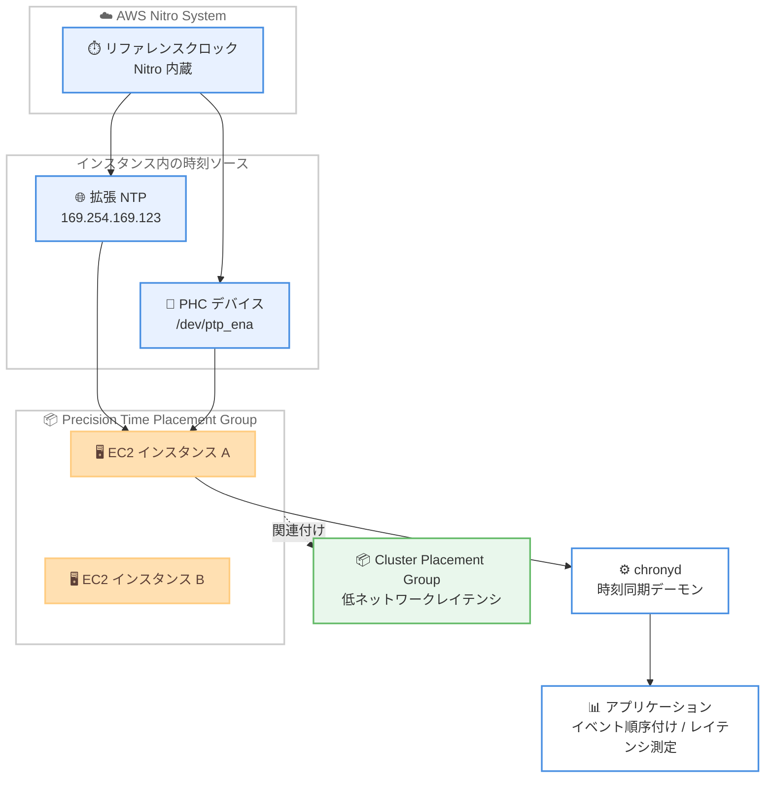

# Amazon Time Sync Service - 26 種類の追加 EC2 インスタンスタイプでマイクロ秒精度の時刻同期に対応

**リリース日**: 2026年6月30日
**サービス**: Amazon EC2 / Amazon Time Sync Service
**機能**: Precision Time Placement Group (PTPG) によるマイクロ秒精度時刻同期

📊 [このアップデートのインフォグラフィックを見る](https://takech9203.github.io/aws-news-summary/20260630-ec2-time-sync-precision-time-placement-group.html)
<!-- INFOGRAPHIC_BASE_URL は環境変数から取得 -->

## 概要

Amazon Time Sync Service が、新たに 26 種類の EC2 インスタンスタイプで、すべての商用リージョンにおいてマイクロ秒精度の時刻同期に対応しました。この機能は Amazon のネットワークインフラストラクチャと AWS Nitro System 上に構築されており、Nitro System 内で動作するリファレンスクロックを直接活用することで、マイクロ秒精度の時刻とナノ秒精度のハードウェアタイムスタンプを提供します。

このアップデートにより、お客様はアプリケーションイベントの順序付け、片方向のネットワークレイテンシ測定、分散アプリケーションのトランザクション処理速度の向上といった用途で、より高精度な時刻を利用できます。これらの追加インスタンスタイプでマイクロ秒精度の時刻にアクセスするには、Precision Time Placement Group (PTPG) を作成します。PTPG は、Precision Time Protocol ハードウェアクロック (PHC) を有効にしてインスタンスを起動できる新しい配置戦略です。

低ネットワークレイテンシと高精度時刻の両方を必要とするお客様は、PTPG を Cluster Placement Group (CPG) に関連付けることができます。これにより、クラスタ配置による低レイテンシと、高精度な時刻同期を同時に実現できます。

**アップデート前の課題**

- 高精度時刻 (PHC デバイス) を利用できるインスタンスファミリーとリージョンが限定されていた
- 一部のインスタンスタイプでは、マイクロ秒精度の時刻同期やハードウェアパケットタイムスタンプを利用できなかった
- 高精度時刻と低ネットワークレイテンシを同時に確保する標準的な仕組みが整っていなかった

**アップデート後の改善**

- 追加の 26 種類のインスタンスタイプで、すべての商用リージョンにおいてマイクロ秒精度の時刻同期が可能になった
- `precision-time` 戦略の配置グループ (PTPG) を作成するだけで、PHC を有効にしたインスタンスを起動できるようになった
- PTPG を CPG に関連付けることで、高精度時刻と低レイテンシの両立が可能になった

## アーキテクチャ図



Nitro System 内のリファレンスクロックが、拡張 NTP ソースと PHC デバイスの両方に高精度な時刻を供給し、PTPG 内のインスタンスはこれらをローカルに利用して chronyd で時刻同期します。PTPG を CPG に関連付けることで、低レイテンシと高精度時刻を両立できます。

## サービスアップデートの詳細

### 主要機能

1. **マイクロ秒精度の時刻同期の対応拡大**
   - 新たに 26 種類の EC2 インスタンスタイプが対応
   - すべての AWS 商用リージョンで利用可能
   - Nitro System 内のリファレンスクロックを直接活用

2. **Precision Time Placement Group (PTPG)**
   - `precision-time` 戦略を指定する新しい配置グループ戦略
   - PTPG 内に起動したインスタンスは、高精度な NTP ソースおよび Linux の PHC デバイスにアクセス可能
   - PTPG は追加料金なしで利用可能

3. **ナノ秒精度のハードウェアパケットタイムスタンプ**
   - ENA ドライバが提供するハードウェアパケットタイムスタンプ機能
   - 片方向のネットワークレイテンシ測定などのネットワーク計測に活用
   - `ethtool -T` コマンドで対応状況を確認可能

4. **CPG との関連付け**
   - PTPG を Cluster Placement Group (CPG) に関連付け可能
   - 低ネットワークレイテンシと高精度時刻の両方を必要とするワークロードに対応

## 技術仕様

### 時刻ソースの種類

| 項目 | 詳細 |
|------|------|
| 拡張 NTP ソース | リンクローカルアドレス (IPv4: 169.254.169.123 / IPv6: fd00:ec2::123) 経由でアクセス。すべての OS で利用可能 |
| PHC デバイス | Linux インスタンスのみ。`/dev/ptp_ena` シンボリックリンク経由でアクセス。マイクロ秒精度の同期を実現 |
| ハードウェアパケットタイムスタンプ | ENA ドライバが提供。ナノ秒精度のパケット計測に利用 |
| うるう秒の扱い | NTP ソースはうるう秒スミアリング (leap smearing) ビューを提供。PHC は時刻をスミアリングしない |

### 対応インスタンスファミリー

PTPG は Gen7 以降の以下の EC2 インスタンスファミリーをサポートします。

| カテゴリ | インスタンスファミリー |
|----------|------------------------|
| 汎用 | M7a, M7g, M7g-flex, M7gd, M7i, M7i-flex, M8a, M8g, M8g-flex |
| コンピューティング最適化 | C7a, C7gd, C7i, C7i-flex, C8g, C8g-flex, C8gd |
| メモリ最適化 | R7a, R7g, R7i, R7id, R8g, X8adez, X8adz-3tb, X8adz-6tb, X8adzs, X8aedez, X8aedz-3tb, X8aedz-6tb, X8aez, X8az, X8g, X8ge |
| ストレージ最適化 | I8g, I8ge |

### PHC アクセスの要件

- ENA ドライバ バージョン 2.10.0 以降がサポート対象 OS にインストールされていること
- Linux を実行している EC2 インスタンスであること (Windows インスタンスは NTP 経由でのみアクセス可能)
- PTPG 内に起動されたインスタンスであること

## 設定方法

### 前提条件

1. 対応インスタンスファミリーを使用していること (Gen7 以降)
2. Linux インスタンスで PHC を利用する場合、ENA ドライバ 2.10.0 以降がインストールされていること
3. PTPG を作成し、その中にインスタンスを起動すること

### 手順

#### ステップ1: Precision Time Placement Group を作成する

```bash
aws ec2 create-placement-group \
    --group-name my-precision-time-pg \
    --strategy precision-time
```

`precision-time` 戦略を指定して配置グループを作成します。このコマンドは、キャパシティ予約に使用する配置グループ ARN と、インスタンス起動や配置グループのリンクに使用するグループ名 / グループ ID を返します。

#### ステップ2: PTPG 内にインスタンスを起動する

```bash
aws ec2 run-instances \
    --image-id ami-0abcdef1234567890 \
    --instance-type r7g.2xlarge \
    --placement GroupId=pg-0aaa1111111111111
```

作成した PTPG を指定してインスタンスを起動することで、拡張 Amazon Time Sync Service にアクセスできます。リンクローカル NTP アドレスを使用する場合は、追加の設定なしで拡張 NTP ソースを利用できます。

#### ステップ3: chronyd で PHC デバイスを利用するよう設定する (Linux)

```bash
# /etc/chrony.conf に以下の行を追加
refclock PHC /dev/ptp_ena poll 0 delay 0.000010 prefer

# chrony を再起動
sudo systemctl restart chronyd

# 時刻ソースを確認
chronyc sources
```

`/dev/ptp_ena` シンボリックリンクを参照ソースとして追加し、chronyd を再起動します。`chronyc sources` の出力で `PHC0` が Stratum 0 の優先ソースとして表示されれば、PHC デバイスを利用した同期が有効になっています。

```
MS Name/IP address         Stratum Poll Reach LastRx Last sample
===============================================================================
#* PHC0                          0   0   377     0   +184ns[ +198ns] +/- 5032ns
^- 169.254.169.123               1   4   377     8    -18us[  -18us] +/-  115us
```

## メリット

### ビジネス面

- **対応範囲の拡大**: 26 種類の追加インスタンスタイプとすべての商用リージョンで高精度時刻を利用でき、ワークロード配置の選択肢が広がる
- **追加コストなし**: PTPG は追加料金なしで利用可能
- **規制対応の支援**: 高精度なタイムスタンプは、金融取引などイベント順序の正確性が求められる業務要件への対応に役立つ

### 技術面

- **マイクロ秒精度の時刻同期**: Nitro System のリファレンスクロックを直接活用し、ネットワークジッタの影響を受けにくい高精度同期を実現
- **片方向レイテンシ測定**: ナノ秒精度のハードウェアパケットタイムスタンプにより、精緻なネットワーク計測が可能
- **デプロイの簡素化**: 単一の配置戦略で配置グループ内の全インスタンスに高精度時刻機能を付与できる

## デメリット・制約事項

### 制限事項

- PHC デバイスは Linux インスタンスのみアクセス可能。Windows インスタンスは NTP 経由でのみ拡張 Amazon Time Sync Service を利用可能
- リンクローカルアドレスを使用するサービスには 1 秒あたり 1024 パケット (PPS) の上限があり、これは NTP、Route 53 Resolver DNS クエリ、IMDS リクエストなどの合計に対して適用される
- 起動時に拡張 Amazon Time Sync Service を提供するハードウェアが不足している場合、リクエストが失敗する。停止後の再起動時にも同様に失敗する可能性がある

### 考慮すべき点

- NTP ソースはうるう秒スミアリングビューを提供するのに対し、PHC は時刻をスミアリングしないため、用途に応じて時刻ソースを選択する必要がある
- 配置グループ自体のルールおよび制限が適用される
- キャパシティが不足してリクエストが失敗した場合は、時間をおいて再試行するか、別のアベイラビリティーゾーンを試す

## ユースケース

### ユースケース1: 分散データベースのトランザクション順序付け

**シナリオ**: 複数ノードにまたがる分散データベースで、トランザクションの正確な順序付けが求められる。

**実装例**:
```
PTPG を作成し、データベースノードを起動
→ 各ノードで chronyd を PHC デバイスに同期
→ マイクロ秒精度のタイムスタンプでトランザクションを順序付け
```

**効果**: ノード間のクロック差が縮小し、分散トランザクションの整合性と処理速度が向上する。

### ユースケース2: 金融取引システムのイベント記録

**シナリオ**: 取引イベントの発生順序を高精度に記録し、監査やコンプライアンス要件に対応する必要がある。

**実装例**:
```
PTPG を CPG に関連付けて取引アプリケーションを配置
→ 低レイテンシと高精度時刻を両立
→ ナノ秒精度のタイムスタンプでイベントを記録
```

**効果**: イベント順序の正確性が向上し、規制要件への対応が容易になる。

### ユースケース3: ネットワーク性能の精密計測

**シナリオ**: 分散システム間の片方向ネットワークレイテンシを正確に測定したい。

**実装例**:
```
PTPG 内にインスタンスを起動し、ENA ドライバで PHC を有効化
→ ethtool -T <interface> でハードウェアパケットタイムスタンプを確認
→ 送受信のハードウェアタイムスタンプから片方向レイテンシを算出
```

**効果**: ソフトウェア処理の影響を排した精密なネットワーク計測が可能になる。

## 料金

Precision Time Placement Group (PTPG) は追加料金なしで利用できます。インスタンスの利用料金は通常の EC2 料金が適用されます。

## 利用可能リージョン

PTPG はすべての AWS 商用リージョンで利用可能です。今回のアップデートにより、26 種類の追加インスタンスタイプでマイクロ秒精度の時刻同期がすべての商用リージョンで利用できます。

なお、PTPG なしでも拡張 Amazon Time Sync Service と PHC デバイスにアクセスできるレガシーアクセスが、以下の特定のリージョンとインスタンスファミリーでサポートされます (最良の体験のためには PTPG での起動が推奨されます)。

- レガシーアクセス対応リージョン: 米国東部 (バージニア北部)、米国東部 (オハイオ)、アジアパシフィック (マレーシア)、アジアパシフィック (タイ)、アジアパシフィック (東京)、欧州 (ストックホルム)
- レガシーアクセス対応 Local Zones: 米国東部 (ニューヨークシティ)
- レガシーアクセス対応インスタンスファミリー: M7a, M7g, M7i, R7a, R7g, R7i, I8g, I8ge

## 関連サービス・機能

- **AWS Nitro System**: PHC とリファレンスクロックの基盤となるハードウェア。Nitro 内蔵のクロックを直接活用する
- **Cluster Placement Group (CPG)**: PTPG と関連付けることで、低ネットワークレイテンシと高精度時刻を両立できる
- **Elastic Network Adapter (ENA)**: PHC デバイスとハードウェアパケットタイムスタンプを提供するネットワークドライバ

## 参考リンク

- 📊 [インフォグラフィック](https://takech9203.github.io/aws-news-summary/20260630-ec2-time-sync-precision-time-placement-group.html)
- [公式発表 (What's New)](https://aws.amazon.com/about-aws/whats-new/2026/06/ec2-time-sync-precision-time-placement-group)
- [ドキュメント (Amazon Time Sync Service の設定)](https://docs.aws.amazon.com/AWSEC2/latest/UserGuide/configure-ec2-ntp.html#enhanced-amazon-time-sync-service)

## まとめ

今回のアップデートにより、マイクロ秒精度の時刻同期が 26 種類の追加 EC2 インスタンスタイプとすべての商用リージョンに拡大され、高精度時刻を必要とするワークロードの選択肢が大きく広がりました。PTPG は追加料金なしで利用でき、CPG との関連付けにより低レイテンシと高精度時刻を両立できます。分散データベース、金融取引システム、ネットワーク計測などの用途では、`precision-time` 戦略の配置グループを活用した構成を検討することをお勧めします。
