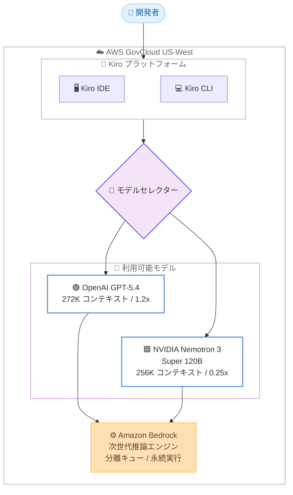

# Kiro - AWS GovCloud (US-West) リージョンで OpenAI GPT-5.4 と NVIDIA Nemotron 3 Super 120B が利用可能に

**リリース日**: 2026 年 6 月 30 日
**サービス**: Kiro
**機能**: AWS GovCloud (US-West) リージョンの Kiro IDE および CLI での 2 つの新モデル提供開始

📊 [このアップデートのインフォグラフィックを見る](https://takech9203.github.io/aws-news-summary/20260630-kiro-gpt-nemotron-launch-aws-govcloud-us.html)

## 概要

AWS GovCloud (US-West) リージョンの Kiro IDE および CLI で、2 つの新しいモデルが利用可能になりました。OpenAI GPT-5.4 と NVIDIA Nemotron 3 Super 120B です。これにより、政府機関や政府系コントラクターは、コンプライアンス境界内でより幅広いモデルを選択し、エージェント型 AI 開発を行えるようになります。

OpenAI GPT-5.4 は、複雑な推論、コーディング、ドキュメント分析、マルチステップのエージェント型ワークフロー向けに設計されたモデルです。コンテキストの解釈、ツールとの連携、ソフトウェア環境の操作、複数ステップにわたる出力検証を行う AI アプリケーションや本番ワークフローの構築を支援します。GPT-5.4 は、分離されたキューと永続的な実行 (durable execution) を備えた Amazon Bedrock の次世代推論エンジン上で動作し、回復性の高いワークロードを実現します。272K のコンテキストウィンドウと 1.2 倍のクレジット乗数で提供されます。

NVIDIA Nemotron 3 Super 120B は、オープンウェイトモデルの選択肢として提供されます。120B パラメータのうち 12B のみをアクティブ化するハイブリッド型 Mixture-of-Experts (MoE) モデルであり、高い計算効率とエージェント型タスクでの高速な推論を実現します。256K のコンテキストウィンドウと 32K の最大出力に対応し、0.25 倍のクレジット乗数で提供されます。

**アップデート前の課題**

- AWS GovCloud (US-West) リージョンの Kiro では、利用可能なモデルの選択肢が限られていた
- 複雑な推論や永続的な実行を必要とするワークロードに最適化された最新モデルを、コンプライアンス境界内で利用しにくかった
- コスト効率の高いオープンウェイトモデルを GovCloud 環境で選択する手段が限られていた

**アップデート後の改善**

- AWS GovCloud (US-West) リージョンの Kiro IDE および CLI で OpenAI GPT-5.4 が利用可能になり、複雑な推論とマルチステップのエージェント型ワークフローに対応
- NVIDIA Nemotron 3 Super 120B が利用可能になり、低コスト (0.25 倍のクレジット乗数) で高速なエージェント型タスクを実行可能
- 用途やコストに応じてモデルを使い分けられるようになり、GovCloud 環境での開発の柔軟性が向上

## アーキテクチャ図

開発者は Kiro IDE または CLI のモデルセレクターから新モデルを選択し、Amazon Bedrock の次世代推論エンジンを通じて推論を実行します。

## サービスアップデートの詳細

### 主要機能

1. **OpenAI GPT-5.4**
   - 複雑な推論、コーディング、ドキュメント分析、マルチステップのエージェント型ワークフロー向けに設計
   - コンテキストの解釈、ツール連携、ソフトウェア環境の操作、複数ステップにわたる出力検証を支援
   - 分離されたキューと永続的な実行を備えた Amazon Bedrock の次世代推論エンジン上で動作し、回復性の高いワークロードを実現
   - 272K のコンテキストウィンドウ、1.2 倍のクレジット乗数

2. **NVIDIA Nemotron 3 Super 120B**
   - オープンウェイトモデルの選択肢として提供
   - 120B パラメータのうち 12B のみをアクティブ化するハイブリッド型 Mixture-of-Experts (MoE) モデル
   - 高い計算効率とエージェント型タスクでの高速な推論を実現
   - 256K のコンテキストウィンドウ、32K の最大出力、0.25 倍のクレジット乗数

3. **モデルセレクターからの利用**
   - IDE または CLI を最新バージョンに更新後、再起動することでモデルセレクターから新モデルにアクセス可能
   - 用途やコスト要件に応じて、既存モデルと新モデルを使い分け可能

## 技術仕様

### モデル比較

| 項目 | OpenAI GPT-5.4 | NVIDIA Nemotron 3 Super 120B |
|------|----------------|------------------------------|
| モデルタイプ | 推論・エージェント型ワークフロー向け | オープンウェイト (ハイブリッド MoE) |
| コンテキストウィンドウ | 272K | 256K |
| 最大出力 | 記載なし | 32K |
| クレジット乗数 | 1.2 倍 | 0.25 倍 |
| 主な用途 | 複雑な推論、コーディング、ドキュメント分析、マルチステップ処理 | 計算効率重視のエージェント型タスク、高速推論 |
| 推論基盤 | Amazon Bedrock 次世代推論エンジン (分離キュー / 永続実行) | Amazon Bedrock |

### AWS GovCloud (US) における Kiro の制約

AWS GovCloud (US) リージョンの Kiro には、商用リージョンとは異なる以下の制約があります。

| 項目 | GovCloud での扱い |
|------|-------------------|
| Kiro プラグイン (VS Code 等の IDE 統合) | 利用不可。スタンドアロン IDE または CLI のみ |
| インラインサジェスト / インライン補完 | 利用不可 |
| Autonomous Agent | 利用不可 |
| ソーシャルログイン / AWS Builder ID 認証 | 利用不可 (IAM Identity Center を使用) |
| サービス改善のためのデータ収集 | 無効化 |
| ユーザーアクティビティメトリクス / S3 レポート | 利用不可 |
| クロスリージョン推論 (CRIS) | US-East の推論リクエストは US-West の Amazon Bedrock で処理 (TLS 1.2 以上で暗号化) |
| Auto (自動モデル選択) | 提供開始時点では無効。デフォルトは Claude Sonnet 4.5 |

## 設定方法

### 前提条件

1. AWS GovCloud (US-West) リージョンで Kiro を利用できる環境であること
2. AWS IAM Identity Center による GovCloud 認証が設定済みであること
3. Kiro IDE または CLI がインストール済みであること

### 手順

#### ステップ1: IDE または CLI を最新バージョンに更新

Kiro IDE または CLI を最新バージョンに更新します。新モデルは最新版でのみ利用可能です。

#### ステップ2: アプリケーションを再起動

更新後、Kiro IDE または CLI を再起動します。これにより、新しいモデル定義が読み込まれます。

#### ステップ3: モデルセレクターから新モデルを選択

モデルセレクターを開き、OpenAI GPT-5.4 または NVIDIA Nemotron 3 Super 120B を選択します。用途やコスト要件に応じて使い分けます。

## メリット

### ビジネス面

- **コンプライアンス境界内での選択肢拡大**: 政府機関や政府系コントラクターが、コンプライアンス要件を満たしながら最新モデルを利用可能
- **コスト最適化**: 0.25 倍のクレジット乗数の Nemotron 3 Super 120B により、コスト効率の高いエージェント型開発が可能
- **用途別のモデル選択**: 複雑な推論には GPT-5.4、計算効率重視のタスクには Nemotron と、ワークロードに応じた使い分けが可能

### 技術面

- **大規模コンテキスト対応**: GPT-5.4 は 272K、Nemotron 3 Super 120B は 256K のコンテキストウィンドウに対応し、大規模なコードベースやドキュメントを扱える
- **回復性の高いワークロード**: GPT-5.4 は分離キューと永続実行を備えた Amazon Bedrock 次世代推論エンジン上で動作
- **高速かつ効率的な推論**: Nemotron 3 Super 120B はハイブリッド MoE により 120B 中 12B のみをアクティブ化し、高速推論を実現

## デメリット・制約事項

### 制限事項

- 提供リージョンは AWS GovCloud (US-West) に限定される
- GovCloud では Kiro プラグイン、インラインサジェスト、Autonomous Agent、自動モデル選択 (Auto) が利用できない
- 新モデルの利用には IDE または CLI の最新バージョンへの更新と再起動が必要

### 考慮すべき点

- GPT-5.4 は 1.2 倍のクレジット乗数のため、利用量に応じてクレジット消費が増加する点を考慮する
- AWS GovCloud (US) のデフォルトモデルは Claude Sonnet 4.5 であり、新モデルはモデルセレクターから明示的に選択する必要がある
- US-East の利用者の推論リクエストは US-West の Amazon Bedrock で処理される (コンテンツはプロファイル作成リージョンに保存)

## ユースケース

### ユースケース1: コンプライアンス境界内での複雑なコード生成

**シナリオ**: 政府系コントラクターが、複雑な業務ロジックを含むアプリケーションを GovCloud 環境で開発する。

**効果**: GPT-5.4 の 272K コンテキストウィンドウとマルチステップ推論により、大規模なコードベースを踏まえた精度の高いコード生成が可能になり、コンプライアンス要件を維持しながら開発速度を向上できる。

### ユースケース2: コスト効率を重視したエージェント型タスクの実行

**シナリオ**: 大量の反復的なリファクタリングやテスト生成タスクを、コストを抑えて自動化したい。

**効果**: 0.25 倍のクレジット乗数の Nemotron 3 Super 120B を活用することで、計算効率と推論速度を両立しつつクレジット消費を抑えてエージェント型タスクを実行できる。

### ユースケース3: 大規模ドキュメントの分析

**シナリオ**: 仕様書や設計ドキュメントを分析し、実装タスクへ落とし込みたい。

**効果**: GPT-5.4 の大規模コンテキストとドキュメント分析能力により、長文ドキュメントを一度に解釈し、構造化された要件や実装計画へ変換できる。

## 料金

Kiro の料金はクレジットベースで計算され、モデルごとに設定されたクレジット乗数が適用されます。

| モデル | クレジット乗数 |
|--------|----------------|
| OpenAI GPT-5.4 | 1.2 倍 |
| NVIDIA Nemotron 3 Super 120B | 0.25 倍 |

クレジット乗数は、同一のリクエストに対するクレジット消費量に影響します。コストを重視する場合は乗数の低いモデル、推論精度を重視する場合は乗数の高いモデルを選択するなど、用途に応じた使い分けが推奨されます。最新の料金体系は Kiro の公式情報を参照してください。

## 利用可能リージョン

AWS GovCloud (US-West) (us-gov-west-1) リージョンの Kiro IDE および CLI で利用可能です。なお、AWS GovCloud (US-East) の利用者の推論リクエストは、AWS GovCloud (US-West) の Amazon Bedrock で処理されます。

## 関連サービス・機能

- **Amazon Bedrock**: GPT-5.4 は分離キューと永続実行を備えた次世代推論エンジン上で動作し、Nemotron 3 Super 120B も Amazon Bedrock を通じて推論を実行
- **AWS IAM Identity Center**: AWS GovCloud (US) の Kiro 認証に使用
- **AWS GovCloud (US)**: コンプライアンス要件の高いワークロード向けの分離されたリージョン環境

## 参考リンク

- 📊 [インフォグラフィック](https://takech9203.github.io/aws-news-summary/20260630-kiro-gpt-nemotron-launch-aws-govcloud-us.html)
- [公式発表 (What's New)](https://aws.amazon.com/about-aws/whats-new/2026/06/kiro-gpt-nemotron-launch-aws-govcloud-us/)
- [Kiro in AWS GovCloud (US) ドキュメント](https://docs.aws.amazon.com/govcloud-us/latest/UserGuide/govcloud-kiro.html)
- [Kiro 公式サイト](https://kiro.dev/)

## まとめ

このアップデートにより、AWS GovCloud (US-West) リージョンの Kiro で OpenAI GPT-5.4 と NVIDIA Nemotron 3 Super 120B が利用可能になり、コンプライアンス境界内でのモデル選択肢が拡大しました。複雑な推論には GPT-5.4、コスト効率重視のエージェント型タスクには Nemotron 3 Super 120B と、用途に応じた使い分けが可能です。GovCloud 環境で Kiro を利用している場合は、IDE または CLI を最新バージョンに更新し、再起動してモデルセレクターから新モデルを試すことを推奨します。
