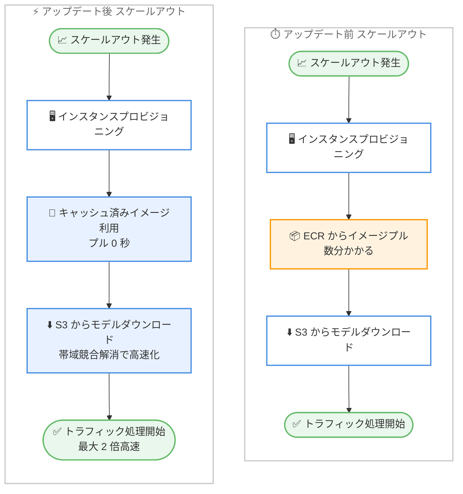

# Amazon SageMaker AI - コンテナイメージキャッシング

**リリース日**: 2026 年 6 月 30 日
**サービス**: Amazon SageMaker AI (Inference)
**機能**: コンテナイメージキャッシング (Container Image Caching)

📊 [このアップデートのインフォグラフィックを見る]({INFOGRAPHIC_BASE_URL}/20260630-sagemakerai-inf-scale-out-time.html)
<!-- INFOGRAPHIC_BASE_URL は環境変数から取得 -->

## 概要

Amazon SageMaker Inference が、コンテナイメージキャッシングをサポートしました。これにより、生成 AI モデルのスケールアウト時のエンドツーエンドのスケーリングが最大 2 倍高速化されます。エンドポイントがスケールアウトする際、サービスがコンテナイメージを事前にキャッシュするため、新しいインスタンスは Amazon ECR から大きなコンテナイメージをプルする時間を待つことなく、より速くトラフィックの処理を開始できます。

生成 AI ワークロードは、一般的に 10 GB 以上の大きなコンテナイメージ (LMI/vLLM、NVIDIA Triton など) を使用します。今回のアップデートにより、スケールアウト時のコールドスタートレイテンシーの主要なボトルネックとなっていたイメージプルの待ち時間が解消されます。

この機能は、お客様による設定変更を一切必要としません。サービスがエンドポイントまたは推論コンポーネントの設定で指定されたイメージ URI を自動的にキャッシュします。アクセラレーターインスタンスタイプ、単一モデルエンドポイント、推論コンポーネントベースのエンドポイントに対応しています。

**アップデート前の課題**

- スケールアウト時に起動する新しいインスタンスは、毎回 ECR からコンテナイメージの全体をプルする必要があり、数分のコールドスタートレイテンシーが発生していた
- 生成 AI ワークロードでは 10 GB 以上の大きなイメージが一般的であり、イメージプルがスケールアウトレイテンシーの最大の要因となっていた
- 既存インスタンス上のキャッシュ (instance-store container caching) は、新規インスタンスの起動時には効果がなかった

**アップデート後の改善**

- コンテナイメージが事前にキャッシュされ、新規インスタンスでのイメージプル時間が実質 0 秒になった
- ネットワーク帯域幅の競合が解消され、並行して実行されるモデルダウンロードも高速化された
- お客様による設定変更が不要で、サポート対象のインスタンスタイプで自動的に有効化される

## アーキテクチャ図



スケールアウト時の処理フローを比較した図です。アップデート前は ECR からのイメージプルが数分かかるボトルネックとなっていましたが、アップデート後はキャッシュ済みイメージを利用することでイメージプルが実質 0 秒となり、エンドツーエンドのスケーリング時間が最大 2 倍高速化されます。

## サービスアップデートの詳細

### 主要機能

1. **コンテナイメージの事前キャッシング**
   - スケールアウト時に新規インスタンスへ起動するコンテナイメージをローカルに事前キャッシュする
   - これにより、新規インスタンスでのイメージプル時間が実質 0 秒になる
   - 推論コンポーネントを使用する場合、参照される各ユニークなコンテナイメージを保存する

2. **設定変更不要の自動有効化**
   - エンドポイントまたは推論コンポーネントの設定で指定されたイメージ URI を自動的にキャッシュする
   - サポート対象のアクセラレーターインスタンスタイプを使用するエンドポイントで自動的に有効化される
   - カスタムイメージを含む任意の ECR ホスト型イメージで動作し、コンテナの変更も不要

3. **フォールバック動作**
   - キャッシュされたイメージが利用できない場合、SageMaker は ECR からイメージをプルする
   - これにより、スケーリングがブロックされることはない

4. **スケーリング最適化スイートの一部**
   - サブミニットの同時実行メトリクス (最大 6 倍高速な負荷検出)
   - instance-store コンテナキャッシング (既存インスタンス上での高速スケーリング)
   - コンテナイメージキャッシング (新規インスタンス上での最大 2 倍高速なスケーリング)

## 技術仕様

### パフォーマンスベンチマーク

AWS Blog で公開されている、Qwen3-8B モデル (16 GB) を ml.g6.2xlarge 上で LMI コンテナ (17.7 GB) で実行した場合のベンチマーク結果です。

| ステージ | アップデート前 | アップデート後 |
|------|------|------|
| ECR からのイメージプル | 333 秒 | 0 秒 (キャッシュ済み) |
| S3 からのモデルダウンロード | 168 秒 | 77 秒 |
| エンドツーエンド合計 | 525 秒 | 258 秒 |

エンドツーエンドの起動レイテンシーが約 51% 削減されています。

### 早期アクセスのお客様の結果 (P50)

| インスタンス | イメージ / モデルサイズ | アップデート前 | アップデート後 | 改善率 |
|------|------|------|------|------|
| ml.g4dn.xlarge | 15.7 GB / 0 GB | 381 秒 | 134 秒 | -65% |
| ml.g5.2xlarge | 17.5 GB / 5.8 GB | 346 秒 | 164 秒 | -52% |
| ml.g5.xlarge | 10.6 GB / 6.5 GB | 346 秒 | 216 秒 | -38% |

改善率はインスタンスタイプ、イメージサイズ、モデルサイズによって変動します。

### サポート対象

| 項目 | 詳細 |
|------|------|
| インスタンスタイプ | アクセラレーターインスタンスタイプ |
| エンドポイント種別 | 単一モデルエンドポイント、推論コンポーネントベースのエンドポイント |
| イメージ | ECR ホスト型イメージ全般 (カスタムイメージを含む) |
| 有効化 | 自動 (オプトイン不要) |

### セキュリティ

既存のテナント分離が維持されます。各キャッシュは単一のお客様のエンドポイント専用であり、アカウントやエンドポイント間で共有されることはありません。また、エンドポイントが削除されると自動的にパージされます。

## 設定方法

### 前提条件

1. SageMaker Inference のエンドポイントまたは推論コンポーネントが構成されていること
2. サポート対象のアクセラレーターインスタンスタイプを使用していること
3. コンテナイメージが Amazon ECR にホストされていること

### 手順

#### ステップ1: 通常どおりエンドポイントをデプロイする

```bash
# エンドポイント設定で使用するコンテナイメージ URI を指定
# (通常のデプロイと同じ。追加設定は不要)
aws sagemaker create-endpoint-config \
  --endpoint-config-name my-genai-config \
  --production-variants '[{"VariantName":"AllTraffic","ModelName":"my-genai-model","InstanceType":"ml.g6.2xlarge","InitialInstanceCount":1}]'
```

エンドポイント設定または推論コンポーネント設定で指定されたイメージ URI が、コンテナイメージキャッシングの対象として自動的に認識されます。お客様による追加のオプトイン操作は不要です。

#### ステップ2: スケーリングポリシーを構成する (推奨)

```bash
# サブミニットメトリクスを活用した
# ターゲット追跡スケーリングポリシーの構成例
# ConcurrentRequestsPerModel または ConcurrentRequestsPerCopy を指定
```

サブミニットの同時実行メトリクスを活用するターゲット追跡スケーリングポリシー (`ConcurrentRequestsPerModel` または `ConcurrentRequestsPerCopy`) を構成することで、負荷検出が最大 6 倍高速化され、コンテナイメージキャッシングと組み合わせてスケールアウト全体をさらに高速化できます。

## メリット

### ビジネス面

- **応答性の向上**: スケールアウトが最大 2 倍高速になることで、トラフィック急増時のレイテンシー悪化やリクエスト失敗のリスクを低減できる
- **設定の容易さ**: 設定変更やコードの修正が不要で、対象インスタンスで自動的に有効化されるため、導入コストが実質ゼロ
- **コスト効率の改善**: スケールアウトが速くなることで、過剰なプロビジョニング (バッファインスタンスの常時起動) への依存を減らせる可能性がある

### 技術面

- **コールドスタートの解消**: 大きな生成 AI コンテナイメージ (10 GB 以上) のプルがボトルネックでなくなる
- **並行処理の高速化**: ネットワーク帯域幅の競合が解消され、S3 からのモデルダウンロードも高速化される
- **耐障害性**: キャッシュが利用できない場合は ECR からプルするフォールバックがあり、スケーリングがブロックされない

## デメリット・制約事項

### 制限事項

- アクセラレーターインスタンスタイプが対象であり、対象外のインスタンスタイプでは効果が得られない
- 改善率はインスタンスタイプ、イメージサイズ、モデルサイズによって変動する
- 単一モデルエンドポイントおよび推論コンポーネントベースのエンドポイントが対象

### 考慮すべき点

- コンテナイメージキャッシングは新規インスタンスの起動を高速化するものであり、既存インスタンス上でのスケーリングには instance-store コンテナキャッシングが用いられる
- スケーリング全体を最適化するには、サブミニットメトリクスを活用したスケーリングポリシーの構成を併用することが推奨される

## ユースケース

### ユースケース1: トラフィック急増への対応

**シナリオ**: 大規模言語モデルを提供するチャットアプリケーションで、日中の特定時間帯にトラフィックが急増する。従来は新規インスタンスの起動に数分かかり、その間レイテンシーが悪化していた。

**効果**: コンテナイメージキャッシングにより新規インスタンスのイメージプルが実質 0 秒となり、スケールアウトが最大 2 倍高速化されるため、急増するトラフィックへ迅速に対応できる。

### ユースケース2: 大きなコンテナイメージを使う生成 AI 推論

**シナリオ**: vLLM や NVIDIA Triton などをベースとした 17 GB 規模のコンテナイメージを使用する生成 AI モデルをデプロイしている。ECR からのイメージプルがスケールアウトレイテンシーの大半を占めていた。

**効果**: イメージプルが事前キャッシュにより排除され、ベンチマークでは ECR プルが 333 秒から 0 秒に短縮。エンドツーエンドで約 51% のレイテンシー削減を実現する。

### ユースケース3: 推論コンポーネントによる複数モデルの集約

**シナリオ**: 推論コンポーネントベースのエンドポイントで、複数の生成 AI モデルを集約して運用している。容量不足時に新規インスタンスを追加する際の起動時間が課題だった。

**効果**: 参照される各ユニークなコンテナイメージがキャッシュされ、新規インスタンス追加時のスケーリングが高速化される。

## 料金

公式発表および AWS Blog において、コンテナイメージキャッシングの利用に対する追加料金についての記載はありません。SageMaker Inference の通常のインスタンス料金が適用されます。詳細は SageMaker の料金ページを参照してください。

## 利用可能リージョン

SageMaker Inference がサポートされているすべての AWS 商用リージョンで利用可能です。

## 関連サービス・機能

- **Amazon ECR**: コンテナイメージのホスティング先。キャッシュ利用不可時のフォールバックでイメージをプルする
- **Amazon S3**: モデルアーティファクトのダウンロード元。帯域競合の解消により高速化される
- **SageMaker サブミニット同時実行メトリクス**: 最大 6 倍高速な負荷検出を実現し、スケーリングポリシーと組み合わせてスケールアウトを最適化する
- **instance-store コンテナキャッシング**: 既存インスタンス上でのスケーリングを高速化する補完的な機能

## 参考リンク

- 📊 [インフォグラフィック]({INFOGRAPHIC_BASE_URL}/20260630-sagemakerai-inf-scale-out-time.html)
- [公式発表 (What's New)](https://aws.amazon.com/about-aws/whats-new/2026/06/sagemakerai-inf-scale-out-time)
- [AWS Blog](https://aws.amazon.com/blogs/machine-learning/introducing-container-caching-in-amazon-sagemaker-ai-for-faster-model-scaling/)
- [Amazon SageMaker 料金ページ](https://aws.amazon.com/sagemaker/pricing/)

## まとめ

Amazon SageMaker Inference のコンテナイメージキャッシングは、生成 AI ワークロードにおけるスケールアウト時の最大のボトルネックであった大きなコンテナイメージのプルを排除し、エンドツーエンドのスケーリングを最大 2 倍高速化します。設定変更が不要で対象インスタンスで自動的に有効化されるため、生成 AI 推論を SageMaker で運用しているお客様は、サブミニットメトリクスを活用したスケーリングポリシーと組み合わせることで、トラフィック急増への応答性をさらに向上させることを検討してください。
