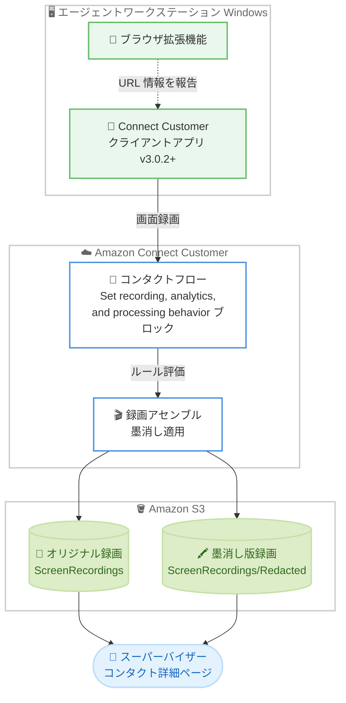

# Amazon Connect - エージェント画面録画向けルールベースの墨消し

**リリース日**: 2026 年 6 月 30 日
**サービス**: Amazon Connect (Connect Customer)
**機能**: Rule-based redaction for agent screen recording (エージェント画面録画向けルールベースの墨消し)

📊 [このアップデートのインフォグラフィックを見る](https://takech9203.github.io/aws-news-summary/20260630-screen-recording-rule-based.html)
<!-- INFOGRAPHIC_BASE_URL は環境変数から取得 -->

## 概要

Amazon Connect Customer は、エージェント画面録画に含まれる機密情報を、ルールに基づいて自動的に墨消し (レダクション) できる機能をサポートしました。管理者は、特定のアプリケーションウィンドウや URL を対象とするルールを定義し、録画に映り込んだ該当コンテンツを自動的にマスクできます。

エージェント画面録画は、音声通話、チャット、タスクの処理中にエージェントの画面上の操作を記録する機能です。スーパーバイザーはこの録画を通じて、業務プロセスへの非準拠などのコーチング機会を特定できます。一方で、録画にはクレジットカード情報や顧客の個人情報など、記録すべきではない機密情報が映り込む可能性があります。今回のルールベース墨消しは、この課題に対応するものです。

墨消しは録画のアセンブル時 (コンタクト終了後) に適用されます。マスクされた墨消し版と、マスクされていないオリジナル版の両方が Amazon S3 に別々のプレフィックスで保存され、セキュリティプロファイルの権限によってアクセス範囲を個別に制御できます。本機能は Amazon Connect が提供されているすべての AWS リージョンで利用可能で、Windows のみが対象オペレーティングシステムです。

**アップデート前の課題**

- 画面録画にクレジットカード入力画面や機密アプリケーションが映り込んでも、自動的にマスクする手段がなかった
- 内部のプライバシーポリシーで特定アプリケーションやページの記録が禁止されている場合、録画機能そのものの利用を制限せざるを得なかった
- 通話音声については Contact Lens の墨消しが利用できたが、画面録画の映像コンテンツを対象とする墨消しはできなかった

**アップデート後の改善**

- URL ルールとウィンドウタイトルルールを定義することで、該当するブラウザページやアプリケーションウィンドウを自動的にマスクできるようになった
- 墨消し版とオリジナル版が別々に保存され、閲覧・ダウンロード権限をセキュリティプロファイルで個別に制御できるようになった
- コンタクトフロー内で設定するため、キューやコンタクト属性に応じて異なる墨消しルールを適用できるようになった

## アーキテクチャ図



エージェントの画面がクライアントアプリで録画され、コンタクトフローで定義したルールに基づいてコンタクト終了後にマスク処理が行われ、オリジナル版と墨消し版が S3 に別々に保存される流れを示します。

## サービスアップデートの詳細

### 主要機能

1. **ルールベースの自動墨消し**
   - エージェントがコンタクト中に閲覧した各ブラウザページとアプリケーションウィンドウを、設定した墨消しルールと照合する
   - ルールに一致したウィンドウは最終録画でマスクされ、それ以外の画面はそのまま残る
   - 墨消しはリアルタイムではなく、コンタクト終了後の録画アセンブル時に適用される

2. **2 つの墨消しモード**
   - **Denylist - hide matching content (拒否リスト)**: ルールに一致したコンテンツのみをマスクし、その他はすべて表示する。エージェントが幅広いアプリケーションを扱い、特定の機密ページのみを隠したい場合に使用する
   - **Allowlist - show matching content (許可リスト)**: ルールに一致したコンテンツのみを表示し、その他のウィンドウはすべてマスクする。承認された少数のアプリケーションのみで作業する場合に使用する

3. **2 種類のルール**
   - **URL ルール**: ブラウザのアドレスバーに表示される URL と照合する。Connect Customer ブラウザ拡張機能が必要で、Google Chrome、Microsoft Edge、Mozilla Firefox でサポートされる
   - **ウィンドウタイトルルール**: デスクトップアプリケーションや上記以外のブラウザなど、ネイティブアプリケーションのウィンドウタイトルと照合する

4. **墨消し版とオリジナル版の分離保存**
   - 墨消し版はオリジナルと同じ S3 バケット内の別プレフィックスに保存される
   - 2 つの新しいセキュリティプロファイル権限により、閲覧・ダウンロードのアクセス範囲を個別に制御できる

## 技術仕様

### ルールの比較タイプ

| 条件 | 一致する条件 |
|------|------|
| Begins with (前方一致) | URL またはウィンドウタイトルがパターンで始まる場合 |
| Contains (部分一致) | URL またはウィンドウタイトルがパターンを任意の位置に含む場合 |
| Exact (完全一致) | URL またはウィンドウタイトルがパターンと完全に一致する場合 |

### 制限値と保存先

| 項目 | 詳細 |
|------|------|
| ルール数の上限 | フローブロックあたり URL ルールとウィンドウタイトルルール合わせて最大 100 件 |
| パターン文字数 | 各パターンは 1 から 128 文字 |
| 対応 OS | Windows のみ |
| クライアントアプリ | Connect Customer クライアントアプリケーション v3.0.2 以降が必要 |
| URL ルール対応ブラウザ | Google Chrome、Microsoft Edge、Mozilla Firefox |
| 墨消し版の保存先 | `s3://{your-bucket}/Analysis/ScreenRecordings/Redacted/{year}/{month}/{day}/{contact-id}_screen_recording_redacted_{UTC-timestamp}.mp4` |

### 新しいセキュリティプロファイル権限

セキュリティプロファイルの **Recordings and Transcripts** カテゴリに、以下の 2 つの権限が追加されました。

| 権限 | 付与される操作 |
|------|------|
| Screen recording (redacted) - Access | コンタクト詳細ページのメディアプレーヤーを開き、墨消し版の画面録画を閲覧する |
| Screen recording (redacted) - Enable download button | 墨消し版の画面録画をダウンロードする (Access 権限が前提) |

ユーザーが墨消し版とオリジナル版の両方のアクセス権を持ち、かつそのコンタクトで墨消しが有効化されていた場合、コンタクト詳細ページには墨消し版が表示されます。

## 設定方法

### 前提条件

1. Connect Customer インスタンスでエージェント画面録画を有効化する
2. エージェントワークステーションがルールベース墨消しの要件 (Windows) を満たすことを確認する
3. Connect Customer クライアントアプリケーションを v3.0.2 以降に更新する
4. エージェントが録画対象コンタクト中に使用するすべてのブラウザに Connect Customer ブラウザ拡張機能をデプロイする

### 手順

#### ステップ 1: フローブロックの追加

Connect Customer 管理サイトで [Routing] から [Flows] を開き、対象のコンタクトフロー (エージェントへのルーティング前に実行されるフロー) に **Set recording, analytics, and processing behavior** ブロックを追加します。

ブロックを開き、[Config] タブで [Select action] に **Set recording and analytics behavior**、[Select channel] に **Screen recording** を選択します。この操作で画面録画の設定対象を指定します。

#### ステップ 2: 墨消しの有効化とモード選択

[Agent screen recording] で [Enable screen recording] を選択し、[Redaction configuration] を展開して [Enable redaction] を選択します。続いて [Mode] で **Allowlist - show matching content** または **Denylist - hide matching content** を選択します。この操作で墨消しの動作方針を決定します。

#### ステップ 3: ルールの定義とフローの公開

[URL rules] で URL ルールを、[Window title rules] でウィンドウタイトルルールを追加します。各ルールで [Comparison type] (比較タイプ) を選び、対象のパターンを入力します。両方のタイプのルールを同一ブロック内に混在させることができます。設定後、フローを保存して公開します。設定変更は保存後に開始する新規コンタクトから適用され、進行中のコンタクトには影響しません。

## メリット

### ビジネス面

- **コンプライアンス強化**: 内部のプライバシーポリシーで記録が禁止されているページやアプリケーションを自動的にマスクし、機密情報の露出リスクを低減できる
- **録画活用範囲の拡大**: 機密情報の映り込みを理由に躊躇していた画面録画を、より広範な業務で安全に活用できる
- **アクセス権の分離**: 墨消し版を広範なチームに公開しつつ、マスクされていないオリジナル版は限定された担当者のみに制限できる

### 技術面

- **フローによる柔軟な制御**: コンタクトフロー内で設定するため、キューやコンタクト属性に応じて異なるルールセットを適用できる
- **設定の再利用**: 設定済みのブロックをフローモジュールに配置することで、複数フロー間で同一ルールを共有・一元管理できる
- **既存ワークフローへの影響なし**: 墨消しはコンタクト終了後に適用されるため、エージェントの操作やリアルタイム処理に影響しない

## デメリット・制約事項

### 制限事項

- Windows のみが対象オペレーティングシステムであり、他の OS はサポートされない
- URL ルールは Chrome、Edge、Firefox でのみ一致する。それ以外のブラウザは URL を報告しないため、ウィンドウタイトルルールで対応する必要がある
- フィールド単位の墨消しはできず、一致したウィンドウ全体がマスクされる。ウィンドウ内の個別フィールドや DOM 要素を選択的に隠すことはできない
- 音声・チャットコンテンツは対象外。通話録音の墨消しには Contact Lens のセンシティブデータ墨消しを別途使用する
- フローブロックあたりのルール数は最大 100 件、各パターンは 1 から 128 文字

### 考慮すべき点

- 墨消し版はオリジナル版に加えて生成されるため、両方が S3 に保存され、ストレージ使用量が増加する。オリジナルを短い期間で削除したい場合は S3 ライフサイクルポリシーの設定を検討する
- ルールが一致するには、すべての対象ブラウザにブラウザ拡張機能がデプロイされている必要がある
- 墨消しはリアルタイムではなく事後適用のため、進行中のコンタクトへの設定変更は反映されない

## ユースケース

### ユースケース 1: 決済ページとレガシー業務アプリの墨消し

**シナリオ**: 社内 CRM の決済入力ページと、レガシー請求アプリケーションのウィンドウを画面録画から隠したい。

**実装例**:
```
モード: Denylist - hide matching content
URL ルール:
  - Begins with : https://crm.example.com/contacts/
  - Contains    : /payment
ウィンドウタイトルルール:
  - Contains    : Legacy Billing App
```

**効果**: 機密性の高い決済画面と特定アプリのみが自動的にマスクされ、その他の画面はコーチング用にそのまま確認できる。

### ユースケース 2: 承認済みアプリのみを表示

**シナリオ**: エージェントが少数の承認済みアプリケーションのみで作業することが前提の環境で、それ以外の画面をすべて隠したい。

**実装例**:
```
モード: Allowlist - show matching content
URL ルール:
  - Begins with : https://connect.example.com/
  - Begins with : https://crm.example.com/
  - Begins with : https://knowledge.example.com/
ウィンドウタイトルルール:
  - Contains    : Amazon Connect Client
  - Contains    : Company CRM
```

**効果**: 承認済みのアプリケーションとサイトのみが録画に残り、想定外のアプリケーションや私的なウィンドウは自動的にマスクされる。

### ユースケース 3: キューごとに異なる墨消しを適用

**シナリオ**: 金融部門のキューと一般問い合わせのキューで、異なる墨消しルールを適用したい。

**実装例**:
```
フローを各キューへのルーティング前に分岐させ、
分岐ごとに Set recording, analytics, and processing behavior ブロックを配置。
各ブロックで異なるモードとルールセットを設定する。
共通ルールはフローモジュールに配置して複数フローで再利用する。
```

**効果**: 業務内容に応じた粒度の異なる墨消しポリシーを、単一の Connect インスタンス内で運用できる。

## 料金

ルールベースの墨消しに関する追加料金の情報については、Amazon Connect の料金ページを参照してください。画面録画は Contact Lens の機能として提供されており、利用料金が発生します。詳細は下記の料金ページで確認してください。

## 利用可能リージョン

ルールベースの墨消しは、Connect Customer のエージェント画面録画をサポートするすべての AWS リージョンで利用可能です。対応リージョンの最新の一覧は、Connect Customer のエンドポイントとクォータのドキュメントを参照してください。対象ワークステーションの OS は Windows のみです。

## 関連サービス・機能

- **Amazon Connect Contact Lens**: 画面録画機能を提供する基盤。通話音声の墨消し (センシティブデータ墨消し) は Contact Lens 側で設定する
- **Amazon S3**: オリジナル版と墨消し版の録画を保存する。ライフサイクルポリシーで保持期間を制御できる
- **Connect Customer ブラウザ拡張機能**: URL ルールを機能させるために、エージェントの各ブラウザへのデプロイが必要
- **セキュリティプロファイル**: 墨消し版・オリジナル版の閲覧とダウンロード権限を制御する

## 参考リンク

- 📊 [インフォグラフィック](https://takech9203.github.io/aws-news-summary/20260630-screen-recording-rule-based.html)
- [公式発表 (What's New)](https://aws.amazon.com/about-aws/whats-new/2026/07/screen-recording-rule-based/)
- [ドキュメント: Rule-based redaction for screen recordings](https://docs.aws.amazon.com/connect/latest/adminguide/rule-based-redaction-screen-recording.html)
- [ドキュメント: Configure rule-based redaction](https://docs.aws.amazon.com/connect/latest/adminguide/configure-rule-based-redaction.html)
- [ドキュメント: Agent screen recording](https://docs.aws.amazon.com/connect/latest/adminguide/agent-screen-recording.html)
- [Amazon Connect Contact Lens (製品ページ)](https://aws.amazon.com/connect/contact-lens/)
- [料金ページ](https://aws.amazon.com/connect/pricing/)

## まとめ

エージェント画面録画向けルールベースの墨消しは、URL やウィンドウタイトルのルールによって機密コンテンツを自動的にマスクし、コンプライアンスを維持しながら録画の活用範囲を広げる機能です。墨消し版とオリジナル版の分離保存とセキュリティプロファイル権限により、アクセス制御も柔軟に行えます。画面録画を利用している、または導入を検討している組織は、クライアントアプリの v3.0.2 以降への更新とブラウザ拡張機能のデプロイを準備し、コンタクトフローで墨消しルールの設定を検討することを推奨します。
