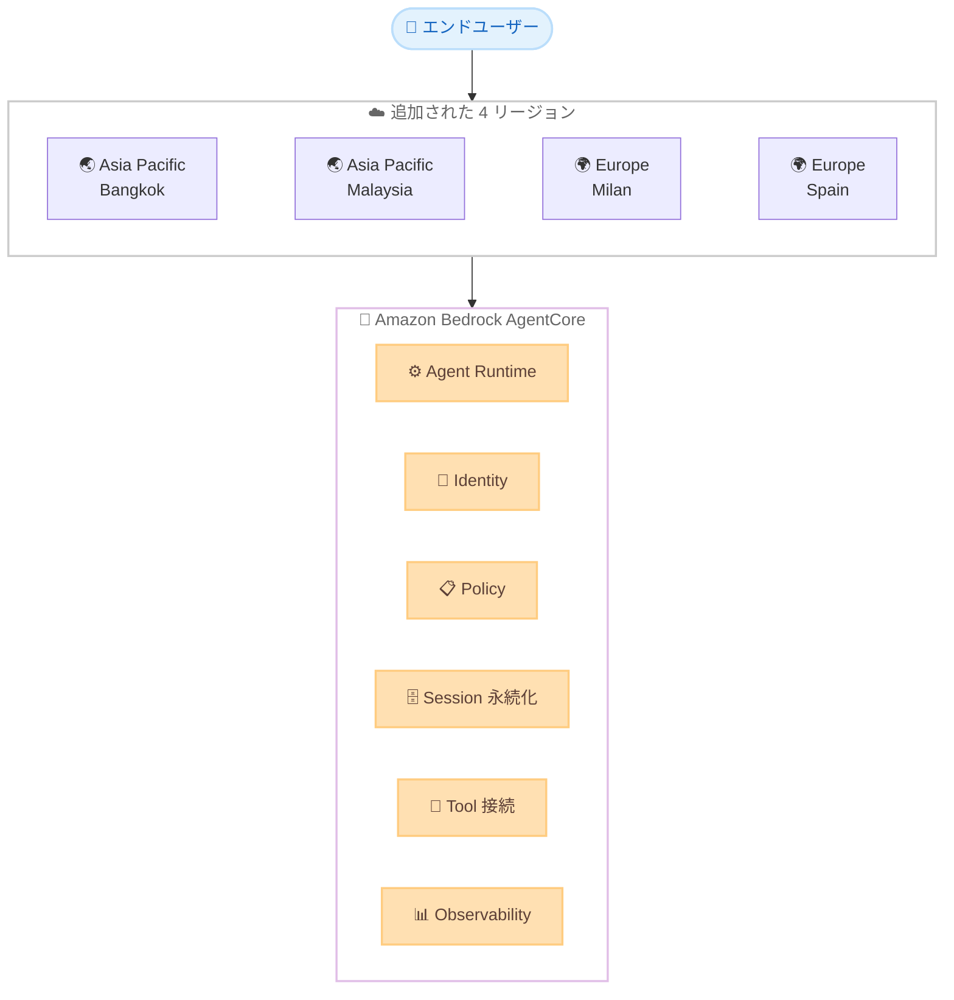

# Amazon Bedrock AgentCore - 4 つの追加リージョンでの提供開始

**リリース日**: 2026年7月1日
**サービス**: Amazon Bedrock AgentCore
**機能**: 追加リージョンでの提供開始 (Asia Pacific Bangkok、Asia Pacific Malaysia、Europe Milan、Europe Spain)

📊 [このアップデートのインフォグラフィックを見る](https://takech9203.github.io/aws-news-summary/20260701-amazon-bedrock-agentcore-four-additional-regions.html)
<!-- INFOGRAPHIC_BASE_URL は環境変数から取得 -->

## 概要

Amazon Bedrock AgentCore が、新たに 4 つの AWS リージョンで利用可能になりました。今回追加されたのは、アジアパシフィック (バンコク)、アジアパシフィック (マレーシア)、欧州 (ミラノ)、欧州 (スペイン) の各リージョンです。

Amazon Bedrock AgentCore は、AI エージェントを構築、接続、最適化するためのプラットフォームです。任意のフレームワークと任意のモデルを使用してエージェントを迅速にリリースし、エンタープライズシステムやツールに接続し、継続的に最適化できます。セキュリティはインフラストラクチャレイヤーで強制され、エージェントがこれを回避できない仕組みになっています。

今回のリージョン拡大により、これらのリージョンの利用者は、エンドユーザーにより近い場所でエージェントを構築および実行でき、レイテンシーを低減できます。エージェントランタイム、ID とアクセス制御、ポリシー管理、セッション永続化、ツール接続、オブザーバビリティといった AgentCore の各機能が、提供開始時点でこれらのリージョンで利用可能です。

**アップデート前の課題**

- 対象リージョンの利用者は、AgentCore が提供されていないリージョンを利用する必要があり、エンドユーザーとの物理的距離によるレイテンシーが発生していた
- データレジデンシー要件のある利用者は、ローカルリージョンで AgentCore を利用できず、要件を満たしにくかった
- ローカルリージョンでエージェントワークロードを完結できず、リージョン間のアーキテクチャ設計が複雑になる場合があった

**アップデート後の改善**

- アジアパシフィック (バンコク、マレーシア) および欧州 (ミラノ、スペイン) でも AgentCore を利用できるようになった
- エンドユーザーに近いリージョンでエージェントを実行することで、レイテンシーを低減できる
- 提供開始時点で AgentCore の主要機能が対象リージョンで利用可能になった

## アーキテクチャ図

対象の 4 リージョンでエンドユーザーからのリクエストを受け付け、AgentCore の各機能を用いてエージェントを実行する構成を示しています。

## サービスアップデートの詳細

### 主要機能

今回のリージョン拡大に伴い、提供開始時点で以下の AgentCore 機能が対象リージョンで利用可能です。

1. **Agent Runtime (エージェントランタイム)**
   - エージェントの実行環境を提供
   - 任意のフレームワークおよびモデルでのエージェント実行に対応

2. **Identity and Access Control (ID とアクセス制御)**
   - エージェントの ID 管理とアクセス制御を提供
   - エンタープライズシステムとの安全な連携を実現

3. **Policy Management (ポリシー管理)**
   - エージェントに対するポリシーを管理
   - インフラストラクチャレイヤーでセキュリティを強制

4. **Session Persistence (セッション永続化)**
   - エージェントのセッション状態を保持
   - 会話やタスクの継続性を確保

5. **Tool Connectivity (ツール接続)**
   - エージェントを外部ツールやエンタープライズシステムに接続

6. **Observability (オブザーバビリティ)**
   - エージェントの動作を可視化し、継続的な最適化を支援

## 技術仕様

### リージョン別の機能提供状況 (公式ドキュメントより)

今回追加された 4 リージョンにおける主要機能の提供状況は以下のとおりです。なお、公式ドキュメントの「Supported AWS Regions」によると、一部の機能はリージョンごとに提供状況が異なります。

| 機能 | Asia Pacific (Bangkok) | Asia Pacific (Malaysia) | Europe (Milan) | Europe (Spain) |
|------|------------------------|-------------------------|----------------|----------------|
| AgentCore Runtime | ✓ | ✓ | ✓ | ✓ |
| AgentCore Identity | ✓ | ✓ | ✓ | ✓ |
| AgentCore Gateway | ✓ | ✓ | ✓ | ✓ |
| AgentCore Built-in Tools | ✓ | ✓ | ✓ | ✓ |
| AgentCore Observability | ✓ | ✓ | ✓ | ✓ |
| Policy in AgentCore | ✓ | ✓ | ✓ | ✓ |
| AgentCore Memory | - | - | - | - |
| AgentCore Evaluations | - | - | - | - |
| AgentCore optimization | - | - | - | - |

上記は 2026年7月時点の公式ドキュメントに基づく情報です。最新かつ正確な提供状況は、必ず「Supported AWS Regions」ページで確認してください。

### API 変更履歴

今回のアップデートはリージョン拡大が中心であり、AWS API Changes における API メソッドの追加・変更は確認できませんでした。API の詳細については公式ドキュメントを参照してください。

## メリット

### ビジネス面

- **レイテンシーの低減**: エンドユーザーに近いリージョンでエージェントを実行することで、応答速度の向上が期待できる
- **データレジデンシーへの対応**: ローカルリージョンで AgentCore を利用でき、地域のデータ所在要件を満たしやすくなる
- **市場拡大への対応**: 東南アジアや欧州南部の利用者に対して、より低レイテンシーなエージェント体験を提供できる

### 技術面

- **主要機能の即時利用**: 提供開始時点でエージェントランタイム、ID 管理、ポリシー管理などの主要機能が利用可能
- **アーキテクチャの簡素化**: ローカルリージョンでエージェントワークロードを完結でき、リージョン間の複雑な構成を回避できる
- **インフラレイヤーでのセキュリティ**: エージェントが回避できないセキュリティがインフラストラクチャレイヤーで強制される

## デメリット・制約事項

### 制限事項

- 追加された 4 リージョンでは、AgentCore Memory、AgentCore Evaluations、AgentCore optimization などの一部機能が提供対象外の場合がある (公式ドキュメント参照)
- 提供機能はリージョンによって異なるため、利用予定の機能が対象リージョンでサポートされているか事前確認が必要

### 考慮すべき点

- リージョンごとに提供状況が変化する可能性があるため、設計前に必ず最新の「Supported AWS Regions」ページを確認する
- 既存のワークロードを新リージョンへ移行する場合は、依存する機能の提供状況とデータ移行の要件を確認する

## ユースケース

### ユースケース1: 東南アジア向けカスタマーサポートエージェント

**シナリオ**: タイやマレーシアの利用者向けに、AI エージェントによるカスタマーサポートを提供する。

**効果**: アジアパシフィック (バンコク) またはアジアパシフィック (マレーシア) リージョンでエージェントを実行することで、エンドユーザーへの応答レイテンシーを低減できる。

### ユースケース2: 欧州南部でのデータレジデンシー対応

**シナリオ**: イタリアやスペインの企業が、データを自国に近いリージョンで処理する要件のもとで AI エージェントを運用する。

**効果**: 欧州 (ミラノ) または欧州 (スペイン) リージョンで AgentCore を利用でき、地域のデータ所在要件を満たしやすくなる。

### ユースケース3: マルチリージョンでのエージェント展開

**シナリオ**: グローバルに展開するアプリケーションで、各地域の利用者に近いリージョンでエージェントを実行する。

**効果**: 対象リージョンの追加により、より多くの地域でローカルにエージェントを展開でき、一貫した低レイテンシー体験を提供できる。

## 料金

AgentCore の料金体系は、利用する機能や使用量に基づきます。具体的な料金は AgentCore の料金ページを参照してください。今回のリージョン拡大自体による追加料金は発表されていません。

## 利用可能リージョン

今回のアップデートにより、以下の 4 リージョンが追加されました。

- アジアパシフィック (バンコク)
- アジアパシフィック (マレーシア)
- 欧州 (ミラノ)
- 欧州 (スペイン)

AgentCore がサポートされる全リージョンおよび機能ごとの提供状況は、公式ドキュメントの「Supported AWS Regions」ページで確認できます。

## 関連サービス・機能

- **Amazon Bedrock**: 基盤モデルを API 経由で利用できるフルマネージドサービス。AgentCore は Bedrock 上の AI エージェント構築プラットフォーム
- **AgentCore Runtime**: エージェントの実行環境を提供する AgentCore のコアコンポーネント
- **AgentCore Gateway**: エージェントを外部ツールやシステムに接続する機能

## 参考リンク

- 📊 [インフォグラフィック](https://takech9203.github.io/aws-news-summary/20260701-amazon-bedrock-agentcore-four-additional-regions.html)
- [公式発表 (What's New)](https://aws.amazon.com/about-aws/whats-new/2026/06/amazon-bedrock-agentcore-four-additional-regions/)
- [AgentCore 製品ページ](https://aws.amazon.com/bedrock/agentcore/)
- [AgentCore Developer Guide](https://docs.aws.amazon.com/bedrock-agentcore/)
- [AgentCore 料金ページ](https://aws.amazon.com/bedrock/agentcore/pricing/)
- [Supported AWS Regions](https://docs.aws.amazon.com/bedrock-agentcore/latest/devguide/agentcore-regions.html)

## まとめ

Amazon Bedrock AgentCore がアジアパシフィック (バンコク、マレーシア) および欧州 (ミラノ、スペイン) の 4 リージョンで利用可能になり、これらの地域の利用者はエンドユーザーに近い場所で低レイテンシーなエージェントを実行できるようになりました。新リージョンでエージェントを構築する際は、利用予定の機能が対象リージョンでサポートされているかを「Supported AWS Regions」ページで確認したうえで設計を進めることを推奨します。
