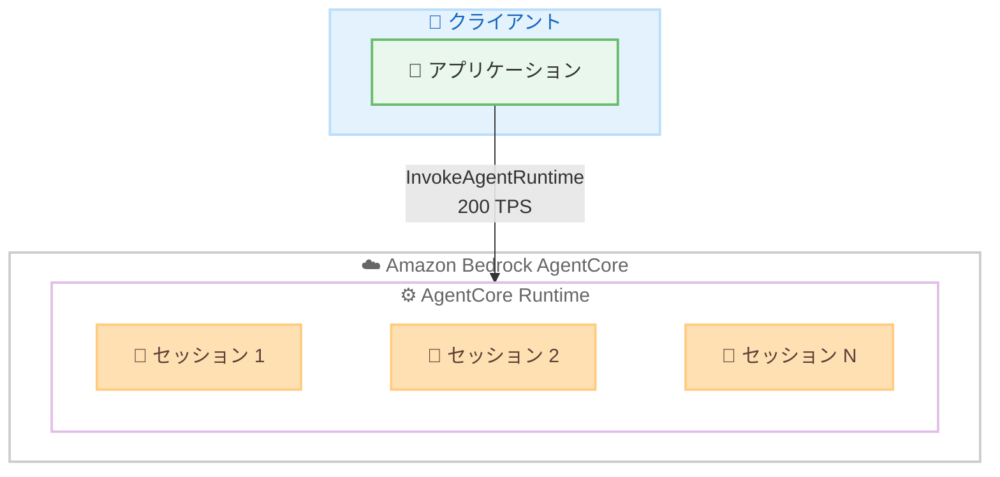

# Amazon Bedrock AgentCore - ランタイムのデフォルトクォータ上限引き上げ

**リリース日**: 2026 年 7 月 1 日
**サービス**: Amazon Bedrock AgentCore
**機能**: AgentCore Runtime のデフォルトクォータ上限の引き上げ

📊 [このアップデートのインフォグラフィックを見る](https://takech9203.github.io/aws-news-summary/20260701-amazon-bedrock-agentcore-increases-default-runtime-quota-limits.html)
<!-- INFOGRAPHIC_BASE_URL は環境変数から取得 -->

## 概要

Amazon Bedrock AgentCore は、AgentCore Runtime のデフォルトクォータ上限を引き上げました。これにより、お客様はエージェントベースのワークロードをスケールするための容量を、追加の申請なしに標準で確保できるようになりました。AgentCore は、開発者が AI エージェントを構築、接続、最適化するためのプラットフォームです。

今回引き上げられた新しいデフォルト上限では、US East (バージニア北部) および US West (オレゴン) で最大 5,000 のアクティブな同時セッション、その他のサポート対象リージョンで最大 2,500 のアクティブな同時セッションがサポートされます。また、AgentCore が利用可能なすべての AWS リージョンで、1 秒あたり 200 のエージェントインタラクション、および 1 秒あたり 25 の新規セッション作成がサポートされます。

この引き上げにより、お客様はより多くの AI エージェントを同時に実行しながら、高スループットのワークロードを標準構成のまま処理できるようになります。エージェントの本番運用やスケール要件に対して、事前のクォータ引き上げ申請なしで対応できる点が大きな価値です。

**アップデート前の課題**

今回のアップデート以前は、デフォルトのクォータ上限が低く設定されていました。

- 大規模なエージェントワークロードを実行する際、デフォルトの同時セッション数では容量が不足しやすかった
- 高スループットのトラフィックに対応するには、事前にサービスクォータ引き上げ申請が必要になるケースがあった
- スケール要件に達するまでに、クォータ調整のためのリードタイムが発生していた

**アップデート後の改善**

今回のアップデートにより、標準構成での処理能力が向上しました。

- US East (バージニア北部) および US West (オレゴン) で最大 5,000 の同時セッションが標準で利用可能になった
- その他のサポート対象リージョンでも最大 2,500 の同時セッションが標準で利用可能になった
- すべての対象リージョンで 1 秒あたり 200 のエージェントインタラクションと 25 の新規セッション作成が標準でサポートされるようになった

## アーキテクチャ図

新しいデフォルトクォータにより、AgentCore Runtime は US East / US West で最大 5,000、その他のリージョンで最大 2,500 の同時セッションを標準で処理できます。

## サービスアップデートの詳細

### 主要機能

1. **アクティブ同時セッション上限の引き上げ**
   - US East (バージニア北部) および US West (オレゴン) で最大 5,000 のアクティブな同時セッションをサポート
   - その他のサポート対象リージョンで最大 2,500 のアクティブな同時セッションをサポート
   - このクォータは Service Quotas コンソールから引き上げ申請が可能

2. **エージェントインタラクションレートの標準化**
   - AgentCore が利用可能なすべての AWS リージョンで 1 秒あたり 200 のインタラクション (200 TPS) をサポート
   - `InvokeAgentRuntime` API のレート上限 (エージェントごと、アカウントごと) に相当
   - 高スループットの推論トラフィックを標準構成で処理可能

3. **新規セッション作成レートの標準化**
   - すべての対象リージョンで 1 秒あたり 25 の新規セッション作成をサポート
   - 短時間で多数のエージェントセッションを立ち上げるワークロードに対応
   - 急激なトラフィック増加時のセッション確立をスムーズに実施可能

## 技術仕様

### AgentCore Runtime のリソース割り当て・スロットリング上限

| 項目 | デフォルト値 | 調整可否 |
|------|------|------|
| アクティブセッションワークロード数 (US East バージニア北部 / US West オレゴン) | 5,000 | 可能 |
| アクティブセッションワークロード数 (その他のリージョン) | 2,500 | 可能 |
| `InvokeAgentRuntime` API レート (エージェントごと、アカウントごと) | 200 TPS | 可能 |
| 新規セッション作成レート (直接コードデプロイ、エンドポイントごと) | 25 TPS | 可能 |
| アカウントあたりのエージェント総数 | 1,000 | 可能 |
| セッションあたりの最大ハードウェア割り当て | 2 vCPU / 8 GB | 不可 |
| リクエストタイムアウト | 15 分 | 不可 |
| 最大ペイロードサイズ | 100 MB | 不可 |

TPS は 1 秒あたりのトランザクション数 (Transactions Per Second) を表します。上記の値は 2026 年 7 月時点の公式ドキュメントに基づきます。最新かつ完全なクォータ一覧は AgentCore のクォータドキュメントを参照してください。

## メリット

### ビジネス面

- **スケール対応の迅速化**: 事前のクォータ引き上げ申請なしで大規模なエージェントワークロードを開始でき、本番展開までのリードタイムを短縮できます
- **高負荷ワークロードへの標準対応**: 高スループットのトラフィックを標準構成で処理できるため、ピーク時の需要にも対応しやすくなります
- **運用負荷の軽減**: クォータ調整の申請や管理にかかる運用作業を削減できます

### 技術面

- **同時実行性の向上**: 主要リージョンで最大 5,000 の同時セッションを標準でサポートし、多数のエージェントを並行して実行できます
- **一貫したレート上限**: すべての対象リージョンで 200 TPS のインタラクションと 25 TPS の新規セッション作成が保証され、リージョン間で予測可能な性能を確保できます
- **追加設定不要**: 既存のエージェントアプリケーションに変更を加えることなく、引き上げられた上限の恩恵を受けられます

## デメリット・制約事項

### 制限事項

- アクティブ同時セッション上限はリージョンによって異なり、US East (バージニア北部) と US West (オレゴン) 以外は最大 2,500 です
- セッションあたりの最大ハードウェア割り当て (2 vCPU / 8 GB) やリクエストタイムアウト (15 分) など、一部のクォータは引き上げできません
- 引き上げられたのはデフォルト値であり、これを超える要件がある場合は引き続き Service Quotas コンソールからの申請が必要です

### 考慮すべき点

- 大規模なワークロードを計画する際は、同時セッション数だけでなく `InvokeAgentRuntime` の TPS 上限や新規セッション作成レートも合わせて確認することが重要です
- リージョンごとに上限が異なるため、マルチリージョン構成では各リージョンの容量を考慮した設計が必要です

## ユースケース

### ユースケース1: 大規模なカスタマーサポートエージェント

**シナリオ**: 多数のエンドユーザーに対して同時に AI エージェントによる問い合わせ対応を提供する本番環境。

**効果**: US East (バージニア北部) で最大 5,000 の同時セッションを標準でサポートできるため、ピーク時間帯の同時問い合わせにも事前申請なしで対応できます。

### ユースケース2: 高スループットのバッチ処理

**シナリオ**: 短時間で大量のドキュメントを処理するために、多数のエージェントセッションを次々に立ち上げるワークロード。

**効果**: 1 秒あたり 25 の新規セッション作成と 200 のインタラクションが標準でサポートされるため、セッションの立ち上げとリクエスト処理を高いスループットで実行できます。

### ユースケース3: マルチリージョン展開のエージェントアプリケーション

**シナリオ**: 複数の AWS リージョンにエージェントをデプロイし、エンドユーザーに近い場所で低レイテンシーの応答を提供するアプリケーション。

**効果**: すべての対象リージョンで一貫した 200 TPS のインタラクションと 25 TPS の新規セッション作成がサポートされるため、リージョン間で予測可能な性能を確保しながら展開できます。

## 料金

今回のアップデートはデフォルトクォータ上限の引き上げであり、クォータ引き上げ自体に追加料金は発生しません。AgentCore の利用料金は、実際に使用したリソースに基づいて課金されます。詳細は AgentCore の料金ページを参照してください。

## 利用可能リージョン

新しいレート上限 (1 秒あたり 200 インタラクション、1 秒あたり 25 新規セッション作成) は、AgentCore が利用可能なすべての AWS リージョンでサポートされます。アクティブ同時セッション上限は、US East (バージニア北部) および US West (オレゴン) で 5,000、その他のサポート対象リージョンで 2,500 です。対象リージョンの一覧は AgentCore のサポート対象リージョンのドキュメントを参照してください。

## 関連サービス・機能

- **Amazon Bedrock**: AgentCore は Amazon Bedrock の一部として提供される、AI エージェントの構築・実行プラットフォームです
- **AWS Service Quotas**: 引き上げ可能なクォータについては、Service Quotas コンソールから追加の引き上げ申請が可能です
- **Amazon CloudWatch**: エージェントの実行状況やスロットリングの監視に活用できます

## 参考リンク

- 📊 [インフォグラフィック](https://takech9203.github.io/aws-news-summary/20260701-amazon-bedrock-agentcore-increases-default-runtime-quota-limits.html)
- [公式発表 (What's New)](https://aws.amazon.com/about-aws/whats-new/2026/07/amazon-bedrock-agentcore-increases-default-runtime-quota-limits/)
- [AgentCore 製品ページ](https://aws.amazon.com/bedrock/agentcore/)
- [AgentCore デベロッパーガイド](https://docs.aws.amazon.com/bedrock-agentcore/)
- [AgentCore クォータドキュメント](https://docs.aws.amazon.com/bedrock-agentcore/latest/devguide/bedrock-agentcore-limits.html)
- [AgentCore サポート対象リージョン](https://docs.aws.amazon.com/bedrock-agentcore/latest/devguide/agentcore-regions.html)

## まとめ

今回のデフォルトクォータ上限の引き上げにより、AgentCore Runtime は主要リージョンで最大 5,000 の同時セッションと高いスループットを標準でサポートするようになりました。大規模なエージェントワークロードを計画しているお客様は、追加の申請なしでスケールを開始できます。本番展開を検討している場合は、想定される同時セッション数と TPS 上限を確認し、必要に応じて Service Quotas から追加の引き上げを申請することをお勧めします。
