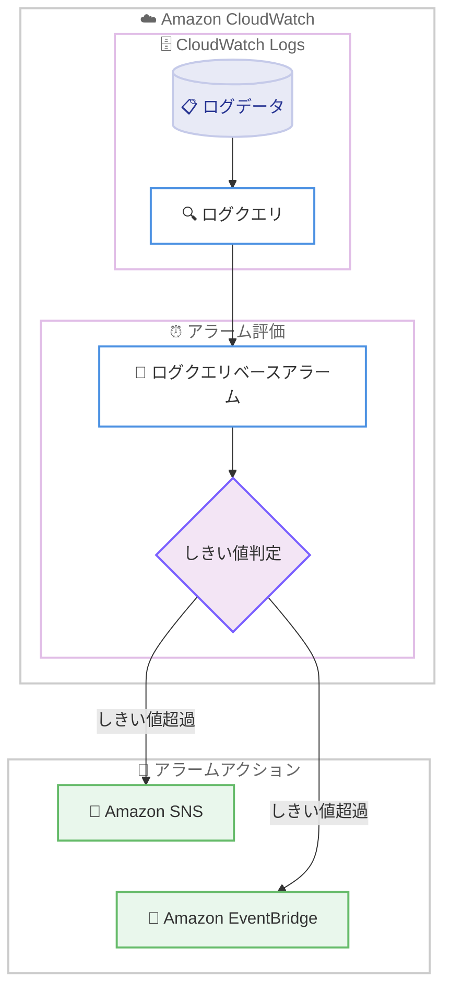

# Amazon CloudWatch - ログクエリからのアラーム作成

**リリース日**: 2026 年 7 月 1 日
**サービス**: Amazon CloudWatch
**機能**: ログクエリからのアラーム作成 (Alarms from log queries)

📊 [このアップデートのインフォグラフィックを見る](https://takech9203.github.io/aws-news-summary/20260701-amazon-cloudwatch-log-alarms.html)
<!-- INFOGRAPHIC_BASE_URL は環境変数から取得 -->

## 概要

Amazon CloudWatch は、ログクエリを使用してログデータに直接アラームを作成できる機能を発表しました。これにより、ログ分析のワークフローから離れることなく、異常を検知してアラート通知を受け取れるようになります。

今回のアップデートでは、ログクエリに対してアラームを設定し、アラームのしきい値を直接指定できます。これまで中間ステップとして必要だったメトリクスフィルターやカスタムメトリクスの作成が不要になります。この結果、ログ内のデータを能動的に監視し、アラートを設定するまでの経路が簡素化されます。たとえば、サービスごとのエラー率をカウントするクエリを記述し、しきい値を設定することで、エラーが急増した際にログのコンテキストを含むアラーム通知を単一のワークフロー内で受け取ることができます。

ログクエリから作成されたアラームは、Amazon SNS 通知や Amazon EventBridge 連携を含む、標準的な CloudWatch アラームアクションのすべてをサポートします。この機能は、運用チームやオブザーバビリティ担当者が、ログ分析と監視設定を分断せずに一貫して行えるようにすることを目的としています。

**アップデート前の課題**

このアップデート以前は、ログデータの値に基づいてアラームを設定するために追加の準備作業が必要でした。

- ログ内の特定のパターンやカウントを監視するには、まずメトリクスフィルターまたはカスタムメトリクスを作成する必要があった
- ログ分析の画面とアラーム設定の画面を行き来する必要があり、ワークフローが分断されていた
- 中間ステップを介するため、ログの値を監視対象にするまでに手間と時間がかかっていた

**アップデート後の改善**

今回のアップデートにより、ログクエリから直接アラームを作成できるようになりました。

- ログクエリに対してしきい値を直接指定でき、メトリクスフィルターやカスタムメトリクスの事前作成が不要になった
- ログ分析のワークフロー内でアラームを設定でき、画面を離れる必要がなくなった
- エラー急増などの異常検知から通知までを単一のワークフローで完結できるようになった

## アーキテクチャ図



ログクエリの結果をしきい値と比較してアラームを評価し、超過時に SNS や EventBridge へ通知するフローを示しています。

## サービスアップデートの詳細

### 主要機能

1. **ログクエリからの直接アラーム作成**
   - ログクエリに対してアラームを設定し、しきい値を直接指定できる
   - メトリクスフィルターやカスタムメトリクスを中間ステップとして作成する必要がない
   - ログ分析のワークフロー内で完結する

2. **ログコンテキストを含む通知**
   - しきい値を超過した際に、ログのコンテキストを含むアラーム通知を受け取れる
   - たとえばサービスごとのエラー率をカウントするクエリを設定し、エラーが急増した際に通知を受け取る、といった運用が可能

3. **標準的なアラームアクションのサポート**
   - Amazon SNS 通知に対応
   - Amazon EventBridge 連携に対応
   - 既存の CloudWatch アラームアクションと同様に扱える

## 技術仕様

### 機能概要

| 項目 | 詳細 |
|------|------|
| アラームの対象 | ログクエリ |
| しきい値の指定 | クエリに対して直接指定 |
| 中間メトリクス | 不要 (メトリクスフィルター/カスタムメトリクスの事前作成が不要) |
| サポートするアラームアクション | Amazon SNS 通知、Amazon EventBridge 連携を含む標準アクション |
| 設定手段 | CloudWatch コンソール、AWS CLI、AWS CloudFormation、AWS SDK |

### API変更履歴

今回のアップデートに対応する awsapichanges.com 上の API 変更情報は本レポート作成時点で確認できませんでした。CloudWatch コンソール、AWS CLI、AWS CloudFormation、AWS SDK から機能を利用できます。

## 設定方法

### 前提条件

1. Amazon CloudWatch Logs にログデータが収集されていること
2. 監視対象のログに対してクエリを実行できる権限があること
3. アラーム作成および通知先 (Amazon SNS トピックなど) の設定権限があること

### 手順

#### ステップ 1: ログクエリの作成

CloudWatch コンソールのログ分析画面で、監視したいログデータに対するクエリを作成します。たとえばサービスごとのエラー率をカウントするクエリを記述します。

#### ステップ 2: アラームのしきい値設定

作成したログクエリに対してアラームを構成し、しきい値を直接指定します。従来のようにメトリクスフィルターやカスタムメトリクスを事前に作成する必要はありません。

#### ステップ 3: アラームアクションの設定

しきい値を超過した際の通知先を設定します。Amazon SNS 通知や Amazon EventBridge 連携など、標準的な CloudWatch アラームアクションを利用できます。

コンソールに加えて、AWS CLI、AWS CloudFormation、AWS SDK を使用したアラームの作成にも対応しています。具体的な操作手順やパラメータについては、公式ドキュメントを参照してください。

## メリット

### ビジネス面

- **運用効率の向上**: ログ分析から監視設定までを単一のワークフローで完結でき、運用担当者の作業時間を短縮できる
- **異常検知の迅速化**: エラー急増などの異常を素早く検知し、通知を受け取ることで、インシデント対応の初動を早められる
- **導入の容易さ**: 中間メトリクスの設計・作成が不要になり、監視設定の導入ハードルが下がる

### 技術面

- **設定の簡素化**: メトリクスフィルターやカスタムメトリクスを介さず、ログクエリに直接しきい値を設定できる
- **既存アクションとの互換性**: Amazon SNS や Amazon EventBridge など、既存の CloudWatch アラームアクションをそのまま活用できる
- **多様な設定手段**: コンソール、AWS CLI、AWS CloudFormation、AWS SDK に対応し、Infrastructure as Code での管理も可能

## デメリット・制約事項

### 制限事項

- この機能は、Middle East (UAE) および Middle East (Bahrain) を除くすべての商用 AWS リージョンで利用可能です。上記 2 リージョンでは利用できません
- クエリの実行やアラーム評価に関する具体的な制約 (対応するクエリ言語や結果形式など) については、公式ドキュメントで確認することを推奨します

### 考慮すべき点

- ログクエリベースのアラームは、しきい値の判定に適したクエリ設計が重要になります。クエリの内容や結果の形式を事前に確認してください
- 料金については、CloudWatch の料金体系に基づきます。詳細は料金ページを参照してください

## ユースケース

### ユースケース 1: エラー率の急増監視

**シナリオ**: マイクロサービス環境で、サービスごとのエラー発生数をログから集計し、急増した場合にアラート通知を受け取りたい。

**実装例**:
```
サービスごとのエラー率をカウントするログクエリを作成し、
しきい値を設定してアラームを構成する。
しきい値超過時に Amazon SNS 経由で通知する。
```

**効果**: メトリクスフィルターを事前作成することなく、ログから直接エラー急増を検知し、迅速に対応できます。

### ユースケース 2: 特定パターンの発生監視

**シナリオ**: アプリケーションログ内の特定のエラーパターンや例外の発生回数を監視し、一定回数を超えたら運用チームに通知したい。

**実装例**:
```
対象のログパターンを抽出・集計するクエリを作成し、
しきい値を指定してアラームを設定する。
```

**効果**: ログ分析の画面を離れずにアラームを設定でき、監視設定の手間を削減できます。

### ユースケース 3: EventBridge による自動対応

**シナリオ**: ログクエリでしきい値を超過した際に、自動で修復ワークフローやインシデント管理プロセスを起動したい。

**実装例**:
```
ログクエリベースのアラームアクションに Amazon EventBridge を設定し、
イベントをトリガーに後続の処理 (Lambda 関数の実行など) を起動する。
```

**効果**: 異常検知から自動対応までをイベント駆動で連携でき、運用の自動化を推進できます。

## 料金

ログクエリベースのアラームに関する料金は、Amazon CloudWatch の料金体系に基づきます。詳細な料金については、Amazon CloudWatch の料金ページを参照してください。

## 利用可能リージョン

Middle East (UAE) および Middle East (Bahrain) を除く、すべての商用 AWS リージョンで利用可能です。

## 関連サービス・機能

- **Amazon CloudWatch Logs**: アラームの対象となるログデータを収集・保存するサービス
- **Amazon SNS**: アラーム発報時の通知先として利用できるメッセージングサービス
- **Amazon EventBridge**: アラームをトリガーにイベント駆動の後続処理を連携できるサービス

## 参考リンク

- 📊 [インフォグラフィック](https://takech9203.github.io/aws-news-summary/20260701-amazon-cloudwatch-log-alarms.html)
- [公式発表 (What's New)](https://aws.amazon.com/about-aws/whats-new/2026/07/amazon-cloudwatch-log-alarms/)
- [Amazon CloudWatch ドキュメント](https://docs.aws.amazon.com/cloudwatch/)
- [Amazon CloudWatch 料金ページ](https://aws.amazon.com/cloudwatch/pricing/)

## まとめ

このアップデートにより、Amazon CloudWatch でログクエリから直接アラームを作成できるようになり、メトリクスフィルターやカスタムメトリクスの中間ステップが不要になりました。ログ分析から監視・通知までを単一のワークフローで完結できるため、運用効率と異常検知の迅速化に貢献します。ログベースの監視を運用しているチームは、既存の監視設定を見直し、この機能への移行を検討することを推奨します。
