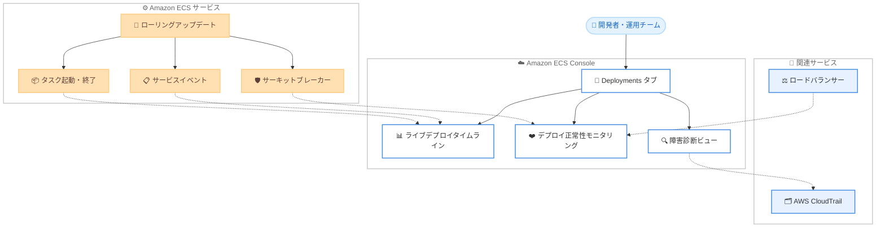

# Amazon ECS - リアルタイムデプロイオブザーバビリティ

**リリース日**: 2026 年 7 月 1 日
**サービス**: Amazon Elastic Container Service (Amazon ECS)
**機能**: AWS Management Console におけるリアルタイムデプロイオブザーバビリティ

📊 [このアップデートのインフォグラフィックを見る](https://takech9203.github.io/aws-news-summary/20260701-amazon-ecs-aws-management-console.html)
<!-- INFOGRAPHIC_BASE_URL は環境変数から取得 -->

## 概要

Amazon Elastic Container Service (Amazon ECS) は、Amazon ECS コンソールにおいてリアルタイムのデプロイオブザーバビリティを提供するようになりました。このアップデートにより、お客様はデプロイの進行状況の追跡、デプロイの正常性の監視、および障害の診断をコンソールから直接実行できます。

デプロイ中に何が起きているのかを正確に把握し、問題が発生した時点で特定し、デプロイの失敗をトラブルシューティングして解決するまでの時間を短縮できます。強化されたデプロイオブザーバビリティは、各フェーズ、サービスイベント、タスクの起動および終了の進捗を自動更新で表示するライブデプロイタイムラインを導入しています。

この機能は、ローリングアップデートデプロイタイプを使用するすべての Amazon ECS サービスを対象としており、すべての AWS 商用リージョンおよび AWS GovCloud (US) リージョンで追加料金なしで利用できます。デプロイの運用を担当するアプリケーション開発者や運用チームにとって、デプロイ状況の可視化を大きく前進させるアップデートです。

**アップデート前の課題**

このアップデート以前は、ECS デプロイの状況把握や障害診断に手間がかかっていました。

- 以前はデプロイの進行状況をリアルタイムに把握しづらく、サービスイベントを手動で確認する必要があった
- 以前はデプロイの失敗原因を特定するために、複数のツールやサービスを行き来して調査する必要があった
- 以前はサーキットブレーカーの状態やタスク障害の推移を一元的に確認する手段が限られていた

**アップデート後の改善**

今回のアップデートにより、コンソールから一貫したデプロイの可視化と診断が可能になりました。

- 今回のアップデートにより、デプロイの各フェーズとタスクの起動・終了の進捗を自動更新のタイムラインで追跡できるようになった
- 今回のアップデートにより、サーキットブレーカーの状態、デプロイアラームの状態、ヘルスチェックをリアルタイムで監視できるようになった
- 今回のアップデートにより、失敗したタスクを診断コンテキストと関連サービスへのディープリンク付きで確認でき、根本原因の特定にかかる時間が短縮された

## アーキテクチャ図



上図は、ECS コンソールの Deployments タブが、ローリングアップデート中のサービスイベントやタスクの状態を取り込み、タイムライン・正常性・診断の各ビューとして可視化する流れを示しています。

## サービスアップデートの詳細

### 主要機能

1. **ライブデプロイタイムライン**
   - デプロイの各フェーズ、サービスイベント、タスクの起動・終了の進捗を表示
   - 自動更新により、手動でのリロードなしで最新状況を確認可能
   - デプロイ中に何が起きているかを時系列で把握できる

2. **リアルタイムのデプロイ正常性モニタリング**
   - サーキットブレーカーの状態を、タスク障害の閾値への接近度 (proximity) と閾値追跡とともにライブ表示
   - デプロイアラームの状態を監視
   - コンテナレベルおよびロードバランサーレベルの両方でヘルスチェックを確認可能

3. **障害診断の高速化**
   - 失敗したタスクを診断コンテキスト付きでデプロイタイムライン上に直接表示
   - AWS CloudTrail など関連サービスへのディープリンクを提供
   - 複数のツールを横断して調査する必要を減らし、根本原因の特定を迅速化

## 技術仕様

### 対象と適用条件

| 項目 | 詳細 |
|------|------|
| 対象デプロイタイプ | ローリングアップデート (rolling update) |
| アクセス方法 | Amazon ECS コンソールの [Deployments] タブ |
| 追加料金 | なし (追加料金なしで利用可能) |
| 監視対象 | デプロイフェーズ、サービスイベント、タスク起動・終了、サーキットブレーカー状態、デプロイアラーム状態、ヘルスチェック |
| 連携サービス | AWS CloudTrail、ロードバランサー (ヘルスチェック) |

### API変更履歴

今回のアップデートはコンソール (AWS Management Console) の可視化機能の強化であり、Amazon ECS API の変更を伴うものではありません。このため API 変更履歴の該当項目はありません。

## 設定方法

### 前提条件

1. Amazon ECS サービスがローリングアップデートデプロイタイプを使用していること
2. Amazon ECS コンソールへアクセスできる IAM 権限を持っていること
3. 対象サービスがサポートされるリージョン (AWS 商用リージョンまたは AWS GovCloud (US) リージョン) にあること

### 手順

#### ステップ1: ECS コンソールで対象サービスを開く

Amazon ECS コンソールにサインインし、対象のクラスターとサービスを選択します。この操作で、監視したいサービスのデプロイ詳細画面に移動します。

#### ステップ2: Deployments タブを選択する

サービスの画面で [Deployments] タブを選択します。この操作で、ライブデプロイタイムラインと正常性モニタリングのビューが表示されます。

#### ステップ3: デプロイの進行状況と正常性を確認する

タイムラインでデプロイの各フェーズ、サービスイベント、タスクの起動・終了を確認します。サーキットブレーカーの状態やアラーム状態を監視し、失敗したタスクがある場合は診断コンテキストと CloudTrail などへのディープリンクを利用して原因を特定します。追加の設定は不要で、Deployments タブを開くだけで最新状況が自動更新されます。

## メリット

### ビジネス面

- **障害対応時間の短縮**: デプロイ失敗の原因特定にかかる時間を短縮し、サービスへの影響を最小化できる
- **追加コストなし**: 追加料金なしで利用できるため、運用コストを増やさずに可観測性を向上できる
- **運用効率の向上**: コンソールから一元的にデプロイ状況を把握でき、チームの運用負荷を軽減できる

### 技術面

- **リアルタイムな可視性**: 自動更新のタイムラインにより、デプロイ中の状態変化を即座に把握できる
- **多層的なヘルスチェック**: コンテナレベルとロードバランサーレベルの両方で正常性を確認できる
- **ツール横断の削減**: CloudTrail などへのディープリンクにより、複数ツールを行き来する手間を減らせる

## デメリット・制約事項

### 制限事項

- ローリングアップデートデプロイタイプを使用するサービスが対象であり、それ以外のデプロイ方式は今回の発表の対象外
- コンソール上の可視化機能であり、プログラムによる自動処理やアラート連携を目的とした機能ではない

### 考慮すべき点

- リアルタイムの状況把握が主眼であるため、長期的な傾向分析には Amazon CloudWatch など既存の監視サービスの併用が有効
- 詳細な監査ログの分析には、ディープリンク先の AWS CloudTrail を活用する必要がある

## ユースケース

### ユースケース1: 本番デプロイのリアルタイム監視

**シナリオ**: 本番環境のマイクロサービスをローリングアップデートで更新する際、デプロイの進行を担当者がリアルタイムに監視したい。

**実装例**:
```
ECS コンソール > 対象クラスター > 対象サービス > [Deployments] タブ
→ ライブタイムラインでフェーズとタスク起動・終了を監視
```

**効果**: デプロイの進捗と正常性を即座に把握でき、問題発生時に早期対応できる。

### ユースケース2: デプロイ失敗の根本原因分析

**シナリオ**: デプロイ中にタスクが繰り返し失敗し、原因を特定して復旧したい。

**実装例**:
```
[Deployments] タブ > 失敗したタスクを選択
→ 診断コンテキストを確認
→ AWS CloudTrail へのディープリンクから関連イベントを調査
```

**効果**: 複数ツールを横断せずに、失敗タスクの診断情報から根本原因を迅速に特定できる。

### ユースケース3: サーキットブレーカーによる安全なデプロイ運用

**シナリオ**: デプロイサーキットブレーカーを有効にしたサービスで、タスク障害が閾値にどこまで近づいているかを把握したい。

**実装例**:
```
[Deployments] タブ > デプロイ正常性ビュー
→ サーキットブレーカー状態とタスク障害の閾値接近度・閾値追跡を確認
```

**効果**: 自動ロールバックが発動する前に状況を把握し、必要に応じて手動で判断・対応できる。

## 料金

これらの機能は、すべての AWS 商用リージョンおよび AWS GovCloud (US) リージョンで追加料金なしで利用できます。Amazon ECS の既存の料金体系に対する追加費用は発生しません。

## 利用可能リージョン

すべての AWS 商用リージョンおよび AWS GovCloud (US) リージョンで利用可能です。ローリングアップデートデプロイタイプを使用するすべての Amazon ECS サービスが対象となります。

## 関連サービス・機能

- **AWS CloudTrail**: 失敗したタスクの診断時にディープリンクで遷移し、関連する API イベントを調査できる
- **Elastic Load Balancing**: ロードバランサーレベルのヘルスチェック状態をデプロイ正常性ビューで確認できる
- **Amazon CloudWatch**: デプロイアラームの状態監視や、長期的な傾向分析における補完的な監視に活用できる

## 参考リンク

- 📊 [インフォグラフィック](https://takech9203.github.io/aws-news-summary/20260701-amazon-ecs-aws-management-console.html)
- [公式発表 (What's New)](https://aws.amazon.com/about-aws/whats-new/2026/07/amazon-ecs-aws-management-console)
- [Amazon ECS](https://aws.amazon.com/ecs/)
- [Amazon ECS コンソール](https://console.aws.amazon.com/ecs)

## まとめ

このアップデートは、Amazon ECS のデプロイ運用における可観測性を大きく向上させ、進行状況の追跡から障害診断までをコンソール上で一元的に実現します。ローリングアップデートを利用しているお客様は、追加料金なしですぐに [Deployments] タブから活用できるため、デプロイの監視・トラブルシューティングのワークフローに取り入れることを推奨します。
