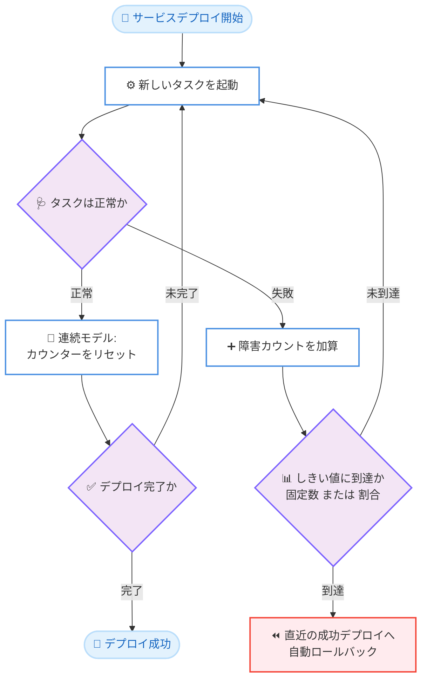

# Amazon ECS - デプロイサーキットブレーカーの設定カスタマイズ

**リリース日**: 2026年7月1日
**サービス**: Amazon Elastic Container Service (Amazon ECS)
**機能**: 設定可能なデプロイサーキットブレーカー (Configurable Deployment Circuit Breaker Settings)

📊 [このアップデートのインフォグラフィックを見る](https://takech9203.github.io/aws-news-summary/20260701-amazon-ecs-circuit-breaker-settings.html)
<!-- INFOGRAPHIC_BASE_URL は環境変数から取得 -->

## 概要

Amazon Elastic Container Service (Amazon ECS) は、サービスデプロイをいつ失敗とみなし、自動的にロールバックするかについて、より細かく制御できるようになりました。今回のアップデートにより、デプロイサーキットブレーカーの設定をアプリケーションの起動動作、デプロイのニーズ、タスク障害への許容度に合わせてカスタマイズできます。

ECS のデプロイサーキットブレーカーは、失敗したデプロイを自動的に検出し、障害のしきい値に達すると直近の成功したデプロイへ自動的にロールバックする機能です。従来はこのしきい値が固定的で、アプリケーションの特性ごとに調整することができませんでした。今回のアップデートでは、しきい値を「固定のタスク障害数」または「サービスの希望タスク数に対する割合」のいずれかで設定できるようになり、さらに障害のカウント方法も選択できるようになりました。

これにより、開発環境やテスト環境ではしきい値を低く設定して素早くロールバックを実行し、本番環境では起動時に一時的な障害が発生してから安定するアプリケーションに対してより高い許容度を持たせるといった、環境やアプリケーションごとの最適な運用が可能になります。対象は Amazon ECS を利用するすべてのユーザーです。

**アップデート前の課題**

- 以前はデプロイサーキットブレーカーの障害しきい値がサービス側で固定的に決定されており、アプリケーションの特性に合わせて調整できなかった
- 以前は起動時に一時的な障害が想定されるアプリケーションでも、その特性を考慮したロールバック挙動を設定できなかった
- 以前は開発環境と本番環境で異なるロールバック感度を使い分けることが難しかった

**アップデート後の改善**

- 今回のアップデートにより、障害しきい値を固定のタスク障害数または希望タスク数に対する割合で指定できるようになった
- 今回のアップデートにより、障害のカウント方法を連続 (consecutive) モデルと累積 (cumulative) モデルから選択できるようになった
- 今回のアップデートにより、環境やアプリケーションごとにロールバックの感度を最適化できるようになった

## アーキテクチャ図



デプロイサーキットブレーカーは、タスクの起動と正常性の確認を繰り返しながら障害数をカウントし、設定したしきい値に到達すると自動的に直近の成功デプロイへロールバックします。今回のアップデートで、しきい値の指定方法とカウント方法をカスタマイズできるようになりました。

## サービスアップデートの詳細

### 主要機能

1. **しきい値の指定方法の選択**
   - 固定のタスク障害数を指定して、その数に達した時点でロールバックを実行できる
   - サービスの希望タスク数に対する割合でしきい値を指定できる
   - 割合指定により、サービスのスケールに応じた相対的なしきい値設定が可能になる

2. **障害カウントモデルの選択**
   - 連続 (consecutive) モデル: 正常なタスクが起動するとカウンターがリセットされる方式
   - 累積 (cumulative) モデル: デプロイ全体を通じて障害数が加算され続ける方式
   - アプリケーションの起動特性に応じて、より適切なカウント方式を選択できる

3. **環境やアプリケーションごとの最適化**
   - 開発環境やテスト環境では低いしきい値を設定し、素早いロールバックを実現できる
   - 起動時に想定される障害があるアプリケーションには、より高い許容度を設定できる
   - 新規および既存の ECS サービスの両方に対して設定できる

## 技術仕様

### デプロイサーキットブレーカーの設定項目

| 項目 | 詳細 |
|------|------|
| しきい値の指定方法 | 固定のタスク障害数、または希望タスク数に対する割合 |
| カウントモデル | 連続 (consecutive) モデル、または累積 (cumulative) モデル |
| 適用対象 | 新規および既存の ECS サービス |
| ロールバック動作 | しきい値到達時に直近の成功デプロイへ自動ロールバック |

### 連続モデルと累積モデルの違い

| モデル | カウント動作 | 適したケース |
|--------|--------------|--------------|
| 連続 (consecutive) | 正常なタスクが起動するとカウンターがリセットされる | 起動時に一時的な障害が発生してから安定するアプリケーション |
| 累積 (cumulative) | デプロイ全体を通じて障害数が加算され続ける | 障害の総数を厳格に管理したいケース |

### 設定例 (割合指定と連続モデル)

```json
{
  "deploymentConfiguration": {
    "deploymentCircuitBreaker": {
      "enable": true,
      "rollback": true
    }
  }
}
```

上記は既存の有効化設定の例です。今回のアップデートで追加されたしきい値やカウントモデルの詳細なパラメータ名については、ECS デプロイサーキットブレーカーのドキュメントを参照してください。

## 設定方法

### 前提条件

1. Amazon ECS のサービスが作成済み、または新規に作成すること
2. デプロイサーキットブレーカーを有効化していること
3. AWS Management Console、AWS CLI、AWS SDK、AWS CloudFormation、AWS CDK、Terraform のいずれかを利用できること

### 手順

#### ステップ1: 対象サービスとデプロイ要件の確認

対象となる ECS サービスと、そのアプリケーションの起動特性を確認します。起動時に一時的な障害が想定されるか、開発環境か本番環境かなどを整理し、適切なしきい値とカウントモデルを決定します。

#### ステップ2: デプロイサーキットブレーカー設定の適用

```bash
# ECS サービスの設定を確認する例
aws ecs describe-services \
  --cluster my-cluster \
  --services my-service
```

上記のコマンドは、対象サービスの現在のデプロイ設定を確認するためのものです。しきい値やカウントモデルの具体的な設定は、AWS Management Console またはドキュメントに記載されたパラメータを用いて `create-service` および `update-service` で適用します。

#### ステップ3: デプロイの実行と挙動の確認

設定を適用した後、実際にデプロイを実行し、障害しきい値に到達した際に想定どおりにロールバックが動作することを確認します。開発環境で挙動を検証してから本番環境へ展開することを推奨します。

## メリット

### ビジネス面

- **リリースリスクの低減**: 環境ごとに適切なしきい値を設定することで、問題のあるデプロイを早期に検出し自動ロールバックできる
- **運用効率の向上**: 手動でのロールバック判断が不要になり、運用負荷を軽減できる
- **サービス品質の維持**: 本番環境での障害の影響範囲を最小限に抑えられる

### 技術面

- **柔軟なしきい値設定**: 固定数と割合の 2 通りでしきい値を指定でき、サービスのスケールに応じた設定が可能
- **アプリケーション特性への適合**: 連続モデルと累積モデルの選択により、起動挙動に合わせたロールバック制御ができる
- **幅広いツール対応**: Console、CLI、SDK、CloudFormation、CDK、Terraform のいずれからでも設定できる

## デメリット・制約事項

### 制限事項

- デプロイサーキットブレーカー自体を有効化していないサービスでは、しきい値設定は機能しない
- しきい値やカウントモデルの設定が不適切な場合、意図しないロールバックや、逆にロールバックの遅延が発生する可能性がある

### 考慮すべき点

- アプリケーションの起動特性を正しく把握したうえで、連続モデルと累積モデルのどちらを選択するかを慎重に検討する必要がある
- 割合でしきい値を指定する場合、希望タスク数の変更に伴って実際のロールバック発生条件も変化する点に注意する

## ユースケース

### ユースケース1: 開発環境での高速ロールバック

**シナリオ**: 開発環境やテスト環境で、デプロイに問題があった場合に素早くロールバックし、開発サイクルを短縮したい。

**実装例**:
```
しきい値: 固定のタスク障害数 (低い値)
カウントモデル: 累積 (cumulative)
```

**効果**: 少数の障害でも即座にロールバックが発生し、問題のあるデプロイに開発チームが早期に気づける。

### ユースケース2: 起動時に一時的な障害があるアプリケーション

**シナリオ**: 起動直後に一時的な障害が発生し、その後安定する特性を持つアプリケーションで、正常起動を待ってから判断したい。

**実装例**:
```
しきい値: 希望タスク数に対する割合
カウントモデル: 連続 (consecutive)
```

**効果**: 正常なタスクが起動するたびにカウンターがリセットされるため、一時的な起動障害による不要なロールバックを回避できる。

### ユースケース3: 大規模サービスでのスケールに応じたしきい値

**シナリオ**: 希望タスク数が変動する大規模サービスで、常に一定の割合の障害を許容範囲としたい。

**実装例**:
```
しきい値: 希望タスク数に対する割合 (例: 一定割合)
カウントモデル: 累積 (cumulative)
```

**効果**: サービスのスケールに応じてしきい値が相対的に調整され、タスク数が変わっても一貫したロールバック基準を維持できる。

## 料金

本機能はデプロイサーキットブレーカーの設定オプションの拡張であり、この機能自体に追加料金は発生しません。Amazon ECS の利用料金は、起動タイプ (AWS Fargate または Amazon EC2) に応じた通常の料金体系に従います。詳細は Amazon ECS の料金ページを参照してください。

## 利用可能リージョン

本機能は、Amazon ECS が利用可能なすべての AWS リージョンで利用できます。

## 関連サービス・機能

- **AWS Fargate**: サーバーレスでコンテナを実行する起動タイプで、ECS サービスのデプロイ対象として本機能と組み合わせて利用できる
- **AWS CloudFormation / AWS CDK / Terraform**: Infrastructure as Code を通じてデプロイサーキットブレーカー設定を管理できる
- **Amazon CloudWatch**: デプロイやタスクの状態を監視し、ロールバックの発生状況を可視化するのに役立つ

## 参考リンク

- 📊 [インフォグラフィック](https://takech9203.github.io/aws-news-summary/20260701-amazon-ecs-circuit-breaker-settings.html)
- [公式発表 (What's New)](https://aws.amazon.com/about-aws/whats-new/2026/07/amazon-ecs-circuit-breaker-settings)
- [Amazon ECS デプロイサーキットブレーカーのドキュメント](https://docs.aws.amazon.com/AmazonECS/latest/developerguide/deployment-circuit-breaker.html)
- [Amazon ECS 料金ページ](https://aws.amazon.com/ecs/pricing/)

## まとめ

今回のアップデートにより、Amazon ECS のデプロイサーキットブレーカーを、しきい値の指定方法 (固定数または割合) とカウントモデル (連続または累積) の観点でカスタマイズできるようになりました。これにより、開発環境から本番環境まで、また多様な起動特性を持つアプリケーションに対して、最適な自動ロールバック挙動を設定できます。ECS を利用してコンテナサービスを運用しているチームは、対象サービスの特性を確認し、環境ごとに適切なサーキットブレーカー設定を見直すことを推奨します。
