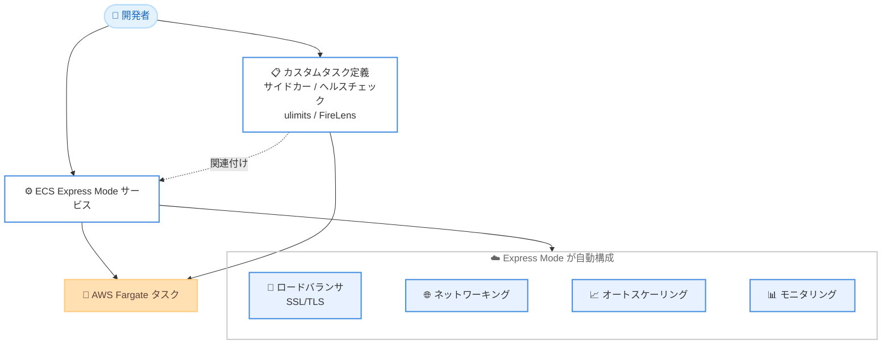

# Amazon ECS - Express Mode がカスタムタスク定義に対応

**リリース日**: 2026 年 7 月 1 日
**サービス**: Amazon Elastic Container Service (Amazon ECS)
**機能**: ECS Express Mode カスタムタスク定義サポート

📊 [このアップデートのインフォグラフィックを見る](https://takech9203.github.io/aws-news-summary/20260701-amazon-ecs-express-mode-custom-task-def.html)
<!-- INFOGRAPHIC_BASE_URL は環境変数から取得 -->

## 概要

Amazon Elastic Container Service (Amazon ECS) の Express Mode が、カスタムタスク定義に対応しました。これにより、既存の ECS アプリケーション構成やタスクレベルの高度なカスタマイズを、Express Mode のシンプルなデプロイ体験と組み合わせて利用できるようになりました。

ECS Express Mode は、コンテナ化された Web アプリケーションや API のデプロイを容易にするための機能です。ロードバランシング、ネットワーキング、オートスケーリング、モニタリング、デプロイを自動的に処理し、コンテナイメージ、タスク実行ロール、インフラストラクチャロールの 3 つを指定するだけでアプリケーションを起動できます。今回のアップデートにより、この手軽さを維持しながら、ユーザーが独自に定義したカスタムタスク定義を利用できるようになりました。

このアップデートは、既存の CI/CD パイプラインや Infrastructure as Code (IaC) ワークフローで管理しているタスク定義を再利用したい開発者や、プラットフォームチームにとって特に価値があります。確立された運用プラクティスを維持しながら、Express Mode による合理化されたデプロイとインフラストラクチャの自動化を活用できます。

**アップデート前の課題**

- 以前は Express Mode がカスタムタスク定義に対応しておらず、タスクレベルの高度なカスタマイズを適用できなかった
- 以前は既存の CI/CD パイプラインや IaC ワークフローで管理しているタスク定義を Express Mode で再利用できなかった
- 以前はサイドカーコンテナやカスタムログルーティングなどの高度な機能を使う場合、Express Mode の簡易デプロイの恩恵を受けられなかった

**アップデート後の改善**

- 今回のアップデートにより、既存のカスタムタスク定義を Express Mode サービスに関連付けられるようになった
- 今回のアップデートにより、可観測性やセキュリティのサイドカー、カスタムコンテナヘルスチェック、ulimits、Linux ランタイム設定、FireLens によるカスタムログルーティングを Express Mode で利用できるようになった
- 今回のアップデートにより、既存の CI/CD パイプラインや IaC ワークフローのタスク定義をそのまま再利用できるようになった

## アーキテクチャ図



開発者が用意したカスタムタスク定義を Express Mode サービスに関連付けると、Express Mode がロードバランシングやオートスケーリングなどのインフラストラクチャを自動構成し、AWS Fargate 上でタスクを実行します。

## サービスアップデートの詳細

### 主要機能

1. **カスタムタスク定義の関連付け**
   - 既存の ECS タスク定義を Express Mode サービスに関連付けて利用できる
   - CI/CD パイプラインや IaC ワークフローで管理しているタスク定義をそのまま再利用できる
   - 関連付け後は、タスク定義の更新経由でも Express Mode 経由でも、好みの方法でアプリケーションを継続管理できる

2. **高度なタスク定義機能の利用**
   - 可観測性 (Observability) およびセキュリティのサイドカーコンテナを追加できる
   - カスタムコンテナヘルスチェックを設定できる
   - ulimits および Linux ランタイム設定を指定できる
   - FireLens によるカスタムログルーティングを構成できる

3. **Express Mode のシンプルさの維持**
   - カスタムタスク定義を使う場合でも、ロードバランシング、ネットワーキング、オートスケーリング、モニタリング、デプロイは Express Mode が自動的に処理する
   - AWS Management Console、AWS CLI、AWS SDK、IaC ツールから利用できる

## 技術仕様

### Express Mode で追加利用可能になったタスク定義機能

| 項目 | 詳細 |
|------|------|
| サイドカーコンテナ | 可観測性、セキュリティ用のサイドカーを追加可能 |
| コンテナヘルスチェック | カスタムのヘルスチェックコマンドを定義可能 |
| ulimits | プロセスのリソース上限を設定可能 |
| Linux ランタイム設定 | Linux 固有のランタイムパラメータを指定可能 |
| FireLens | カスタムログルーティングを構成可能 |

### Express Mode の基本構成

Express Mode サービスは、以下の 3 つの要素を指定するだけで起動できます。

| 項目 | 詳細 |
|------|------|
| コンテナイメージ | 実行するアプリケーションのコンテナイメージ |
| タスク実行ロール | タスク起動時に ECS が使用する IAM ロール |
| インフラストラクチャロール | Express Mode がインフラを構成するための IAM ロール |

Express Mode は、上記をもとに Fargate ベースの ECS サービス、一意のアクセス可能な URL、SSL/TLS 付きロードバランサ、オートスケーリングポリシー、モニタリング、ネットワーキングコンポーネントを自動的にオーケストレーションおよび構成します。

## 設定方法

### 前提条件

1. Amazon ECS および AWS Fargate が利用可能な AWS リージョンであること
2. Express Mode サービスに関連付けるカスタムタスク定義が作成済みであること
3. タスク実行ロールおよびインフラストラクチャロールが用意されていること

### 手順

#### ステップ 1: カスタムタスク定義を用意する

```bash
aws ecs register-task-definition --cli-input-json file://task-definition.json
```

このコマンドは、サイドカーやヘルスチェック、ulimits、FireLens 設定などを含むカスタムタスク定義を ECS に登録します。既存の CI/CD パイプラインや IaC で管理しているタスク定義をそのまま利用できます。

#### ステップ 2: タスク定義を渡して Express Mode サービスを作成または更新する

Express Mode サービスの作成または更新時に、用意したタスク定義を渡します。AWS Management Console、AWS CLI、AWS SDK、または IaC ツールから実行できます。関連付け後は、Express Mode がロードバランシングやオートスケーリングなどのインフラストラクチャを自動的に構成します。

#### ステップ 3: 継続的に管理する

カスタムタスク定義を Express Mode サービスに関連付けた後は、タスク定義の更新経由でアプリケーションを管理することも、Express Mode 経由で管理することもできます。運用スタイルに合わせて好みの方法を選択できます。

## メリット

### ビジネス面

- **既存資産の再利用**: CI/CD パイプラインや IaC ワークフローで管理してきたタスク定義をそのまま活用でき、移行コストを抑えられる
- **運用プラクティスの維持**: 確立された運用手順を維持しながら、Express Mode の合理化されたデプロイを導入できる
- **開発生産性の向上**: アプリケーションチームが深い AWS の知識なしに独立してデプロイできる

### 技術面

- **高度なカスタマイズとの両立**: サイドカーや FireLens などの高度な機能と、Express Mode の自動化を同時に利用できる
- **柔軟な管理方法**: タスク定義の更新経由でも Express Mode 経由でも、好みの方法でアプリケーションを管理できる
- **透明なインフラストラクチャ**: すべてのリソースがユーザーの AWS アカウント内に作成され、コンソールや API から直接管理できる

## デメリット・制約事項

### 制限事項

- Express Mode は Fargate ベースのサービスであり、HTTP リクエストを処理するステートレスなコンテナアプリケーションを想定している
- Express Mode は公開または非公開の HTTPS アプリケーションをサポートする

### 考慮すべき点

- Express Mode 自体には追加料金は発生しないが、Fargate コンピューティング、Application Load Balancer、CloudWatch ログとメトリクス、データ転送などの基盤リソースの料金は発生する
- カスタムタスク定義と Express Mode の両方から管理できるため、更新経路を組織内で統一しておくと運用が明確になる

## ユースケース

### ユースケース 1: 既存 IaC ワークフローでのタスク定義再利用

**シナリオ**: Terraform で ECS タスク定義を管理しているチームが、シンプルなデプロイ体験を求めて Express Mode を導入したい。

**効果**: 既存の IaC で定義したタスク定義をそのまま Express Mode サービスに関連付けられるため、定義を作り直すことなくロードバランシングやオートスケーリングの自動化を利用できる。

### ユースケース 2: 可観測性サイドカーを含むアプリケーション

**シナリオ**: OpenTelemetry コレクターなどの可観測性サイドカーを含めてアプリケーションをデプロイしたい。

**効果**: サイドカーコンテナを含むカスタムタスク定義を Express Mode で利用でき、可観測性を確保しながらインフラ構成の手間を削減できる。

### ユースケース 3: FireLens によるカスタムログルーティング

**シナリオ**: アプリケーションログを FireLens 経由でサードパーティのログ基盤に転送したい。

**効果**: FireLens を構成したカスタムタスク定義を Express Mode サービスで実行でき、既存のログルーティング要件を満たしつつ簡易デプロイを実現できる。

## 料金

ECS Express Mode サービス自体の利用に追加料金は発生しません。アプリケーションの実行のために作成される基盤リソースに対してのみ料金が発生します。

### 料金例

| 使用量 | 月額料金（概算） |
|--------|------------------|
| Fargate コンピューティングリソース | 使用量に応じて課金 |
| Application Load Balancer | 使用量に応じて課金 |
| CloudWatch ログとメトリクス | 使用量に応じて課金 |
| データ転送 | 使用量に応じて課金 |

## 利用可能リージョン

この機能は、Amazon ECS および AWS Fargate が利用可能なすべての AWS リージョンで利用できます。

## 関連サービス・機能

- **AWS Fargate**: Express Mode サービスは Fargate ベースで実行されるコンピューティング基盤
- **Elastic Load Balancing**: Express Mode が SSL/TLS 付きの Application Load Balancer を自動構成
- **Amazon CloudWatch**: Express Mode が自動的にモニタリングとログ収集を構成
- **FireLens**: カスタムログルーティングを実現するログドライバー

## 参考リンク

- 📊 [インフォグラフィック](https://takech9203.github.io/aws-news-summary/20260701-amazon-ecs-express-mode-custom-task-def.html)
- [公式発表 (What's New)](https://aws.amazon.com/about-aws/whats-new/2026/07/amazon-ecs-express-mode-custom-task-def/)
- [ドキュメント: Amazon ECS Express Mode](https://docs.aws.amazon.com/AmazonECS/latest/developerguide/express-service-overview.html)
- [入門ガイド: Getting started walkthrough](https://docs.aws.amazon.com/AmazonECS/latest/developerguide/express-service-getting-started.html)

## まとめ

今回のアップデートにより、ECS Express Mode の簡易デプロイ体験を維持しながら、サイドカーや FireLens などの高度なタスク定義機能を利用できるようになりました。既存の CI/CD パイプラインや IaC ワークフローの資産を再利用できるため、運用プラクティスを変えずに導入を検討できます。既にカスタムタスク定義を運用しているチームは、Express Mode への関連付けによるデプロイ簡素化の効果を評価することを推奨します。
