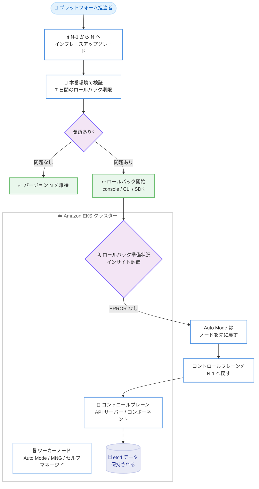

# Amazon EKS - Kubernetes バージョンロールバック

**リリース日**: 2026 年 7 月 1 日
**サービス**: Amazon Elastic Kubernetes Service (Amazon EKS)
**機能**: Kubernetes version rollback (バージョンロールバック)

📊 [このアップデートのインフォグラフィックを見る](https://takech9203.github.io/aws-news-summary/20260701-amazon-eks-version-rollback.html)
<!-- INFOGRAPHIC_BASE_URL は環境変数から取得 -->

## 概要

Amazon EKS が Kubernetes のバージョンロールバックに対応しました。この機能により、インプレースアップグレードの実施後 7 日以内であれば、クラスターのコントロールプレーンを 1 つ前のマイナーバージョンに戻すことができます。アップグレード後にアプリケーションの非互換性、非推奨 API の利用、想定外の動作などの問題が発生した場合に、既知の正常な状態へ復元できる安全策を提供します。

ロールバックは Amazon EKS コンソール、AWS CLI、または AWS SDK から開始できます。実行前に Amazon EKS がクラスターの「ロールバック準備状況インサイト (rollback readiness insights)」を評価し、API 互換性、バージョンスキュー、アドオン互換性、クラスターの健全性などの自動チェックを実施します。EKS Auto Mode を利用しているクラスターでは、EKS がコントロールプレーンを戻す前にワーカーノードのロールバックを自動的に管理し、設定済みの中断制御 (disruption controls) を尊重します。

この機能は、Kubernetes のアップグレードを本番環境で慎重に検証したいプラットフォームエンジニアや SRE を対象としています。ロールバック中、Amazon EKS は Kubernetes API サーバーとコントロールプレーンコンポーネントを 1 つ前のバージョンに戻す一方で、etcd データ、お客様のワークロード、永続ボリュームはすべて保持します。Amazon EKS が利用可能なすべての AWS リージョンで追加費用なしで利用できます。

**アップデート前の課題**

- アップグレード後に問題が判明しても、簡単に前のマイナーバージョンへ戻す仕組みがなく、切り戻しには新しいクラスターの再作成や複雑な手動対応が必要だった
- 本番環境の実負荷でアップグレード後のバージョンを検証し、問題があれば元に戻すという安全策を組み込みにくかった
- EKS Auto Mode 環境で、コントロールプレーンとワーカーノードのバージョンを整合させながら切り戻す作業が煩雑だった

**アップデート後の改善**

- アップグレード完了後 7 日以内であれば、コンソール、CLI、SDK から 1 つ前のマイナーバージョン (N から N-1) へロールバックできるようになった
- ロールバック準備状況インサイトにより、API 互換性やアドオン互換性などの問題を事前に自動チェックできるようになった
- EKS Auto Mode クラスターでは、ワーカーノードのロールバックが自動管理され、中断制御を尊重しながら切り戻しできるようになった

## アーキテクチャ図



アップグレード後の検証で問題が判明した場合、ロールバック準備状況インサイトの評価を経て、コントロールプレーンを 1 つ前のバージョンへ戻す流れを示しています。etcd データは保持されます。

## サービスアップデートの詳細

### 主要機能

1. **7 日間のロールバックウィンドウ**
   - インプレースアップグレードの完了後 7 日以内にロールバックを開始できる
   - 7 日を経過するとロールバックは利用できなくなる
   - ロールバックできるのは 1 マイナーバージョン (N から N-1) のみ。例えば 1.31 から 1.32、さらに 1.33 へアップグレードした場合、戻せるのは 1.32 までで 1.31 には戻せない

2. **ロールバック準備状況インサイト (rollback readiness insights)**
   - アップグレード後、`ROLLBACK_READINESS` カテゴリのクラスターインサイトとして自動評価される
   - API 使用互換性 (フィールドレベルの変更検出を含む)、クラスターの健全性、kubelet のバージョンスキュー、kube-proxy のバージョンスキュー、アドオンのバージョン互換性をチェックする
   - EKS Auto Mode クラスターでは、NodePool の中断バジェット、do-not-disrupt アノテーション、PodDisruptionBudget の設定も追加でチェックされる
   - インサイトは 24 時間ごとに更新され、コンソールの [Refresh] ボタンまたは `start-insights-refresh` で手動更新も可能

3. **EKS Auto Mode の自動ノードロールバック**
   - EKS がコントロールプレーンを戻す前に Auto Mode ワーカーノードのロールバックを自動管理する
   - NodePool の中断バジェット、PDB、do-not-disrupt アノテーションを尊重する (`--force` でも上書きされない)
   - ノードのロールバック中はクラスターステータスが `ACTIVE` のままで、コントロールプレーンのロールバック開始時に `UPDATING` へ変わる

4. **データとワークロードの保持**
   - ロールバックで戻されるのは Kubernetes API サーバーのバージョン、コントロールプレーンのコンポーネントと設定、プラットフォームバージョンのみ
   - etcd データ、お客様のワークロード (Pod、Deployment、Service)、永続ボリューム、EKS アドオンのバージョンは変更されず保持される

## 技術仕様

### ロールバックで戻されるもの / 戻されないもの

| 項目 | ロールバックの対象 |
|------|------|
| Kubernetes API サーバーのバージョン | 戻される |
| コントロールプレーンのコンポーネントと設定 | 戻される |
| プラットフォームバージョン | 戻される (前バージョンの最新プラットフォームバージョンへ) |
| EKS Auto Mode ワーカーノード | 自動的に戻される |
| etcd データ / クラスターの状態 | 戻されない (保持される) |
| お客様のワークロード (Pod、Deployment 等) | 戻されない (稼働継続) |
| EKS アドオン | 戻されない (別途管理が必要) |
| 永続ボリュームとデータ | 戻されない (保持される) |
| マネージドノードグループ (MNG) | 戻されない (`UpdateNodegroupVersion` で別途実施) |
| セルフマネージドノード / ハイブリッドノード | 戻されない (ユーザー責任で実施) |

### 前提条件のチェック項目

| 項目 | 詳細 |
|------|------|
| 7 日間のウィンドウ | アップグレード完了から 7 日以内に開始する必要がある |
| アップグレード済みクラスター | インプレースアップグレードを経たクラスターのみ対象。現行バージョンで作成されたクラスターは対象外 |
| 1 バージョンのみ | N から N-1 への 1 マイナーバージョンのみ |
| サポート対象バージョン | 現在サポートされている EKS バージョンが対象 |
| 拡張サポートポリシー | 拡張サポート中のバージョンへ戻す場合、事前にアップグレードポリシーを `EXTENDED` に変更する必要がある |
| クラスターステータス | クラスターが `ACTIVE` であり、他の更新が進行中でないこと |
| EKS 機能の互換性 | 現行バージョンで有効化した機能が前バージョンで未サポートの場合、ロールバックは失敗する (`--force` でも回避不可) |

### インサイトのステータスと挙動

| ステータス | 意味 | ロールバックへの影響 |
|------|------|------|
| PASSING | 問題なし | ロールバック可能 |
| WARNING | 潜在的な問題あり (ブロックしない) | ロールバック可能 (助言のみ) |
| ERROR | ブロッキングの問題あり | 解決するまでブロック。または `--force` で回避 |
| UNKNOWN | 判定不可 | 解決するまでブロック。または `--force` で回避 |

## 設定方法

### 前提条件

1. 対象クラスターがインプレースアップグレードを経ており、完了から 7 日以内であること
2. クラウターが `ACTIVE` ステータスで、他の更新が進行中でないこと
3. ワーカーノードがコントロールプレーンと同じバージョンの場合、先にワーカーノードをロールバックすること (Auto Mode は自動)
4. アドオンが前バージョンと非互換の場合、互換バージョンへダウングレードすること

### 手順

#### ステップ 1: ロールバック準備状況インサイトの確認

```bash
aws eks list-insights \
  --cluster-name my-cluster \
  --region us-west-2 \
  --filter '{"categories": ["ROLLBACK_READINESS"]}'
```

`ROLLBACK_READINESS` カテゴリのインサイト一覧を取得し、ERROR または WARNING のステータスがないか確認します。特定のインサイトの詳細は `aws eks describe-insight --id <insight-id>` で取得できます。

#### ステップ 2: ワーカーノードの準備 (マネージドノードグループの場合)

```bash
aws eks update-nodegroup-version \
  --cluster-name my-cluster \
  --nodegroup-name my-nodegroup \
  --kubernetes-version 1.30 \
  --region us-west-2
```

Kubernetes のバージョンスキューポリシーにより、ワーカーノードはコントロールプレーンより新しいバージョンを実行できません。マネージドノードグループを先に前バージョンへ戻します。EKS Auto Mode の場合、この操作は不要で自動的に処理されます。

#### ステップ 3: コントロールプレーンのロールバック実行

```bash
aws eks update-cluster-version \
  --name my-cluster \
  --kubernetes-version 1.30 \
  --region us-west-2
```

既存の `update-cluster-version` コマンドに 1 つ前 (N-1) のバージョンを指定してロールバックを開始します。レスポンスの `type` が `VersionRollback` となり、`status` が `InProgress` になります。インサイトが ERROR のまま強制的に実行する場合は `--force` を付与しますが、すべてのインサイトチェックが回避されるため自己責任での利用となります。

#### ステップ 4: ロールバックの進捗監視

```bash
aws eks describe-update \
  --name my-cluster \
  --region us-west-2 \
  --update-id <update-id>
```

`describe-update` で進捗を確認します。ステータスは `InProgress` から `Successful` または `Failed` へ遷移します。`Successful` になればロールバックは完了です。

## メリット

### ビジネス面

- **アップグレードリスクの低減**: 本番環境の実負荷で新バージョンを検証し、問題があれば元に戻せるため、アップグレードに踏み切りやすくなる
- **ダウンタイムと復旧コストの抑制**: クラスター再作成に頼らず切り戻せるため、障害発生時の復旧時間とコストを削減できる
- **追加費用なし**: Amazon EKS が利用可能なすべてのリージョンで追加費用なく利用できる

### 技術面

- **データとワークロードの保持**: etcd データ、Pod、永続ボリュームを保持したままコントロールプレーンのみを戻せる
- **事前チェックの自動化**: ロールバック準備状況インサイトが API 互換性やアドオン互換性を自動評価し、リスクを可視化する
- **Auto Mode の自動化**: EKS Auto Mode ではワーカーノードのロールバックが自動管理され、中断制御も尊重される

## デメリット・制約事項

### 制限事項

- ロールバックはアップグレード完了から 7 日以内、かつ 1 マイナーバージョン (N から N-1) のみ
- 現行バージョンで新規作成されたクラスターはロールバックできない
- Fargate ワーカーノードはバージョンロールバック非対応。コントロールプレーンは戻せるが、同一バージョンで稼働中の Fargate Pod は kubelet バージョンスキューインサイトが ERROR となる
- マネージドノードグループ、セルフマネージドノード、ハイブリッドノード、EKS アドオンは自動では戻されず、別途対応が必要

### 考慮すべき点

- インサイトはベストエフォートかつポイントインタイム評価であり、チェック後にクラスターへ加えた変更 (新 API を使ったリソース作成など) は検出されない
- `--force` は 7 日間ウィンドウや作成バージョンチェックなどの前提条件検証は回避しない。ERROR インサイトを回避した場合、非互換リソースは etcd に残り自動削除されない
- 標準サポート中のバージョンから拡張サポート中のバージョンへ戻すと、拡張サポート料金が発生する
- 責任共有モデルに基づき、アプリケーションや依存関係が前バージョンと互換であることの検証はお客様の責任となる

## ユースケース

### ユースケース 1: 本番アップグレード後の非互換検出時の切り戻し

**シナリオ**: マイナーバージョンアップグレード後、非推奨 API を利用していたコントローラーが動作不良を起こした。

**実装例**:
```bash
aws eks list-insights --cluster-name prod-cluster \
  --filter '{"categories": ["ROLLBACK_READINESS"]}' --region ap-northeast-1
aws eks update-cluster-version --name prod-cluster \
  --kubernetes-version 1.31 --region ap-northeast-1
```

**効果**: クラスター再作成なしに前バージョンへ戻し、ワークロードと etcd データを保持したまま既知の正常な状態へ復旧できる。

### ユースケース 2: EKS Auto Mode クラスターでの安全なアップグレード検証

**シナリオ**: EKS Auto Mode を使う本番クラスターで、アップグレード後の性能を数日間検証したい。

**実装例**:
```bash
# 検証後に問題が判明した場合、ノードは自動でロールバックされる
aws eks update-cluster-version --name automode-cluster \
  --kubernetes-version 1.31 --region ap-northeast-1
```

**効果**: NodePool の中断バジェットや PDB を尊重しながらワーカーノードが自動で戻され、その後コントロールプレーンが戻る。運用負荷を抑えつつ安全に検証できる。

### ユースケース 3: アドオン互換性の事前確認とダウングレード

**シナリオ**: ロールバック前に、稼働中の VPC CNI アドオンが前バージョンと非互換であることをインサイトで検出した。

**実装例**:
```bash
aws eks update-addon --cluster-name my-cluster \
  --addon-name vpc-cni --addon-version v1.12.0-eksbuild.2 \
  --region ap-northeast-1
```

**効果**: コントロールプレーンのロールバック前にアドオンを互換バージョンへ調整することで、ロールバック後のアドオン不具合を防止できる。

## 料金

Amazon EKS のバージョンロールバック機能自体は追加費用なしで利用できます。ただし、標準サポート中のバージョンから拡張サポート中のバージョンへロールバックした場合、そのクラスターに拡張サポート料金が発生します。クラスターおよびワーカーノードの通常の EKS 料金は引き続き適用されます。

## 利用可能リージョン

Amazon EKS が利用可能なすべての AWS リージョンで利用できます。

## 関連サービス・機能

- **EKS Auto Mode**: ワーカーノードのロールバックを自動管理する対象。中断制御を尊重しながらノードを先に戻す
- **EKS クラスターインサイト**: ロールバック準備状況を `ROLLBACK_READINESS` カテゴリで評価し、アップグレード前のチェックにも利用される機能
- **マネージドノードグループ**: ロールバック時に `UpdateNodegroupVersion` で別途バージョンを戻す必要がある
- **AWS CloudFormation**: スタックのロールバックはクラスターのバージョンロールバックを自動的にはトリガーしない点に注意が必要

## 参考リンク

- 📊 [インフォグラフィック](https://takech9203.github.io/aws-news-summary/20260701-amazon-eks-version-rollback.html)
- [公式発表 (What's New)](https://aws.amazon.com/about-aws/whats-new/2026/07/amazon-eks-version-rollback)
- [ドキュメント: Rollback cluster to previous Kubernetes version](https://docs.aws.amazon.com/eks/latest/userguide/rollback-cluster.html)
- [ドキュメント: Rollback EKS Auto Mode clusters](https://docs.aws.amazon.com/eks/latest/userguide/rollback-automode.html)
- [ドキュメント: Cluster insights](https://docs.aws.amazon.com/eks/latest/userguide/cluster-insights.html)

## まとめ

Amazon EKS のバージョンロールバックは、Kubernetes アップグレードにおける切り戻しの安全策を提供する重要なアップデートです。アップグレード完了から 7 日以内であれば、etcd データやワークロードを保持したままコントロールプレーンを 1 つ前のマイナーバージョンへ戻せます。EKS を運用する場合は、ロールバック準備状況インサイトの確認手順を運用フローに組み込み、Fargate やアドオン、マネージドノードグループの制約を事前に把握しておくことを推奨します。
