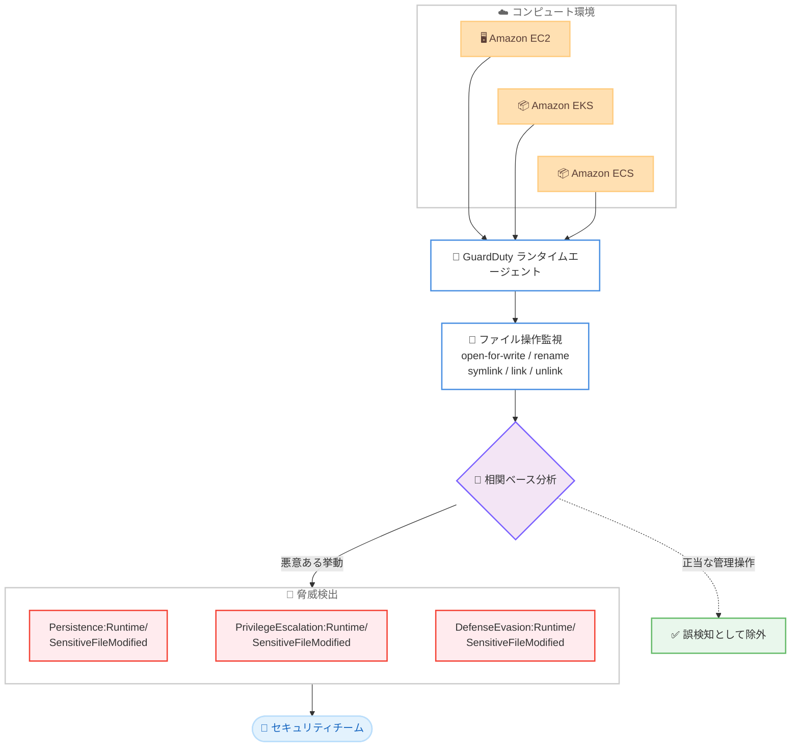

# Amazon GuardDuty - 機密ファイル変更の脅威検出

**リリース日**: 2026 年 7 月 1 日
**サービス**: Amazon GuardDuty
**機能**: Runtime Monitoring における機密ファイル変更 (Sensitive File Modification) 検出

📊 [このアップデートのインフォグラフィックを見る](https://takech9203.github.io/aws-news-summary/20260701-amazon-guardduty-sfm.html)
<!-- INFOGRAPHIC_BASE_URL は環境変数から取得 -->

## 概要

Amazon GuardDuty の Runtime Monitoring に、機密ファイルが変更された際にセキュリティチームへ通知する 3 つの新しい脅威検出が追加されました。この検出は、Amazon EC2 インスタンス、および Amazon EKS や Amazon ECS 上で稼働するコンテナワークロードを対象とし、設定ファイル、認証設定、システムログといった重要なシステムファイルを監視します。

新しい検出は、システム侵害後の攻撃者の活動 (post-compromise activity) を特定することを目的としています。攻撃者が初期侵入後に永続的なアクセスを確立したり、権限を昇格させたり、検出を回避したりする試みを識別します。これらの検出は、AWS のコンピュート環境全体で包括的な脅威の可視性を必要とするセキュリティチーム、DevSecOps 担当者、クラウドセキュリティアーキテクトを対象としています。

これらの検出は、5 つの特定のファイル操作 (open-for-write、rename、symlink、link、unlink) を直接監視することで、コマンドラインの監視を回避する難読化された手法が使われた場合でも脅威を検出できます。相関ベースの分析により、悪意ある挙動を正当な管理操作から区別し、誤検知を削減しながら MITRE ATT&CK フレームワークの戦術マッピングと修復推奨を提供します。

**アップデート前の課題**

このアップデート以前、Runtime Monitoring における機密ファイル変更の検出には以下の課題がありました。

- 侵害後の攻撃者による機密システムファイルの改ざんを、専用の検出タイプで捉えることが難しかった
- コマンドライン監視に依存する検出は、難読化された手法によって回避される可能性があった
- 正当な管理操作と悪意ある操作の区別が難しく、誤検知が発生しやすかった

**アップデート後の改善**

今回のアップデートにより、以下が可能になりました。

- 永続化、権限昇格、防御回避の 3 つの戦術に対応した専用の検出タイプが利用可能になった
- ファイル操作を直接監視することで、コマンドラインを回避する難読化された手法も検出できるようになった
- 相関ベースの分析により、正当な管理操作と区別して誤検知を削減できるようになった

## アーキテクチャ図



GuardDuty ランタイムエージェントが各コンピュート環境からファイル操作イベントを収集し、相関ベースの分析を経て 3 種類の脅威検出をセキュリティチームへ通知する流れを示しています。

## サービスアップデートの詳細

### 主要機能

1. **Persistence:Runtime/SensitiveFileModified (永続化)**
   - 攻撃者がシステム上で永続的な実行権限を維持できる可能性がある、機密システムファイルの変更を検出します
   - 新しい SSH キーファイルのインストール、ユーザー設定ファイルの変更、パスワードや shadow ファイルの変更、スケジュールされたタスクの作成、システム起動スクリプトの改ざんなどが対象です
   - デフォルトの重要度は Medium です

2. **PrivilegeEscalation:Runtime/SensitiveFileModified (権限昇格)**
   - 攻撃者がシステム上で権限を昇格できる可能性がある、機密システムファイルの変更を検出します
   - sudoers 設定、PAM 設定、システム認証ファイルなどのセキュリティ上重要なファイルの変更が対象です
   - 不正な root アクセス、認証メカニズムの弱体化、セキュリティ制御の侵害につながる可能性があります
   - デフォルトの重要度は Medium です

3. **DefenseEvasion:Runtime/SensitiveFileModified (防御回避)**
   - 攻撃者がシステム上で検出を回避できる可能性がある、機密システムファイルの変更を検出します
   - システムログファイル、監査設定、コマンド履歴ファイルなどの変更が対象です
   - 不正な活動の隠蔽、セキュリティ監視の妨害、システム活動の証拠の削除につながる可能性があります
   - デフォルトの重要度は Medium です

## 技術仕様

### 監視対象のファイル操作

GuardDuty は以下の 5 つのファイル操作を直接監視します。これにより、コマンドラインの監視を回避する難読化された手法にも対応します。

| ファイル操作 | 説明 |
|------|------|
| open-for-write | 書き込み用にファイルを開く操作 |
| rename | ファイル名の変更操作 |
| symlink | シンボリックリンクの作成操作 |
| link | ハードリンクの作成操作 |
| unlink | ファイルの削除 (リンク解除) 操作 |

### 検出タイプの一覧

| 検出タイプ | 戦術 | デフォルト重要度 |
|------|------|------|
| Persistence:Runtime/SensitiveFileModified | 永続化 | Medium |
| PrivilegeEscalation:Runtime/SensitiveFileModified | 権限昇格 | Medium |
| DefenseEvasion:Runtime/SensitiveFileModified | 防御回避 | Medium |

### 検出詳細の確認

各検出では、`service.runtimeDetails.context` フィールドに、変更されたファイルパスや操作タイプを含む詳細情報が格納されます。侵害された可能性のあるリソースは、GuardDuty コンソールの検出パネルの **Resource type** で確認できます。検出には MITRE ATT&CK の戦術マッピングと修復推奨が含まれます。

## 設定方法

### 前提条件

1. 対象アカウントで Amazon GuardDuty が有効化されていること
2. Amazon EC2、Amazon EKS、または Amazon ECS のワークロードで GuardDuty Runtime Monitoring が有効化されていること
3. GuardDuty ランタイムエージェントが対象リソースにデプロイされていること

### 手順

#### ステップ 1: GuardDuty Runtime Monitoring の有効化

```bash
aws guardduty update-detector \
  --detector-id <detector-id> \
  --features '[{"Name":"RUNTIME_MONITORING","Status":"ENABLED"}]'
```

このコマンドは、指定した GuardDuty ディテクターで Runtime Monitoring 機能を有効化します。機密ファイル変更の検出は Runtime Monitoring を有効化しているすべてのお客様に自動的に提供されるため、追加の設定は不要です。

#### ステップ 2: 検出の確認

```bash
aws guardduty list-findings \
  --detector-id <detector-id> \
  --finding-criteria '{"Criterion":{"type":{"Eq":["Persistence:Runtime/SensitiveFileModified"]}}}'
```

このコマンドは、機密ファイル変更に関連する検出結果を一覧表示します。返された検出 ID を `get-findings` に渡すことで、ファイルパスや操作タイプを含む詳細を確認できます。

#### ステップ 3: 通知の設定

新機能や脅威検出に関するプログラムによる更新を受け取るには、Amazon GuardDuty SNS トピックをサブスクライブします。これにより、新しい検出タイプが追加された際に自動的に通知を受け取れます。

## メリット

### ビジネス面

- **インシデント対応の迅速化**: 侵害後の攻撃者活動を早期に特定し、被害拡大の前に対応できます
- **コンプライアンス対応の強化**: 重要なシステムファイルの変更を継続的に監視することで、監査要件への対応を支援します
- **運用負荷の削減**: 相関ベースの分析により誤検知が削減され、セキュリティチームが対応すべき検出に集中できます

### 技術面

- **難読化への耐性**: ファイル操作を直接監視するため、コマンドラインを回避する難読化された手法も検出できます
- **包括的なカバレッジ**: EC2、EKS、ECS の各コンピュート環境を単一のサービスで一貫して監視できます
- **実用的なインテリジェンス**: MITRE ATT&CK の戦術マッピングと修復推奨により、対応の判断が容易になります

## デメリット・制約事項

### 制限事項

- 検出には GuardDuty Runtime Monitoring の有効化と、ランタイムエージェントのデプロイが必要です
- 検出のデフォルト重要度は Medium であり、環境によっては重要度のカスタマイズを検討する必要があります
- 相関ベースの分析は正当な管理操作と悪意ある操作の区別を行いますが、運用の実態に応じた抑制ルールの検討が必要な場合があります

### 考慮すべき点

- Runtime Monitoring の利用には追加の料金が発生します (新規ユーザー向けに 30 日間の無料トライアルが提供されます)
- 検出フィールドにはファイルパスなど攻撃者が制御し得る値が含まれるため、GuardDuty コンソール外で処理する際は HTML エンコードなどのサニタイズを行う必要があります

## ユースケース

### ユースケース 1: SSH キーの不正追加による永続化の検出

**シナリオ**: 攻撃者が Web アプリケーションの脆弱性を悪用して EC2 インスタンスに侵入し、`authorized_keys` に自身の SSH 公開鍵を追加して永続的なアクセスを確立しようとします。

**実装例**:
```
検出タイプ: Persistence:Runtime/SensitiveFileModified
対象ファイル: ~/.ssh/authorized_keys
操作タイプ: open-for-write
```

**効果**: 永続化の試みを早期に検出し、攻撃者がアクセスを維持する前に対応できます。

### ユースケース 2: sudoers 変更による権限昇格の検出

**シナリオ**: 侵害されたコンテナ内で攻撃者が `/etc/sudoers` を変更し、低権限ユーザーに root 権限を付与して権限を昇格させようとします。

**実装例**:
```
検出タイプ: PrivilegeEscalation:Runtime/SensitiveFileModified
対象ファイル: /etc/sudoers
操作タイプ: open-for-write
```

**効果**: 認証メカニズムの弱体化やセキュリティ制御の侵害につながる操作を検出し、権限昇格を阻止できます。

### ユースケース 3: ログ削除による防御回避の検出

**シナリオ**: 攻撃者が痕跡を隠すためにシステムログや監査設定を改ざんまたは削除し、セキュリティ監視を妨害しようとします。

**実装例**:
```
検出タイプ: DefenseEvasion:Runtime/SensitiveFileModified
対象ファイル: /var/log/ 配下のログファイル
操作タイプ: unlink
```

**効果**: 証拠隠滅の試みを検出し、インシデント調査に必要な情報を保全できます。

## 料金

機密ファイル変更の検出は、GuardDuty Runtime Monitoring を有効化しているすべてのお客様に対し、Runtime Monitoring の標準料金の範囲内で提供されます。この機能自体に追加料金はありません。新規ユーザーには 30 日間の無料トライアルが提供されます。

### 料金例

| 使用量 | 月額料金 (概算) |
|--------|------------------|
| Runtime Monitoring の利用料金に準拠 | GuardDuty の料金ページを参照 |
| 機密ファイル変更検出の追加料金 | なし |

正確な料金は、監視対象のリソース数や vCPU 時間などによって異なります。詳細は GuardDuty の料金ページを参照してください。

## 利用可能リージョン

機密ファイル変更の検出は、GuardDuty Runtime Monitoring を有効化している Amazon EC2、Amazon EKS、Amazon ECS のワークロードを持つすべてのお客様に提供されます。

## 関連サービス・機能

- **Amazon EC2**: ランタイムエージェントによるインスタンスのファイル操作監視の対象です
- **Amazon EKS**: Kubernetes クラスター上のコンテナワークロードの監視対象です
- **Amazon ECS**: コンテナワークロードの監視対象です
- **AWS Security Hub**: GuardDuty の検出結果を集約し、セキュリティ体制の一元管理を支援します
- **Amazon EventBridge**: 検出結果をトリガーとした自動対応 (修復ワークフロー) の構築に活用できます

## 参考リンク

- 📊 [インフォグラフィック](https://takech9203.github.io/aws-news-summary/20260701-amazon-guardduty-sfm.html)
- [公式発表 (What's New)](https://aws.amazon.com/about-aws/whats-new/2026/07/amazon-guardduty-sfm/)
- [ドキュメント (Amazon GuardDuty Findings)](https://docs.aws.amazon.com/guardduty/latest/ug/guardduty_findings.html)
- [Runtime Monitoring finding types](https://docs.aws.amazon.com/guardduty/latest/ug/findings-runtime-monitoring.html)
- [Amazon GuardDuty SNS トピック](https://docs.aws.amazon.com/guardduty/latest/ug/guardduty_sns.html)

## まとめ

今回のアップデートは、侵害後の攻撃者活動を捉える 3 つの専用検出を GuardDuty Runtime Monitoring に追加し、永続化、権限昇格、防御回避という重要な攻撃戦術への可視性を高めるものです。ファイル操作を直接監視することで難読化された手法にも対応し、相関ベースの分析で誤検知を抑えます。Runtime Monitoring を利用中の環境では追加設定なしで有効になるため、検出タイプの確認と通知設定を見直し、インシデント対応ワークフローへの組み込みを検討することを推奨します。
