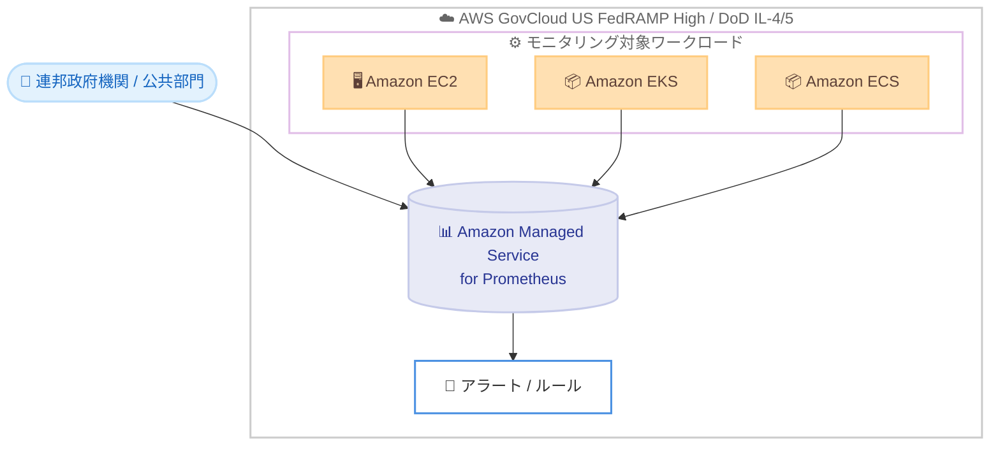

# Amazon Managed Service for Prometheus - AWS GovCloud (US) での FedRAMP High および DoD IL-4/5 認証取得

**リリース日**: 2026 年 7 月 1 日
**サービス**: Amazon Managed Service for Prometheus
**機能**: AWS GovCloud (US) リージョンでの FedRAMP High および DoD CC SRG IL-4/5 認証取得

📊 [このアップデートのインフォグラフィックを見る](https://takech9203.github.io/aws-news-summary/20260701-amazon-managed-service-prometheus-fedramp-high.html)
<!-- INFOGRAPHIC_BASE_URL は環境変数から取得 -->

## 概要

Amazon Managed Service for Prometheus が、AWS GovCloud (US) リージョンにおいて FedRAMP High および米国国防総省 (DoD) Cloud Computing Security Requirements Guide (DoD CC SRG) の Impact Level (IL) 4 および 5 の認証を取得しました。これにより、高いセキュリティレベルとコンプライアンス要件を持つワークロードでも、このサービスを安心して利用できるようになりました。

Amazon Managed Service for Prometheus は、オープンソースの Prometheus と互換性のあるフルマネージド型のモニタリングサービスです。運用メトリクスを大規模に収集、保存し、アラートを発報できます。高カーディナリティのワークロードに対してもデータの取り込みと保存を自動的にスケールし、AWS のセキュリティサービスと統合してデータへの高速かつ安全なアクセスを実現します。

今回の認証取得により、連邦政府機関、公共部門組織、および FedRAMP High と DoD CC SRG IL-4/5 のコンプライアンス要件を持つ企業は、機微な環境で求められるセキュリティおよびコンプライアンス基準を満たしていることを前提に、ワークロードのモニタリングとアラートにこのサービスを活用できます。

**アップデート前の課題**

このアップデート以前に存在していた課題や制限を記述します。

- 以前は Amazon Managed Service for Prometheus が AWS GovCloud (US) で FedRAMP High および DoD IL-4/5 の認証を取得していなかったため、これらのコンプライアンス要件を持つワークロードでは採用が難しかった
- 高いコンプライアンス基準が求められる連邦政府機関や国防関連のワークロードでは、代替のモニタリング手段や自前のインフラ運用が必要になる場合があった
- 機微な環境において、Prometheus 互換のマネージドモニタリングを利用する際にコンプライアンス上の裏付けが不足していた

**アップデート後の改善**

今回のアップデートにより可能になったことを記述します。

- 今回のアップデートにより、AWS GovCloud (US) リージョンで FedRAMP High および DoD CC SRG IL-4/5 のコンプライアンス要件を満たしたモニタリングが可能になった
- 連邦政府機関や公共部門組織が、機微なワークロードのメトリクス収集とアラートにフルマネージド型サービスを利用できるようになった
- 自前で Prometheus 環境を構築、運用する必要がなくなり、コンプライアンス要件を満たしながら運用負荷を削減できるようになった

## アーキテクチャ図

AWS GovCloud (US) 内で稼働する各種ワークロードのメトリクスを Amazon Managed Service for Prometheus に取り込み、アラートを発報する構成を示しています。今回の認証取得により、この構成全体が FedRAMP High および DoD IL-4/5 の基準を満たします。

## サービスアップデートの詳細

### 主要機能

1. **FedRAMP High 認証の取得**
   - AWS GovCloud (US) リージョンで FedRAMP High の認証を取得
   - 機微な連邦政府データを扱うワークロードでの利用が可能

2. **DoD CC SRG IL-4/5 認証の取得**
   - 米国国防総省の Cloud Computing Security Requirements Guide における Impact Level 4 および 5 に対応
   - 国防関連の機微なワークロードのモニタリングに対応

3. **Prometheus 互換のフルマネージドモニタリング**
   - オープンソースの Prometheus と同じデータモデルおよびクエリ言語 (PromQL) を利用可能
   - 高カーディナリティのワークロードに対して取り込みと保存を自動的にスケール
   - AWS のセキュリティサービスと統合し、データへの高速かつ安全なアクセスを提供

## 技術仕様

### AWS GovCloud (US) での提供内容

| 項目 | 詳細 |
|------|------|
| 対応リージョン | AWS GovCloud (US-West)、AWS GovCloud (US-East) |
| コンプライアンス | FedRAMP High、DoD CC SRG IL-4、DoD CC SRG IL-5 |
| サービス種別 | サーバーレス、Prometheus 互換のフルマネージドモニタリング |
| データの所在 | データは AWS GovCloud (US) リージョン外に出ない |

### 標準リージョンとの差異

| 項目 | 詳細 |
|------|------|
| AWS マネージドコレクター | AWS GovCloud (US) では Amazon Managed Service for Prometheus Collector は利用不可 |

## メリット

### ビジネス面

- **コンプライアンス要件への対応**: FedRAMP High および DoD IL-4/5 の要件を持つ連邦政府機関や公共部門組織が、正式な認証の裏付けのもとでモニタリングサービスを採用できる
- **調達の簡素化**: マネージドサービスとして認証済みのため、機微な環境でのモニタリング基盤の選定と承認が容易になる
- **運用負荷の削減**: 自前で Prometheus 環境を構築、運用する必要がなくなり、担当者はワークロードの監視に集中できる

### 技術面

- **既存資産の活用**: オープンソースの Prometheus と同じデータモデルおよび PromQL を利用でき、既存の設定やダッシュボードを流用しやすい
- **自動スケーリング**: 高カーディナリティのワークロードに対しても取り込みと保存を自動的にスケール
- **セキュアなアクセス**: AWS のセキュリティサービスと統合し、データへの高速かつ安全なアクセスを実現

## デメリット・制約事項

### 制限事項

- AWS GovCloud (US) では Amazon Managed Service for Prometheus Collector が利用できない
- 対応リージョンは AWS GovCloud (US-West) および AWS GovCloud (US-East) に限定される
- 商用リージョンとは異なる制約が適用される場合がある

### 考慮すべき点

- AWS マネージドコレクターが利用できないため、メトリクスの収集方法 (自己管理型のコレクターや Prometheus サーバーなど) を別途検討する必要がある
- 具体的なコンプライアンス要件への適合可否は、対象ワークロードごとに確認することが望ましい

## ユースケース

### ユースケース1: 連邦政府機関のコンテナ環境の監視

**シナリオ**: FedRAMP High の要件を持つ連邦政府機関が、AWS GovCloud (US) 上の Amazon EKS クラスターで稼働するアプリケーションのメトリクスを監視したい。

**効果**: コンプライアンス基準を満たしたフルマネージドサービスで、コンテナ環境の運用メトリクスを収集、可視化し、アラートを発報できる。

### ユースケース2: 国防関連ワークロードの大規模モニタリング

**シナリオ**: DoD CC SRG IL-4/5 の要件を持つ組織が、機微なワークロードから発生する高カーディナリティのメトリクスを大規模に収集する必要がある。

**効果**: 取り込みと保存が自動的にスケールするため、インフラを管理せずに大規模なメトリクスを IL-4/5 準拠の環境で扱える。

### ユースケース3: 既存 Prometheus 資産の GovCloud への移行

**シナリオ**: 既にオープンソースの Prometheus を利用している公共部門組織が、運用負荷を削減しつつコンプライアンス要件を満たす環境へ移行したい。

**効果**: 既存の PromQL クエリやアラートルールを活かしながら、認証済みのマネージドサービスへ移行でき、運用負荷とコンプライアンス対応の両方を改善できる。

## 料金

Amazon Managed Service for Prometheus の料金は、取り込んだメトリクスサンプル数、保存したメトリクスのストレージ量、およびクエリで処理したメトリクスサンプル数に基づく従量課金です。詳細は公式の料金ページを確認してください。

## 利用可能リージョン

AWS GovCloud (US-West) および AWS GovCloud (US-East) の 2 つの AWS GovCloud (US) リージョンで、FedRAMP High および DoD CC SRG IL-4/5 の認証を取得しています。

## 関連サービス・機能

- **Amazon EKS / Amazon ECS**: コンテナワークロードのメトリクスを Amazon Managed Service for Prometheus で監視
- **Amazon EC2**: EC2 インスタンス上で稼働するワークロードのメトリクス収集
- **AWS GovCloud (US)**: 米国政府の機微なワークロード向けに設計された分離リージョン

## 参考リンク

- 📊 [インフォグラフィック](https://takech9203.github.io/aws-news-summary/20260701-amazon-managed-service-prometheus-fedramp-high.html)
- [公式発表 (What's New)](https://aws.amazon.com/about-aws/whats-new/2026/07/amazon-managed-service-prometheus-fedramp-high/)
- [ドキュメント (GovCloud)](https://docs.aws.amazon.com/govcloud-us/latest/UserGuide/govcloud-amp.html)
- [製品ページ](https://aws.amazon.com/prometheus/)

## まとめ

今回のアップデートにより、Amazon Managed Service for Prometheus は AWS GovCloud (US) で FedRAMP High および DoD CC SRG IL-4/5 の認証を取得し、機微なワークロードでも安心して利用できるようになりました。FedRAMP High や DoD IL-4/5 の要件を持つ連邦政府機関や公共部門組織は、GovCloud のドキュメントを確認し、対象ワークロードでの導入を検討することをおすすめします。GovCloud ではマネージドコレクターが利用できない点に留意し、メトリクスの収集方法を事前に設計してください。
