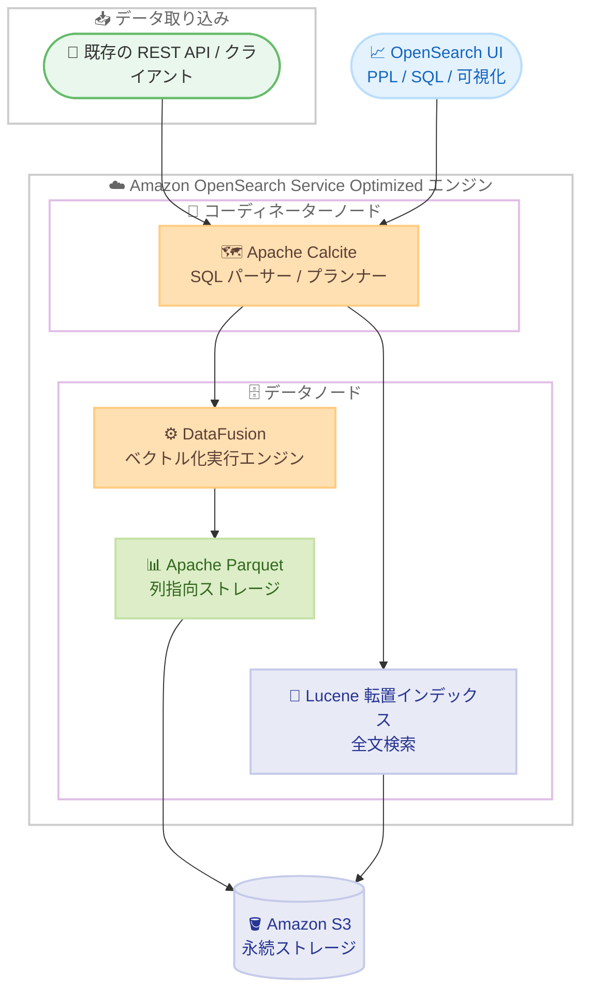

# Amazon OpenSearch Service - ログ分析に最適化された新エンジン

**リリース日**: 2026 年 7 月 1 日
**サービス**: Amazon OpenSearch Service
**機能**: ログ分析に最適化された新エンジン (Optimized engine for log analytics)

📊 [このアップデートのインフォグラフィックを見る](https://takech9203.github.io/aws-news-summary/20260701-amazon-opensearch-service-optimized-log-analytics.html)
<!-- INFOGRAPHIC_BASE_URL は環境変数から取得 -->

## 概要

Amazon OpenSearch Service は、ログ分析ワークロードに特化して構築された新しいエンジンを発表しました。AWS の内部ベンチマークでは、従来と比較して最大 4 倍のコストパフォーマンスを実現します。この新エンジンは、列指向ストレージによる効率性と、OpenSearch が得意とする全文検索機能を 1 つのサービスに統合しており、インシデント調査で必要となるアドホックなテキスト検索も引き続き実行できます。

クラウドネイティブアーキテクチャ、AI ワークロード、拡大するコンプライアンス要件に伴い、ログ量は増加を続けています。チームは広範なパターンを把握するための集計やトレンド分析により多くの時間を費やす一方で、インシデント調査では依然として正確なテキスト検索が求められます。ログ分析に最適化された新エンジンは、高速な分析クエリと全文検索の両方を単一のシームレスなサービスで提供します。

新エンジンは、集計ワークロード向けの新しい列指向ストレージにより、ストレージを最大 70% 削減します。これにより、同じコストで最大 3 倍のデータを保持できます。また、同じハードウェアで最大 2 倍の取り込みスループット、最大 2 倍高速な分析クエリを実現します。対象ユーザーは、大規模なアプリケーションログ、インフラログ、セキュリティログを扱うオブザーバビリティチームやセキュリティチームです。

**アップデート前の課題**

- 集計やトレンド分析といった分析ワークロードと、インシデント調査のための全文検索を両立させるには、汎用エンジンで運用する必要があり、ログ量の増加に伴いストレージコストと処理性能の面で負担が大きかった
- ログ量が増加するにつれてストレージコストが増大し、限られたコストで保持できるデータ量に制約があった
- 大規模なログ取り込みと分析クエリの高速化には、より多くのハードウェアリソースが必要だった

**アップデート後の改善**

- ログ分析に最適化された新エンジンにより、高速な分析クエリと全文検索を単一のサービスで実行できるようになった
- 新しい列指向ストレージ (Apache Parquet) により、ストレージを最大 70% 削減し、同じコストで最大 3 倍のデータを保持できるようになった
- 同じハードウェアで最大 2 倍の取り込みスループットと最大 2 倍高速な分析クエリが可能になり、最大 4 倍のコストパフォーマンスが得られるようになった

## アーキテクチャ図



新エンジンは、コーディネーターノードでクエリを解析し、分析処理は DataFusion エンジン、全文検索は Lucene エンジンにルーティングします。データは分析用に列指向の Parquet 形式で保存し、検索対象フィールドは Lucene 転置インデックスにも書き込むため、1 つのクエリ内で検索と集計を組み合わせて実行できます。

## サービスアップデートの詳細

### 主要機能

1. **ログ分析に最適化された新エンジンモード**
   - 集計、フィルタ、トレンド分析が中心となるログ分析ワークロード向けに特化
   - 追記型 (append-only) のログを、1 日あたり数テラバイト規模で扱うユースケースに最適
   - 汎用エンジンと同じコンソール、API、セキュリティモデル、ネットワーク設定をそのまま利用可能

2. **列指向ストレージによる効率化**
   - Apache Parquet の列指向フォーマットにより、従来のインデックス構造と比べてログデータを大幅に圧縮
   - ストレージを最大 70% 削減し、同じコストで最大 3 倍のデータを保持
   - ベクトル化された列指向の書き込みパスにより、取り込みスループットを最大 2 倍に向上

3. **全文検索と分析クエリの統合**
   - 同一クエリ内で全文検索の述語 (predicate) と分析 SQL を組み合わせて実行可能
   - Lucene 転置インデックスを保持し、フレーズ検索、あいまい検索、ワイルドカード検索に対応
   - OpenSearch UI での PPL によるデータ探索、API / JDBC / ODBC ドライバ / Query Workbench 経由での SQL クエリに対応

## 技術仕様

### 新エンジンの構成コンポーネント

| コンポーネント | 役割 |
|------|------|
| Apache Parquet | オープンな列指向ストレージ形式。ログデータの主ストレージとして大幅なストレージ削減を実現 |
| Lucene 転置インデックス | ログ内容の全文検索 (フレーズ、あいまい、ワイルドカード) 用に保持 |
| Apache Calcite | SQL パーサー / プランナー / オプティマイザ。コーディネーターノード上ですべてのクエリ言語の単一フロントエンドとして動作 |
| DataFusion | Rust ベースのベクトル化実行エンジン。列指向データに対する集計、フィルタ、範囲スキャンを実行 |
| Apache Arrow | インメモリの列指向形式。ゼロコピーのデータ転送とベクトル化処理を実現 |
| Amazon S3 | Parquet ファイルと転置インデックスセグメントの永続的なバッキングストア |

### エンジンモードの比較

| エンジンモード | 適したワークロード |
|------|------|
| General Purpose (汎用) | 頻繁な更新を伴う検索中心・混在ワークロード (EC サイト、コンテンツ検索、アプリケーション検索) |
| Optimized (ログ分析に推奨) | 追記型ログ、マルチテラバイト規模のログ分析 |

### API 変更履歴

このアップデートに直接対応する固有の API メソッド変更は、AWS API Changes では確認できませんでした。新エンジンは既存の REST API およびクライアントライブラリを通じて利用します。

## 設定方法

### 前提条件

1. OpenSearch 3.5 以降のバージョンで新しいドメインを作成できること
2. 利用可能な 12 リージョンのいずれかを使用していること
3. ログ分析 (追記型ログ、集計・トレンド分析が中心のワークロード) を対象としていること

### 手順

#### ステップ 1: 新しいドメインを作成する

AWS Management Console で OpenSearch 3.5 以降を指定して新しいドメインを作成します。ドメイン作成時にオブザーバビリティのユースケースを選択し、エンジンモードを「optimized」に設定します。この設定により、ログ分析に最適化された列指向ストレージと実行エンジンが有効になります。

#### ステップ 2: データを取り込む

```bash
# 既存の REST API を使用してログデータをバルク取り込みする例
curl -XPOST "https://<domain-endpoint>/_bulk" \
  -H "Content-Type: application/json" \
  --aws-sigv4 "aws:amz:<region>:es" \
  --data-binary @logs.ndjson
```

新エンジンは既存の REST API およびクライアントライブラリからのデータ取り込みに対応しているため、新しいエージェントやパイプラインを導入する必要はありません。データは分析用に Parquet 形式へ書き込まれ、検索対象フィールドは Lucene 転置インデックスにも書き込まれます。

#### ステップ 3: クエリと可視化

OpenSearch UI 上で PPL (Piped Processing Language) を用いてデータを探索・可視化するか、API、JDBC / ODBC ドライバ、Query Workbench を通じて SQL でクエリを実行します。全文検索の述語と分析 SQL を同一クエリ内で組み合わせることで、ログ内容を検索した結果を追加のラウンドトリップなしに集計できます。

## メリット

### ビジネス面

- **コスト削減**: 内部ベンチマークで最大 4 倍のコストパフォーマンスを実現し、ログ分析を大幅に低いコストで運用可能
- **データ保持期間の拡大**: ストレージを最大 70% 削減することで、同じコストで最大 3 倍のデータを保持でき、コンプライアンス要件への対応や長期分析が容易
- **追加料金なし**: 新エンジンの利用に追加料金は発生しない

### 技術面

- **高速な取り込みと分析**: 同じハードウェアで最大 2 倍の取り込みスループット、最大 2 倍高速な分析クエリを実現
- **検索と分析の統合**: 全文検索と分析クエリを 1 つのサービスで実行でき、インシデント調査とトレンド分析を単一基盤で完結
- **既存資産の活用**: 汎用エンジンと同じコンソール、API、セキュリティモデル、ネットワーク設定を利用できるため、移行の負担が小さい

## デメリット・制約事項

### 制限事項

- 新エンジンは OpenSearch 3.5 以降で新規に作成したドメインで利用可能
- 追記型ログおよびログ分析ワークロード向けに最適化されており、頻繁なインプレース更新を伴うワークロードには適さない
- 関連度ランキング、ネストオブジェクトクエリ、Painless スクリプト、地理空間クエリ、ベクトル / セマンティック検索などが必要な場合は、引き続き汎用 (General Purpose) エンジンが推奨される

### 考慮すべき点

- ワークロードの特性 (追記型ログ中心か、検索・更新中心か) に応じて、Optimized エンジンと General Purpose エンジンを適切に選択する必要がある
- 既存の汎用エンジンのドメインをそのまま切り替えるのではなく、新規ドメインの作成が前提となる

## ユースケース

### ユースケース 1: 大規模なアプリケーションログの集約分析

**シナリオ**: 1 日あたり数テラバイトのアプリケーションログを取り込み、エラー率やレイテンシのトレンドを継続的に分析したいオブザーバビリティチーム。

**実装例**:
```sql
SELECT service, COUNT(*) AS error_count
FROM app_logs
WHERE level = 'ERROR'
GROUP BY service
ORDER BY error_count DESC;
```

**効果**: 列指向ストレージとベクトル化実行により、大規模な集計クエリを高速に実行しつつ、ストレージコストを最大 70% 削減できる。

### ユースケース 2: インシデント調査における全文検索と集計の組み合わせ

**シナリオ**: セキュリティインシデントの発生時に、特定のキーワードを含むログを検索しながら、同時に発生元ごとの件数を集計したいセキュリティチーム。

**実装例**:
```sql
SELECT source_ip, COUNT(*) AS hits
FROM security_logs
WHERE MATCH(message, 'unauthorized access')
GROUP BY source_ip;
```

**効果**: 全文検索の述語と分析 SQL を同一クエリ内で組み合わせることで、追加のラウンドトリップなしにインシデントの範囲を素早く特定できる。

### ユースケース 3: コンプライアンス目的の長期ログ保持

**シナリオ**: 規制要件により長期間のログ保持が必要だが、ストレージコストを抑えたい組織。

**実装例**:
```
エンジンモード: optimized
ストレージ形式: Apache Parquet (列指向・高圧縮)
```

**効果**: 同じコストで最大 3 倍のデータを保持できるため、コンプライアンス要件を満たしつつコストを最適化できる。

## 料金

新エンジンの利用に追加料金は発生しません。ログ分析に最適化されたエンジンは、Amazon OpenSearch Service の標準的なドメイン料金の範囲で利用できます。ストレージ削減効果により、実質的なコストパフォーマンスが向上します。

## 利用可能リージョン

ログ分析に最適化された Amazon OpenSearch Service は、グローバルで 12 リージョンで利用可能です。東京リージョンも対象に含まれます。

- 米国東部 (バージニア北部) `us-east-1`
- 米国東部 (オハイオ) `us-east-2`
- 米国西部 (オレゴン) `us-west-2`
- カナダ (中部) `ca-central-1`
- アジアパシフィック (ムンバイ)
- アジアパシフィック (シンガポール)
- アジアパシフィック (シドニー)
- アジアパシフィック (東京)
- 欧州 (フランクフルト)
- 欧州 (アイルランド)
- 欧州 (ロンドン)
- 欧州 (スペイン)

## 関連サービス・機能

- **Amazon S3**: Parquet ファイルと転置インデックスセグメントの永続的なバッキングストアとして利用される
- **OpenSearch UI**: PPL によるデータ探索、SQL クエリ、可視化のためのインターフェースを提供
- **Amazon OpenSearch Ingestion**: ログデータを OpenSearch Service に取り込むためのマネージドなデータ収集パイプラインとして併用可能

## 参考リンク

- 📊 [インフォグラフィック](https://takech9203.github.io/aws-news-summary/20260701-amazon-opensearch-service-optimized-log-analytics.html)
- [公式発表 (What's New)](https://aws.amazon.com/about-aws/whats-new/2026/07/amazon-opensearch-service-optimized-log-analytics)
- [AWS Blog: Run log analytics for a fraction of the cost with the new engine for Amazon OpenSearch Service](https://aws.amazon.com/blogs/big-data/run-log-analytics-for-a-fraction-of-the-cost-with-the-new-engine-for-amazon-opensearch-service/)
- [ドキュメント: Optimized for log analytics](https://docs.aws.amazon.com/opensearch-service/latest/developerguide/optimized-log-analytics.html)
- [Amazon OpenSearch Service 製品ページ](https://aws.amazon.com/opensearch-service/)

## まとめ

ログ分析に最適化された新エンジンは、列指向ストレージによるコスト効率と OpenSearch の全文検索を単一サービスで両立させ、最大 4 倍のコストパフォーマンスを実現する重要なアップデートです。追記型ログを大規模に扱うオブザーバビリティチームやセキュリティチームは、OpenSearch 3.5 以降で新規ドメインを作成し、エンジンモードを「optimized」に設定して評価を始めることを推奨します。既存の汎用エンジンとはワークロード特性に応じて使い分けることが重要です。
