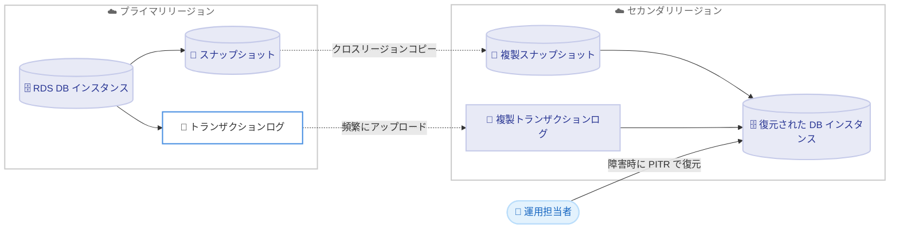

# Amazon RDS - クロスリージョン自動バックアップの対応リージョン拡大

**リリース日**: 2026 年 7 月 1 日
**サービス**: Amazon RDS (Amazon Relational Database Service)
**機能**: Cross-Region Automated Backups (クロスリージョン自動バックアップレプリケーション)

📊 [このアップデートのインフォグラフィックを見る](https://takech9203.github.io/aws-news-summary/20260701-amazon-rds-cross-region-automated-backups-additional-aws-regions.html)
<!-- INFOGRAPHIC_BASE_URL は環境変数から取得 -->

## 概要

Amazon RDS のクロスリージョン自動バックアップレプリケーションが、新たに 4 つの AWS リージョンで利用可能になりました。この機能は、RDS の自動バックアップ (スナップショットおよびトランザクションログ) を別の AWS リージョンへ自動的に複製し、災害対策 (DR) やビジネス継続性を強化するものです。

今回の拡大により、以下のリージョン間でバックアップレプリケーションを設定できるようになりました。

- Mexico (Central) から Europe (Ireland) または US West (N. California) へ
- Asia Pacific (Taipei) から Asia Pacific (Singapore) または Asia Pacific (Tokyo) へ
- Asia Pacific (New Zealand) から Asia Pacific (Singapore)、Asia Pacific (Sydney)、または Asia Pacific (Melbourne) へ
- Asia Pacific (Thailand) から Asia Pacific (Singapore) または Asia Pacific (Jakarta) へ

自動バックアップにより、ミッションクリティカルなデータベースをバックアップ保持期間内の任意の時点に復元できます。クロスリージョン自動バックアップレプリケーションを利用すると、プライマリリージョンが利用不能になった場合でも、セカンダリリージョンでポイントインタイムリカバリを実行し、迅速に業務を再開できます。トランザクションログはターゲットリージョンへ頻繁にアップロードされるため、数分以内の目標復旧時点 (RPO) を実現できます。

**アップデート前の課題**

- Mexico (Central)、Asia Pacific (Taipei)、Asia Pacific (New Zealand)、Asia Pacific (Thailand) を起点としたクロスリージョン自動バックアップレプリケーションが設定できなかった
- これらのリージョンで稼働するデータベースについては、災害対策のために独自のバックアップ複製の仕組みを構築する必要があった
- 地理的に離れたリージョンへ自動バックアップを複製できず、リージョン障害時のリカバリ地点の選択肢が限られていた

**アップデート後の改善**

- 上記 4 リージョンを起点に、指定した近隣リージョンへ自動バックアップを複製できるようになった
- マネジメントコンソール、AWS SDK、AWS CLI から数クリックでレプリケーションを設定できる
- 6 種類の RDS データベースエンジンで、数分以内の RPO を伴う災害対策を追加インフラなしで実現できる

## アーキテクチャ図



プライマリリージョンで作成されたスナップショットとトランザクションログがセカンダリリージョンへ自動的に複製され、リージョン障害時にセカンダリリージョンでポイントインタイムリカバリ (PITR) を実行できます。

## サービスアップデートの詳細

### 主要機能

1. **クロスリージョン自動バックアップレプリケーション**
   - RDS がスナップショットとトランザクションログを、指定した別リージョンへ自動的に複製する
   - スナップショットは DB インスタンス上で準備が完了するとすぐにクロスリージョンコピーが開始される
   - トランザクションログが頻繁にアップロードされるため、数分以内の RPO を達成できる

2. **今回追加された対応リージョンペア**
   - Mexico (Central): Europe (Ireland)、US West (N. California) へ複製可能
   - Asia Pacific (Taipei): Asia Pacific (Singapore)、Asia Pacific (Tokyo) へ複製可能
   - Asia Pacific (New Zealand): Asia Pacific (Singapore)、Asia Pacific (Sydney)、Asia Pacific (Melbourne) へ複製可能
   - Asia Pacific (Thailand): Asia Pacific (Singapore)、Asia Pacific (Jakarta) へ複製可能

3. **幅広いデータベースエンジンのサポート**
   - Amazon RDS for PostgreSQL、MariaDB、MySQL、Db2、Oracle、Microsoft SQL Server に対応
   - Multi-AZ DB インスタンス構成でもサポートされる (Multi-AZ DB クラスターは非対応)

## 技術仕様

### サポートされるデータベースエンジン

| 項目 | 詳細 |
|------|------|
| 対応エンジン | RDS for PostgreSQL、MariaDB、MySQL、Db2、Oracle、SQL Server |
| RPO | 数分以内 (トランザクションログの頻繁なアップロードによる) |
| Multi-AZ DB インスタンス | サポート対象 |
| Multi-AZ DB クラスター | 非対応 |
| デフォルトクォータ | AWS アカウントあたり最大 20 のクロスリージョン自動バックアップ |
| 設定方法 | マネジメントコンソール、AWS SDK、AWS CLI |

### 今回追加されたリージョンペア

| ソースリージョン | 複製先リージョン |
|------------------|------------------|
| Mexico (Central) | Europe (Ireland)、US West (N. California) |
| Asia Pacific (Taipei) | Asia Pacific (Singapore)、Asia Pacific (Tokyo) |
| Asia Pacific (New Zealand) | Asia Pacific (Singapore)、Asia Pacific (Sydney)、Asia Pacific (Melbourne) |
| Asia Pacific (Thailand) | Asia Pacific (Singapore)、Asia Pacific (Jakarta) |

## 設定方法

### 前提条件

1. クロスリージョン自動バックアップレプリケーションに対応した RDS DB インスタンスを保有していること
2. ソース DB インスタンスで自動バックアップ (バックアップ保持期間が 1 日以上) が有効になっていること
3. 複製先が、ソースリージョンからサポートされている複製先リージョンに含まれていること

### 手順

#### ステップ 1: 対応リージョンの確認

```bash
aws rds describe-source-regions --region us-west-1
```

`describe-source-regions` コマンドを使用して、どの AWS リージョン間でレプリケーションが可能かを確認します。この例では US West (N. California) から複製可能なリージョンを確認しています。

#### ステップ 2: クロスリージョン自動バックアップレプリケーションの開始

```bash
aws rds start-db-instance-automated-backups-replication \
    --source-db-instance-arn arn:aws:rds:mx-central-1:123456789012:db:mydbinstance \
    --backup-retention-period 7 \
    --region us-west-1
```

`start-db-instance-automated-backups-replication` コマンドで、指定したソース DB インスタンスの自動バックアップを複製先リージョン (この例では US West (N. California)) へ複製する設定を開始します。`--backup-retention-period` で複製先での保持期間を指定します。

#### ステップ 3: 複製されたバックアップからの復元

障害発生時には、複製先リージョンで `restore-db-instance-to-point-in-time` コマンド、またはマネジメントコンソールを使用して、保持期間内の任意の時点にデータベースを復元します。これにより、プライマリリージョンが利用不能になった場合でも迅速に業務を再開できます。

## メリット

### ビジネス面

- **災害対策の強化**: プライマリリージョン障害時に別リージョンで業務を再開でき、ビジネス継続性を確保できる
- **地理的な選択肢の拡大**: 新たに 4 リージョンが対応し、地域ごとのコンプライアンスやデータレジデンシー要件に合わせた DR 設計が可能になる
- **低い運用コスト**: 独自のバックアップ複製基盤を構築・運用する必要がなく、マネージド機能として利用できる

### 技術面

- **数分以内の RPO**: トランザクションログの頻繁なアップロードにより、データ損失を最小限に抑えられる
- **簡単なセットアップ**: コンソール、SDK、CLI から数クリックまたは 1 コマンドで設定できる
- **幅広いエンジン対応**: 主要な 6 種類の RDS エンジンで一貫した DR 手法を適用できる

## デメリット・制約事項

### 制限事項

- Multi-AZ DB クラスターではクロスリージョン自動バックアップレプリケーションはサポートされない
- デフォルトでは 1 AWS アカウントあたり最大 20 のクロスリージョン自動バックアップに制限される
- レプリケーション可能なリージョンペアは定められた組み合わせに限られる (任意のリージョン間ではない)

### 考慮すべき点

- スナップショットコピーによるデータ転送料金、および複製先リージョンでのストレージ料金が発生する
- 機能とサポートはデータベースエンジンの特定バージョンおよび AWS リージョンによって異なるため、事前に対応状況を確認する必要がある

## ユースケース

### ユースケース 1: 台北リージョンのデータベース DR を東京リージョンで構築

**シナリオ**: Asia Pacific (Taipei) で本番データベースを稼働させている企業が、地理的に近い Asia Pacific (Tokyo) をセカンダリリージョンとして災害対策を構築したい。

**実装例**:
```
ソース: Asia Pacific (Taipei) の RDS for PostgreSQL インスタンス
複製先: Asia Pacific (Tokyo)
設定: start-db-instance-automated-backups-replication で複製を開始
```

**効果**: 台北リージョンで障害が発生しても、東京リージョンで数分以内の RPO により迅速にデータベースを復元できる。

### ユースケース 2: メキシコリージョンから米国・欧州への地理的分散 DR

**シナリオ**: Mexico (Central) でシステムを運用する組織が、大陸をまたいだ地理的分散による堅牢な DR を実現したい。

**実装例**:
```
ソース: Mexico (Central) の RDS for MySQL インスタンス
複製先: US West (N. California) または Europe (Ireland)
```

**効果**: 地理的に大きく離れたリージョンへバックアップを複製することで、広域災害に対する耐性を高められる。

### ユースケース 3: ニュージーランドを起点としたオセアニア圏 DR

**シナリオ**: Asia Pacific (New Zealand) の金融系ワークロードで、規制要件に合わせて域内および近隣リージョンで DR を構成したい。

**実装例**:
```
ソース: Asia Pacific (New Zealand) の RDS for SQL Server インスタンス
複製先: Asia Pacific (Sydney)、Asia Pacific (Melbourne)、または Asia Pacific (Singapore)
```

**効果**: オセアニア圏内での複製により、データレジデンシー要件を満たしつつ、リージョン障害時の復旧性を確保できる。

## 料金

クロスリージョン自動バックアップレプリケーション自体に追加の機能料金はありません。ただし、以下の料金が発生します。

- スナップショットコピーに伴うリージョン間のデータ転送料金
- 複製先リージョンでのバックアップストレージ料金 (標準の RDS ストレージ料金が適用)

### 料金例

| 使用量 | 月額料金 (概算) |
|--------|------------------|
| リージョン間データ転送 | 転送量に応じた従量課金 (詳細は RDS 料金ページを参照) |
| 複製先ストレージ | 複製先リージョンの標準バックアップストレージ料金 |

正確な料金は対象エンジンとリージョンにより異なるため、[RDS 料金ページ](https://aws.amazon.com/rds/pricing/) を確認してください。

## 利用可能リージョン

今回のアップデートで、以下のソースリージョンからのクロスリージョン自動バックアップレプリケーションが追加されました。

- Mexico (Central)
- Asia Pacific (Taipei)
- Asia Pacific (New Zealand)
- Asia Pacific (Thailand)

各リージョンから複製可能な複製先リージョンは「技術仕様」セクションの表を参照してください。対応リージョンとエンジンバージョンの最新情報は公式ドキュメントで確認してください。

## 関連サービス・機能

- **Amazon RDS 自動バックアップ**: 本機能の基盤となる、バックアップ保持期間内のポイントインタイムリカバリを提供する機能
- **AWS Backup**: 複数の AWS サービスのバックアップを一元管理するマネージドサービス。RDS のバックアップ管理にも利用可能
- **Amazon RDS リードレプリカ**: クロスリージョンでの読み取り負荷分散や DR 補完に利用できる関連機能

## 参考リンク

- 📊 [インフォグラフィック](https://takech9203.github.io/aws-news-summary/20260701-amazon-rds-cross-region-automated-backups-additional-aws-regions.html)
- [公式発表 (What's New)](https://aws.amazon.com/about-aws/whats-new/2026/07/amazon-rds-cross-region-automated-backups-additional-aws-regions/)
- [ドキュメント (Replicating automated backups to another AWS Region)](https://docs.aws.amazon.com/AmazonRDS/latest/UserGuide/USER_ReplicateBackups.html)
- [料金ページ](https://aws.amazon.com/rds/pricing/)

## まとめ

今回のアップデートにより、Mexico (Central)、Asia Pacific (Taipei)、Asia Pacific (New Zealand)、Asia Pacific (Thailand) を起点としたクロスリージョン自動バックアップレプリケーションが利用可能になり、これらのリージョンで稼働するデータベースの災害対策の選択肢が広がりました。これらのリージョンでミッションクリティカルなワークロードを運用している場合は、複製先リージョンを選定し、数分以内の RPO を実現する DR 構成の導入を検討することを推奨します。
