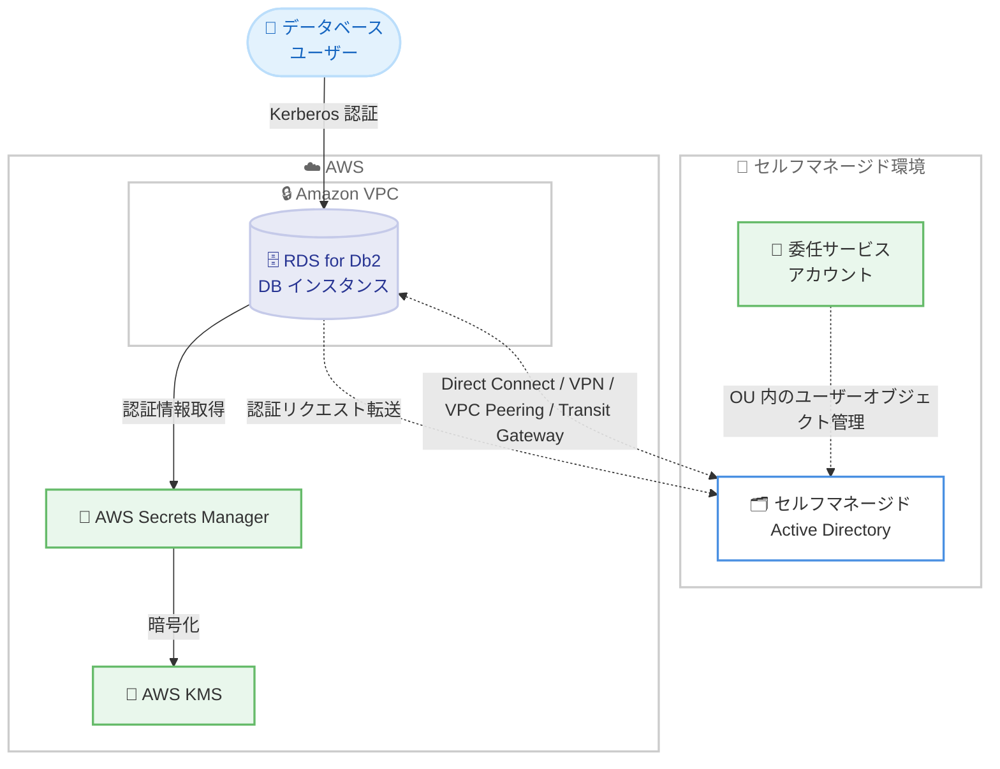

# Amazon RDS for Db2 - セルフマネージド Active Directory サポート

**リリース日**: 2026 年 7 月 1 日
**サービス**: Amazon Relational Database Service (Amazon RDS) for Db2
**機能**: セルフマネージド Active Directory との直接統合 (Kerberos 認証)

📊 [このアップデートのインフォグラフィックを見る](https://takech9203.github.io/aws-news-summary/20260701-amazon-rds-db2-supports-self-managed-active-directory.html)
<!-- INFOGRAPHIC_BASE_URL は環境変数から取得 -->

## 概要

Amazon RDS for Db2 が、セルフマネージドの Microsoft Active Directory (AD) ドメインへの直接参加をサポートしました。この機能により、RDS for Db2 DB インスタンスを、オンプレミス、AWS 上、または他のクラウド上で運用しているセルフマネージド AD のドメインに直接ジョインできます。認証プロトコルには Kerberos を使用し、データベースユーザーのシングルサインオン (SSO) を実現します。

これまでは、セルフマネージド AD に対して Kerberos 認証を利用するために、AWS Managed Microsoft AD をデプロイし、AWS マネージドドメインとセルフマネージドドメインの間に信頼関係 (トラスト) を確立する必要がありました。今回のアップデートにより、既存のセルフマネージド AD を直接利用してデータベースユーザーの認証と認可を行えるようになり、マネージドディレクトリやディレクトリトラストという追加の複雑さが不要になります。

この機能は、既存の ID インフラストラクチャを活用しながらコンプライアンス要件を満たしたいお客様、特にオンプレミスや他クラウドの AD をアイデンティティの中心に据えている組織にとって有用です。RDS for Db2 が利用可能なすべての AWS リージョン (AWS GovCloud (US) リージョンを含む) で一般提供 (GA) されています。

**アップデート前の課題**

このアップデート以前に存在していた課題や制限を以下に示します。

- セルフマネージド AD で Kerberos 認証を利用するには、AWS Managed Microsoft AD を別途デプロイする必要があった
- AWS マネージドドメインとセルフマネージドドメインの間にディレクトリトラスト (信頼関係) を構築・維持する運用負荷があった
- 中間ドメインやフォレストトラストの管理により、アーキテクチャが複雑化していた

**アップデート後の改善**

今回のアップデートにより可能になったことを以下に示します。

- 既存のセルフマネージド AD に RDS for Db2 インスタンスを直接ドメインジョインできるようになった
- AWS Managed Microsoft AD やディレクトリトラストの構築が不要になった
- 既存の ID インフラストラクチャを活用してコンプライアンス要件を満たしやすくなり、セルフマネージド AD の利用は追加料金なしで可能になった

## アーキテクチャ図



RDS for Db2 DB インスタンスは、VPC からセルフマネージド AD へのネットワーク接続を通じて Kerberos 認証リクエストを転送します。認証情報は AWS Secrets Manager に保管され、AWS KMS で暗号化されます。

## サービスアップデートの詳細

### 主要機能

1. **セルフマネージド AD への直接ドメインジョイン**
   - オンプレミス、Amazon EC2 上、または他のクラウドプロバイダーでホストされている AD ドメインに直接参加できる
   - 中間ドメインやフォレストトラストが不要
   - 新規インスタンスの作成時、または既存インスタンスの変更 (modify) のいずれでもドメインジョインが可能

2. **Kerberos によるシングルサインオン**
   - Kerberos を認証プロトコルとして使用し、データベースユーザーの SSO を実現
   - 接続時に RDS for Db2 が認証リクエストを指定した AD ドメインに安全に転送
   - 既存の ID 管理体制を維持したまま、RDS のマネージド機能を活用できる

3. **Secrets Manager と KMS による認証情報管理**
   - 委任された AD サービスアカウントの認証情報を AWS Secrets Manager に保管
   - 認証情報は AWS KMS で暗号化
   - サービスアカウントには、専用の組織単位 (OU) 内でユーザーオブジェクトを管理する委任権限が必要

## 技術仕様

### 前提要件の概要

| 項目 | 詳細 |
|------|------|
| AD ドメイン機能レベル | Windows Server 2008 R2 以上 |
| FQDN の長さ | 47 文字以内 |
| ネットワーク接続 | AWS Direct Connect、AWS VPN、VPC ピアリング、AWS Transit Gateway のいずれか |
| DNS | 通常はドメインコントローラー上の DNS サーバーを使用 (VPC DHCP オプションセットの設定は不要) |
| 認証情報の保管 | AWS Secrets Manager (AWS KMS で暗号化) |
| サービスアカウントの委任権限 | ユーザーオブジェクトの作成・削除、パスワードリセット、`msDS-SupportedEncryptionTypes` の読み書き、`servicePrincipalName` の読み書き |
| 料金 | セルフマネージド AD の利用は追加料金なし |

### API 変更履歴

過去 7 日間において、awsapichanges.com で本機能に直接関連する RDS API メソッドの追加・変更は確認されませんでした。ドメイン設定は既存の `ModifyDBInstance` および `CreateDBInstance` の Domain 関連パラメータで行います。

### ネットワークで必要なポート (network ACL 使用時)

```text
# VPC ネットワーク ACL を使用する場合、RDS for Db2 DB インスタンスから
# 動的ポート (49152-65535) への送信 (アウトバウンド) トラフィックを許可する必要がある。
# セキュリティグループはトラフィックの発信方向のみ開放すればよいが、
# Windows ファイアウォールおよびネットワーク ACL では双方向の開放が必要な場合が多い。
```

## 設定方法

### 前提条件

1. 参加先となるオンプレミスまたはセルフマネージドの Microsoft AD を用意する (ドメイン機能レベルは Windows Server 2008 R2 以上、FQDN は 47 文字以内)
2. RDS for Db2 DB インスタンスを作成する VPC とセルフマネージド AD 間のネットワーク接続を構成する (Direct Connect、VPN、VPC ピアリング、Transit Gateway)
3. 専用の OU に対して必要な委任権限を持つドメインサービスアカウントを準備し、その認証情報を AWS Secrets Manager に保管する (AWS KMS で暗号化)

### 手順

#### ステップ 1: ドメインサービスアカウントの委任設定

セルフマネージド AD 側で、RDS for Db2 をジョインさせる OU に対して、サービスアカウントに以下の権限を委任します。ユーザーオブジェクトの作成・削除、パスワードのリセット、`msDS-SupportedEncryptionTypes` の読み書き、`servicePrincipalName` の読み書きが必要です。

#### ステップ 2: Secrets Manager へのシークレット登録

```bash
# 委任サービスアカウントの認証情報を Secrets Manager に登録する例
aws secretsmanager create-secret \
    --name rds-db2-self-managed-ad \
    --secret-string '{"CUSTOMER_MANAGED_ACTIVE_DIRECTORY_USERNAME":"svc-rds-db2","CUSTOMER_MANAGED_ACTIVE_DIRECTORY_PASSWORD":"<password>"}' \
    --kms-key-id <KMS キー ARN>
```

上記コマンドは、委任 AD サービスアカウントの認証情報を保持するシークレットを AWS Secrets Manager に作成し、指定した KMS キーで暗号化します。

#### ステップ 3: DB インスタンスのドメインジョイン

新規インスタンスの作成時、または既存インスタンスの変更時にドメイン設定を指定します。マネジメントコンソール、AWS CLI、AWS SDK のいずれからでも操作できます。ドメインジョイン後に AD が作成したユーザーオブジェクトを OU 外へ移動すると構成が壊れるため、移動が必要な場合は `ModifyDBInstance` でドメインパラメータを更新してください。

## メリット

### ビジネス面

- **既存 ID インフラの活用**: すでに運用しているセルフマネージド AD をそのまま利用でき、既存の ID 管理体制を維持したままコンプライアンス要件を満たしやすくなる
- **コスト削減**: AWS Managed Microsoft AD のデプロイが不要になり、セルフマネージド AD の利用自体は追加料金なしで行える
- **導入の迅速化**: 中間ドメインやトラスト構築の工程が省けるため、認証統合までの時間を短縮できる

### 技術面

- **アーキテクチャの簡素化**: ディレクトリトラストや中間マネージドドメインが不要になり、構成がシンプルになる
- **標準的な認証プロトコル**: Kerberos による SSO を利用でき、データベースユーザーの認証・認可を一元化できる
- **セキュアな認証情報管理**: サービスアカウントの認証情報を Secrets Manager に保管し、KMS で暗号化することで安全に管理できる

## デメリット・制約事項

### 制限事項

- AD ドメインコントローラーのドメイン機能レベルは Windows Server 2008 R2 以上が必要
- AD の FQDN は 47 文字を超えられない
- ネットワーク ACL 使用時は、動的ポート (49152-65535) の送信トラフィック許可が必要

### 考慮すべき点

- RDS for Db2 が OU に作成したユーザーオブジェクトを手動で移動すると DB インスタンスの構成が壊れるため、移動が必要な場合は `ModifyDBInstance` を使用する
- VPC と AD 間の安定したネットワーク接続 (Direct Connect、VPN など) の確保と、双方向のファイアウォール・ネットワーク ACL 設定が前提となる
- サービスアカウントに対して適切な委任権限を正しく設定する必要がある

## ユースケース

### ユースケース 1: オンプレミス AD を中心とした認証統合

**シナリオ**: 社内の ID 基盤としてオンプレミスの Active Directory を運用している企業が、RDS for Db2 へのデータベースアクセスを既存の AD アカウントで統一したい。

**実装例**:
```text
オンプレミス AD <-- Direct Connect / VPN --> Amazon VPC (RDS for Db2)
既存 AD アカウントで Kerberos SSO
```

**効果**: AWS Managed Microsoft AD やトラストを追加せずに、既存の AD アカウントで直接データベース認証を行える。

### ユースケース 2: マルチクラウド環境での ID 一元化

**シナリオ**: 他のクラウドプロバイダー上でセルフマネージド AD を運用している組織が、AWS 上の RDS for Db2 を同じ AD で認証したい。

**実装例**:
```text
他クラウドの セルフマネージド AD <-- VPN / Transit Gateway --> Amazon VPC (RDS for Db2)
```

**効果**: クラウドをまたいだ ID 管理を一元化し、認証基盤の重複を避けられる。

### ユースケース 3: GovCloud でのコンプライアンス対応

**シナリオ**: 厳格なコンプライアンス要件を持つ組織が、AWS GovCloud (US) 上の RDS for Db2 を既存のセルフマネージド AD と統合したい。

**実装例**:
```text
セルフマネージド AD <-- 専用接続 --> AWS GovCloud (US) VPC (RDS for Db2)
Secrets Manager + KMS で認証情報を暗号化
```

**効果**: 既存の ID インフラを活かしつつ、GovCloud を含む規制環境でコンプライアンス要件を満たしやすくなる。

## 料金

セルフマネージド AD を RDS for Db2 で利用する機能自体に追加料金は発生しません。関連する AWS Secrets Manager および AWS KMS の利用については、それぞれの標準料金が適用されます。RDS for Db2 のインスタンス利用料は通常どおり課金されます。

## 利用可能リージョン

Amazon RDS for Db2 が利用可能なすべての商用 AWS リージョン、および AWS GovCloud (US) リージョンで一般提供 (GA) されています。RDS for Db2 は Kerberos を用いたセルフマネージド AD をこれらすべてのリージョンでサポートします。

## 関連サービス・機能

- **AWS Managed Microsoft AD (AWS Directory Service)**: 従来はトラスト構築のために必要だったが、本機能により直接統合が可能となった
- **AWS Secrets Manager**: 委任 AD サービスアカウントの認証情報を安全に保管
- **AWS KMS**: Secrets Manager に保管する認証情報の暗号化に使用
- **AWS Direct Connect / AWS VPN / AWS Transit Gateway**: VPC とセルフマネージド AD 間のネットワーク接続を確立

## 参考リンク

- 📊 [インフォグラフィック](https://takech9203.github.io/aws-news-summary/20260701-amazon-rds-db2-supports-self-managed-active-directory.html)
- [公式発表 (What's New)](https://aws.amazon.com/about-aws/whats-new/2026/07/amazon-rds-db2-supports-self-managed-active-directory)
- [ドキュメント (Amazon RDS for Db2 User Guide)](https://docs.aws.amazon.com/AmazonRDS/latest/UserGuide/db2-self-managed-active-directory.html)
- [Amazon RDS for Db2 製品ページ](https://aws.amazon.com/rds/db2/)

## まとめ

このアップデートにより、RDS for Db2 をセルフマネージド AD へ直接ドメインジョインできるようになり、AWS Managed Microsoft AD やディレクトリトラストが不要になりました。既存の ID インフラを活用したい組織や GovCloud を含む規制環境でのコンプライアンス対応にとって、認証統合のアーキテクチャを大きく簡素化できます。オンプレミスや他クラウドの AD を運用している場合は、ネットワーク接続とサービスアカウントの委任権限を整えたうえで移行を検討することをお勧めします。
