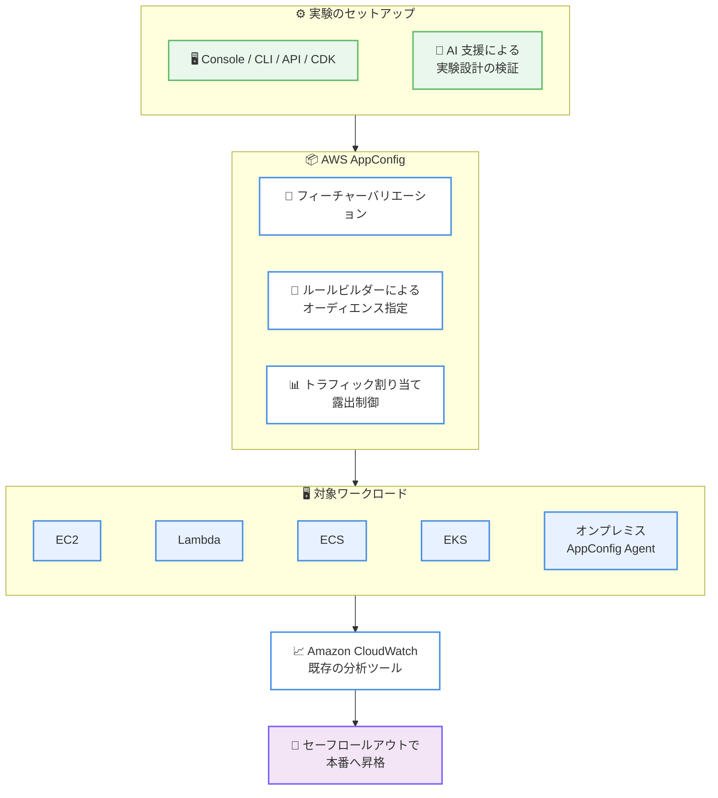

# AWS AppConfig - マネージド実験ツール (A/B テスト)

**リリース日**: 2026年7月1日
**サービス**: AWS AppConfig
**機能**: マネージド実験ツール (Experimentation tools)

📊 [このアップデートのインフォグラフィックを見る](https://takech9203.github.io/aws-news-summary/20260701-aws-appconfig-experimentation.html)
<!-- INFOGRAPHIC_BASE_URL は環境変数から取得 -->

## 概要

AWS は、AWS AppConfig におけるマネージド実験ツール (Experimentation tools) の一般提供 (GA) を発表しました。この新機能により、独立した実験インフラストラクチャを構築したり管理したりすることなく、A/B テストや機能実験を実施できます。この機能は Amazon が 25 年以上にわたって培ってきた実験のベストプラクティスに基づいて構築されています。

マネージド実験ツールは AI 駆動のガイダンスを活用し、統計的検出力が十分な堅牢な実験の設計を支援します。加えて、露出制御 (exposure control) とロックされたトリートメント割り当て (locked treatment allocations) を提供することで、顧客に何を提供するかについて、確信を持ってデータに基づいた意思決定を下せるようにします。

UI の変更やレコメンデーションアルゴリズムから、AI モデルの選択やプロンプトの実験まで、アプリケーションスタック全体にわたって A/B テストや多変量実験を実行できます。この機能は開発者やプロダクトチームを主な対象としており、実験を AWS AppConfig 内でセットアップ・実行し、Amazon CloudWatch または既存の分析ツールで結果を分析できます。

**アップデート前の課題**

これまで、アプリケーションで A/B テストや機能実験を実施するには、以下のような課題がありました。

- 独立した実験用インフラストラクチャを自前で構築・運用する必要があった
- 統計的検出力が十分な実験を設計するには専門的な統計知識が求められた
- トラフィック割り当てや露出制御を独自に実装する必要があった
- 実験結果を検証した後、本番環境へ安全に反映する仕組みを別途整備する必要があった

**アップデート後の改善**

今回のアップデートにより、以下が可能になりました。

- 実験基盤を構築・管理せずに、AWS AppConfig 上で A/B テストや多変量実験を実行できるようになった
- AI 支援による実験設計で、Amazon のベストプラクティスに照らして設定を検証できるようになった
- 露出制御とロックされたトリートメント割り当てにより、実験の一貫性と信頼性が確保されるようになった
- 勝者となったトリートメントを、標準の AWS AppConfig セーフロールアウトを通じて本番環境へ昇格できるようになった

## アーキテクチャ図



この図は、実験のセットアップから対象ワークロードへの適用、結果分析、本番環境への昇格までの一連の流れを示しています。

## サービスアップデートの詳細

### 主要機能

1. **A/B テストおよび多変量実験**
   - UI の変更、レコメンデーションアルゴリズム、AI モデルの選択、プロンプトの実験など、アプリケーションスタック全体で実験を実行できます
   - フィーチャーバリエーションを定義し、複数のトリートメントを比較できます

2. **オーディエンスターゲティングとトラフィック制御**
   - ルールビルダーを使用して、きめ細かいオーディエンスをターゲットに指定できます
   - トラフィック割り当ての割合を設定できます
   - 露出制御とロックされたトリートメント割り当てにより、実験の一貫性を確保します

3. **AI 支援による実験設計**
   - AI 支援の実験設計により、設定を Amazon のベストプラクティスに照らして検証できます
   - 統計的検出力が十分な実験の構築を支援します

4. **結果分析とセーフロールアウト**
   - Amazon CloudWatch または既存の分析ツールで結果を分析できます
   - 実験終了後、勝者となったトリートメントを標準の AWS AppConfig セーフロールアウトを通じて本番環境へ昇格できます

## 技術仕様

### 実験ツールの概要

| 項目 | 詳細 |
|------|------|
| 実験タイプ | A/B テスト、多変量実験 |
| 設定インターフェース | AWS Management Console、CLI、API、AWS CDK |
| オーディエンス指定 | ルールビルダーによるきめ細かいターゲティング |
| 制御機能 | 露出制御、ロックされたトリートメント割り当て |
| 設計支援 | AI 支援による設定検証 (Amazon のベストプラクティスに準拠) |
| 結果分析 | Amazon CloudWatch、既存の分析ツール |
| 本番反映 | 標準の AWS AppConfig セーフロールアウト |
| 対象ワークロード | Amazon EC2、AWS Lambda、Amazon ECS、Amazon EKS、オンプレミスサーバー (AWS AppConfig Agent 経由) |

## 設定方法

### 前提条件

1. AWS AppConfig のアプリケーション、環境、構成プロファイルが設定されていること
2. 実験対象のワークロードで AWS AppConfig によるフィーチャーフラグまたは構成の取得が構成されていること
3. オンプレミスサーバーで実行する場合は、AWS AppConfig Agent が導入されていること

### 手順

#### ステップ1: フィーチャーバリエーションの定義

AWS Management Console、CLI、API、または AWS CDK を使用して、実験対象となるフィーチャーバリエーション (トリートメント) を定義します。UI 要素、アルゴリズム、AI モデル、プロンプトなど、比較したい変種を指定します。

#### ステップ2: オーディエンスとトラフィックの設定

ルールビルダーを使用して実験対象のオーディエンスを指定し、各トリートメントへのトラフィック割り当ての割合を設定します。露出制御により、実験に含めるユーザーの範囲を制御できます。

#### ステップ3: AI 支援による設計検証と実行

AI 支援の実験設計を活用して、設定が Amazon のベストプラクティスに沿っているか、統計的検出力が十分かを検証します。検証後、実験を実行します。

#### ステップ4: 結果分析と本番への昇格

Amazon CloudWatch または既存の分析ツールで実験結果を分析します。実験終了後、勝者となったトリートメントを標準の AWS AppConfig セーフロールアウトを通じて本番環境へ昇格します。

## メリット

### ビジネス面

- **意思決定の高速化**: データに基づいて、顧客に提供する機能を確信を持って決定できます
- **市場投入までの時間短縮**: 実験基盤の構築が不要になり、実験の立ち上げが迅速になります
- **リスクの低減**: 露出制御とセーフロールアウトにより、変更を段階的かつ安全に展開できます

### 技術面

- **インフラ管理の不要化**: 独立した実験インフラストラクチャを構築・運用する必要がありません
- **幅広いワークロード対応**: Amazon EC2、AWS Lambda、Amazon ECS、Amazon EKS、オンプレミスまで対応します
- **統計的な健全性**: AI 支援により、統計的検出力が十分な実験を設計できます

## デメリット・制約事項

### 制限事項

- 実験結果の分析は Amazon CloudWatch または既存の分析ツールとの組み合わせが前提となります
- オンプレミスサーバーで利用する場合は AWS AppConfig Agent の導入が必要です

### 考慮すべき点

- 統計的に有意な結論を得るには、十分なトラフィック量と実験期間の確保が必要です
- 既存の AWS AppConfig の運用プラクティス (デプロイ戦略、セーフロールアウト設定) と整合させる設計が望ましいです

## ユースケース

### ユースケース1: UI 変更の A/B テスト

**シナリオ**: 新しいランディングページのデザインが既存デザインよりもコンバージョン率を向上させるかを検証したい。

**実装例**:
```
トリートメント A: 既存のランディングページ (トラフィック 50%)
トリートメント B: 新デザインのランディングページ (トラフィック 50%)
指標: コンバージョン率を Amazon CloudWatch で計測
```

**効果**: 実験基盤を構築せずに、データに基づいてデザインの採否を判断できます。

### ユースケース2: AI モデル・プロンプトの選択

**シナリオ**: 生成 AI アプリケーションで、複数のモデルまたはプロンプトのうち、どれが最も高い品質を提供するかを比較したい。

**実装例**:
```
トリートメント A: モデル / プロンプト構成 1
トリートメント B: モデル / プロンプト構成 2
トリートメント C: モデル / プロンプト構成 3
指標: 応答品質、レイテンシー、ユーザー満足度
```

**効果**: 本番トラフィックの一部で実験を行い、最適な AI 構成を確信を持って選択できます。

### ユースケース3: レコメンデーションアルゴリズムの改善

**シナリオ**: EC サイトで新しいレコメンデーションアルゴリズムが売上を向上させるかを検証したい。

**実装例**:
```
トリートメント A: 既存アルゴリズム (トラフィック 90%)
トリートメント B: 新アルゴリズム (トラフィック 10%、露出制御で段階拡大)
指標: クリック率、購入率を CloudWatch で計測
```

**効果**: 露出を制御しながらリスクを抑えて新アルゴリズムを検証し、勝者をセーフロールアウトで本番展開できます。

## 料金

AWS AppConfig のマネージド実験ツールは、実験実行時間 (experimentation hours) に基づく従量課金制です。詳細な料金については AWS AppConfig の料金ページを参照してください。

## 利用可能リージョン

AWS AppConfig のマネージド実験ツールは、AWS GovCloud (US) リージョンを含むすべての AWS リージョンで利用可能です。

## 関連サービス・機能

- **AWS AppConfig**: 本機能のベースとなるサービス。フィーチャーフラグやアプリケーション構成の管理、セーフロールアウトを提供します
- **Amazon CloudWatch**: 実験結果の指標分析に使用します
- **AWS AppConfig Agent**: オンプレミスサーバーや各種コンピュート環境で構成・実験を取得するためのエージェントです
- **AWS CDK**: Infrastructure as Code で実験設定を管理する際に利用できます

## 参考リンク

- 📊 [インフォグラフィック](https://takech9203.github.io/aws-news-summary/20260701-aws-appconfig-experimentation.html)
- [公式発表 (What's New)](https://aws.amazon.com/about-aws/whats-new/2026/6/aws-appconfig-experimentation/)
- [AWS AppConfig 製品ページ](https://aws.amazon.com/systems-manager/features/appconfig/)
- [AWS AppConfig ドキュメント](https://docs.aws.amazon.com/appconfig/)

## まとめ

AWS AppConfig のマネージド実験ツールは、独立した実験基盤を構築・管理することなく、A/B テストや多変量実験を実現する重要なアップデートです。AI 支援による設計検証、露出制御、セーフロールアウトとの統合により、EC2、Lambda、ECS、EKS、オンプレミスまで幅広いワークロードでデータ駆動の意思決定を安全に行えます。実験基盤の自前構築を検討していたチームは、まず AWS AppConfig 上での実験セットアップを試すことを推奨します。
