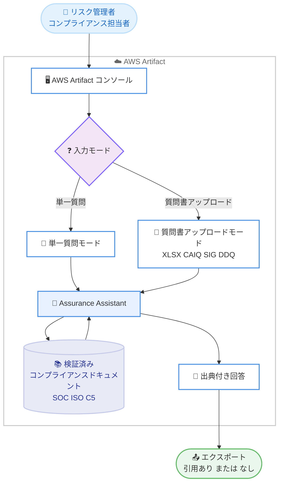

# AWS Artifact - Assurance Assistant

**リリース日**: 2026 年 7 月 1 日
**サービス**: AWS Artifact
**機能**: Assurance Assistant (コンプライアンスに関する問い合わせ機能)

📊 [このアップデートのインフォグラフィックを見る](https://takech9203.github.io/aws-news-summary/20260701-aws-artifact-assurance-assistant.html)
<!-- INFOGRAPHIC_BASE_URL は環境変数から取得 -->

## 概要

AWS Artifact に、AI を活用した新機能 Assurance Assistant が追加されました。Assurance Assistant は、AWS のサービスに関するセキュリティおよびコンプライアンスの質問に対して、出典 (引用) に裏付けられた回答を生成する機能です。AWS Artifact は、AWS がコンプライアンスレポート、認証、契約書などをお客様に提供するためのサービスであり、今回の機能追加によって、これらの検証済みドキュメントを情報源とした回答を得られるようになりました。

Assurance Assistant は、サードパーティのリスク管理者、コンプライアンス担当者、セキュリティエンジニア、監査人などを主な対象としています。ベンダー評価やデューデリジェンス質問書 (DDQ) への回答作成を加速し、従来は数週間を要していた作業を数分に短縮することを目指した機能です。

すべての回答には、SOC レポート、ISO 認証、C5 認証パッケージなどの AWS コンプライアンスドキュメントからの引用が含まれます。お客様は、回答内容を情報源となる資料に照らして独立して検証できます。Assurance Assistant は、すべての商用 AWS リージョンにおいて、AWS Artifact コンソールから追加料金なしで利用できます。

**アップデート前の課題**

このアップデート以前、AWS に関するセキュリティおよびコンプライアンスの質問に回答するには、以下のような手間が発生していました。

- ベンダー評価やデューデリジェンス質問書 (DDQ) への回答作成のたびに、SOC レポートや ISO 認証などの膨大なコンプライアンスドキュメントを手作業で読み解く必要があった
- CAIQ や SIG といった業界標準の質問書に一件ずつ回答するため、多くの時間と工数を要していた
- 回答の根拠となる出典を人手で特定し、資料と照合する作業が煩雑だった

**アップデート後の改善**

今回のアップデートにより、以下が可能になりました。

- 質問に対して、AWS のセキュリティ統制にマッピングされた出典付きの回答を自動生成できるようになった
- CAIQ、SIG、独自の DDQ など XLSX 形式の質問書を一括アップロードし、まとめて処理できるようになった
- すべての回答に引用元が付与されるため、情報源となる資料に照らして独立して検証できるようになった

## アーキテクチャ図



Assurance Assistant は、ユーザーの質問を AWS のセキュリティ統制にマッピングし、検証済みのコンプライアンスドキュメントを横断検索して、引用付きの回答を生成します。

## サービスアップデートの詳細

### 主要機能

1. **2 つの入力モード**
   - 単一質問モード: 質問を入力すると、画面上に即座に回答が表示される
   - 質問書アップロードモード: XLSX 形式の質問書を一括処理できる
   - CAIQ、SIG、独自の DDQ など、業界標準の形式に最適化されている

2. **出典に裏付けられた回答**
   - すべての回答に、AWS コンプライアンスドキュメントからの引用が含まれる
   - 引用元には SOC レポート、ISO 認証、C5 認証パッケージが含まれる
   - お客様は回答内容を情報源となる資料に照らして独立して検証できる

3. **柔軟なエクスポート**
   - 回答は選択的または一括でエクスポートできる
   - 引用を含める / 含めないを選択できる
   - 元のファイル形式のままエクスポートできる

4. **IAM によるアクセス制御**
   - 2 つの新しい IAM 管理ポリシーが提供される
   - `AWSArtifactComplianceInquiriesReadOnlyAccess`: 読み取り専用アクセス
   - `AWSArtifactComplianceInquiriesFullAccess`: フルアクセス

## 技術仕様

### 対応する質問書形式と引用元

| 項目 | 詳細 |
|------|------|
| 対応質問書形式 | CAIQ (Consensus Assessments Initiative Questionnaire)、SIG (Standardized Information Gathering)、独自の DDQ |
| アップロード形式 | XLSX ファイル |
| 引用元ドキュメント | SOC レポート、ISO 認証、C5 認証パッケージなどの AWS コンプライアンスドキュメント |
| 入力モード | 単一質問モード、質問書アップロードモード |
| エクスポート形式 | 元のファイル形式 (引用あり / なしを選択可能) |

### IAM 管理ポリシー

Assurance Assistant へのアクセスを制御するため、2 つの新しい IAM 管理ポリシーが用意されています。

```json
{
  "ReadOnly": "AWSArtifactComplianceInquiriesReadOnlyAccess",
  "FullAccess": "AWSArtifactComplianceInquiriesFullAccess"
}
```

`AWSArtifactComplianceInquiriesReadOnlyAccess` は読み取り専用の操作を許可し、`AWSArtifactComplianceInquiriesFullAccess` は質問の送信や質問書のアップロードなどを含むフルアクセスを許可します。

## 設定方法

### 前提条件

1. AWS アカウントと AWS Artifact コンソールへのアクセス権限
2. Assurance Assistant を利用するユーザーへの適切な IAM 管理ポリシーの割り当て
3. 質問書アップロードモードを利用する場合は、CAIQ、SIG、または独自の DDQ を含む XLSX ファイル

### 手順

#### ステップ 1: IAM ポリシーの割り当て

Assurance Assistant を利用するユーザーまたはロールに、用途に応じて IAM 管理ポリシー (`AWSArtifactComplianceInquiriesReadOnlyAccess` または `AWSArtifactComplianceInquiriesFullAccess`) を割り当てます。これにより、機能へのアクセスを最小権限の原則に沿って制御できます。

#### ステップ 2: AWS Artifact コンソールで質問を送信

AWS Artifact コンソールから Assurance Assistant を開きます。単一質問モードでは質問を入力して即座に回答を確認できます。質問書アップロードモードでは XLSX 形式の質問書をアップロードし、一括で回答を生成します。

#### ステップ 3: 回答の確認とエクスポート

生成された回答と、その根拠となる引用元を確認します。必要に応じて情報源の資料に照らして検証したうえで、回答を選択的または一括でエクスポートします。引用を含めるかどうかを選択し、元のファイル形式のまま出力できます。

## メリット

### ビジネス面

- **回答作成時間の短縮**: ベンダー評価や DDQ への回答作成を、従来の数週間から数分へと大幅に短縮できる
- **追加料金なし**: すべての商用 AWS リージョンで追加料金なしに利用できる
- **監査対応の効率化**: 監査人や法務チームによるベンダーデューデリジェンスを効率的に支援する

### 技術面

- **出典による検証可能性**: すべての回答に引用元が付与されるため、情報の信頼性を独立して確認できる
- **業界標準形式への対応**: CAIQ、SIG、独自の DDQ に最適化されており、既存の質問書をそのまま活用できる
- **きめ細かなアクセス制御**: 2 つの IAM 管理ポリシーにより、読み取り専用とフルアクセスを使い分けられる

## デメリット・制約事項

### 制限事項

- 質問書アップロードは XLSX 形式に対応している
- お客様側の実装に関する質問 (customer-side implementation) は対象範囲外である
- 不完全な質問、コンプライアンスに関連しない質問、不適切な内容を含む質問には回答しない場合がある

### 考慮すべき点

- 回答は AWS のセキュリティ統制、コンプライアンス体制、運用上の実践に関するものであり、AWS 側の情報に基づく点を理解しておく
- AI が生成した回答であるため、重要な意思決定に用いる際は引用元の資料に照らして検証することが推奨される

## ユースケース

### ユースケース 1: ベンダーデューデリジェンス質問書への回答

**シナリオ**: 自社が AWS を利用していることについて、取引先から CAIQ 形式の質問書への回答を求められた。従来は担当者が SOC レポートや ISO 認証を読み解いて手作業で回答していた。

**実装例**:
```
1. AWS Artifact コンソールで Assurance Assistant を開く
2. 質問書アップロードモードで CAIQ の XLSX ファイルをアップロード
3. 一括生成された出典付き回答を確認
4. 元のファイル形式でエクスポートして取引先へ提出
```

**効果**: 質問書への回答作成が大幅に効率化され、引用元により回答の根拠を明確に示せる。

### ユースケース 2: セキュリティレビューでの即時確認

**シナリオ**: セキュリティエンジニアが、特定の AWS のセキュリティ統制について社内レビュー中に個別の質問を確認したい。

**実装例**:
```
1. Assurance Assistant の単一質問モードを開く
2. セキュリティ統制に関する質問を入力
3. 画面上に表示される出典付き回答を確認
```

**効果**: 該当するコンプライアンスドキュメントを手作業で探すことなく、根拠付きの回答を即座に得られる。

### ユースケース 3: 監査対応の効率化

**シナリオ**: 監査人が複数の AWS サービスに関するコンプライアンス状況を体系的に確認する必要がある。

**実装例**:
```
1. 監査項目をまとめた独自の DDQ (XLSX) を用意
2. 質問書アップロードモードで一括処理
3. 引用ありの形式でエクスポートし、監査証跡として保管
```

**効果**: 監査対応の作業負荷を軽減しつつ、引用による検証可能性を確保できる。

## 料金

Assurance Assistant は、AWS Artifact コンソールを通じて追加料金なしで利用できます。

## 利用可能リージョン

Assurance Assistant は、すべての商用 AWS リージョンで利用できます。AWS Artifact はグローバルにアクセス可能なサービスであり、Assurance Assistant を利用するために特定のリージョンを選択する必要はありません。

## 関連サービス・機能

- **AWS Artifact**: コンプライアンスレポート、認証、契約書を提供する基盤サービス。Assurance Assistant はこのサービスの一部として提供される
- **AWS IAM**: 2 つの新しい管理ポリシーにより、Assurance Assistant へのアクセスを制御する
- **AWS コンプライアンスプログラム**: SOC、ISO、C5 などの認証・レポートが回答の引用元となる

## 参考リンク

- 📊 [インフォグラフィック](https://takech9203.github.io/aws-news-summary/20260701-aws-artifact-assurance-assistant.html)
- [公式発表 (What's New)](https://aws.amazon.com/about-aws/whats-new/2026/07/aws-artifact-assurance-assistant/)
- [ドキュメント (Managing compliance inquiries)](https://docs.aws.amazon.com/artifact/latest/ug/managing-compliance-inquiries.html)
- [AWS Artifact 製品ページ](https://aws.amazon.com/artifact/)

## まとめ

Assurance Assistant は、AWS に関するセキュリティおよびコンプライアンスの問い合わせに対し、出典に裏付けられた回答を自動生成する AI 機能です。ベンダー評価や DDQ への回答作成を大幅に効率化し、CAIQ や SIG などの業界標準形式にも対応しています。すべての商用 AWS リージョンで追加料金なしに利用できるため、コンプライアンス業務を担うチームは、まず AWS Artifact コンソールから単一質問モードで機能を試し、IAM 管理ポリシーによるアクセス制御を整えたうえで本格的な活用を検討することをおすすめします。
