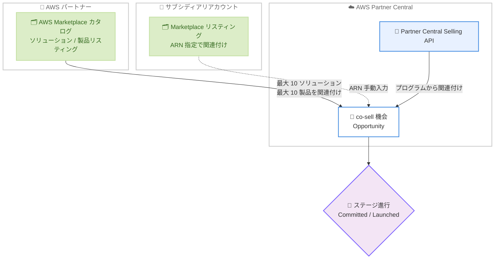

# AWS Partner Central - AWS Marketplace リスティングの co-sell 連携

**リリース日**: 2026 年 7 月 1 日
**サービス**: AWS Partner Central / AWS Marketplace
**機能**: co-sell 機会への AWS Marketplace リスティング関連付け

📊 [このアップデートのインフォグラフィックを見る](https://takech9203.github.io/aws-news-summary/20260701-aws-marketplace-co-selling-support.html)
<!-- INFOGRAPHIC_BASE_URL は環境変数から取得 -->

## 概要

AWS は、パートナーが AWS Marketplace カタログにある 1 つ以上の AWS Marketplace ソリューションおよび製品リスティングを、AWS Partner Central の co-sell 機会 (opportunity) に直接関連付けられるようになったことを発表しました。これにより、AWS Marketplace で販売しているリスティングと、共同販売 (co-sell) のためのソリューションを別々に管理する必要がなくなります。

これまでパートナーは、co-sell 用に専用作成したソリューションを機会に紐付ける必要がありました。その結果、AWS Marketplace カタログ向けのソリューションと co-sell 向けのソリューションを二重に管理する運用負荷が生じていました。今回のアップデートにより、既存の AWS Marketplace リスティングを機会に関連付けて、フルフィルメント (受注から履行まで) の追跡をより効果的に行えるようになります。

この機能は AWS Console 上の AWS Partner Central で一般提供 (GA) されており、同等の操作は AWS Partner Central Selling API を通じてプログラムからも利用できます。対象ユーザーは、AWS との共同販売を行うすべての AWS パートナー (ISV、コンサルティングパートナーなど) です。

**アップデート前の課題**

- 機会には co-sell 用に特別に作成されたソリューションを紐付ける必要があった
- AWS Marketplace カタログ向けソリューションと co-sell 向けソリューションを別々に管理する必要があった
- 既存の AWS Marketplace リスティングを機会に直接関連付けできず、フルフィルメントの追跡が煩雑だった

**アップデート後の改善**

- 既存の AWS Marketplace ソリューションおよび製品リスティングを機会に直接関連付け可能になった
- ソリューションの二重管理が不要になり、運用負荷が軽減された
- 機会単位でフルフィルメントをより正確に追跡できるようになった
- サブシディアリ (子会社) アカウント接続を持つ AWS アカウント内のリスティングも関連付け可能になった

## アーキテクチャ図

パートナーは AWS Marketplace カタログのソリューションおよび製品を co-sell 機会に関連付け、機会を Committed または Launched ステージへ進行させます。

## サービスアップデートの詳細

### 主要機能

1. **AWS Marketplace リスティングの機会への関連付け**
   - AWS Marketplace カタログのソリューションと製品を co-sell 機会に直接関連付け可能
   - 機会の作成時または編集時に、AWS Console の AWS Partner Central から操作
   - co-sell 専用ソリューションを別途作成する必要がなくなった

2. **4 つの関連付けオプション**
   - 機会作成・編集時に以下のいずれかを選択可能
     - (1) AWS Marketplace ソリューションおよび製品
     - (2) AWS Marketplace ソリューションのみ
     - (3) AWS Marketplace 製品のみ
     - (4) その他 (Other)

3. **関連付け上限とサブシディアリアカウント対応**
   - 1 つの機会に対して最大 10 個の AWS Marketplace ソリューションと最大 10 個の AWS Marketplace 製品を関連付け可能
   - サブシディアリアカウント接続が確立された AWS アカウント内のリスティングも、ARN を手動入力することで関連付け可能

4. **API によるプログラム操作**
   - 同等の機能を AWS Partner Central Selling API 経由で利用可能
   - 既存の CI/CD やインテグレーションから機会へのソリューション・製品の関連付けを自動化可能

## 技術仕様

### 関連付けに関する仕様

| 項目 | 詳細 |
|------|------|
| 関連付け可能なソリューション数 | 1 機会あたり最大 10 個 |
| 関連付け可能な製品数 | 1 機会あたり最大 10 個 |
| ドロップダウン表示条件 | ステータスが "Limited" または "Public" のソリューションのみ表示 |
| サブシディアリアカウントのリスティング | ソリューション ARN / 製品 ARN を手動入力して関連付け |
| ステージ進行の要件 | Committed または Launched へ進めるには、AWS Marketplace ソリューション、AWS Marketplace 製品、またはパートナーソリューションのいずれかの関連付けが必須 |
| 操作手段 | AWS Console (AWS Partner Central)、AWS Partner Central Selling API |

## 設定方法

### 前提条件

1. AWS Partner Central のアカウントを保有し、Opportunity Management にアクセスできること
2. AWS Marketplace カタログに、ステータスが "Limited" または "Public" のソリューションまたは製品リスティングが存在すること
3. サブシディアリアカウントのリスティングを関連付ける場合は、サブシディアリアカウント接続が確立されていること

### 手順

#### ステップ 1: 機会の作成または編集を開始する

AWS Partner Central にサインインし、[Sell] から [Opportunity Management] を選択します。新規に作成する場合は [Create] を選択し、既存の機会を編集する場合は該当する機会を選択して [Project Details] を開きます。

#### ステップ 2: AWS Marketplace リスティングを関連付ける

[Project Details] の [AWS Marketplace Solutions and Products] セクションで、1 つ以上の AWS Marketplace ソリューションおよび製品を関連付けます。ドロップダウンに表示されるのは "Limited" または "Public" ステータスのリスティングのみです。11 個以上のアクティブなソリューションがある場合は、ID または名前で検索できます。

サブシディアリアカウント接続経由のリスティングを関連付ける場合は、[Enter AWS Marketplace solution ARNs manually] または [Enter AWS Marketplace product ARNs manually] フィールドに対応する ARN を入力します。

#### ステップ 3: 保存して機会を進行させる

残りのフィールドを入力し、[Save and Submit] (新規作成時) または [Save] (編集時) を選択します。機会を Committed または Launched ステージに進めるには、AWS Marketplace ソリューション、AWS Marketplace 製品、またはパートナーソリューションのいずれかが関連付けられている必要があります。

## メリット

### ビジネス面

- **運用負荷の軽減**: co-sell 専用ソリューションの二重管理が不要になり、カタログ管理と共同販売管理を一元化できる
- **フルフィルメント追跡の向上**: 機会に実際の Marketplace リスティングを紐付けることで、受注から履行までを正確に追跡できる
- **共同販売の可視性向上**: AWS セラーとのパイプライン共有を通じて、共同顧客との商談状況を明確に共有できる

### 技術面

- **API による自動化**: AWS Partner Central Selling API を利用して機会へのリスティング関連付けを自動化できる
- **サブシディアリアカウント対応**: ARN 指定により、複数アカウント構成でもリスティングを柔軟に関連付けられる
- **柔軟な関連付けオプション**: ソリューションのみ、製品のみ、両方など 4 つのオプションから選択できる

## デメリット・制約事項

### 制限事項

- 1 つの機会に関連付けできるソリューションと製品はそれぞれ最大 10 個まで
- ドロップダウンに表示されるのは "Limited" または "Public" ステータスのソリューションのみ
- 機会を Committed または Launched ステージへ進めるには、少なくとも 1 つのソリューション、製品、またはパートナーソリューションの関連付けが必須

### 考慮すべき点

- サブシディアリアカウントのリスティングを関連付けるには、事前にサブシディアリアカウント接続を確立しておく必要がある
- ドキュメントによれば、機会には必ずソリューションの追加が必要であり、ソリューション未作成の状態では [Other] オプションのみでの運用はできない点に留意する

## ユースケース

### ユースケース 1: カタログと co-sell の一元管理

**シナリオ**: 複数の SaaS 製品を AWS Marketplace に出品している ISV が、これまで co-sell 用に別途作成していたソリューションと Marketplace カタログを個別に管理していた。

**効果**: 既存の Marketplace リスティングを直接機会に関連付けることで、二重管理をなくし、営業チームが最新の製品情報に基づいて商談を進められる。

### ユースケース 2: 商談ごとのフルフィルメント追跡

**シナリオ**: パートナーが 1 つの大型商談に複数の Marketplace 製品を含めて提案しており、どの製品がどの機会に紐付いているかを追跡したい。

**効果**: 1 機会に最大 10 個のソリューションと 10 個の製品を関連付けられるため、商談内容と実際の Marketplace リスティングを対応付けてフルフィルメントを正確に管理できる。

### ユースケース 3: API による機会管理の自動化

**シナリオ**: 独自の CRM やパイプライン管理システムを運用しているパートナーが、機会作成時に自動で Marketplace リスティングを関連付けたい。

**効果**: AWS Partner Central Selling API を利用して、機会へのソリューション・製品の関連付けをプログラムから実行し、既存の営業ワークフローに統合できる。

## 料金

本アップデートは AWS Partner Central の機能であり、AWS Marketplace リスティングを co-sell 機会に関連付ける操作自体に追加料金は発生しません。AWS Partner Central および AWS Marketplace の通常の利用条件に従います。

## 利用可能リージョン

本機能は AWS Console 上の AWS Partner Central で一般提供されています。AWS Partner Central はグローバルに提供されるサービスです。

## 関連サービス・機能

- **AWS Marketplace**: 機会に関連付けるソリューションおよび製品リスティングのカタログを提供
- **AWS Partner Central Selling API**: 機会へのリスティング関連付けをプログラムから実行するための API
- **サブシディアリアカウント接続**: 別 AWS アカウント内のリスティングを ARN 指定で関連付けるための連携機能
- **AWS Partner Customer Engagement (ACE)**: co-sell 機会を AWS セラーと共有する共同販売プログラム

## 参考リンク

- 📊 [インフォグラフィック](https://takech9203.github.io/aws-news-summary/20260701-aws-marketplace-co-selling-support.html)
- [公式発表 (What's New)](https://aws.amazon.com/about-aws/whats-new/2026/07/aws-marketplace-co-selling-support/)
- [機会の作成 (ドキュメント)](https://docs.aws.amazon.com/partner-central/latest/sales-guide/creating-opportunity.html)
- [ACE 機会への AWS Marketplace リスティングの関連付け (ドキュメント)](https://docs.aws.amazon.com/partner-central/latest/builder-guide/attaching-solutions-to-ace-opportunities.html)
- [プログラムによる実装オプション (API リファレンス)](https://docs.aws.amazon.com/partner-central/latest/APIReference/associating-disassociating-assigning-opportunities.html)

## まとめ

このアップデートにより、パートナーは既存の AWS Marketplace リスティングを co-sell 機会に直接関連付けられるようになり、ソリューションの二重管理が解消されます。共同販売のフルフィルメント追跡を効率化したいパートナーは、AWS Console または AWS Partner Central Selling API を利用して既存リスティングの関連付けを試すことを推奨します。
