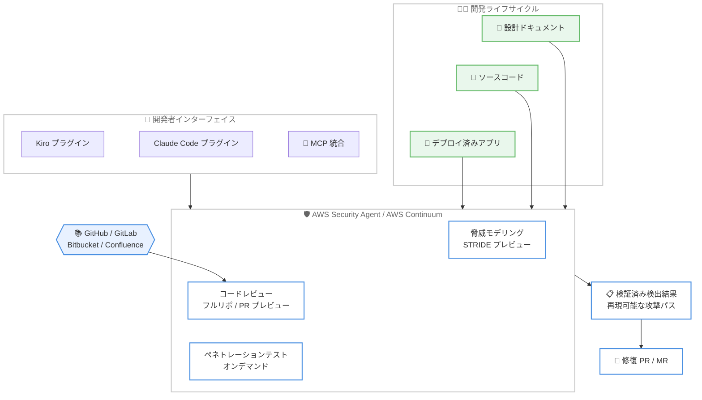

# AWS Security Agent - アジアパシフィックおよび南米リージョンへの提供拡大

**リリース日**: 2026 年 7 月 1 日
**サービス**: AWS Security Agent (AWS Continuum の一部)
**機能**: アジアパシフィック (ムンバイ)、アジアパシフィック (シンガポール)、南米 (サンパウロ) での提供開始

📊 [このアップデートのインフォグラフィックを見る](https://takech9203.github.io/aws-news-summary/20260701-aws-security-agent-asia-pacific.html)
<!-- INFOGRAPHIC_BASE_URL は環境変数から取得 -->

## 概要

AWS は、AWS Security Agent (現在は [AWS Continuum](https://aws.amazon.com/continuum/) の一部) を新たに 3 つの AWS リージョン (アジアパシフィック (ムンバイ)、アジアパシフィック (シンガポール)、南米 (サンパウロ)) で提供開始しました。これらのリージョンのお客様は、開発ライフサイクル全体を通じてアプリケーションをプロアクティブに保護する Security Agent のコア機能を利用できるようになりました。

AWS Security Agent は、設計からデプロイまでの各段階でセキュリティを継続的に検証するフロンティアエージェントです。組織のセキュリティ要件に合わせた自動セキュリティレビュー、アプリケーションが攻撃を受ける可能性を特定する脅威モデリング、オンデマンドのペネトレーションテストを提供し、脆弱性を早期に防止します。今回の拡大により、対象リージョンのお客様は、STRIDE ベースの脅威モデリング (プレビュー)、フルリポジトリおよび PR レベルのコードレビュー (プレビュー)、オンデマンドのペネトレーションテストといった中核機能を活用できます。

対象ユーザーは、開発速度に合わせてセキュリティ専門性をアプリケーション全体に展開したいセキュリティチーム、DevSecOps 担当者、クラウドセキュリティアーキテクトです。開発者は Kiro または Claude Code から新しい IDE プラグインと MCP 統合を通じて、脅威モデリング、コードレビュー、修復を直接トリガーできます。

**アップデート前の課題**

- アジアパシフィック (ムンバイ、シンガポール) および南米 (サンパウロ) のお客様は、AWS Security Agent のコア機能をこれらのリージョンで利用できなかった
- データ所在地や低レイテンシーを重視する組織にとって、地理的に近いリージョンでのセキュリティ検証手段が限られていた
- 開発ライフサイクル全体を通じたプロアクティブなセキュリティ検証を、これらのリージョンで一貫して実施することが難しかった

**アップデート後の改善**

- 3 つの追加リージョンで AWS Security Agent のコア機能を利用できるようになり、地理的に近い環境でアプリケーションを保護できるようになった
- STRIDE ベースの脅威モデリング (プレビュー) により、設計ドキュメントとソースコードを分析し、開発ライフサイクルの早期にリスクを特定できるようになった
- GitHub、GitLab、GitHub Enterprise Server、Bitbucket、Confluence にわたるフルリポジトリおよび PR レベルのコードレビュー (プレビュー) が利用可能になった
- Kiro や Claude Code から IDE プラグインおよび MCP 統合を通じて、セキュリティ機能を直接呼び出せるようになった

## アーキテクチャ図



AWS Security Agent は、設計ドキュメント、ソースコード、デプロイ済みアプリケーションを入力として受け取り、脅威モデリング、コードレビュー、ペネトレーションテストを実行して、検証済みの検出結果と修復 PR を提供します。

## サービスアップデートの詳細

### 主要機能

1. **STRIDE ベースの脅威モデリング (プレビュー)**
   - 設計ドキュメント (スコープドキュメント) とソースコードを分析し、アプリケーションのアーキテクチャ、コンポーネント、トラスト境界、データフロー、セキュリティ状態を記述したシステム概要を生成
   - STRIDE カテゴリ (なりすまし、改ざん、否認、情報漏洩、サービス妨害、権限昇格) で脅威を分類し、深刻度レベルと実行可能な推奨事項を提示
   - 脅威モデルは再利用可能な設定として保存でき、コードや設計の進化に合わせて再実行可能

2. **フルリポジトリおよび PR レベルのコードレビュー (プレビュー)**
   - GitHub、GitLab、GitHub Enterprise Server、Bitbucket、Confluence にわたって利用可能
   - フルリポジトリスキャンでソースコード全体の脆弱性と組織要件への準拠を検証
   - プルリクエストのコメントとしてセキュリティ検出結果を直接投稿し、修復用の PR / MR を自動生成可能
   - マネージドコンプライアンスパックとカスタムセキュリティ要件をサポート

3. **オンデマンドのペネトレーションテスト**
   - 再現可能な攻撃パスを伴う検証済みの検出結果を提供
   - すぐに実装可能な修正を含む
   - 再テストにより、適用された修復が有効であることを確認

4. **IDE プラグインと MCP 統合**
   - Kiro または Claude Code から、脅威モデリング、コードレビュー、修復を直接トリガー可能
   - 新しい IDE プラグインと MCP (Model Context Protocol) 統合を通じて、開発者のワークフロー内でセキュリティ機能を利用

## 技術仕様

### 対応機能とリージョン範囲

| 項目 | 詳細 |
|------|------|
| 脅威モデリング (STRIDE) | プレビュー。追加 3 リージョンで利用可能 |
| コードレビュー (フルリポ / PR) | プレビュー。GitHub、GitLab、GitHub Enterprise Server、Bitbucket、Confluence に対応 |
| ペネトレーションテスト | オンデマンド。検証済み検出結果と修復を提供 |
| シミュレーションによる検証 | 米国東部 (バージニア北部) でのみ引き続き利用可能 |
| IDE 統合 | Kiro、Claude Code プラグイン、MCP 統合 |

### 対応リポジトリおよびドキュメントソース

- GitHub
- GitLab
- GitHub Enterprise Server
- Bitbucket
- Confluence

## 設定方法

### 前提条件

1. AWS Security Agent (AWS Continuum) を利用可能なリージョンで AWS アカウントを保有していること
2. コードレビュー機能を利用する場合、対象のソースコードリポジトリ (GitHub、GitLab、GitHub Enterprise Server、Bitbucket) への接続設定
3. IDE 統合を利用する場合、Kiro または Claude Code と対応する IDE プラグインおよび MCP 統合のセットアップ

### 手順

#### ステップ 1: 組織のセキュリティ要件を定義

AWS コンソールで、承認済みの認可ライブラリ、ロギング標準、データアクセスポリシーなどの組織のセキュリティ要件を一度定義します。AWS Security Agent は、設計レビューとコードレビューを通じてこれらの要件を自動的に適用します。

#### ステップ 2: リポジトリの接続と脅威モデリングの実行

対象リポジトリを接続し、設計ドキュメントまたはソースコード (あるいはその両方) を指定して STRIDE ベースの脅威モデリングを実行します。生成されたシステム概要と分類された脅威を確認し、優先度の高いリスクに対応します。

#### ステップ 3: IDE からのセキュリティレビューの実行

Kiro または Claude Code の IDE プラグインおよび MCP 統合を通じて、脅威モデリング、コードレビュー、修復を開発者のワークフロー内で直接トリガーします。ペネトレーションテストが必要な場合は、対象 URL、認証情報、ソースコード、アプリケーションドキュメントを提供してオンデマンドで実行します。

## メリット

### ビジネス面

- **地理的な近接性**: アジアパシフィック (ムンバイ、シンガポール) および南米 (サンパウロ) のお客様が、地理的に近い環境でセキュリティ検証を実施できる
- **セキュリティ専門性のスケール**: 開発速度に合わせてセキュリティレビューをスケールさせ、限られたセキュリティ人材で広範なアプリケーションをカバーできる
- **早期のリスク発見**: 開発ライフサイクルの早期に脅威を特定することで、後工程での手戻りとコストを削減できる

### 技術面

- **開発者ワークフローへの統合**: Kiro や Claude Code から直接セキュリティ機能を呼び出せるため、コンテキストスイッチを削減できる
- **実行可能な修復**: 検証済みの検出結果に、再現可能な攻撃パスとすぐに実装できる修正を含む
- **複数リポジトリ対応**: GitHub、GitLab、GitHub Enterprise Server、Bitbucket、Confluence にわたる一貫したセキュリティレビューが可能

## デメリット・制約事項

### 制限事項

- 脅威モデリング (STRIDE) およびフルリポジトリ / PR レベルのコードレビューはプレビュー段階である
- シミュレーションによる検証は、米国東部 (バージニア北部) でのみ引き続き利用可能で、今回の追加 3 リージョンでは提供されない
- 今回のアップデートで拡大されたのはコア機能であり、全機能がすべてのリージョンで同一に提供されるわけではない

### 考慮すべき点

- プレビュー機能を本番環境で利用する際は、機能の成熟度と提供条件を事前に確認する
- ペネトレーションテストの実施にあたっては、対象 URL、認証情報、ソースコード、ドキュメントの提供が必要となる
- コードレビュー機能を利用するには、対象リポジトリへの接続設定が前提となる

## ユースケース

### ユースケース 1: 設計段階での脅威モデリング

**シナリオ**: アジアパシフィック (シンガポール) を拠点とする開発チームが、新しいマイクロサービスの設計段階でセキュリティリスクを早期に特定したい。

**実装例**:
```
1. 設計ドキュメント (スコープドキュメント) を AWS Security Agent に提供
2. 既存システムのソースコードをコンテキストとして指定
3. STRIDE ベースの脅威モデルを生成し、深刻度別に分類された脅威を確認
```

**効果**: コードを書く前に設計上のリスクを特定し、後工程でのアーキテクチャ変更を削減できる。

### ユースケース 2: プルリクエストの自動セキュリティレビュー

**シナリオ**: 南米 (サンパウロ) のチームが、GitHub 上のプルリクエストごとにセキュリティレビューを自動化したい。

**実装例**:
```
1. AWS Security Agent と GitHub リポジトリを接続
2. PR レベルのコードレビュー (プレビュー) を有効化
3. 検出結果を PR コメントとして受け取り、必要に応じて修復 PR を自動生成
```

**効果**: 開発パイプラインを止めることなく、コード変更ごとにセキュリティ検証を実施できる。

### ユースケース 3: IDE からのオンデマンドセキュリティ検証

**シナリオ**: アジアパシフィック (ムンバイ) の開発者が、Kiro を使いながら開発中のアプリケーションのセキュリティを都度確認したい。

**実装例**:
```
1. Kiro に AWS Security Agent の IDE プラグインと MCP 統合をセットアップ
2. IDE 内から脅威モデリングやコードレビューを直接トリガー
3. 検出された脆弱性の修復を IDE のワークフロー内で実施
```

**効果**: コンテキストスイッチを最小限に抑えながら、開発と並行してセキュリティ検証を継続できる。

## 料金

料金の詳細については、AWS Security Agent (AWS Continuum) の製品ページおよび公式ドキュメントを参照してください。今回の発表では、追加リージョンでの提供開始が案内されており、リージョンごとの提供条件と機能範囲の確認を推奨します。

## 利用可能リージョン

今回の拡大により、以下の 3 リージョンで AWS Security Agent のコア機能が利用可能になりました。

- アジアパシフィック (ムンバイ)
- アジアパシフィック (シンガポール)
- 南米 (サンパウロ)

なお、シミュレーションによる検証 (Simulated validation) は、引き続き米国東部 (バージニア北部) でのみ利用可能です。

## 関連サービス・機能

- **AWS Continuum**: AWS Security Agent が現在その一部となっている、より広範なプラットフォーム
- **Kiro**: AWS が提供する AI 搭載 IDE。Security Agent の脅威モデリング、コードレビュー、修復を IDE プラグインと MCP 統合を通じて直接トリガー可能
- **Claude Code**: IDE プラグインと MCP 統合を通じて Security Agent の機能を呼び出せる開発ツール
- **GitHub / GitLab / GitHub Enterprise Server / Bitbucket / Confluence**: コードレビュー機能が対応するリポジトリおよびドキュメントソース

## 参考リンク

- 📊 [インフォグラフィック](https://takech9203.github.io/aws-news-summary/20260701-aws-security-agent-asia-pacific.html)
- [公式発表 (What's New)](https://aws.amazon.com/about-aws/whats-new/2026/07/aws-security-agent-asia-pacific/)
- [ドキュメント](https://docs.aws.amazon.com/securityagent/latest/userguide/what-is.html)
- [AWS Security Agent 製品ページ](https://aws.amazon.com/security-agent/)
- [AWS Continuum](https://aws.amazon.com/continuum/)

## まとめ

今回のアップデートにより、AWS Security Agent のコア機能がアジアパシフィック (ムンバイ、シンガポール) および南米 (サンパウロ) で利用可能になり、これらのリージョンのお客様が開発ライフサイクル全体を通じてプロアクティブなセキュリティ検証を実施できるようになりました。STRIDE ベースの脅威モデリングやコードレビューはプレビュー段階のため、機能の提供条件を確認しながら、まずは開発ワークフローへの統合を検証することを推奨します。
