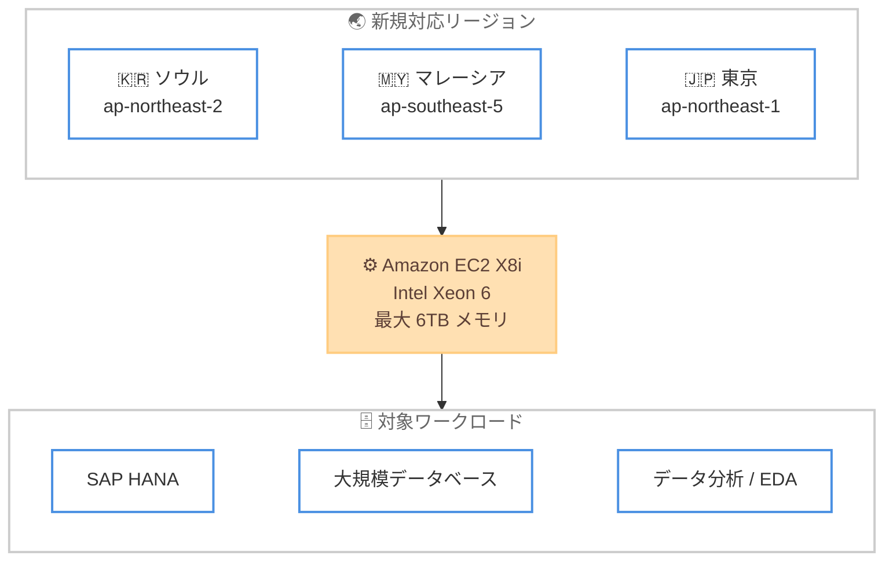

# Amazon EC2 - X8i インスタンスの追加リージョン対応

**リリース日**: 2026 年 7 月 2 日
**サービス**: Amazon Elastic Compute Cloud (Amazon EC2)
**機能**: X8i インスタンス

📊 [このアップデートのインフォグラフィックを見る](https://takech9203.github.io/aws-news-summary/20260702-amazon-ec2-x8i-instances-ICN-KUL-NRT-region.html)
<!-- INFOGRAPHIC_BASE_URL は環境変数から取得 -->

## 概要

Amazon EC2 X8i インスタンスが、アジアパシフィック (ソウル)、アジアパシフィック (マレーシア)、アジアパシフィック (東京) の各リージョンで利用可能になりました。X8i インスタンスは、AWS でのみ利用可能なカスタム Intel Xeon 6 プロセッサを搭載したメモリ最適化インスタンスです。

X8i インスタンスは SAP 認定を取得しており、クラウド上の同等の Intel プロセッサの中で最高のパフォーマンスと最速のメモリ帯域幅を提供します。前世代の X2i インスタンスと比較して、最大 43% 高いパフォーマンス、1.5 倍のメモリ容量 (最大 6 TB)、3.3 倍のメモリ帯域幅を実現します。今回の東京リージョンへの対応により、日本国内のお客様も低レイテンシーでこれらの高性能メモリ最適化インスタンスを利用できるようになりました。

これらのインスタンスは、SAP HANA、大規模データベース、データ分析、電子設計自動化 (EDA) といったメモリ集約型ワークロード向けに設計されています。large から 96xlarge までの 14 サイズ (2 種類のベアメタルオプションを含む) が提供されます。

**アップデート前の課題**

- 対象リージョン (ソウル、マレーシア、東京) では X8i インスタンスを利用できず、メモリ集約型ワークロードには前世代の X2i インスタンスなどを選択する必要があった
- 前世代インスタンスではメモリ容量が最大 4 TB にとどまり、6 TB を要求する大規模な SAP HANA などのワークロードに制約があった
- 高性能なメモリ最適化インスタンスを必要とするワークロードを、これらのリージョンで低レイテンシーに実行することが困難だった

**アップデート後の改善**

- アジアパシフィック (ソウル)、アジアパシフィック (マレーシア)、アジアパシフィック (東京) で X8i インスタンスを利用できるようになった
- 前世代 X2i と比較して 1.5 倍のメモリ容量 (最大 6 TB) と 3.3 倍のメモリ帯域幅を、これらのリージョンで利用可能になった
- SAP 認定済みの高性能インスタンスを東京リージョンなどで直接利用でき、データレジデンシー要件とパフォーマンス要件を両立しやすくなった

## アーキテクチャ図

X8i インスタンスが 3 つの新規リージョンで利用可能になり、メモリ集約型ワークロードを各リージョンで実行できることを示しています。

## サービスアップデートの詳細

### 主要機能

1. **カスタム Intel Xeon 6 プロセッサ**
   - AWS でのみ利用可能なカスタム Intel Xeon 6 プロセッサを搭載
   - クラウド上の同等の Intel プロセッサの中で最高のパフォーマンスと最速のメモリ帯域幅を提供
   - SAP 認定を取得しており、SAP ワークロードでの利用に適している

2. **メモリ容量と帯域幅の大幅な向上**
   - 前世代 X2i と比較して 1.5 倍のメモリ容量 (最大 6 TB) を提供
   - メモリ帯域幅は前世代比で 3.3 倍
   - 全体で最大 43% 高いパフォーマンスを実現

3. **幅広いインスタンスサイズとベアメタルオプション**
   - large から 96xlarge まで 14 のサイズを提供
   - 2 種類のベアメタルオプションを含む
   - Savings Plans、オンデマンドインスタンス、スポットインスタンスで購入可能

## 技術仕様

### X8i インスタンスの主な特性

| 項目 | 詳細 |
|------|------|
| プロセッサ | カスタム Intel Xeon 6 (AWS 限定) |
| 最大メモリ容量 | 6 TB (前世代比 1.5 倍) |
| メモリ帯域幅 | 前世代 X2i 比 3.3 倍 |
| インスタンスサイズ | 14 サイズ (large ～ 96xlarge、ベアメタル 2 種を含む) |
| SAP 認定 | あり |
| 購入オプション | Savings Plans、オンデマンド、スポット |

### 前世代 X2i との性能比較

| ワークロード | X2i 比の改善 |
|------|------|
| 総合パフォーマンス | 最大 43% 向上 |
| SAPS (SAP) パフォーマンス | 最大 50% 向上 |
| PostgreSQL パフォーマンス | 最大 47% 高速化 |
| Memcached パフォーマンス | 88% 高速化 |
| AI 推論パフォーマンス | 46% 高速化 |

## メリット

### ビジネス面

- **リージョン選択肢の拡大**: 東京、ソウル、マレーシアの各リージョンで X8i を利用でき、データレジデンシー要件を満たしつつ高性能なメモリ最適化インスタンスを選択できる
- **SAP ワークロードへの適合**: SAP 認定済みのため、これらのリージョンで SAP HANA などのミッションクリティカルなワークロードを安心して稼働できる
- **コスト最適化**: Savings Plans やスポットインスタンスを活用することで、ワークロード特性に応じた費用最適化が可能

### 技術面

- **大容量メモリ**: 最大 6 TB のメモリにより、大規模なインメモリデータベースや分析処理を単一インスタンスで実行できる
- **高いメモリ帯域幅**: 前世代比 3.3 倍の帯域幅により、メモリ集約型ワークロードのスループットが向上する
- **柔軟なサイジング**: large から 96xlarge、ベアメタルまで 14 サイズから選択でき、ワークロード規模に応じた最適なインスタンス選定が可能

## デメリット・制約事項

### 制限事項

- 今回の対応リージョンはアジアパシフィック (ソウル)、アジアパシフィック (マレーシア)、アジアパシフィック (東京) の 3 リージョン
- メモリ最適化インスタンスのため、コンピューティング集約型ワークロードには他のインスタンスファミリーの方が適する場合がある

### 考慮すべき点

- 大容量メモリ構成のインスタンスは料金が高くなるため、ワークロードのメモリ要件に応じたサイジングが重要
- 既存の X2i など前世代インスタンスからの移行時は、性能検証と料金比較を実施することを推奨

## ユースケース

### ユースケース 1: SAP HANA 環境の実行

**シナリオ**: 東京リージョンで大規模な SAP HANA データベースを稼働させたい企業が、SAP 認定済みで大容量メモリを備えたインスタンスを必要としている。

**効果**: 最大 6 TB のメモリと前世代比最大 50% 高い SAPS パフォーマンスにより、大規模な SAP ワークロードを東京リージョンで低レイテンシーに実行できる。

### ユースケース 2: 大規模インメモリデータベース / 分析基盤

**シナリオ**: メモリ集約型のインメモリデータベースやデータ分析基盤を運用しており、メモリ容量と帯域幅がボトルネックとなっている。

**効果**: 前世代比 3.3 倍のメモリ帯域幅と 47% 高速な PostgreSQL パフォーマンスにより、クエリ処理と分析処理のスループットが向上する。

### ユースケース 3: 電子設計自動化 (EDA)

**シナリオ**: 半導体設計などで大量のメモリを消費する EDA ワークロードを実行しており、処理時間の短縮を求めている。

**効果**: 大容量メモリと高いメモリ帯域幅を備えた X8i により、メモリ集約型の EDA ジョブを効率的に処理できる。

## 料金

X8i インスタンスは、Savings Plans、オンデマンドインスタンス、スポットインスタンスで利用できます。料金はインスタンスサイズおよびリージョンによって異なります。最新かつ正確な料金は、Amazon EC2 の公式料金ページで確認してください。

## 利用可能リージョン

今回のアップデートにより、X8i インスタンスは以下のリージョンで新たに利用可能になりました。

- アジアパシフィック (ソウル)
- アジアパシフィック (マレーシア)
- アジアパシフィック (東京)

## 関連サービス・機能

- **Amazon EC2 X2i インスタンス**: X8i の前世代にあたるメモリ最適化インスタンス。X8i は性能・容量・帯域幅で大幅に上回る
- **AWS Savings Plans**: X8i インスタンスの利用コストを最適化するための購入オプション
- **SAP on AWS**: X8i は SAP 認定済みであり、SAP HANA などのワークロードに適している

## 参考リンク

- 📊 [インフォグラフィック](https://takech9203.github.io/aws-news-summary/20260702-amazon-ec2-x8i-instances-ICN-KUL-NRT-region.html)
- [公式発表 (What's New)](https://aws.amazon.com/about-aws/whats-new/2026/02/amazon-ec2-x8i-instances-ICN-KUL-NRT-region/)
- [X8i インスタンスページ](https://aws.amazon.com/ec2/instance-types/x8i/)
- [AWS Management Console](https://aws.amazon.com/console/)

## まとめ

Amazon EC2 X8i インスタンスが東京を含む 3 つのアジアパシフィックリージョンで利用可能になったことで、SAP HANA や大規模データベース、EDA などのメモリ集約型ワークロードを、より近いリージョンで高性能に実行できるようになりました。前世代 X2i からの移行を検討しているお客様は、性能と料金を比較のうえ、対象リージョンでの X8i 採用を評価することを推奨します。
