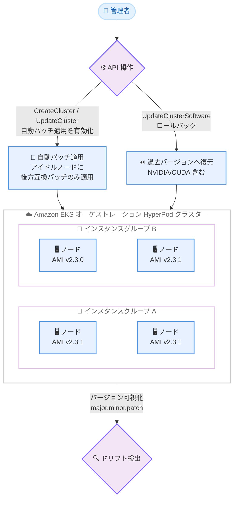

# Amazon SageMaker HyperPod - AMI バージョニングと自動パッチ適用

**リリース日**: 2026 年 7 月 2 日
**サービス**: Amazon SageMaker HyperPod
**機能**: AMI バージョニングと自動パッチ適用 (Auto-Patching)

📊 [このアップデートのインフォグラフィックを見る](https://takech9203.github.io/aws-news-summary/20260702-amazon-sagemaker-hyperpod-ami-version-auto-patch.html)

## 概要

Amazon SageMaker HyperPod が、クラスター全体で稼働している Amazon Machine Image (AMI) のバージョンを可視化し、ワークロードを中断することなくセキュリティパッチを自動的に適用する機能をサポートした。SageMaker HyperPod は、基盤モデルを大規模にトレーニングおよびデプロイするために専用設計されたインフラストラクチャである。

今回のアップデートにより、AMI バージョニングを通じて、各インスタンスグループおよびノードで稼働している正確な AMI バージョンをセマンティックバージョニング (major.minor.patch) 形式で確認できるようになった。これにより、バージョンのドリフト (差異) を迅速に検出し、`UpdateClusterSoftware` API を使用して、以前の NVIDIA ドライバー、CUDA、その他のソフトウェアスタックを含む過去のバージョンへロールバックすることが可能になる。

自動パッチ適用は、インスタンスグループ単位でオプトインする機能であり、ノードがアイドル状態になった時点で後方互換性のあるセキュリティパッチのみを適用する。このため、実行中のワークロードは中断されず、NVIDIA ドライバー、CUDA バージョン、OS カーネルなどの重要な AI/ML パッケージが異なるメジャーバージョンやマイナーバージョンにアップグレードされることはない。この機能は `CreateCluster` または `UpdateCluster` API を通じて有効化する。あわせて、新しい AMI サポートポリシーにより、各 AMI バージョンのサポート期限が公開される。

**アップデート前の課題**

- 各インスタンスグループやノードで稼働している AMI バージョンを正確に把握する手段が限られており、バージョンドリフトの検出が困難であった
- セキュリティパッチの適用が手動かつリアクティブなプロセスであり、長時間のトレーニングジョブに対してリスクを伴っていた
- パッチ適用時にワークロードが中断されるリスクがあり、運用者はメンテナンスタイミングの調整に注意を払う必要があった
- 特定バージョンへ戻したい場合に、NVIDIA ドライバーや CUDA を含むソフトウェアスタックを一貫してロールバックする仕組みがなかった

**アップデート後の改善**

- AMI バージョンをセマンティックバージョニング形式で可視化し、インスタンスグループおよびノード単位でバージョンドリフトを迅速に検出できるようになった
- ノードがアイドル状態になった時点で後方互換性のあるセキュリティパッチが自動適用され、実行中のワークロードが中断されなくなった
- 重要な AI/ML パッケージ (NVIDIA ドライバー、CUDA、OS カーネル) がメジャー/マイナーバージョンを跨いでアップグレードされないため、互換性が保証される
- `UpdateClusterSoftware` API により、以前の NVIDIA ドライバーや CUDA を含む過去バージョンへのロールバックが可能になった
- AMI サポートポリシーによって各バージョンのサポート期限が公開され、計画的なアップデートが可能になった

## アーキテクチャ図



インスタンスグループごとに AMI バージョンを可視化してドリフトを検出し、自動パッチ適用とロールバックを API 経由で制御する構成を示している。

## サービスアップデートの詳細

### 主要機能

1. **AMI バージョニングによる可視化**
   - 各インスタンスグループおよびノードで稼働している正確な AMI バージョンをセマンティックバージョニング (major.minor.patch) 形式で確認できる
   - クラスター内でバージョンの差異 (ドリフト) を迅速に検出できる
   - バージョンを一元的に把握することで、運用状況の透明性が向上する

2. **過去バージョンへのロールバック**
   - `UpdateClusterSoftware` API を使用して、以前の AMI バージョンへロールバックできる
   - ロールバック対象には、以前の NVIDIA ドライバー、CUDA、その他のソフトウェアスタックが含まれる
   - 新しいバージョンで問題が発生した場合でも、既知の安定したバージョンへ迅速に戻せる

3. **自動パッチ適用 (Auto-Patching)**
   - インスタンスグループ単位でオプトインする機能
   - ノードがアイドル状態になった時点で、後方互換性のあるセキュリティパッチのみを適用する
   - 実行中のワークロードは中断されない
   - NVIDIA ドライバー、CUDA バージョン、OS カーネルなどの重要な AI/ML パッケージが、異なるメジャー/マイナーバージョンへアップグレードされることはない
   - `CreateCluster` または `UpdateCluster` API を通じて有効化する

4. **AMI サポートポリシー**
   - 各 AMI バージョンのサポート期限を公開する新しいポリシーが導入された
   - サポート期限を把握することで、計画的なバージョンアップグレードが可能になる

## 技術仕様

### 機能概要

| 項目 | 詳細 |
|------|------|
| バージョン形式 | セマンティックバージョニング (major.minor.patch) |
| 可視化の粒度 | インスタンスグループおよびノード単位 |
| 自動パッチの適用単位 | インスタンスグループ単位 (オプトイン) |
| 自動パッチの適用タイミング | ノードがアイドル状態になった時点 |
| 自動パッチの対象 | 後方互換性のあるセキュリティパッチのみ |
| バージョン保護 | NVIDIA ドライバー、CUDA、OS カーネルはメジャー/マイナーバージョンを跨いでアップグレードされない |
| オーケストレーション | Amazon EKS |

### 主要な API

| API | 用途 |
|------|------|
| `UpdateClusterSoftware` | 過去の AMI バージョン (NVIDIA ドライバー、CUDA 含む) へのロールバック |
| `CreateCluster` | クラスター作成時に自動パッチ適用を有効化 |
| `UpdateCluster` | 既存クラスターに対して自動パッチ適用を有効化 |

### API 変更履歴

今回のアップデートに直接対応する SageMaker HyperPod の API 変更は、awsapichanges.com のフィード (過去 10 日間) では確認できなかった。上記の API 動作については、AWS 公式発表および公式ドキュメントを情報源としている。

## 設定方法

### 前提条件

1. Amazon EKS によってオーケストレーションされた SageMaker HyperPod クラスターであること
2. クラスターおよびインスタンスグループを操作するための適切な IAM 権限を保有していること
3. SageMaker HyperPod がサポートされている AWS リージョンで利用していること

### 手順

#### ステップ1: AMI バージョンの確認

コンソールまたは API を通じて、各インスタンスグループおよびノードで稼働している AMI バージョンをセマンティックバージョニング形式で確認する。バージョンドリフトの有無を把握し、更新やロールバックの要否を判断する。

#### ステップ2: 自動パッチ適用の有効化

```bash
# UpdateCluster API で対象インスタンスグループの自動パッチ適用を有効化 (概念例)
aws sagemaker update-cluster \
  --cluster-name my-hyperpod-cluster \
  --instance-groups '[{ "InstanceGroupName": "worker-group", "..." : "自動パッチ適用の設定" }]'
```

`UpdateCluster` API を実行し、対象インスタンスグループでオプトインの自動パッチ適用を有効化する。これにより、ノードがアイドル状態になった時点で後方互換性のあるセキュリティパッチが自動適用される。新規クラスターの場合は `CreateCluster` API で同様に設定する。

#### ステップ3: 必要に応じたロールバック

```bash
# UpdateClusterSoftware API で過去の AMI バージョンへロールバック (概念例)
aws sagemaker update-cluster-software \
  --cluster-name my-hyperpod-cluster
```

新しいバージョンで問題が発生した場合、`UpdateClusterSoftware` API を使用して、以前の NVIDIA ドライバーや CUDA を含む過去の AMI バージョンへロールバックする。正確なパラメーターは公式ドキュメントを参照すること。

## メリット

### ビジネス面

- **ダウンタイムの削減**: ワークロードを中断せずにセキュリティパッチを適用できるため、長時間のトレーニングジョブへの影響を回避できる
- **セキュリティ対応の効率化**: パッチ適用が自動化され、手動でのリアクティブな対応にかかる運用コストを削減できる
- **計画性の向上**: AMI サポートポリシーによりサポート期限が公開され、アップグレード計画を立てやすくなる

### 技術面

- **バージョン管理の透明性**: セマンティックバージョニングにより、インスタンスグループやノード単位でのバージョン差異を明確に把握できる
- **互換性の保証**: 後方互換性のあるパッチのみが適用され、NVIDIA ドライバーや CUDA のメジャー/マイナーバージョンが維持されるため、AI/ML スタックの安定性が保たれる
- **迅速な復旧**: `UpdateClusterSoftware` API により、問題発生時に既知の安定バージョンへ素早くロールバックできる

## デメリット・制約事項

### 制限事項

- AMI バージョニングと自動パッチ適用は、Amazon EKS によってオーケストレーションされた HyperPod クラスターでのみ利用可能である
- 自動パッチ適用はオプトイン機能であり、デフォルトでは有効化されていない
- 自動パッチはノードがアイドル状態になった時点で適用されるため、常時稼働しているノードへの適用タイミングはワークロードの状況に依存する
- 適用されるのは後方互換性のあるセキュリティパッチのみであり、メジャー/マイナーバージョンのアップグレードには対応しない

### 考慮すべき点

- 自動パッチ適用を有効化する前に、対象インスタンスグループのワークロードのアイドルパターンを把握しておくことが望ましい
- ロールバックによってソフトウェアスタック全体が過去バージョンに戻るため、最新の機能や修正が失われる可能性がある点に留意する
- AMI サポートポリシーで公開されるサポート期限を定期的に確認し、期限切れ前にアップグレードを計画する

## ユースケース

### ユースケース1: 大規模基盤モデルトレーニング中のセキュリティ維持

**シナリオ**: 数週間にわたる基盤モデルのトレーニングジョブを実行している環境で、トレーニングを中断せずにセキュリティパッチを適用したい。

**実装例**:
```
対象インスタンスグループで自動パッチ適用をオプトインで有効化し、
ノードがアイドル状態になったタイミングで後方互換パッチを自動適用する。
```

**効果**: トレーニングジョブを中断することなくセキュリティを維持でき、長時間ワークロードの安定稼働とコンプライアンスを両立できる。

### ユースケース2: バージョンドリフトの検出と是正

**シナリオ**: 複数のインスタンスグループで構成される大規模クラスターにおいて、ノード間で AMI バージョンに差異が生じていないかを確認したい。

**実装例**:
```
各インスタンスグループの AMI バージョンをセマンティックバージョニング形式で確認し、
ドリフトを検出したグループについて更新またはロールバックを判断する。
```

**効果**: クラスター全体のバージョン整合性を可視化し、予期しない挙動やトラブルシューティングの原因となるドリフトを早期に是正できる。

### ユースケース3: 新バージョン適用後の問題からの復旧

**シナリオ**: 新しい AMI バージョンを適用した後、NVIDIA ドライバーや CUDA に起因する問題が発生し、既知の安定バージョンへ戻したい。

**実装例**:
```
UpdateClusterSoftware API を使用して、以前の NVIDIA ドライバーや CUDA を含む
過去の AMI バージョンへロールバックする。
```

**効果**: ソフトウェアスタック全体を一貫して安定バージョンへ復元でき、トレーニングやデプロイの中断時間を最小化できる。

## 料金

本アップデートに関する追加料金についての明示的な記載は、公式発表では確認できなかった。SageMaker HyperPod の利用料金は、使用するコンピューティングリソースに基づく。詳細は SageMaker の料金ページを参照すること。

## 利用可能リージョン

AMI バージョニングと自動パッチ適用は、Amazon EKS によってオーケストレーションされた HyperPod クラスターで利用でき、SageMaker HyperPod がサポートされているすべての AWS リージョンで提供される。

## 関連サービス・機能

- **Amazon EKS**: HyperPod クラスターのオーケストレーション基盤であり、本機能の利用前提となる
- **NVIDIA ドライバー / CUDA**: AI/ML ワークロードの実行に不可欠なソフトウェアスタックであり、バージョン保護とロールバックの対象
- **Amazon Machine Image (AMI)**: バージョニングとパッチ適用の対象となるノードのベースイメージ

## 参考リンク

- 📊 [インフォグラフィック](https://takech9203.github.io/aws-news-summary/20260702-amazon-sagemaker-hyperpod-ami-version-auto-patch.html)
- [公式発表 (What's New)](https://aws.amazon.com/about-aws/whats-new/2026/07/amazon-sagemaker-hyperpod-ami-version-auto-patch)
- [Amazon SageMaker HyperPod ドキュメント](https://docs.aws.amazon.com/sagemaker/latest/dg/sagemaker-hyperpod.html)
- [Amazon SageMaker 料金ページ](https://aws.amazon.com/sagemaker/pricing/)

## まとめ

本アップデートは、大規模な基盤モデルのトレーニングやデプロイを行う環境において、セキュリティ運用の自動化とバージョン管理の透明性を大きく前進させるものである。AMI バージョニングによりドリフトを迅速に検出し、自動パッチ適用でワークロードを中断せずにセキュリティを維持できるため、EKS でオーケストレーションした HyperPod クラスターを運用しているユーザーは、対象インスタンスグループでの自動パッチ適用の有効化と AMI サポートポリシーに基づくアップグレード計画の策定を検討することを推奨する。
