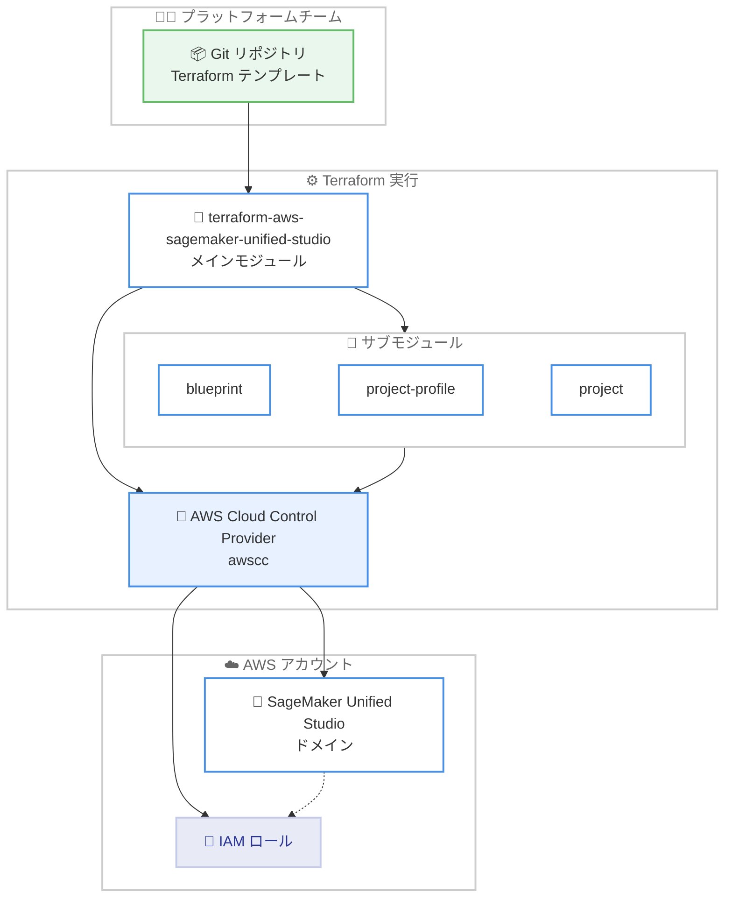

# Amazon SageMaker Unified Studio - Terraform によるプロビジョニングのサポート

**リリース日**: 2026 年 7 月 2 日
**サービス**: Amazon SageMaker Unified Studio
**機能**: Terraform を利用したドメインのプロビジョニング

📊 [このアップデートのインフォグラフィックを見る](https://takech9203.github.io/aws-news-summary/20260702-amazon-sagemaker-unified-studio-terraform.html)
<!-- INFOGRAPHIC_BASE_URL は環境変数から取得 -->

## 概要

Amazon SageMaker Unified Studio が Terraform によるプロビジョニングに対応しました。お客様はオープンソースの `terraform-aws-sagemaker-unified-studio` モジュールを使用して、バージョン管理されたテンプレートから SageMaker Unified Studio のドメインをデプロイできます。これにより、プラットフォームチームは SageMaker Unified Studio を既存の Infrastructure as Code (IaC) パイプラインに組み込み、開発、ステージング、本番の各アカウント間で一貫性を維持できます。

この Terraform モジュールは、プロビジョニングされる IAM ロールとともに SageMaker Unified Studio ドメインのインフラストラクチャを管理します。サブモジュールを利用することで、チームはブループリントの有効化、ブループリントを組み合わせたプロジェクトプロファイルの構成、プロジェクトの作成をそれぞれ独立して実行できます。また、既存の IAM ロールを利用してプロジェクトを作成することも可能です。

この統合は Terraform AWS Cloud Control Provider を通じて実現されています。Cloud Control Provider は AWS Cloud Control API を利用するため、新しい AWS の機能やリソースを迅速に Terraform から扱えるようになる点が特徴です。本機能は Amazon SageMaker Unified Studio が利用可能なすべての AWS リージョンで提供されます。

**アップデート前の課題**

このアップデート以前、SageMaker Unified Studio のドメインを Terraform ベースの IaC で管理する標準的な手段が限られていました。

- SageMaker Unified Studio ドメインを宣言的にプロビジョニングする公式の Terraform モジュールが存在せず、手動での構築や独自スクリプトに依存する必要があった
- ブループリント、プロジェクトプロファイル、プロジェクトといった構成要素を、既存の Terraform ワークフローで一貫して管理することが困難だった
- 開発、ステージング、本番の各アカウント間で構成のドリフト (差異) が発生しやすく、環境間の一貫性を保つのが難しかった

**アップデート後の改善**

今回のアップデートにより、SageMaker Unified Studio を既存の IaC パイプラインに統合できるようになりました。

- 今回のアップデートにより、`terraform-aws-sagemaker-unified-studio` モジュールを使ってバージョン管理されたテンプレートからドメインをプロビジョニングできるようになった
- 今回のアップデートにより、ブループリント、プロジェクトプロファイル、プロジェクトをサブモジュールで独立して管理できるようになった
- 今回のアップデートにより、既存の IAM ロールの再利用が可能になり、環境間の一貫性を保ちながら SageMaker Unified Studio を展開できるようになった

## アーキテクチャ図



プラットフォームチームが Git 管理する Terraform テンプレートから、メインモジュールとサブモジュールを通じて AWS Cloud Control Provider が SageMaker Unified Studio ドメインと IAM ロールをプロビジョニングする流れを示しています。

## サービスアップデートの詳細

### 主要機能

1. **メインモジュールによるドメインのプロビジョニング**
   - `terraform-aws-sagemaker-unified-studio` モジュールが SageMaker Unified Studio ドメインのインフラストラクチャを構築する
   - ドメインに必要な IAM ロールをモジュールがプロビジョニングする
   - バージョン管理されたテンプレートによる宣言的なデプロイが可能になる

2. **独立して利用できるサブモジュール**
   - `blueprint` サブモジュールでブループリントを有効化する
   - `project-profile` サブモジュールでブループリントを組み合わせてプロジェクトプロファイルを構成する
   - `project` サブモジュールでプロジェクトプロファイルからプロジェクトを作成する
   - チームは必要な単位で構成要素を独立して管理できる

3. **既存 IAM ロールの利用**
   - モジュールが新規にロールを作成するだけでなく、既存の IAM ロールを指定してプロジェクトを作成できる
   - 標準的な SageMaker Unified Studio 用ロールが既に存在するアカウントでも安全に実行できる

4. **AWS Cloud Control Provider による統合**
   - 統合は Terraform AWS Cloud Control Provider (awscc プロバイダー) を通じて実現される
   - AWS Cloud Control API を利用することで、新しい AWS 機能を迅速に Terraform から扱える

## 技術仕様

### 主なサブモジュール

| サブモジュール | 役割 |
|------|------|
| `blueprint` | ドメイン上で環境ブループリントを有効化する |
| `blueprint-bootstrap` | ブループリント用の Provisioning / ManageAccess IAM ロールを作成する |
| `project-profile` | 複数のブループリントを組み合わせてプロジェクトプロファイルを構成する |
| `default-project-profile` | ToolingLite、S3Bucket、S3TableCatalog ブループリントを有効化しデフォルトプロファイルを作成する |
| `project` | プロジェクトプロファイルからプロジェクトを作成する |
| `project-membership` | プロジェクトにオーナーやコントリビューターを追加する |
| `domain-management-portal` | 管理ポータル用の管理プロジェクトを作成する |
| `policy-grant-create-project` | ドメインに対して `CREATE_PROJECT` ポリシーを付与する |

<!-- サブモジュールの構成はオープンソースリポジトリの内容に基づく。実際の利用時は最新のドキュメントを確認してください -->

### プロバイダー要件

| 項目 | 詳細 |
|------|------|
| Terraform | 1.7 以上 |
| aws プロバイダー | 6.51.0 以上 |
| awscc プロバイダー (Cloud Control) | 1.89.0 以上 |
| random プロバイダー | 3.8.1 以上 |
| time プロバイダー | 0.13.1 以上 |

<!-- バージョン要件はリポジトリの記載時点の情報。導入前に最新の要件を確認してください -->

### API 変更履歴

今回のアップデートは既存の SageMaker Unified Studio および Cloud Control API を利用した Terraform モジュールの提供であり、新規の API 変更を伴うものではありません。該当する API 変更履歴はありません。

## 設定方法

### 前提条件

1. Terraform 1.7 以上がインストールされていること
2. aws プロバイダーおよび awscc (AWS Cloud Control) プロバイダーが利用可能であること
3. SageMaker Unified Studio ドメインを配置する VPC とサブネットが用意されていること

### 手順

#### ステップ 1: メインモジュールの定義

```hcl
module "domain" {
  source = "aws-ia/sagemaker-unified-studio/aws"

  domain_name = "my-unified-studio-domain"
  vpc_id      = "vpc-0abc123def456"
  subnet_ids  = ["subnet-0aaa111", "subnet-0bbb222"]

  tags = {
    Environment = "dev"
  }
}
```

`vpc_id` と `subnet_ids` が必須の入力値です。ドメイン名、IAM ロール、S3 バケットなどは省略した場合に自動生成されます。この定義により SageMaker Unified Studio ドメインと関連する IAM ロールがプロビジョニングされます。

#### ステップ 2: プロビジョニングの適用

```bash
terraform init
terraform plan
terraform apply
```

`terraform init` でプロバイダーとモジュールを初期化し、`terraform plan` で作成されるリソースを確認したうえで、`terraform apply` で実際にドメインをプロビジョニングします。

#### ステップ 3: リソースの削除時の注意

```bash
aws s3 rm s3://<bucket-name> --recursive
terraform destroy
```

ドメインに紐づく S3 バケットは `force_destroy` が無効化されているため、`terraform destroy` を実行する前にバケット内のオブジェクトを空にする必要があります。上記コマンドでオブジェクトを削除してから削除を実行します。

## メリット

### ビジネス面

- **環境間の一貫性**: 開発、ステージング、本番の各アカウントで同一のテンプレートを再利用でき、構成のドリフトを防止できる
- **ガバナンスの向上**: バージョン管理されたテンプレートにより、変更履歴の追跡やレビュープロセスの適用が容易になる
- **オープンソースでの提供**: モジュールがオープンソースで公開されており、追加のライセンスコストなく導入できる

### 技術面

- **既存 IaC パイプラインへの統合**: SageMaker Unified Studio を既存の Terraform ワークフローに組み込める
- **モジュール化された構成**: ブループリント、プロジェクトプロファイル、プロジェクトを独立したサブモジュールで管理できる
- **Cloud Control Provider の活用**: AWS Cloud Control API を通じて新しい機能へ迅速に追従できる

## デメリット・制約事項

### 制限事項

- 利用可能なリージョンは SageMaker Unified Studio が提供されるリージョンに限定される
- モジュールの利用には Terraform 1.7 以上および awscc プロバイダー 1.89.0 以上が必要
- S3 バケットは削除保護のため、破棄前に手動でオブジェクトを空にする必要がある

### 考慮すべき点

- オープンソースモジュールであるため、バージョンアップや破壊的変更に注意し、利用するモジュールバージョンを固定することが望ましい
- 既存の IAM ロールを利用する場合、ロールに適切な権限が付与されているか事前に確認する必要がある

## ユースケース

### ユースケース 1: マルチアカウントでの一貫した環境構築

**シナリオ**: 開発、ステージング、本番でそれぞれ別アカウントを利用しており、SageMaker Unified Studio ドメインを同一構成で展開したい。

**実装例**:
```hcl
module "domain" {
  source      = "aws-ia/sagemaker-unified-studio/aws"
  domain_name = "analytics-${var.environment}"
  vpc_id      = var.vpc_id
  subnet_ids  = var.subnet_ids
}
```

**効果**: 環境ごとの変数を切り替えるだけで同一テンプレートを再利用でき、アカウント間の構成の一貫性を維持できる。

### ユースケース 2: ブループリントとプロジェクトの段階的な管理

**シナリオ**: ドメインの作成とプロジェクトの作成を別チームが担当しており、責務を分離して管理したい。

**実装例**:
```hcl
module "blueprint" {
  source    = "aws-ia/sagemaker-unified-studio/aws//modules/blueprint"
  domain_id = module.domain.domain_id
}
```

**効果**: サブモジュールを利用して構成要素を独立して管理でき、チーム間の責務分離とパイプラインの整理が可能になる。

### ユースケース 3: 既存 IAM ロールを利用したプロジェクト作成

**シナリオ**: 組織のポリシーで IAM ロールを一元管理しており、SageMaker Unified Studio でも既存ロールを再利用したい。

**実装例**:
```hcl
module "project" {
  source                   = "aws-ia/sagemaker-unified-studio/aws//modules/project"
  domain_id                = module.domain.domain_id
  project_profile_id       = module.project_profile.id
  # 既存ロールの ARN を指定して再利用
}
```

**効果**: 新規ロールを作成せず既存の IAM ロールを利用でき、組織のガバナンスポリシーに準拠できる。

## 料金

Terraform モジュール自体はオープンソースで提供されており、追加料金は発生しません。SageMaker Unified Studio ドメインおよびプロビジョニングされる AWS リソース (コンピュート、ストレージなど) の利用に対して通常の料金が適用されます。詳細は各サービスの料金ページを参照してください。

## 利用可能リージョン

Amazon SageMaker Unified Studio が利用可能なすべての AWS リージョンで提供されます。対応リージョンの一覧は SageMaker Unified Studio の管理者ガイドを参照してください。

## 関連サービス・機能

- **Amazon SageMaker Unified Studio**: 本モジュールがプロビジョニング対象とするサービス。データ、分析、AI/ML の開発を統合する環境
- **Terraform AWS Cloud Control Provider (awscc)**: AWS Cloud Control API を通じて新しい AWS リソースを Terraform から迅速に扱えるプロバイダー
- **AWS Cloud Control API**: AWS リソースを標準化された API で作成、参照、更新、削除するためのサービス

## 参考リンク

- 📊 [インフォグラフィック](https://takech9203.github.io/aws-news-summary/20260702-amazon-sagemaker-unified-studio-terraform.html)
- [公式発表 (What's New)](https://aws.amazon.com/about-aws/whats-new/2026/07/amazon-sagemaker-unified-studio-terraform/)
- [terraform-aws-sagemaker-unified-studio モジュール (GitHub)](https://github.com/aws-ia/terraform-aws-sagemaker-unified-studio)
- [AWS Blog: Terraform AWS Cloud Control Provider](https://aws.amazon.com/blogs/devops/quickly-adopt-new-aws-features-with-the-terraform-aws-cloud-control-provider/)
- [SageMaker Unified Studio 管理者ガイド](https://docs.aws.amazon.com/sagemaker-unified-studio/latest/adminguide/)
- [対応リージョン一覧](https://docs.aws.amazon.com/sagemaker-unified-studio/latest/adminguide/supported-regions.html)

## まとめ

このアップデートにより、Amazon SageMaker Unified Studio を Terraform ベースの Infrastructure as Code で宣言的に管理できるようになりました。マルチアカウント環境で一貫した構成を維持したいプラットフォームチームにとって特に有用です。まずは `terraform-aws-sagemaker-unified-studio` モジュールをテスト環境で試し、既存の IaC パイプラインへの統合方法を検討することをおすすめします。
