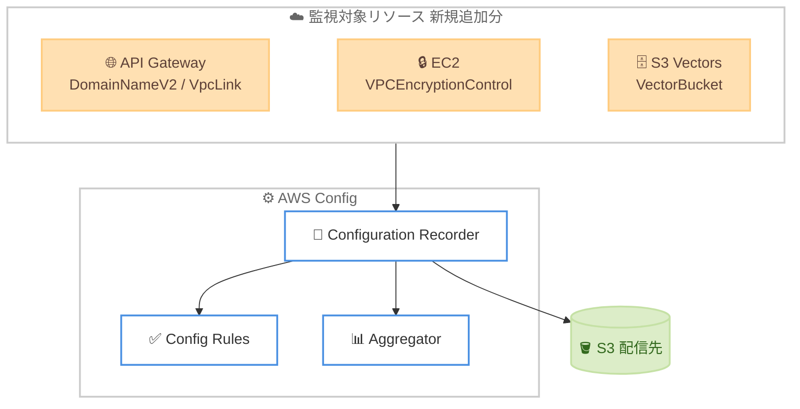

# AWS Config - 8 種類の新しいリソースタイプのサポート

**リリース日**: 2026 年 7 月 2 日
**サービス**: AWS Config
**機能**: 新規リソースタイプのサポート拡大 (8 種類追加)

📊 [このアップデートのインフォグラフィックを見る](https://takech9203.github.io/aws-news-summary/20260702-aws-config-new-resource-types.html)
<!-- INFOGRAPHIC_BASE_URL は環境変数から取得 -->

## 概要

AWS Config が、Amazon API Gateway、Amazon EC2、Amazon S3 Vectors など主要サービスにまたがる 8 種類の AWS リソースタイプに新たに対応しました。今回の拡張により、AWS 環境に対する可視性の範囲が広がり、より多くのリソースを発見、評価、監査、修復できるようになります。

すべてのリソースタイプの記録を有効にしている場合、AWS Config はこれらの新しいリソースタイプを自動的に追跡します。追加のリソースタイプは、Config ルールおよび Config アグリゲーターでも利用可能です。今回サポートされたリソースタイプは、リソースが利用可能なすべての AWS リージョンでモニタリングできます。

対象となるのは、構成管理、コンプライアンス監査、ガバナンス、変更追跡を担当する運用チームやセキュリティチームです。これまで AWS Config の対象外だったリソースについても、構成変更の履歴管理やルールベースの評価が可能になります。

**アップデート前の課題**

- 今回追加された 8 種類のリソースタイプ (API Gateway のカスタムドメイン V2、S3 Vectors のベクトルバケットなど) は AWS Config で構成情報を記録できませんでした。
- 対象外のリソースは構成変更履歴が残らず、コンプライアンス評価や変更監査の対象にできませんでした。
- Config ルールや Config アグリゲーターを使った横断的なガバナンスに、これらのリソースを組み込めませんでした。

**アップデート後の改善**

- 8 種類の新規リソースタイプについて、構成情報の記録と変更履歴の追跡が可能になりました。
- すべてのリソースタイプの記録を有効化している場合、追加設定なしで自動的に新しいリソースタイプが記録対象に含まれます。
- 新規リソースタイプが Config ルールおよびアグリゲーターに対応し、コンプライアンス評価やマルチアカウント集約の対象になりました。

## アーキテクチャ図



Configuration Recorder が新規リソースタイプの構成変更を記録し、Config ルールによる評価、アグリゲーターによる集約、S3 への配信を行う流れを示しています。

## サービスアップデートの詳細

### 主要機能

1. **8 種類の新規リソースタイプのサポート**
   - 今回追加されたリソースタイプは以下のとおりです。
   - `AWS::ApiGateway::DomainNameV2`
   - `AWS::ApiGatewayV2::VpcLink`
   - `AWS::EC2::VPCEncryptionControl`
   - `AWS::NetworkFirewall::ContainerAssociation`
   - `AWS::OpenSearchServerless::SecurityPolicy`
   - `AWS::OSIS::Pipeline`
   - `AWS::S3Vectors::VectorBucket`
   - `AWS::S3Vectors::VectorBucketPolicy`

2. **自動的な記録対象への追加**
   - すべてのリソースタイプの記録を有効化している場合、追加設定なしで新しいリソースタイプが自動的に追跡されます。
   - 特定のリソースタイプのみを記録する構成の場合は、明示的に対象へ追加することで記録できます。

3. **Config ルールとアグリゲーターへの対応**
   - 新規リソースタイプは Config ルールによるコンプライアンス評価の対象になります。
   - Config アグリゲーターを利用することで、複数アカウント・複数リージョンにまたがってこれらのリソースの構成情報を集約できます。

## 技術仕様

### 追加されたリソースタイプ一覧

| リソースタイプ | 関連サービス |
|------|------|
| `AWS::ApiGateway::DomainNameV2` | Amazon API Gateway |
| `AWS::ApiGatewayV2::VpcLink` | Amazon API Gateway (HTTP/WebSocket API) |
| `AWS::EC2::VPCEncryptionControl` | Amazon EC2 (VPC) |
| `AWS::NetworkFirewall::ContainerAssociation` | AWS Network Firewall |
| `AWS::OpenSearchServerless::SecurityPolicy` | Amazon OpenSearch Serverless |
| `AWS::OSIS::Pipeline` | Amazon OpenSearch Ingestion (OSIS) |
| `AWS::S3Vectors::VectorBucket` | Amazon S3 Vectors |
| `AWS::S3Vectors::VectorBucketPolicy` | Amazon S3 Vectors |

### 記録モードと設定例

すべてのリソースタイプを記録する構成の例です。この設定では新規リソースタイプも自動的に対象になります。

```json
{
  "ConfigurationRecorder": {
    "name": "default",
    "roleARN": "arn:aws:iam::123456789012:role/aws-service-role/config.amazonaws.com/AWSServiceRoleForConfig",
    "recordingGroup": {
      "allSupported": true,
      "includeGlobalResourceTypes": true
    }
  }
}
```

特定のリソースタイプのみを記録する場合は、`resourceTypes` に明示的に追加します。

```json
{
  "ConfigurationRecorder": {
    "name": "default",
    "recordingGroup": {
      "allSupported": false,
      "resourceTypes": [
        "AWS::S3Vectors::VectorBucket",
        "AWS::ApiGateway::DomainNameV2",
        "AWS::EC2::VPCEncryptionControl"
      ]
    }
  }
}
```

## 設定方法

### 前提条件

1. 対象リージョンで AWS Config が有効化されていること。
2. Configuration Recorder に適切な IAM ロールが設定されていること。
3. 構成スナップショットと履歴の配信先となる Amazon S3 バケットが設定されていること。

### 手順

#### ステップ1: 現在の記録設定を確認

```bash
aws configservice describe-configuration-recorders
```

現在の Configuration Recorder の設定を表示し、`allSupported` が有効か、特定リソースタイプのみを記録しているかを確認します。

#### ステップ2: 新規リソースタイプを記録対象に含める

```bash
aws configservice put-configuration-recorder \
  --configuration-recorder '{
    "name": "default",
    "roleARN": "arn:aws:iam::123456789012:role/aws-config-role",
    "recordingGroup": { "allSupported": true, "includeGlobalResourceTypes": true }
  }'
```

すべてのリソースタイプを記録する設定に更新します。この構成では、今回追加されたリソースタイプも自動的に記録対象となります。

#### ステップ3: 記録の開始と評価

```bash
aws configservice start-configuration-recorder \
  --configuration-recorder-name default
```

記録を開始します。以降、対象リソースの作成・変更・削除が構成項目として記録され、Config ルールによる評価が実行されます。

## メリット

### ビジネス面

- **ガバナンス範囲の拡大**: これまで可視化できなかったリソースを監査・コンプライアンス評価の対象に加え、統制の抜け漏れを減らせます。
- **設定変更なしでの適用**: 全リソースタイプ記録を有効にしている環境では、追加の運用負荷なしで自動的にカバレッジが広がります。
- **監査対応の効率化**: 構成変更履歴が残ることで、監査要求への証跡提供が容易になります。

### 技術面

- **構成ドリフトの検知**: 新規リソースの構成変更を継続的に記録し、意図しない変更を検知できます。
- **マルチアカウント集約**: Config アグリゲーターにより、組織全体でこれらのリソースの構成状態を一元的に把握できます。
- **ルールベースの自動評価**: Config ルールにより、暗号化やポリシー設定などの要件をリソースタイプごとに自動評価できます。

## デメリット・制約事項

### 制限事項

- 新規リソースタイプの記録は、そのリソースが利用可能なリージョンでのみ行われます。
- 構成項目の記録が増えるため、記録数に応じた料金が発生します。
- 特定リソースタイプのみを記録する構成の場合は、手動で対象へ追加しない限り記録されません。

### 考慮すべき点

- 全リソースタイプ記録を有効にしている環境では、記録される構成項目が増加し、コストが増える可能性があります。想定される増分を事前に評価してください。
- 記録対象を絞っている環境では、必要なリソースタイプを明示的に追加する運用が必要です。

## ユースケース

### ユースケース1: S3 Vectors バケットのポリシー監査

**シナリオ**: 生成 AI アプリケーションで利用する Amazon S3 Vectors のベクトルバケットについて、意図しないアクセスポリシーの変更を検知したい。

**実装例**:
```
記録対象: AWS::S3Vectors::VectorBucket, AWS::S3Vectors::VectorBucketPolicy
Config ルール: バケットポリシーがパブリックアクセスを許可していないか評価
```

**効果**: ベクトルバケットのポリシー変更が構成項目として記録され、コンプライアンス違反を早期に検知できます。

### ユースケース2: VPC 暗号化コントロールのコンプライアンス確認

**シナリオ**: 組織のセキュリティ要件として、VPC の暗号化コントロール設定の変更を追跡し、標準から逸脱していないか確認したい。

**実装例**:
```
記録対象: AWS::EC2::VPCEncryptionControl
Config アグリゲーター: 全アカウント・全リージョンの設定を集約して一覧化
```

**効果**: VPC 暗号化コントロールの構成変更履歴が残り、組織横断でのコンプライアンス状態を一元的に把握できます。

### ユースケース3: API Gateway カスタムドメインの構成管理

**シナリオ**: API Gateway のカスタムドメイン (V2) の設定変更を監査証跡として残し、変更の経緯を追跡したい。

**実装例**:
```
記録対象: AWS::ApiGateway::DomainNameV2, AWS::ApiGatewayV2::VpcLink
用途: 構成タイムラインで変更前後の設定を比較
```

**効果**: カスタムドメインや VpcLink の変更履歴を可視化し、トラブルシューティングや監査に活用できます。

## 料金

AWS Config は従量課金制で、最低料金や前払いのコミットメントはありません。今回のアップデート自体に追加料金はなく、記録される構成項目や評価の数に応じて既存の料金体系が適用されます。

### 料金例

| 項目 | 料金 (概算) |
|--------|------------------|
| 継続的な構成項目の記録 | 1 構成項目あたり 0.003 USD |
| 定期的な構成項目の記録 | 1 構成項目あたり 0.012 USD |
| Config ルールの評価 (最初の 100,000 件) | 1 評価あたり 0.001 USD |
| コンフォーマンスパックの評価 (最初の 100,000 件) | 1 評価あたり 0.001 USD |

新規リソースタイプの記録が増えると構成項目数が増加するため、記録コストにも影響します。カスタムルールや配信に伴う Amazon S3、Amazon SNS、AWS Lambda の標準料金が別途発生する場合があります。

## 利用可能リージョン

今回サポートされたリソースタイプは、対象リソースが利用可能なすべての AWS リージョンでモニタリングできます。リソースタイプごとの対応状況は、AWS Config のリソースカバレッジのドキュメントを参照してください。

## 関連サービス・機能

- **Amazon S3 Vectors**: 今回追加されたベクトルバケットおよびバケットポリシーの構成管理に対応します。
- **Amazon API Gateway**: カスタムドメイン (V2) と HTTP/WebSocket API 向けの VpcLink が記録対象になります。
- **AWS Network Firewall / Amazon OpenSearch Serverless / OpenSearch Ingestion**: ネットワークセキュリティおよび検索・データ取り込み基盤のリソースを監査対象に加えられます。

## 参考リンク

- 📊 [インフォグラフィック](https://takech9203.github.io/aws-news-summary/20260702-aws-config-new-resource-types.html)
- [公式発表 (What's New)](https://aws.amazon.com/about-aws/whats-new/2026/07/aws-config-new-resource-types)
- [AWS Config リソースカバレッジ (ドキュメント)](https://docs.aws.amazon.com/config/latest/developerguide/what-is-resource-config-coverage.html)
- [AWS Config 料金ページ](https://aws.amazon.com/config/pricing/)

## まとめ

今回のアップデートにより、AWS Config が S3 Vectors や API Gateway V2 など 8 種類のリソースタイプに新たに対応し、ガバナンスと監査の対象範囲が広がりました。全リソースタイプ記録を有効にしている環境では追加設定なしでカバレッジが拡大するため、構成項目数の増加によるコスト影響を確認しつつ、必要に応じて Config ルールでの評価を追加することを推奨します。
