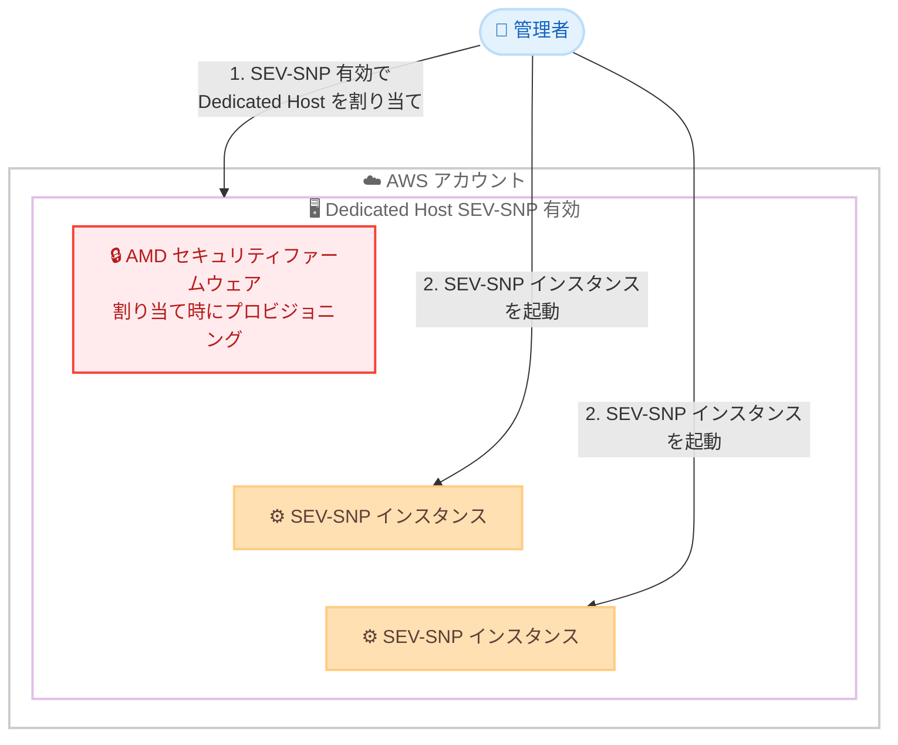

# Amazon EC2 - Dedicated Hosts での AMD SEV-SNP サポート

**リリース日**: 2026 年 7 月 2 日
**サービス**: Amazon Elastic Compute Cloud (Amazon EC2)
**機能**: Dedicated Hosts における AMD SEV-SNP サポート

📊 [このアップデートのインフォグラフィックを見る](https://takech9203.github.io/aws-news-summary/20260702-ec2-amd-sev-snp-dedicated-hosts.html)
<!-- INFOGRAPHIC_BASE_URL は環境変数から取得 -->

## 概要

Amazon EC2 は、Dedicated Hosts において AMD Secure Encrypted Virtualization-Secure Nested Paging (SEV-SNP) をサポートしたことを発表しました。これにより、お客様は自社専用の物理サーバー上で機密コンピューティング (Confidential Computing) ワークロードを実行できるようになります。

お客様は SEV-SNP を有効化した Dedicated Host を割り当て、その上で SEV-SNP インスタンスを起動できます。これにより、機密コンピューティングワークロードに対して Dedicated Hosts が提供する利点、すなわちインスタンス配置の制御や、同じ物理サーバーへ継続的にインスタンスをデプロイできるホストアフィニティを活用できます。物理ホストは割り当て時に AMD セキュリティファームウェアがプロビジョニングされるため、お客様の機密コンピューティング環境は常に最新の状態に保たれます。

これまで SEV-SNP は共有ハードウェア環境での利用が前提でしたが、今回のアップデートにより専用ハードウェアのガバナンス要件と、メモリ暗号化による機密性保護を両立できるようになりました。金融、医療、政府機関など、規制やコンプライアンス要件の厳しい業界にとって重要な選択肢となります。

**アップデート前の課題**

- 以前は SEV-SNP による機密コンピューティングを、専用の物理サーバー上で利用することができませんでした
- 以前は物理サーバーの占有 (Dedicated Hosts) と、メモリ暗号化による機密性保護を同時に満たす構成を選択できませんでした
- 以前はインスタンス配置の制御やホストアフィニティといった Dedicated Hosts の利点を、機密コンピューティングワークロードに適用できませんでした

**アップデート後の改善**

- 今回のアップデートにより、SEV-SNP を有効化した Dedicated Host を割り当て、その上で SEV-SNP インスタンスを起動できるようになりました
- 今回のアップデートにより、専用ハードウェアの占有と機密コンピューティングの両立が可能になりました
- 今回のアップデートにより、割り当て時に AMD セキュリティファームウェアが自動的にプロビジョニングされ、機密コンピューティング環境が最新に保たれるようになりました

## アーキテクチャ図



SEV-SNP を有効化した Dedicated Host を割り当てると、物理ホストに AMD セキュリティファームウェアがプロビジョニングされ、その専用サーバー上で SEV-SNP インスタンスを起動する流れを示しています。

## サービスアップデートの詳細

### 主要機能

1. **SEV-SNP 対応 Dedicated Host の割り当て**
   - SEV-SNP を有効化した状態で Dedicated Host を割り当てることが可能
   - 割り当てた専用ホスト上で SEV-SNP インスタンスを起動できる
   - 物理サーバーはお客様専用となり、他テナントとハードウェアを共有しない

2. **機密コンピューティングと専用ハードウェアの両立**
   - SEV-SNP によるメモリ暗号化とネスト化ページ保護を提供
   - Dedicated Hosts が持つインスタンス配置の制御が利用可能
   - ホストアフィニティにより、同じ物理サーバーへ継続的にインスタンスをデプロイ可能

3. **AMD セキュリティファームウェアの自動プロビジョニング**
   - Dedicated Host の割り当て時に AMD セキュリティファームウェアがプロビジョニングされる
   - これにより機密コンピューティング環境が常に最新の状態に保たれる

## 技術仕様

### AMD SEV-SNP の概要

| 項目 | 詳細 |
|------|------|
| 技術名称 | AMD Secure Encrypted Virtualization-Secure Nested Paging (SEV-SNP) |
| 保護対象 | 実行中のインスタンスのメモリ (使用中データ) |
| 主な保護機能 | メモリ暗号化とネスト化ページによる整合性保護 |
| ホスト形態 | Dedicated Hosts (お客様専用の物理サーバー) |
| ファームウェア | 割り当て時に AMD セキュリティファームウェアをプロビジョニング |

### API 変更履歴

今回のアップデートは、既存の Dedicated Hosts 関連 API (`AllocateHosts` など) の利用を前提としており、SEV-SNP に固有の新規 API メソッド追加は本レポート作成時点の awsapichanges.com では確認されていません。設定の詳細は公式ドキュメントを参照してください。

## 設定方法

### 前提条件

1. AMD インスタンスをサポートする AWS 商用リージョンを利用していること
2. SEV-SNP に対応した AMD ベースのインスタンスファミリーを選択すること
3. Dedicated Host を割り当てるための適切な IAM 権限を保持していること

### 手順

#### ステップ 1: SEV-SNP を有効化した Dedicated Host の割り当て

```bash
# SEV-SNP を有効化した Dedicated Host を割り当てる
# instance-family には対象の AMD インスタンスファミリーを指定
aws ec2 allocate-hosts \
    --instance-family <amd-instance-family> \
    --availability-zone <az> \
    --quantity 1
```

上記コマンドは、指定したアベイラビリティーゾーンに AMD インスタンスファミリー向けの Dedicated Host を割り当てます。割り当て時に AMD セキュリティファームウェアがプロビジョニングされます。実際の SEV-SNP 有効化に必要なパラメータの詳細は公式ドキュメントを確認してください。

#### ステップ 2: SEV-SNP インスタンスの起動

```bash
# 割り当てた Dedicated Host 上に SEV-SNP インスタンスを起動する
aws ec2 run-instances \
    --image-id <ami-id> \
    --instance-type <amd-instance-type> \
    --placement "Tenancy=host,HostId=<dedicated-host-id>" \
    --cpu-options "AmdSevSnp=enabled"
```

上記コマンドは、割り当て済みの Dedicated Host 上で SEV-SNP を有効化したインスタンスを起動します。`--placement` で対象のホスト ID を指定し、`--cpu-options` で SEV-SNP を有効化します。パラメータ名や指定方法は公式ドキュメントで最新情報を確認してください。

## メリット

### ビジネス面

- **コンプライアンス対応の強化**: 専用ハードウェアの占有要件と、使用中データのメモリ暗号化要件を同時に満たせるため、規制の厳しい業界での採用がしやすくなります
- **ガバナンスの向上**: インスタンス配置の制御とホストアフィニティにより、ワークロードを配置する物理サーバーを管理でき、監査要件に対応しやすくなります
- **既存投資の活用**: Dedicated Hosts の運用モデルを維持したまま機密コンピューティングを導入できるため、既存の運用プロセスを大きく変更する必要がありません

### 技術面

- **使用中データの保護**: SEV-SNP によりメモリ内のデータが暗号化され、ネスト化ページ保護によって整合性が守られます
- **専有性とアフィニティ**: 物理サーバーを占有し、同じホストへの継続的なデプロイが可能なため、ライセンス管理や配置戦略を最適化できます
- **ファームウェアの自動更新**: 割り当て時に AMD セキュリティファームウェアがプロビジョニングされ、環境を最新に保てます

## デメリット・制約事項

### 制限事項

- AMD インスタンスをサポートする AWS 商用リージョンでのみ利用可能です
- SEV-SNP に対応した AMD ベースのインスタンスファミリーを選択する必要があります
- Dedicated Hosts はお客様専用の物理サーバーであるため、共有テナンシーと比較してコスト効率が異なります

### 考慮すべき点

- SEV-SNP を利用する場合、対応するインスタンスタイプおよび AMI 要件を事前に確認する必要があります
- 機密コンピューティングの効果を最大化するには、アプリケーション側の設計やアテステーション運用も併せて検討することが望ましいです

## ユースケース

### ユースケース 1: 規制業界での機密データ処理

**シナリオ**: 金融機関が、顧客の機微な個人情報を扱うワークロードを、他テナントとハードウェアを共有しない専用環境で実行し、かつメモリ上のデータも保護したいと考えています。

**実装例**:
```
SEV-SNP 有効の Dedicated Host を割り当て、
その上で SEV-SNP インスタンスを起動して
機密データ処理アプリケーションをデプロイ
```

**効果**: 物理サーバーの占有とメモリ暗号化を両立し、厳格なコンプライアンス要件に対応できます。

### ユースケース 2: ライセンス管理と機密性の両立

**シナリオ**: ソフトウェアライセンスがソケット単位または物理コア単位で課金されるアプリケーションを、機密性を保ちながら運用したい企業があります。

**実装例**:
```
ホストアフィニティを利用して同一の Dedicated Host に
インスタンスを継続的にデプロイし、
SEV-SNP でメモリを保護
```

**効果**: 物理サーバー単位のライセンス管理を維持しつつ、使用中データの保護を実現できます。

### ユースケース 3: 政府機関向けワークロードの隔離

**シナリオ**: 政府機関向けのシステムで、物理的な隔離とデータ機密性の両方が求められています。

**実装例**:
```
専用の物理ホスト上で SEV-SNP インスタンスを起動し、
インスタンス配置を明示的に制御して
隔離要件を満たす
```

**効果**: 専用ハードウェアによる隔離と機密コンピューティングを組み合わせ、高いセキュリティ要件に対応できます。

## 料金

Dedicated Hosts の料金モデルに基づきます。SEV-SNP の有効化自体に追加料金が発生するかどうかを含め、最新の料金は EC2 Dedicated Hosts の料金ページを確認してください。Dedicated Hosts はオンデマンドおよび Dedicated Host Reservation による課金に対応しています。

## 利用可能リージョン

AMD インスタンスをサポートするすべての AWS 商用リージョンで利用可能です。

## 関連サービス・機能

- **AWS Nitro System**: EC2 の基盤となるシステムで、機密コンピューティングやインスタンスの分離を支える技術です
- **AMD SEV-SNP (共有テナンシー)**: 従来から提供されている SEV-SNP による機密コンピューティング機能で、今回のアップデートで Dedicated Hosts へ対象が拡大しました
- **AWS Key Management Service (AWS KMS)**: 保管中データや通信中データの暗号化と組み合わせ、多層的なデータ保護を実現できます

## 参考リンク

- 📊 [インフォグラフィック](https://takech9203.github.io/aws-news-summary/20260702-ec2-amd-sev-snp-dedicated-hosts.html)
- [公式発表 (What's New)](https://aws.amazon.com/about-aws/whats-new/2026/07/ec2-amd-sev-snp-dedicated-hosts)
- [Amazon EC2 Dedicated Hosts](https://aws.amazon.com/ec2/dedicated-hosts/)
- [料金ページ](https://aws.amazon.com/ec2/dedicated-hosts/pricing/)

## まとめ

このアップデートは、Dedicated Hosts の専用ハードウェアによるガバナンスと、AMD SEV-SNP による使用中データの機密性保護を両立できる点で、規制やコンプライアンス要件の厳しいワークロードにとって重要な選択肢を提供します。機密コンピューティングを検討している場合は、対象の AMD インスタンスファミリーとリージョンを確認し、公式ドキュメントを参照しながら SEV-SNP 有効の Dedicated Host の割り当てを検討してください。
