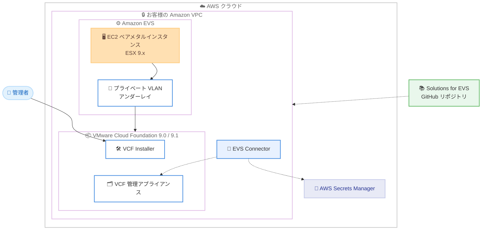

# Amazon EVS - VMware Cloud Foundation (VCF) 9.0 および 9.1 のサポート

**リリース日**: 2026 年 7 月 6 日
**サービス**: Amazon Elastic VMware Service (EVS)
**機能**: VMware Cloud Foundation (VCF) 9.0 および 9.1 のサポート

📊 [このアップデートのインフォグラフィックを見る](https://takech9203.github.io/aws-news-summary/20260706-amazon-evs-vcf9.html)
<!-- INFOGRAPHIC_BASE_URL は環境変数から取得 -->

## 概要

Amazon Elastic VMware Service (EVS) が、VMware Cloud Foundation (VCF) 9.0 および 9.1 のサポートを開始しました。Amazon EVS は、最新の VCF ソフトウェアをお客様の Amazon VPC 内の EC2 ベアメタルインスタンス上で直接実行できるサービスです。今回のアップデートにより、お客様は VCF 9.0 および 9.1 で稼働する VMware 仮想化ソリューションのインストール、運用、管理を完全に制御できるようになりました。

VCF 9.x では、AWS のインフラストラクチャのプロビジョニングと VCF ソフトウェア自体が分離されます。Amazon EVS が ESX 9.x を実行する EC2 ベアメタルインスタンスをお客様の VPC にデプロイし、VCF デプロイメントの基盤となるプライベート VLAN と接続します。お客様は Broadcom の VCF Installer をダウンロードしてデプロイし、Broadcom のネイティブなワークフローを通じてインストールを完了します。これにより、既存のデータセンターのツール、プロセス、スキルをそのまま再利用できます。

あわせて、Solutions for EVS GitHub リポジトリ (https://github.com/aws/solutions-for-amazon-evs) も公開されました。このリポジトリには、環境構築を迅速に開始するためのサンプル、テンプレート、Infrastructure as Code (IaC) のアーティファクトが含まれています。本機能は Amazon EVS が提供されているすべてのリージョンで利用可能です。

**アップデート前の課題**

- 以前は最新の VCF 9.x ソフトウェアが Amazon EVS 上でサポートされておらず、オンプレミスと同一の最新バージョンを AWS 上で稼働できなかった
- 以前は EVS 環境の構築を迅速に開始するための公式なテンプレートや IaC のサンプルが提供されていなかった
- 以前は VCF のバージョン差異により、移行元と移行先でアーキテクチャが異なり、大規模移行が複雑になる場合があった

**アップデート後の改善**

- 今回のアップデートにより、VCF 9.0 および 9.1 を Amazon EVS 上で実行し、オンプレミスと同じ最新ソフトウェアを AWS 上で稼働できるようになった
- 今回のアップデートにより、Solutions for EVS GitHub リポジトリのサンプルや IaC アーティファクトを活用して環境構築を迅速に開始できるようになった
- 今回のアップデートにより、オンプレミスと同じ方法で VCF をデプロイ、運用できるため、移行元と移行先のアーキテクチャの差異を最小化し、大規模移行を簡素化、加速できるようになった

## アーキテクチャ図

Amazon EVS が ESX 9.x を実行する EC2 ベアメタルインスタンスをお客様の VPC にデプロイし、プライベート VLAN を基盤として VCF 9.0 / 9.1 をお客様自身がインストール、運用する構成を示しています。

## サービスアップデートの詳細

### 主要機能

1. **VCF 9.0 および 9.1 のサポート**
   - 最新の VCF ソフトウェアをお客様の Amazon VPC 内の EC2 ベアメタルインスタンス上で直接実行
   - インストール、運用、管理をお客様が完全に制御
   - 既存のデータセンターのツール、プロセス、スキルを再利用可能
   - お客様自身による自己管理、または AWS パートナーとの協業のいずれも選択可能

2. **評価モード (Evaluation mode)**
   - ライセンスキーを事前に用意することなく EVS 環境を構築し、VCF のデプロイを開始可能
   - 本番適用前に設計の検証やテストを実施できる
   - 評価モードを超えて利用する場合のサブスクリプションの適用はお客様の責任範囲

3. **Solutions for EVS GitHub リポジトリの公開**
   - 環境構築を迅速に開始するためのサンプル、テンプレート、IaC アーティファクトを提供
   - AWS CloudFormation や HashiCorp Terraform などのツールに対応
   - 今後、リファレンスアーキテクチャや AWS ネイティブサービスとの統合を拡充予定

4. **EVS Connector**
   - EVS から VCF 管理アプライアンスへの永続的かつ認証された接続を提供
   - 認証情報は AWS Secrets Manager に保存
   - 環境の状態を監視し、使用状況をレポート (運用パスには介在しない)

## 技術仕様

### アーキテクチャ構成

| 項目 | 詳細 |
|------|------|
| コンピュート基盤 | EC2 ベアメタルインスタンス (ESX 9.x を実行) |
| デプロイ先 | お客様の Amazon VPC |
| ネットワーク | プライベート VLAN (VCF デプロイメントのアンダーレイ) |
| サポート VCF バージョン | VCF 9.0 および 9.1 |
| インストーラー | Broadcom VCF Installer (お客様がダウンロードしてデプロイ) |
| IaC 対応 | AWS CloudFormation、HashiCorp Terraform |

### API 変更履歴

今回のアップデートに関連する awsapichanges.com への API 変更の登録は確認されませんでした。

## 設定方法

### 前提条件

1. Amazon EVS が利用可能なリージョンの AWS アカウント
2. EC2 ベアメタルインスタンスをデプロイするための Amazon VPC
3. Broadcom の VCF Installer および VCF 9.0 / 9.1 のライセンス (評価モードの場合は事前のライセンスキーは不要)

### 手順

#### ステップ 1: EVS 環境の作成

Amazon EVS が ESX 9.x を実行する EC2 ベアメタルインスタンスをお客様の VPC にデプロイし、VCF デプロイメントの基盤となるプライベート VLAN を構成します。評価モードを利用する場合は、ライセンスキーを用意せずに環境構築を開始できます。

#### ステップ 2: VCF Installer による VCF のインストール

Broadcom の VCF Installer をダウンロードしてデプロイし、Broadcom のネイティブなワークフローに従って VCF 9.0 / 9.1 のインストールを完了します。オンプレミスと同じ手順で構築できるため、既存のスキルをそのまま活用できます。

#### ステップ 3: Solutions for EVS の活用と運用開始

Solutions for EVS GitHub リポジトリのテンプレートや IaC アーティファクトを利用して構成を標準化、自動化します。EVS Connector を設定することで、AWS Secrets Manager に保存された認証情報を用いて環境の状態監視や使用状況のレポートが可能になります。

## メリット

### ビジネス面

- **迅速なクラウド移行**: データセンターの契約期限やインフラのリフレッシュサイクルなど、時間的制約のあるニーズに対して、クラウドへの最速級の移行手段を提供
- **既存資産の活用**: 既存のデータセンターのツール、プロセス、スキルを再利用でき、再教育コストを抑制
- **柔軟な運用体制**: 自己管理と AWS パートナーとの協業のいずれも選択可能

### 技術面

- **最新 VCF の利用**: オンプレミスと同じ最新の VCF 9.0 / 9.1 を AWS 上で稼働
- **移行の簡素化**: 移行元と移行先のアーキテクチャの差異を最小化し、大規模移行を簡素化、加速
- **迅速な立ち上げ**: Solutions for EVS の IaC アーティファクトにより環境構築を効率化

## デメリット・制約事項

### 制限事項

- VCF ソフトウェアのインストール、運用、管理はお客様の責任範囲となる (フルマネージドサービスではない)
- 評価モードを超えて利用する場合、VCF のサブスクリプション適用はお客様の責任
- VCF Installer や VCF のライセンスは Broadcom から別途調達する必要がある

### 考慮すべき点

- EC2 ベアメタルインスタンスを利用するため、インスタンスの選定とコスト見積もりが必要
- VCF 9.x の運用には VMware に関する専門知識が求められる
- 既存の VCF バージョンからの移行時は、対象バージョンとの互換性を事前に確認することが望ましい

## ユースケース

### ユースケース 1: データセンター契約期限に伴う移行

**シナリオ**: オンプレミスのデータセンター契約が期限を迎える企業が、短期間で VMware ワークロードをクラウドへ移行したい。

**効果**: オンプレミスと同じ方法で VCF をデプロイ、運用できるため、アーキテクチャの差異を最小化し、期限内に迅速な移行を実現できます。

### ユースケース 2: 最新 VCF 環境の検証

**シナリオ**: 本番導入前に VCF 9.1 の新機能や設計を評価したい。

**効果**: 評価モードを利用することで、ライセンスキーを事前に用意せずに EVS 環境を構築し、設計の検証やテストを実施できます。

### ユースケース 3: IaC による標準化されたデプロイ

**シナリオ**: 複数の環境で一貫した EVS / VCF 構成を再現可能な形で展開したい。

**効果**: Solutions for EVS GitHub リポジトリの CloudFormation や Terraform のアーティファクトを利用し、環境構築を自動化、標準化できます。

## 料金

Amazon EVS の利用料金は EC2 ベアメタルインスタンスなどの AWS リソース使用量に基づきます。VCF ソフトウェアのライセンス (サブスクリプション) は Broadcom から別途調達する必要があります。詳細な料金は Amazon EVS の製品ページおよび料金ページを参照してください。

## 利用可能リージョン

Amazon EVS が提供されているすべてのリージョンで利用可能です。

## 関連サービス・機能

- **Amazon EC2 (ベアメタルインスタンス)**: ESX 9.x を実行する VCF の基盤となるコンピュートリソース
- **Amazon VPC**: EVS 環境がデプロイされるネットワーク境界
- **AWS Secrets Manager**: EVS Connector が VCF 管理アプライアンスへ接続する際の認証情報を保存
- **AWS CloudFormation / HashiCorp Terraform**: Solutions for EVS の IaC アーティファクトで利用

## 参考リンク

- 📊 [インフォグラフィック](https://takech9203.github.io/aws-news-summary/20260706-amazon-evs-vcf9.html)
- [公式発表 (What's New)](https://aws.amazon.com/about-aws/whats-new/2026/07/amazon-evs-vcf9)
- [AWS Blog](https://aws.amazon.com/blogs/migration-and-modernization/vmware-cloud-foundation-vcf-9-0-and-9-1-on-amazon-evs/)
- [Solutions for EVS GitHub リポジトリ](https://github.com/aws/solutions-for-amazon-evs)
- [Amazon EVS 製品ページ](https://aws.amazon.com/evs/)
- [ドキュメント (ユーザーガイド)](https://docs.aws.amazon.com/evs/latest/userguide/what-is-evs.html)

## まとめ

Amazon EVS が VCF 9.0 および 9.1 をサポートしたことで、オンプレミスと同じ最新の VMware Cloud Foundation を AWS 上で完全に制御しながら運用できるようになりました。評価モードや Solutions for EVS GitHub リポジトリの提供により、環境構築の検証と迅速な立ち上げが容易になっています。VMware ワークロードのクラウド移行を検討しているお客様は、まず評価モードで設計を検証し、Solutions for EVS の IaC アーティファクトを活用して展開を進めることをおすすめします。
