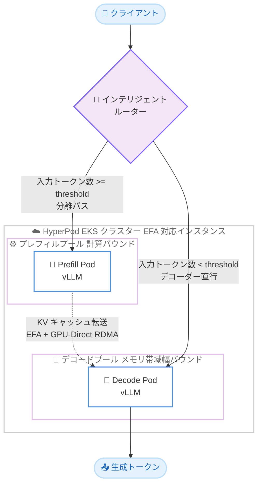

# Amazon SageMaker HyperPod - Disaggregated Prefill and Decode (DPD)

**リリース日**: 2026 年 7 月 6 日
**サービス**: Amazon SageMaker HyperPod
**機能**: Disaggregated Prefill and Decode (DPD)

📊 [このアップデートのインフォグラフィックを見る](https://takech9203.github.io/aws-news-summary/20260706-amazon-sagemaker-hyperpod-dpd.html)
<!-- INFOGRAPHIC_BASE_URL は環境変数から取得 -->

## 概要

Amazon SageMaker HyperPod が、大規模言語モデル (LLM) の推論最適化技術である Disaggregated Prefill and Decode (DPD) をサポートしました。DPD は、LLM 推論を構成する 2 つのフェーズであるプレフィル (prefill) とデコード (decode) を、それぞれ専用の GPU プールに分離して実行します。両フェーズ間の Key-Value (KV) キャッシュの受け渡しは、Elastic Fabric Adapter (EFA) 上で GPU-Direct RDMA (Remote Direct Memory Access) を用いて行われます。

LLM 推論には特性の異なる 2 つのフェーズがあります。プレフィルは入力プロンプト全体を一括処理する計算バウンド (compute-bound) な処理であり、デコードはトークンを 1 つずつ生成するメモリ帯域幅バウンド (memory-bandwidth-bound) な処理です。DPD では、計算バウンドなプレフィルを 1 つの GPU グループで、メモリ帯域幅バウンドなデコードを別の GPU グループで実行することで、両フェーズがリソースを奪い合う状況を解消します。インテリジェントルーターが、ロングコンテキストのリクエストを分離パスへ自動的に振り分け、短いプロンプトはデコーダーに直接送ることで、不要な転送オーバーヘッドを回避します。

DPD は、チャットアシスタント、エージェンティックパイプライン、RAG、長文ドキュメント分析といった本番 LLM ワークロードにおいて、安定したレイテンシーと予測可能なスループットを実現します。HyperPod Inference Operator の `InferenceEndpointConfig` カスタムリソースに `pdSpec` セクションを追加するだけで有効化でき、既存の KV キャッシュオフローディングやインテリジェントルーティング機能と組み合わせて利用できます。

**アップデート前の課題**

- プレフィルとデコードを同一 GPU で同居 (colocated) 実行していたため、1 件のロングコンテキストリクエストが、並行する他の全リクエストのトークン生成を停滞させることがあった
- フェーズ間の干渉によって、負荷が高い状況下でトークンごとのレイテンシーが悪化していた
- 一方のフェーズを保護するために、もう一方のフェーズを過剰にプロビジョニングする必要があった
- プレフィルとデコードの容量を、ワークロードの入出力分布に合わせて独立にスケールできなかった

**アップデート後の改善**

- 今回のアップデートにより、計算バウンドなプレフィルとメモリ帯域幅バウンドなデコードを別々の GPU プールで実行でき、フェーズ間の干渉が解消された
- 今回のアップデートにより、混在トラフィック下でもトークンごとのレイテンシーがより予測可能になり、厳格なレイテンシー SLO 下での goodput が向上した
- 今回のアップデートにより、プレフィルとデコードの容量を独立してスケールできるようになった
- 今回のアップデートにより、`pdSpec` セクションを追加するだけで既存の推論エンドポイント構成から DPD を有効化できるようになった

## アーキテクチャ図



インテリジェントルーターが入力トークン数を `routingThreshold` と比較し、閾値以上のロングコンテキストリクエストはプレフィルプールを経由させ、KV キャッシュを EFA + GPU-Direct RDMA でデコードプールへ転送します。閾値未満の短いリクエストはプレフィルを省略してデコーダーへ直接送られます。

## サービスアップデートの詳細

### 主要機能

1. **プレフィルとデコードの物理的な分離**
   - LLM 推論の 2 フェーズを専用の GPU プールに分離して実行する
   - 計算バウンドなプレフィルとメモリ帯域幅バウンドなデコードがリソースを奪い合わなくなる
   - Inference Operator が、ルーターのプロビジョニング、LMCache と NIXL を用いたプレフィル/デコード Pod の連携、HyperPod オブザーバビリティとの統合を自動的にオーケストレーションする

2. **EFA + GPU-Direct RDMA による KV キャッシュ転送**
   - プレフィルで計算した KV キャッシュを、EFA 上の GPU-Direct RDMA を使ってデコード側の GPU へ直接転送する
   - NIXL チャネルを介して転送され、デコーダー側では再計算が不要になる
   - Llama 70B (TP=8) の場合、6,000 トークンのプロンプトの KV キャッシュは 1 ランクあたり約 0.23 GB

3. **インテリジェントルーターによる条件付きルーティング**
   - 入力トークン数が `routingThreshold` (デフォルト 4,096) 以上のリクエストのみを分離パスへ振り分ける
   - 閾値未満の短いプロンプトはプレフィラーをバイパスし、デコーダーへ直接送られるため、短いプロンプトでの転送オーバーヘッドを回避する
   - ルーティング戦略として `prefixaware` (デフォルト) と `roundrobin` を選択可能

4. **独立したスケーリングと既存機能との組み合わせ**
   - `prefillSpec.replicas` と `decodingSpec.replicas` により、プレフィルとデコードの容量を独立してスケールできる
   - KV キャッシュオフローディング (L1 キャッシュ) やインテリジェントルーティングと組み合わせて利用可能

## 技術仕様

### DPD が効果を発揮する条件

| 項目 | 詳細 |
|------|------|
| モデルサイズ | 70B 以上の大規模 Dense モデル (例: Llama 3.3 70B) |
| 入力長 | 4,000 トークン以上の長い入力 |
| 同時実行性 | 秒間 2 リクエスト以上の継続的な同時実行 |
| 出力長 | 256 トークン以上の中〜長い出力 |

入力が短い、同時実行性が低い、または小規模モデルを使用するワークロードの場合は、標準の同居 (colocated) デプロイの方がシンプルで良好に動作します。

### サポート対象インスタンスタイプ

DPD には GPU-Direct RDMA をサポートする EFA 対応インスタンスが必要です。以下のインスタンスタイプがサポートされます。

| インスタンスタイプ | 備考 |
|------|------|
| ml.p5.48xlarge | パフォーマンス検証済み (Llama 3.3 70B) |
| ml.p5e.48xlarge | EFA 対応 |
| ml.p5en.48xlarge | EFA 対応 |
| ml.p6-b200.48xlarge | EFA 対応 |
| ml.p6-b300.48xlarge | EFA 対応 |

### API 変更履歴

今回のアップデートは、HyperPod Inference Operator の Kubernetes カスタムリソース (`InferenceEndpointConfig`) の拡張によって提供されます。AWS SDK/API レベルの新規メソッド追加を伴うものではないため、awsapichanges.com 上での該当する API 変更はありません。

### pdSpec の設定例

```yaml
pdSpec:
  prefillSpec:
    replicas: 1
    resources:
      limits:
        nvidia.com/gpu: "8"
      requests:
        nvidia.com/gpu: "8"
    args:
      - "--gpu-memory-utilization"
      - "0.75"
  decodingSpec:
    replicas: 1
    resources:
      limits:
        nvidia.com/gpu: "8"
      requests:
        nvidia.com/gpu: "8"
  routingThreshold: 4096
```

## 設定方法

### 前提条件

1. AWS Command Line Interface (AWS CLI) がセットアップされていること
2. kubectl 経由で HyperPod Amazon EKS クラスターにアクセスできること
3. モデルチェックポイントへの読み取りアクセスが可能な Hugging Face トークン (モデルが Amazon S3 バケットにある場合は不要)
4. vLLM、LMCache、NVIDIA NIXL、EFA libfabric プロバイダーを含むワーカーイメージ (DLC: `public.ecr.aws/deep-learning-containers/vllm:server-hyperpod-cuda-v1.1` など。LMCache 0.4.3、vLLM 0.19.0、NIXL 1.0.0 を含む)
5. HyperPod Inference Operator バージョン 3.2 以降がインストールされていること (新規作成の HyperPod EKS クラスターにはデフォルトでインストール済み)

### 手順

#### ステップ 1: Inference Operator のバージョン確認

```bash
kubectl get deployment hyperpod-inference-operator-controller-manager \
  -n hyperpod-inference-system \
  -o jsonpath='{.spec.template.spec.containers[?(@.name=="manager")].image}{"\n"}'
```

このコマンドは、インストールされている HyperPod Inference Operator のイメージバージョンを取得します。DPD にはバージョン 3.2 以降が必要です。

#### ステップ 2: pdSpec を含むマニフェストの適用

```bash
kubectl apply -f inference_endpoint_dpd_config.yaml
```

`InferenceEndpointConfig` マニフェストに `pdSpec` セクションを追加して適用します。`pdSpec` が存在することで、Operator がプレフィル用とデコード用の別々の Deployment を作成し、ルーターと LMCache PD バックエンドを介して連携させます。

#### ステップ 3: デプロイの検証

```bash
kubectl get pods -A | grep -E "prefill-|decode-|router"
```

プレフィル Pod、デコード Pod、ルーター Pod が `Running` 状態であることを確認します。さらに、プレフィラーが `sender`、デコーダーが `receiver` の役割を報告していることを確認することで、DPD が正しく配線されているかを検証できます。ロングプロンプトを送信した後、デコーダーのログで `Retrieved N out of N required tokens` を確認すると、KV キャッシュが NIXL チャネル経由で正しく転送されたことを確認できます。

## メリット

### ビジネス面

- **予測可能なユーザー体験**: 混在トラフィック下でもトークンごとのレイテンシーが安定し、チャットアシスタントなどでユーザー体験が向上する
- **SLO 遵守とコスト効率**: 厳格なレイテンシー SLO 下での goodput が向上し、過剰プロビジョニングを削減できる
- **既存構成からの容易な移行**: 既存の `InferenceEndpointConfig` に `pdSpec` を追加するだけで有効化でき、導入の障壁が低い

### 技術面

- **リソース干渉の解消**: 計算バウンドなプレフィルとメモリ帯域幅バウンドなデコードを分離し、フェーズ間の干渉をなくす
- **独立したスケーリング**: プレフィルとデコードの容量を、ワークロードの入出力分布に合わせて個別に調整できる
- **高速な KV キャッシュ転送**: EFA + GPU-Direct RDMA により、GPU プール間で低レイテンシー・高スループットの KV キャッシュ転送を実現する
- **自動オーケストレーション**: Operator がルーターのプロビジョニングや Pod 間の配線を自動化する

## デメリット・制約事項

### 制限事項

- DPD は 70B 以上の Dense モデルで推奨される。小規模モデルや Mixture-of-Experts (MoE) モデルは通常、分離の恩恵を受けない
- 現行リリースでは、1 エンドポイントあたり単一のデコードデプロイメントのみをサポートする (複数デコードデプロイメントのサポートは将来のリリースで予定)
- パフォーマンスは ml.p5.48xlarge 上の Llama 3.3 70B で、最大 64 同時リクエストまで検証済み
- GPU-Direct RDMA をサポートする特定の EFA 対応インスタンスタイプに限定される

### 考慮すべき点

- 入力が短い、同時実行性が低い、小規模モデルを使用するワークロードでは、標準の同居デプロイの方がシンプルで適している
- `PD_BUFFER_SIZE` (デフォルト 8 GiB) がデコーダーの KV 転送バッファ容量を超えると、レイテンシースパイクが発生するため、必要に応じて 16/32 GiB への増加やデコードレプリカのスケールを検討する
- `PYTHONHASHSEED` を固定しないと、同一プロンプトのキャッシュキーがプレフィラーとデコーダーで一致せず、キャッシュミスが発生する
- DPD から標準の同居デプロイに戻すには、`pdSpec` を含まない新しい `InferenceEndpointConfig` を適用する

## ユースケース

### ユースケース 1: 長文ドキュメント分析サービス

**シナリオ**: 数千トークンに及ぶ契約書や技術文書を Llama 3.3 70B で要約・分析する SaaS。長い入力が多く、同時に複数のリクエストが継続的に発生する。

**実装例**:
```yaml
pdSpec:
  prefillSpec:
    replicas: 2
  decodingSpec:
    replicas: 1
  routingThreshold: 4096
```

**効果**: プレフィルレプリカを増やすことでプレフィルキューの滞留を解消し、長い入力に対する Time to First Token (TTFT) を改善しつつ、デコードのトークンごとのレイテンシーを安定させる。

### ユースケース 2: 高並行のチャットアシスタント

**シナリオ**: 多数のユーザーが同時にアクセスするチャットアシスタント。システムプロンプトやチャット履歴が共通するリクエストが多い。

**実装例**:
```yaml
intelligentRoutingSpec:
  enabled: true
  routingStrategy: prefixaware
kvCacheSpec:
  enableL1Cache: true
```

**効果**: `prefixaware` ルーティングと L1 KV キャッシュにより、共通プレフィックスのキャッシュヒット率を最大化し、レスポンスを高速化する。ロングコンテキストのリクエストが他ユーザーのトークン生成を停滞させる問題も解消される。

### ユースケース 3: RAG / エージェンティックパイプライン

**シナリオ**: 検索結果や複数のツール出力を大量のコンテキストとして LLM に渡す RAG やエージェントワークフロー。入力長のばらつきが大きい。

**実装例**:
```yaml
pdSpec:
  routingThreshold: 4096
environmentVariables:
  - name: PD_BUFFER_SIZE
    value: "17179869184"
```

**効果**: 長いコンテキストのリクエストのみを DPD パスに振り分け、短いリクエストはデコーダー直行で処理することで、全体のスループットとレイテンシーのバランスを最適化する。バッファサイズを 16 GiB に拡大し、同時 KV 転送のスパイクにも対応する。

## 料金

DPD の利用自体に追加料金は発生しません。SageMaker HyperPod の通常の料金体系に従い、使用する EFA 対応インスタンス (ml.p5.48xlarge、ml.p6-b200.48xlarge など) の稼働時間に対して課金されます。DPD ではプレフィルとデコードを別々の GPU プールで実行するため、両フェーズに必要なインスタンス数の合計がコストに影響します。最新かつ正確な料金は、AWS 公式の料金ページを参照してください。

## 利用可能リージョン

Amazon SageMaker HyperPod が利用可能なすべての AWS リージョンで、EKS オーケストレーターを使用する HyperPod クラスターの EFA 対応インスタンスタイプ上で利用できます。

## 関連サービス・機能

- **Amazon EKS**: DPD は EKS オーケストレーターを使用する HyperPod クラスター上で動作し、`InferenceEndpointConfig` カスタムリソースで構成する
- **Elastic Fabric Adapter (EFA)**: GPU-Direct RDMA による KV キャッシュの高速転送に使用されるネットワークインターフェイス
- **vLLM / LMCache / NVIDIA NIXL**: プレフィル/デコード Pod の推論エンジンと KV キャッシュ連携を担うコンポーネント
- **HyperPod オブザーバビリティ**: E2E TTFT、KV Transfer Time、DPD Routing Counts などの DPD 固有メトリクスをダッシュボードで可視化

## 参考リンク

- 📊 [インフォグラフィック](https://takech9203.github.io/aws-news-summary/20260706-amazon-sagemaker-hyperpod-dpd.html)
- [公式発表 (What's New)](https://aws.amazon.com/about-aws/whats-new/2026/7/amazon-sagemaker-hyperpod-dpd/)
- [ドキュメント (Disaggregated Prefill and Decode for HyperPod inference)](https://docs.aws.amazon.com/sagemaker/latest/dg/sagemaker-hyperpod-model-deployment-dpd.html)
- [SageMaker HyperPod 料金ページ](https://aws.amazon.com/sagemaker/ai/pricing/)

## まとめ

Disaggregated Prefill and Decode (DPD) は、大規模 LLM の本番推論において、フェーズ間干渉を解消し、安定したレイテンシーと高い goodput を実現する重要な最適化技術です。70B 以上の Dense モデルで長い入力・高い同時実行性を持つワークロードを HyperPod で運用している場合は、既存の `InferenceEndpointConfig` に `pdSpec` を追加して DPD を検証し、実際のワークロードの入出力分布に合わせて `routingThreshold` やレプリカ数をチューニングすることを推奨します。
