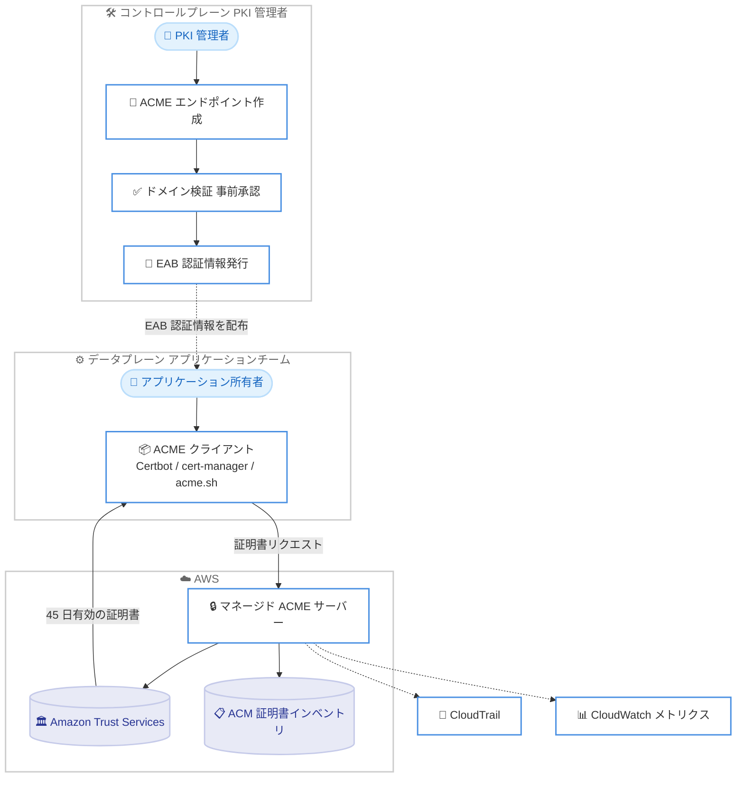

# AWS Certificate Manager - ACME プロトコルによるパブリック証明書の自動発行

**リリース日**: 2026 年 7 月 6 日
**サービス**: AWS Certificate Manager (ACM)
**機能**: パブリック証明書向け ACME プロトコルサポート

📊 [このアップデートのインフォグラフィックを見る](https://takech9203.github.io/aws-news-summary/20260706-aws-certificate-manager-acme.html)
<!-- INFOGRAPHIC_BASE_URL は環境変数から取得 -->

## 概要

AWS Certificate Manager (ACM) が、ACME (Automated Certificate Management Environment) プロトコルに対応しました。この機能により、フルマネージドの ACME サーバーエンドポイントをプロビジョニングし、Amazon Trust Services から有効期間 45 日のパブリック TLS 証明書を発行できるようになりました。Certbot、Kubernetes 向けの cert-manager、acme.sh など、ACMEv2 互換のクライアントであればどれでも利用できます。

ACME は RFC 8555 で定義されたインターネット標準プロトコルで、マシン間通信によって証明書の発行とライフサイクル管理を自動化します。今回のアップデートにより、オンプレミスサーバー、Kubernetes クラスター、ハイブリッド環境など、お客様が管理するインフラストラクチャに対して、公的に信頼される証明書を業界標準の方法で発行できるようになりました。

このアップデートは、CA/Browser Forum が 2029 年初頭までにパブリック証明書の最大有効期間を 47 日に短縮することを義務付けている業界動向に対応するものです。有効期間の短縮により手動での証明書管理が現実的でなくなるなか、ACME による自動更新が重要性を増しています。PKI 管理者は、ドメインスコープの定義、ワイルドカード利用のポリシー適用、DNS 認証情報を配布せずにアプリケーションチームへ証明書リクエストを委任するといった、一元化されたガバナンス管理を実現できます。

**アップデート前の課題**

- パブリック証明書の自動発行には、AWS SDK に依存する `RequestCertificate` API を使用する必要があり、業界標準の ACME クライアントをそのまま利用できなかった
- お客様が管理するインフラストラクチャ (オンプレミス、Kubernetes、ハイブリッド環境) で ACM のパブリック証明書を活用する際、証明書のライフサイクル自動化が難しかった
- コンプライアンス要件などにより秘密鍵を自社システム内で保持したい場合、ACM 統合サービス以外で証明書を運用する仕組みが限られていた
- アプリケーションチームに証明書発行を委任する際、DNS 認証情報の配布が必要になり、ガバナンス統制が難しかった

**アップデート後の改善**

- Certbot、cert-manager、acme.sh などの標準 ACME クライアントを使用して、パブリック証明書の発行と更新を自動化できるようになった
- 秘密鍵は ACME クライアント側で生成・保持され、ACM が秘密鍵を一切参照しないため、コンプライアンス要件を満たしやすくなった
- PKI 管理者がドメイン検証を事前に 1 回実施しておけば、アプリケーションチームは DNS 認証情報なしで証明書をリクエストできるようになった
- ドメインスコープやワイルドカードポリシーによる一元的なガバナンス管理と、CloudTrail ログおよび CloudWatch メトリクスによる可視化が可能になった

## アーキテクチャ図



ACME サポートは、エンドポイントの作成やドメイン検証を行うコントロールプレーンと、ACME クライアントが実際に証明書を発行するデータプレーンに分離されており、管理責任と発行操作を明確に分けることができます。

## サービスアップデートの詳細

### 主要機能

1. **マネージド ACME エンドポイント**
   - お客様専用の一意な URL を持つ、RFC 8555 準拠のマネージド ACME サーバーをプロビジョニングする
   - ディレクトリ URL の形式は `https://acm-acme-enroll.{region}.api.aws/{endpoint-id}/directory`
   - エンドポイントは `PublicCertificateAuthority` を指定して、Amazon Trust Services からの公的に信頼される証明書発行を有効化する
   - 許可する鍵アルゴリズム (ECDSA P-256、RSA 2048、ECDSA P-384) を制限できる

2. **事前承認方式のドメイン検証**
   - PKI 管理者が事前にドメインを検証する永続的なリソースとして構成する
   - 検証は標準の ACM DNS 検証と同じ CNAME レコード方式を使用し、CNAME により継続的な検証を ACM に委任する
   - ドメインスコープを `ExactDomain`、`Subdomains`、`Wildcards` の 3 つの独立した設定で制御できる
   - アプリケーション所有者はドメイン検証を自ら行うことなく証明書をリクエストできる

3. **外部アカウントバインディング (EAB) による委任**
   - ACME クライアントがエンドポイントにアカウント登録する際の認証情報を発行する
   - 各 EAB は IAM ロールに関連付けられ、`acm:RequestCertificate` や `acm:RevokeCertificate` の権限で発行操作を制御する
   - Key ID と MAC キーが生成され、ACME クライアントの `kid` と `hmacKey` として使用する
   - EAB には有効期限 (MINUTES / HOURS / DAYS) を任意で設定できる

4. **監査と可視化**
   - すべての発行・失効操作が AWS CloudTrail に記録される
   - `AWS/CertificateManager` 名前空間に `CertificateIssuanceSuccess` と `CertificateIssuanceFailed` メトリクスを発行する
   - ACM コンソールの Monitoring タブや Certificates ダッシュボードで発行状況を確認できる
   - AWS Organizations の Service Control Policy (SCP) が発行時に適用される

## 技術仕様

### ACME 証明書の特性

| 項目 | 詳細 |
|------|------|
| 発行元 CA | Amazon Trust Services (公的に信頼される Web PKI 証明書) |
| 有効期間 | 45 日 (標準の ACM パブリック証明書より短い) |
| 秘密鍵 | ACME クライアント側で生成・保持され、ACM は参照しない |
| 更新 | ACME クライアントが有効期限前に新しい証明書をリクエスト (ACM マネージド更新は非対応) |
| 失効 | ACME エンドポイントの `revoke-cert` URL を通じてクライアントが実行 |
| 削除 | 有効期限切れ後、ACM が 1 年で自動削除 (`DeleteCertificate` でも削除可能) |
| 鍵ペア出所 | `CertificateKeyPairOrigin` が `ACME` として識別される |

### ドメイン検証スコープの組み合わせ

| DomainName | ExactDomain | Subdomains | Wildcards | 発行可能な証明書 |
|------------|-------------|------------|-----------|------------------|
| example.com | ENABLED | DISABLED | DISABLED | example.com のみ |
| example.com | DISABLED | ENABLED | DISABLED | sub.example.com、api.example.com など |
| example.com | DISABLED | DISABLED | ENABLED | *.example.com のみ |
| example.com | ENABLED | ENABLED | ENABLED | example.com、任意のサブドメイン、*.example.com |

### ACME で利用できない ACM API

ACME で発行した証明書に対しては、以下の ACM API はサポートされません。ライフサイクルは ACME クライアントが管理します。

- `ExportCertificate`
- `RevokeCertificate`
- `RenewCertificate`
- `ResendValidationEmail`

### EAB 用 IAM ロールの信頼ポリシー例

```json
{
    "Version": "2012-10-17",
    "Statement": [
        {
            "Effect": "Allow",
            "Principal": {
                "Service": "acm-acme.amazonaws.com"
            },
            "Action": [
                "sts:AssumeRole",
                "sts:TagSession",
                "sts:SetSourceIdentity"
            ],
            "Condition": {
                "StringLike": {
                    "sts:SourceIdentity": "acm-acme-*"
                }
            }
        }
    ]
}
```

## 設定方法

### 前提条件

1. ACME エンドポイントを作成・管理する PKI 管理者の IAM 権限
2. 証明書発行を許可する IAM ロール (`acm:RequestCertificate` 権限と上記の信頼ポリシー)。EAB 作成者には `iam:PassRole` 権限が必要
3. 検証対象ドメインの DNS レコードを操作できる権限 (Route 53 を利用する場合はホストゾーン ID)

### 手順

#### ステップ 1: ACME エンドポイントの作成

```bash
aws acm create-acme-endpoint \
    --authorization-behavior PRE_APPROVED \
    --contact REQUIRED \
    --certificate-authority '{
        "PublicCertificateAuthority": {
            "AllowedKeyAlgorithms": ["RSA_2048", "EC_prime256v1", "EC_secp384r1"]
        }
    }'
```

PKI 管理者が事前承認方式 (`PRE_APPROVED`) のマネージド ACME エンドポイントを作成します。レスポンスに含まれる `AcmeEndpointArn` を後続の操作で使用します。`describe-acme-endpoint` を実行すると、ACME クライアントに渡すディレクトリ URL (`EndpointUrl`) を取得できます。

#### ステップ 2: ドメイン検証の事前承認

```bash
aws acm create-acme-domain-validation \
    --acme-endpoint-arn arn:aws:acm:region:111122223333:acme-endpoint/00000000-0000-0000-0000-000000000000 \
    --domain-name example.com \
    --prevalidation-options '{
        "DnsPrevalidation": {
            "DomainScope": {
                "ExactDomain": "ENABLED",
                "Subdomains": "ENABLED",
                "Wildcards": "DISABLED"
            },
            "HostedZoneId": "Z1234567890"
        }
    }'
```

対象ドメインを事前承認し、発行を許可する範囲 (スコープ) を指定します。Route 53 のホストゾーン ID を指定すると CNAME レコードが自動でプロビジョニングされます。ステータスが `VALID` になれば発行に利用できます。CNAME が 72 時間以内に確認されない場合は `INVALID` (`TIMED_OUT`) に遷移します。

#### ステップ 3: 外部アカウントバインディング (EAB) の作成と配布

```bash
aws acm create-acme-external-account-binding \
    --acme-endpoint-arn arn:aws:acm:region:111122223333:acme-endpoint/00000000-0000-0000-0000-000000000000 \
    --role-arn arn:aws:iam::111122223333:role/AcmeIssuanceRole \
    --expiration '{"Value": 7, "Type": "DAYS"}'

aws acm get-acme-external-account-binding-credentials \
    --acme-external-account-binding-arn arn:aws:acm:region:111122223333:acme-endpoint/00000000-0000-0000-0000-000000000000/acme-external-account-binding/22222222-2222-2222-2222-222222222222
```

発行権限を持つ IAM ロールに紐づく EAB を作成し、`get-acme-external-account-binding-credentials` で Key ID と MAC キーを取得します。MAC キーは秘密情報として扱い、認可した ACME クライアントにのみ安全に配布します。

#### ステップ 4: ACME クライアントでの証明書リクエスト

アプリケーション所有者は、受け取ったディレクトリ URL、Key ID、MAC キーを ACME クライアント (例: Certbot) に設定してアカウントを登録し、事前承認済みドメインの証明書をリクエストします。発行された証明書は標準の ARN を持ち、ACM の証明書インベントリに表示されます。

## メリット

### ビジネス面

- **業界標準への準拠**: CA/Browser Forum の証明書有効期間短縮 (2029 年までに 47 日) に先行して対応でき、自動更新により運用負荷を抑えられる
- **ガバナンスの一元化**: ドメインスコープやワイルドカードポリシーにより、証明書発行を統制しながらアプリケーションチームへ安全に委任できる
- **ベンダーロックインの回避**: Certbot や cert-manager など既存の標準ツールをそのまま活用でき、AWS SDK への依存なく証明書ライフサイクルを自動化できる

### 技術面

- **秘密鍵の非開示**: 秘密鍵は ACME クライアント側でのみ生成・保持され、ACM が参照しないため、コンプライアンス・規制要件を満たしやすい
- **既存 IAM 統制の再利用**: 発行・失効は EAB に紐づく IAM ロールで実行され、標準 ACM API と同じ IAM ポリシー、条件キー、SCP が適用される
- **可観測性**: CloudTrail による監査ログと CloudWatch メトリクス、ACM コンソールのダッシュボードで発行状況を包括的に把握できる

## デメリット・制約事項

### 制限事項

- ACME で発行した証明書は、Elastic Load Balancing、CloudFront、API Gateway などの AWS 統合サービスにバインドできない
- ACM マネージド更新は適用されず、更新は ACME クライアントが担う
- `ExportCertificate`、`RevokeCertificate`、`RenewCertificate`、`ResendValidationEmail` API は利用できない
- ドメイン検証の CNAME はエンドポイントごとに個別に必要で、同じドメインでも別エンドポイントでは別レコードが必要

### 考慮すべき点

- 有効期間が 45 日と短いため、ACME クライアントによる確実な自動更新の運用設計が前提となる
- 失効情報の確認に OCSP / CRL (`http://*.amazontrust.com`) への通信が必要で、ファイアウォールで許可ルールの追加が必要な場合がある
- EAB を失効・削除しても、既存の ACME アカウントは発行を継続できるため、発行停止には `RevokeAcmeAccount` などアカウント自体の管理が必要
- CAA レコードにより Amazon の発行が拒否されないよう、DNS 設定を事前に確認する必要がある

## ユースケース

### ユースケース 1: Kubernetes クラスターの証明書自動化

**シナリオ**: 自社管理の Kubernetes クラスターで稼働するサービスに、公的に信頼される TLS 証明書を自動発行・更新したい。

**実装例**:
```
1. PKI 管理者が ACME エンドポイントと example.com のドメイン検証 (サブドメイン許可) を作成
2. cert-manager 用 IAM ロールと EAB を作成し、Key ID / MAC キーを Kubernetes Secret として配布
3. cert-manager の ACME Issuer にディレクトリ URL と EAB を設定
```

**効果**: cert-manager が 45 日有効の証明書を自動で発行・更新し、DNS 認証情報をクラスターに渡すことなく運用できる。

### ユースケース 2: オンプレミスサーバーでの秘密鍵保持

**シナリオ**: 規制要件により秘密鍵を第三者に預けられないオンプレミスの Web サーバーで、パブリック証明書を利用したい。

**実装例**:
```
1. サーバー上の Certbot に ACME ディレクトリ URL と EAB 認証情報を設定
2. 事前承認済みドメインに対して certbot で証明書をリクエスト
3. 秘密鍵はサーバー内で生成・保持し、TLS 終端をサーバー上で実施
```

**効果**: 秘密鍵を ACM に渡すことなく、公的に信頼される証明書を取得し、コンプライアンス要件を満たせる。

### ユースケース 3: 複数チームへの発行委任

**シナリオ**: 中央の PKI チームがドメインを一元管理しつつ、各アプリケーションチームに証明書発行を委任したい。

**実装例**:
```
1. PKI 管理者がドメインスコープを絞った検証 (ワイルドカード禁止など) を構成
2. チームごとに権限を分離した IAM ロールと EAB を発行 (有効期限付き)
3. 各チームは割り当てられた範囲内でのみ証明書を発行
```

**効果**: ドメインごとの発行範囲とポリシーを統制しながら、DNS 認証情報を配布せずに発行をセルフサービス化できる。

## 料金

ACME サポートによる証明書発行の料金体系については、ACM の料金ページを参照してください。ACM のパブリック証明書は従来から無償で提供されています。具体的な料金は公式の料金ページで確認してください。

## 利用可能リージョン

すべての商用 AWS リージョンで利用可能です。

## 関連サービス・機能

- **Amazon Trust Services**: ACME エンドポイントが発行する公的に信頼される証明書の認証局
- **AWS Certificate Manager (RequestCertificate)**: AWS 統合サービス向けやマネージド更新が必要な場合に使用する従来の発行方式
- **AWS CloudTrail**: ACME による証明書の発行・失効操作を監査ログとして記録
- **Amazon CloudWatch**: `CertificateIssuanceSuccess` / `CertificateIssuanceFailed` メトリクスで発行状況を監視
- **AWS IAM / AWS Organizations**: EAB に紐づくロールと SCP により発行操作を統制
- **cert-manager / Certbot / acme.sh**: 証明書ライフサイクルを自動化する ACMEv2 互換クライアント

## 参考リンク

- 📊 [インフォグラフィック](https://takech9203.github.io/aws-news-summary/20260706-aws-certificate-manager-acme.html)
- [公式発表 (What's New)](https://aws.amazon.com/about-aws/whats-new/2026/07/aws-certificate-manager-acme/)
- [AWS Blog](https://aws.amazon.com/blogs/aws/automate-public-tls-certificate-issuance-with-acme-support-in-aws-certificate-manager/)
- [ドキュメント](https://docs.aws.amazon.com/acm/latest/userguide/acm-acme.html)
- [料金ページ](https://aws.amazon.com/certificate-manager/pricing/)

## まとめ

ACM の ACME プロトコルサポートは、公的に信頼される証明書のライフサイクルを業界標準ツールで自動化しつつ、PKI 管理者による一元的なガバナンスを実現する重要なアップデートです。CA/Browser Forum による証明書有効期間の短縮が迫るなか、オンプレミスや Kubernetes、ハイブリッド環境を運用しているお客様は、まずマネージド ACME エンドポイントとドメイン検証を作成し、Certbot や cert-manager での自動更新運用を検証することを推奨します。
