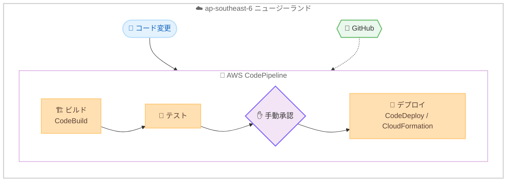

# AWS CodePipeline - アジアパシフィック (ニュージーランド) リージョンでの提供開始

**リリース日**: 2026 年 7 月 6 日
**サービス**: AWS CodePipeline
**機能**: アジアパシフィック (ニュージーランド) リージョン (ap-southeast-6) への対応

📊 [このアップデートのインフォグラフィックを見る](https://takech9203.github.io/aws-news-summary/20260706-aws-codepipeline-new-zealand.html)
<!-- INFOGRAPHIC_BASE_URL は環境変数から取得 -->

## 概要

AWS は、継続的デリバリーサービスである AWS CodePipeline をアジアパシフィック (ニュージーランド) リージョン (ap-southeast-6) で提供開始しました。これにより、ニュージーランド国内のお客様は、地理的に近いリージョンで CI/CD パイプラインを構築、運用できるようになります。

AWS CodePipeline は、ソフトウェアのリリースに必要なステップをモデル化、可視化、自動化する継続的デリバリーサービスです。コード変更が発生するたびに、定義されたワークフローに従ってアプリケーションのビルド、テスト、デプロイを自動的に実行します。AWS CodeBuild、AWS CodeDeploy、AWS CloudFormation などの AWS サービスとネイティブに連携するほか、GitHub などのサードパーティツールとの統合もサポートします。

今回の提供開始により、AWS CodePipeline は 30 の AWS 商用リージョンに加え、4 つの AWS GovCloud (US) リージョンと 2 つの中国リージョンで利用可能になりました。データレジデンシーやレイテンシーの要件を持つニュージーランドのお客様にとって、重要な選択肢が増えることになります。

**アップデート前の課題**

このアップデート以前、ニュージーランドのお客様が AWS CodePipeline を利用するには、他リージョンを選択する必要がありました。

- 以前はニュージーランド国内のリージョンで CodePipeline を利用できなかった
- 以前は他リージョン (例: シドニー) を利用する必要があり、データレジデンシー要件に対応しづらかった
- 以前は地理的に離れたリージョンを利用することで、運用管理上の考慮事項が増える場合があった

**アップデート後の改善**

今回のアップデートにより、ニュージーランドリージョンで CI/CD パイプラインを完結できるようになりました。

- 今回のアップデートにより、ap-southeast-6 リージョンで CodePipeline を利用可能になった
- 今回のアップデートにより、ニュージーランド国内でのデータレジデンシー要件への対応が容易になった
- 今回のアップデートにより、同一リージョン内のリソースとパイプラインを統合的に運用できるようになった

## アーキテクチャ図



コード変更をトリガーとして、ap-southeast-6 リージョン内で CodePipeline がビルド、テスト、手動承認、デプロイの各ステージを自動実行する流れを示しています。

## サービスアップデートの詳細

### 主要機能

1. **AWS サービスとのネイティブ統合**
   - AWS CodeBuild によるビルドおよびテストの実行
   - AWS CodeDeploy によるアプリケーションのデプロイ
   - AWS CloudFormation によるインフラストラクチャのプロビジョニング

2. **サードパーティツールとの連携**
   - GitHub などのソースリポジトリとの統合
   - カスタムプラグインによる独自ツールの連携
   - CI/CD ワークフロー内でのセキュリティスキャンやコンプライアンスチェックの自動化

3. **セキュリティとガバナンス**
   - 手動承認ゲートによるリリースプロセスの制御
   - IAM ベースのアクセス制御
   - 保存時および転送時のアーティファクトの暗号化

## 技術仕様

### リージョン情報

| 項目 | 詳細 |
|------|------|
| リージョン名 | アジアパシフィック (ニュージーランド) |
| リージョンコード | ap-southeast-6 |
| サービス | AWS CodePipeline |
| 提供開始日 | 2026 年 7 月 6 日 |

## 設定方法

### 前提条件

1. AWS アカウントを保有していること
2. パイプラインの実行およびアーティファクト保存に必要な IAM 権限を持つこと
3. アーティファクト保存用の Amazon S3 バケットが ap-southeast-6 リージョンに存在すること

### 手順

#### ステップ1: リージョンの選択

AWS Management Console でリージョンとして「アジアパシフィック (ニュージーランド)」(ap-southeast-6) を選択します。この操作により、以降作成するパイプラインが ap-southeast-6 リージョンに配置されます。

#### ステップ2: パイプラインの作成

```bash
aws codepipeline create-pipeline \
  --region ap-southeast-6 \
  --cli-input-json file://pipeline.json
```

このコマンドは、ap-southeast-6 リージョンに `pipeline.json` で定義したパイプラインを作成します。ソースステージ、ビルドステージ、デプロイステージなどのワークフローを JSON で指定します。

#### ステップ3: パイプラインの確認

作成したパイプラインは AWS Management Console の CodePipeline コンソール、または以下のコマンドで状態を確認できます。

```bash
aws codepipeline get-pipeline-state \
  --region ap-southeast-6 \
  --name <パイプライン名>
```

このコマンドは、各ステージの実行状態や最新のアクションの結果を取得します。

## メリット

### ビジネス面

- **データレジデンシー要件への対応**: ニュージーランド国内のリージョンでパイプラインを運用でき、データの所在に関する要件に対応しやすくなります
- **選択肢の拡大**: 現地のお客様が地理的に近いリージョンで CI/CD を構築できるようになります
- **従量課金**: 前払い費用や長期契約なしで、使用量に応じた課金モデルを利用できます

### 技術面

- **低レイテンシー**: ニュージーランド国内のリソースと同一リージョンでパイプラインを実行でき、遅延を抑えられます
- **統合運用**: 同一リージョン内の他の AWS リソースと統合的に運用できます
- **既存機能の完全利用**: 手動承認ゲート、IAM ベースのアクセス制御、アーティファクトの暗号化など、CodePipeline の主要機能をそのまま利用できます

## デメリット・制約事項

### 制限事項

- クロスリージョンアクションを利用する場合、対象リージョンでの対応状況を確認する必要があります
- サードパーティ連携やアクションによっては、リージョンごとに対応状況が異なる場合があります

### 考慮すべき点

- 既存の他リージョンのパイプラインを移行する場合は、アーティファクトバケットや IAM ロール、連携先サービスの再構成を検討する必要があります
- 利用予定の統合サービス (CodeBuild、CodeDeploy など) が ap-southeast-6 リージョンで利用可能かを事前に確認してください

## ユースケース

### ユースケース1: ニュージーランド国内でのアプリケーションデリバリー

**シナリオ**: ニュージーランド国内でサービスを提供する企業が、データを国内リージョンに保持したまま CI/CD パイプラインを構築したい。

**実装例**:
```
ソース (GitHub)
  → ビルド (CodeBuild)
  → テスト
  → デプロイ (CodeDeploy)
すべて ap-southeast-6 リージョンで実行
```

**効果**: データレジデンシー要件を満たしながら、ソフトウェアのリリースを自動化できます。

### ユースケース2: 承認ゲートを含むガバナンス強化

**シナリオ**: 本番環境へのデプロイ前に、責任者による手動承認を必須としたい。

**実装例**:
```
ビルド → テスト → 手動承認ゲート → 本番デプロイ
```

**効果**: リリースプロセスに統制を組み込み、意図しないデプロイを防止できます。

### ユースケース3: インフラストラクチャのコード化デプロイ

**シナリオ**: アプリケーションだけでなく、インフラストラクチャの変更も自動デプロイしたい。

**実装例**:
```
ソース → CloudFormation テンプレートの検証
  → CloudFormation スタックの更新
```

**効果**: アプリケーションとインフラストラクチャの両方を一貫したパイプラインで管理できます。

## 料金

AWS CodePipeline は従量課金モデルを採用しており、前払い費用や長期契約は不要です。料金体系はパイプラインの種類 (V1 タイプ、V2 タイプ) によって異なります。最新かつ正確な料金は公式の料金ページをご確認ください。

## 利用可能リージョン

今回のアップデートにより、AWS CodePipeline はアジアパシフィック (ニュージーランド) リージョン (ap-southeast-6) で利用可能になりました。これにより、CodePipeline は 30 の AWS 商用リージョンに加え、4 つの AWS GovCloud (US) リージョンと 2 つの中国リージョンで利用可能となっています。

## 関連サービス・機能

- **AWS CodeBuild**: パイプライン内でビルドおよびテストを実行するフルマネージドのビルドサービス
- **AWS CodeDeploy**: パイプラインからアプリケーションを各環境へデプロイするサービス
- **AWS CloudFormation**: パイプラインからインフラストラクチャをプロビジョニングするサービス

## 参考リンク

- 📊 [インフォグラフィック](https://takech9203.github.io/aws-news-summary/20260706-aws-codepipeline-new-zealand.html)
- [公式発表 (What's New)](https://aws.amazon.com/about-aws/whats-new/2026/07/aws-codepipeline-new-zealand/)
- [ドキュメント (Getting Started)](https://docs.aws.amazon.com/codepipeline/latest/userguide/getting-started.html)
- [料金ページ](https://aws.amazon.com/codepipeline/pricing/)

## まとめ

AWS CodePipeline がアジアパシフィック (ニュージーランド) リージョン (ap-southeast-6) で利用可能になったことで、現地のお客様はデータレジデンシー要件に対応しながら CI/CD パイプラインを構築できるようになりました。ニュージーランドでの開発ワークロードを持つお客様は、パイプラインを ap-southeast-6 リージョンに配置することを検討してください。
