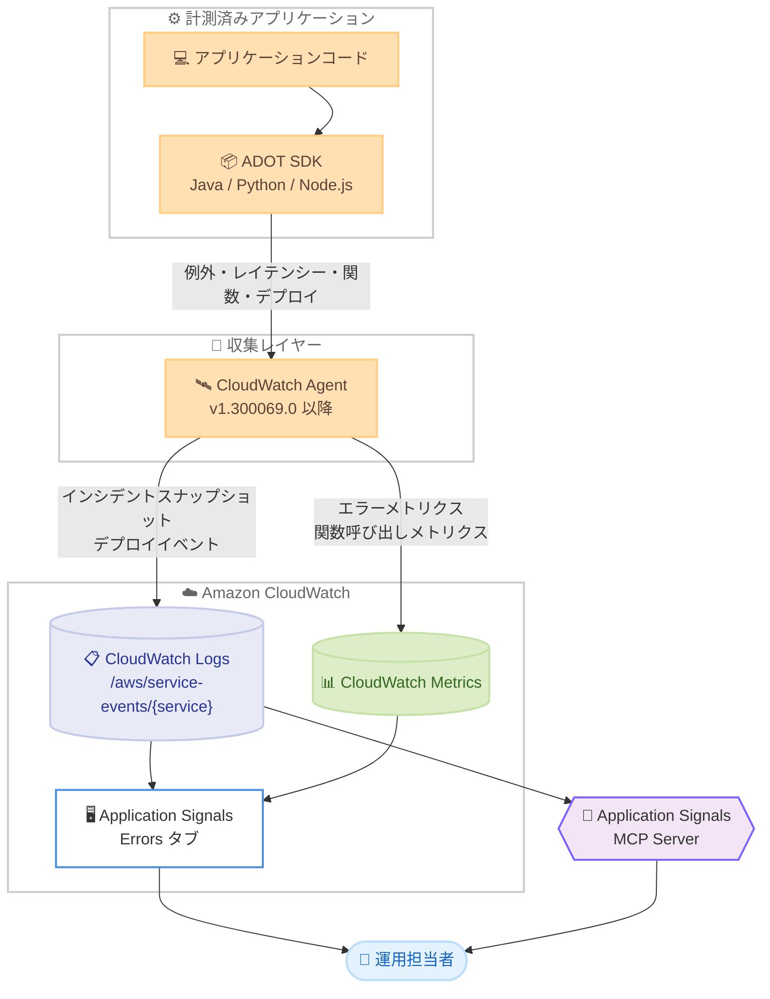

# Amazon CloudWatch Application Signals - Service Events

**リリース日**: 2026 年 7 月 6 日
**サービス**: Amazon CloudWatch Application Signals
**機能**: Service Events (サービスイベント)

📊 [このアップデートのインフォグラフィックを見る](https://takech9203.github.io/aws-news-summary/20260706-cloudwatch-service-events.html)
<!-- INFOGRAPHIC_BASE_URL は環境変数から取得 -->

## 概要

AWS は、Amazon CloudWatch Application Signals の新機能として Service Events を発表しました。Service Events は、計測済みのサービスから例外イベントとレイテンシーイベントのスナップショット、関数レベルのパフォーマンスデータ、デプロイイベントを追加のコード変更なしで自動的にキャプチャします。これにより、運用担当者は本番環境で発生している問題を、コードを変更することなく詳細に把握できます。

特に重要な価値提案として、デプロイが新しい例外を導入したかどうかを迅速に特定できる点が挙げられます。運用担当者は CloudWatch コンソールで「Application Signals > [対象サービス] > Errors」に移動するだけで、例外の発生傾向とデプロイイベントを関連付けて確認できます。これにより、リリース直後の障害調査にかかる時間を大幅に短縮できます。

Service Events は、CloudWatch Application Signals が有効になっているすべてのアプリケーションで利用できます。アプリケーションは ADOT (AWS Distro for OpenTelemetry) SDK または Amazon CloudWatch Observability EKS アドオンで計測します。対象言語は Java、Python、JavaScript (Node.js) です。すべての商用 AWS リージョンで利用可能で、標準の CloudWatch 料金が適用されます。

**アップデート前の課題**

このアップデート以前、詳細なランタイム観測データを取得するには追加の設定や実装が必要でした。

- 例外の詳細情報 (スタックトレース、呼び出しツリー、発信元情報) を得るには、個別のトレース設定や手動の計測が必要だった
- デプロイと障害発生を関連付けるには、デプロイマーカーを手動で作成し、メトリクスと突き合わせる必要があった
- 関数レベルのボトルネックを特定するには、独自のプロファイリングツールや追加のコード計測が必要だった

**アップデート後の改善**

今回のアップデートにより、深い観測性が自動的に得られるようになりました。

- CloudWatch Application Signals を有効にするだけで、例外メトリクスとインシデントスナップショットが自動的にキャプチャされる
- デプロイイベントが自動的に発行され、デプロイと障害・パフォーマンス変化の相関を容易に確認できる
- 環境変数を設定するだけで、関数レベルのパフォーマンスメトリクスをコード変更なしで収集できる

## アーキテクチャ図



計測済みアプリケーションの ADOT SDK が例外・レイテンシー・関数・デプロイの各シグナルを収集し、CloudWatch Agent が CloudWatch Logs と CloudWatch Metrics に発行します。運用担当者はコンソールの Errors タブや MCP サーバー経由で確認できます。

## サービスアップデートの詳細

### 主要機能

1. **エラーメトリクス (Error metrics)**
   - 各オペレーションについて、例外タイプごとのエラー件数と発生率を記録
   - どの例外が最も頻繁に発生し、傾向が変化しているかを特定できる
   - CloudWatch Application Signals を有効にすると即座に有効化される

2. **インシデントスナップショット (Incident snapshots)**
   - リクエストがレイテンシーしきい値を超過した場合、または例外がスローされた場合に詳細情報をキャプチャ
   - スタックトレース、呼び出しツリー、発信元情報、オペレーションコンテキストを含む
   - デフォルトのレイテンシーしきい値は 5,000 ミリ秒 (エンドポイントごとに上書き可能)

3. **関数呼び出しメトリクス (Function-call metrics)**
   - アプリケーションコード内の個々の関数について、呼び出し回数、実行時間、エラー率を計測
   - OpenTelemetry メトリクスとしてキャプチャされる
   - オプトイン機能であり、計測対象パッケージの設定が必要

4. **デプロイイベント (Deployment events)**
   - アプリケーション起動時および 24 時間ごとにマーカーを発行し、コードデプロイとサービス動作の変化を関連付ける
   - デプロイイベントは常に自動的に発行される
   - Git コミット SHA やデプロイ ID などのメタデータを提供すると、追加のコンテキストで強化される

5. **Application Signals MCP サーバー連携**
   - Service Events のデータは CloudWatch Application Signals MCP (Model Context Protocol) サーバー経由でアクセス可能
   - AI コーディングアシスタントやエージェントがサービスのランタイム動作を直接クエリできる
   - コード内のエラーと本番環境のインシデントスナップショットを自動的に関連付け、対象を絞った修正提案が可能

## 技術仕様

### データの保存と種類

| 項目 | 詳細 |
|------|------|
| Service Events データ | CloudWatch Logs に保存 (ログとしてキャプチャ) |
| ログ グループ プレフィックス | `/aws/service-events/{service-name}` (サービスごとに 1 つ作成) |
| 関数呼び出しメトリクス | OpenTelemetry メトリクスとしてキャプチャ |
| サービス名の決定 | `OTEL_SERVICE_NAME` 環境変数の値を使用 |
| 対象言語 | Java、Python、Node.js (JavaScript) |
| Lambda 環境 | Service Events は自動的に無効化される |

### 前提コンポーネントの最小バージョン

| 項目 | 詳細 |
|------|------|
| ADOT SDK | 対象言語 (Java / Python / Node.js) の最新バージョン |
| CloudWatch Observability EKS アドオン | 最新バージョン (EKS を使用する場合) |
| CloudWatch Agent | バージョン `1.300069.0` 以降 |

### 主要な環境変数

```bash
# Service Events の有効・無効の切り替え (デフォルト: Application Signals に追従)
OTEL_AWS_SERVICE_EVENTS_ENABLED=true

# 関数計測の対象パッケージ (関数メトリクス収集には必須)
# 例: Java は com.myapp、Python は myapp、Node.js は src/myapp
OTEL_AWS_SERVICE_EVENTS_PACKAGES_INCLUDE=com.myapp

# 計測から除外するサブパッケージ (include より優先される)
OTEL_AWS_SERVICE_EVENTS_PACKAGES_EXCLUDE=com.myapp.models

# インシデントスナップショットの全体レイテンシーしきい値 (ミリ秒、デフォルト: 5000)
OTEL_AWS_SERVICE_EVENTS_INCIDENT_SNAPSHOT_DURATION_THRESHOLD_MS=5000
```

### API 変更履歴

今回のアップデートに直接関連する新規または変更された公開 API メソッドは確認されていません。Service Events は ADOT SDK と CloudWatch Agent を通じてデータを収集し、CloudWatch Logs および CloudWatch Metrics に発行する仕組みのため、専用の管理 API を追加せずに動作します。

## 設定方法

### 前提条件

1. CloudWatch Application Signals が対象サービスで有効になっていること
2. ADOT SDK を対象言語の最新バージョンに更新していること (EKS 利用時は CloudWatch Observability EKS アドオンも最新化)
3. CloudWatch Agent がバージョン `1.300069.0` 以降であること

### 手順

#### ステップ 1: デフォルトで有効な機能の確認

CloudWatch Application Signals を有効にすると、以下のシグナルは追加設定なしで自動的に有効になります。

- インシデントスナップショット (例外およびレイテンシーしきい値超過時にトリガー)
- エラーメトリクス (オペレーションごとの例外タイプ別エラー件数)
- デプロイイベント (常に発行され、メタデータ提供時に強化される)
- 関数計測 (デフォルトで有効だが、対象パッケージを設定するまでメトリクスは生成されない)

前提コンポーネントを最新化した状態で Application Signals を有効にするだけで、エラー追跡が即座に開始されます。

#### ステップ 2: 関数レベルのメトリクスを有効化 (オプション)

```bash
# アプリケーションコンテナまたはプロセスに環境変数を設定
export OTEL_AWS_SERVICE_EVENTS_PACKAGES_INCLUDE=com.myapp
export OTEL_AWS_SERVICE_EVENTS_PACKAGES_EXCLUDE=com.myapp.models
```

関数計測はデフォルトで有効ですが、計測対象パッケージを設定するまでメトリクスは生成されません。`OTEL_AWS_SERVICE_EVENTS_PACKAGES_INCLUDE` にパッケージプレフィックスのリストを指定することで、関数単位のテレメトリ収集が開始されます。`OTEL_AWS_SERVICE_EVENTS_PACKAGES_EXCLUDE` で特定のサブパッケージを除外でき、除外設定は常に包含設定より優先されます。

#### ステップ 3: デプロイメタデータの設定 (オプション、推奨)

```yaml
# GitHub Actions のワークフロー例
env:
  OTEL_AWS_SERVICE_EVENTS_GIT_COMMIT_SHA: ${{ github.sha }}
  OTEL_AWS_SERVICE_EVENTS_GIT_REPO_URL: ${{ github.server_url }}/${{ github.repository }}
  OTEL_AWS_SERVICE_EVENTS_DEPLOYMENT_ID: ${{ github.run_id }}
  OTEL_AWS_SERVICE_EVENTS_DEPLOYMENT_TIMESTAMP: $(date -u +%Y-%m-%dT%H:%M:%SZ)
  OTEL_AWS_SERVICE_EVENTS_DEPLOYMENT_URL: ${{ github.server_url }}/${{ github.repository }}/actions/runs/${{ github.run_id }}
```

デプロイイベントは常に発行されますが、上記の環境変数でメタデータを提供すると、インシデントやパフォーマンス変化を特定のコードデプロイと関連付けられるようになります。GitLab CI/CD の場合は `CI_COMMIT_SHA` や `CI_PIPELINE_ID` などの定義済み変数を使用します。設定した変数はコンテナオーケストレーション (ECS タスク定義や Kubernetes マニフェストなど) を通じてアプリケーションコンテナに渡します。

## メリット

### ビジネス面

- **平均復旧時間 (MTTR) の短縮**: デプロイと障害の相関を自動で可視化し、リリース起因の問題を迅速に特定できる
- **追加コストの抑制**: 標準の CloudWatch 料金のみで利用でき、専用の観測性ツールの導入や運用が不要
- **開発生産性の向上**: MCP サーバー連携により、AI コーディングアシスタントが本番インシデントを踏まえた修正提案を行える

### 技術面

- **コード変更不要**: ADOT SDK と CloudWatch Agent を最新化するだけで、例外・レイテンシー・デプロイの詳細を自動取得
- **詳細なインシデントコンテキスト**: スタックトレース、呼び出しツリー、発信元情報、トレース ID を含むスナップショットを自動キャプチャ
- **柔軟な制御**: エンドポイントフィルタリング、レイテンシーしきい値、レート制限、サンプリングモードを環境変数で細かく調整可能

## デメリット・制約事項

### 制限事項

- 対象言語は Java、Python、Node.js (JavaScript) に限定される
- Lambda 環境では Service Events は自動的に無効化される
- 関数レベルのメトリクスは `OTEL_AWS_SERVICE_EVENTS_PACKAGES_INCLUDE` を設定するまで生成されない (オプトイン)
- CloudWatch Agent はバージョン `1.300069.0` 以降が必要

### 考慮すべき点

- Service Events データは CloudWatch Logs に保存されるため、標準の CloudWatch Logs 取り込み・保存料金が発生する
- インシデントスナップショットには 1 分あたりの最大件数 (デフォルト 100) と同一エラーの最大件数 (デフォルト 1) のレート制限がある
- エラーデータを表示するには、アカウント内に少なくとも 1 つの `/aws/service-events/{service-name}` ログ グループが存在する必要がある

## ユースケース

### ユースケース 1: リリース起因の障害の迅速な特定

**シナリオ**: 新バージョンのマイクロサービスをデプロイした直後、特定のエンドポイントで新しい例外が発生し始めた。原因がデプロイにあるのか外部要因なのかを切り分けたい。

**実装例**:
```text
1. CloudWatch コンソールで Application Signals > 対象サービス > Errors タブを開く
2. 例外件数チャートで最近増加した例外タイプを確認
3. デプロイイベントのマーカーと例外の増加タイミングを突き合わせる
```

**効果**: デプロイと例外発生の相関を数分で確認でき、ロールバックや修正の判断を迅速化できます。

### ユースケース 2: レイテンシーボトルネックの特定

**シナリオ**: あるオペレーションのレイテンシーが悪化しているが、どの関数が原因か特定できていない。

**実装例**:
```bash
# 対象アプリケーションのコードパッケージを計測対象に指定
export OTEL_AWS_SERVICE_EVENTS_PACKAGES_INCLUDE=com.myapp.orders
# 重要エンドポイントのしきい値を個別設定
export OTEL_AWS_SERVICE_EVENTS_LATENCY_THRESHOLDS="POST /checkout:8000"
```

**効果**: 関数呼び出しメトリクスで実行時間の長い関数を特定し、デプロイ間で比較することでパフォーマンスリグレッションを正確に把握できます。

### ユースケース 3: AI アシスタントによる根本原因分析

**シナリオ**: 開発者が IDE 上で、本番環境で発生しているエラーの修正に取り組んでいる。手動でダッシュボードを確認せずに、コンテキストを得たい。

**実装例**:
```text
1. Application Signals MCP サーバーを AI コーディングアシスタントに接続
2. アシスタントがインシデントスナップショット (例外タイプ、呼び出しパス、トレース ID) を取得
3. デプロイイベントを参照して、直近のリリースがリグレッションを導入したかを判断
```

**効果**: コード内のエラーと本番インシデントを自動的に関連付け、対象を絞った修正を効率的に行えます。

## 料金

Service Events には専用の追加料金はなく、標準の CloudWatch 料金が適用されます。具体的には、Service Events データは CloudWatch Logs に保存されるため、ログの取り込みと保存に対して標準の CloudWatch Logs 料金が発生します。また、関数呼び出しメトリクスは CloudWatch Metrics として発行されるため、カスタムメトリクスに対する標準料金が適用されます。

### 料金の考え方

| 項目 | 課金対象 |
|--------|------------------|
| Service Events データ (ログ) | CloudWatch Logs の取り込み・保存料金 |
| 関数呼び出しメトリクス | CloudWatch カスタムメトリクス料金 |
| CloudWatch Application Signals | Application Signals の標準料金 |

正確な料金は、リージョンや使用量によって異なります。詳細は料金ページを参照してください。

## 利用可能リージョン

すべての商用 AWS リージョンで利用可能です。東京リージョンを含む商用リージョンで使用できます。

## 関連サービス・機能

- **Amazon CloudWatch Application Signals**: Service Events の基盤となる機能。Application Signals を有効にすることで Service Events が利用可能になる
- **AWS Distro for OpenTelemetry (ADOT)**: アプリケーションを計測するための SDK。Service Events のデータ収集に使用する
- **Amazon CloudWatch Observability EKS アドオン**: Amazon EKS 上のアプリケーションを計測するためのアドオン
- **CloudWatch Logs / CloudWatch Metrics**: Service Events データと関数呼び出しメトリクスの保存先
- **Application Signals MCP サーバー**: AI コーディングアシスタントが Service Events データをクエリするための連携ポイント

## 参考リンク

- 📊 [インフォグラフィック](https://takech9203.github.io/aws-news-summary/20260706-cloudwatch-service-events.html)
- [公式発表 (What's New)](https://aws.amazon.com/about-aws/whats-new/2026/06/cloudwatch-service-events/)
- [ドキュメント (Monitor service events)](https://docs.aws.amazon.com/AmazonCloudWatch/latest/monitoring/CloudWatch-Application-Signals-ServiceEvents.html)
- [料金ページ (Amazon CloudWatch Pricing)](https://aws.amazon.com/cloudwatch/pricing/)

## まとめ

Service Events は、CloudWatch Application Signals にコード変更なしの深い観測性をもたらす重要なアップデートです。例外・レイテンシー・関数・デプロイの各シグナルを自動的にキャプチャし、特にデプロイと障害の相関を迅速に可視化することで、リリース起因の問題の切り分けを大幅に効率化します。既に Application Signals を利用しているチームは、ADOT SDK と CloudWatch Agent を最新化して機能を有効化し、必要に応じて関数計測とデプロイメタデータを設定することを推奨します。
