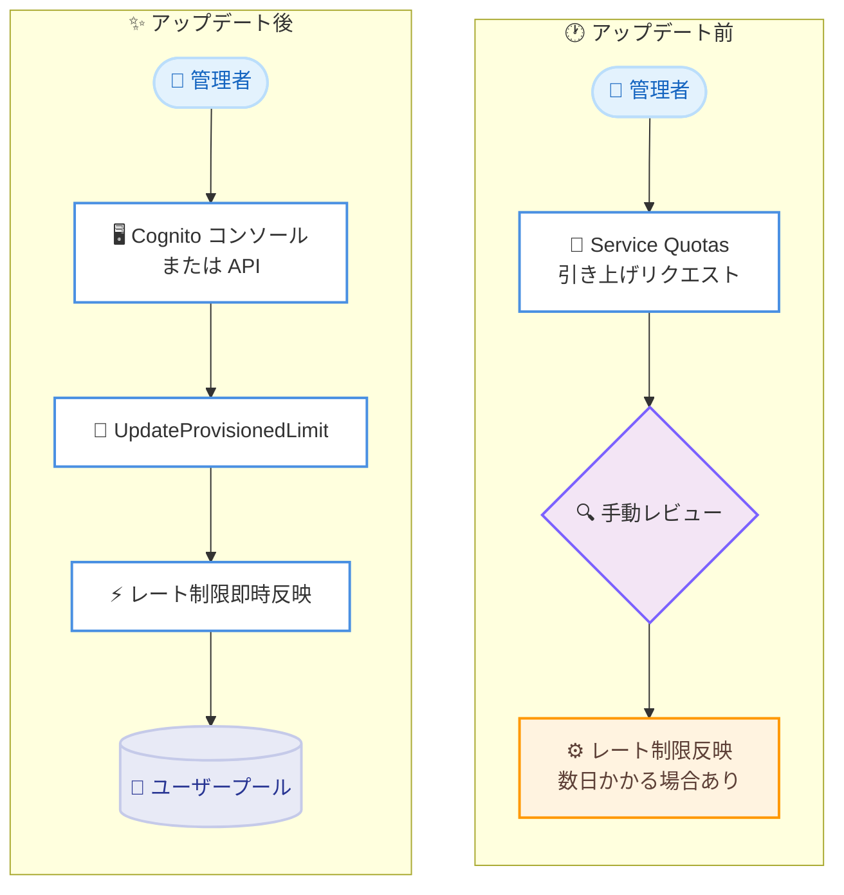

# Amazon Cognito - セルフサービスによるプロビジョンド API レート制限

**リリース日**: 2026 年 7 月 6 日
**サービス**: Amazon Cognito
**機能**: セルフサービスによるプロビジョンド API レート制限の調整

📊 [このアップデートのインフォグラフィックを見る](https://takech9203.github.io/aws-news-summary/20260706-cognito-provisioned-limits.html)
<!-- INFOGRAPHIC_BASE_URL は環境変数から取得 -->

## 概要

Amazon Cognito は、プロビジョンド API レート制限をオンデマンドで増減できるセルフサービス機能に対応しました。Cognito では、各 AWS リージョンのユーザープールごとに 1 秒あたりの最大オペレーション数を定めたデフォルトのレート制限があり、調整可能な API カテゴリについては追加の制限を購入できます。今回のオンデマンドモデルにより、アプリケーションのトラフィックパターンに合わせて、レート制限をこれまでより迅速に増減できるようになりました。

これまで Cognito の API レート制限を調整するには、Service Quotas を通じて引き上げをリクエストし、手動レビューを受ける必要がありました。今回のアップデートでは、コンソールまたは新しい制限プロビジョニング API オペレーションを使用して、アカウントレベルの最大制限までの範囲で希望するレート制限を設定できる、新しいセルフサービス体験が提供されます。

レート制限の変更は即座に反映されます。本機能は Amazon Cognito が利用可能なすべての AWS リージョンで利用できます。

**アップデート前の課題**

- レート制限を調整するには Service Quotas 経由でのリクエストが必要で、手動レビューを待つ必要があった
- レビューに時間がかかるため、トラフィックの急増を見越して事前にキャパシティを計画しておく必要があった
- 制限の引き下げ (減少) についても柔軟に行えなかった

**アップデート後の改善**

- コンソールまたは API から希望するレート制限をセルフサービスで設定できるようになった
- レート制限の変更が即座に反映されるようになった
- アカウントレベルの最大制限までの範囲で、上下双方向に迅速な調整が可能になった

## アーキテクチャ図



アップデート前は Service Quotas 経由の手動レビューが必要でしたが、アップデート後はコンソールまたは API から即座にレート制限を変更できます。

## サービスアップデートの詳細

### 主要機能

1. **オンデマンドのレート制限調整**
   - 調整可能な API カテゴリに対して、レート制限を上下双方向に変更可能
   - アカウントレベルの最大制限までの範囲で希望する値を設定可能
   - トラフィックの急増や減少に合わせて柔軟に調整できる

2. **セルフサービス体験**
   - Amazon Cognito コンソールから希望するレート制限を設定
   - 新しい制限プロビジョニング API オペレーションによるプログラムからの設定
   - Service Quotas への引き上げリクエストや手動レビューが不要

3. **即時反映**
   - レート制限の変更は即座に有効になる
   - トラフィックパターンの変化に対して迅速に対応可能

## 技術仕様

### レート制限の仕組み

| 項目 | 詳細 |
|------|------|
| 対象 | 各 AWS リージョンのユーザープールにおける 1 秒あたりの最大オペレーション数 |
| デフォルト制限 | Cognito がリージョンごとに設定するデフォルトのレート制限 |
| 追加制限 | 調整可能な API カテゴリについて追加購入が可能 |
| 上限 | アカウントレベルの最大制限まで設定可能 |
| 反映タイミング | 変更は即座に反映される |

### API 変更履歴

| 日付 | サービス | 変更内容 |
|------|----------|----------|
| 2026/07/02 | [cognito-idp](https://awsapichanges.com/archive/changes/c1894c-cognito-idp.html) | 2 new api methods - プロビジョンド制限管理のサポートを追加。`GetProvisionedLimit` と `UpdateProvisionedLimit` により、Amazon Cognito User Pools のプロビジョンド API レート制限をプログラムから参照・更新可能 |

### 新しい API オペレーション

- **GetProvisionedLimit**: 現在のプロビジョンド API レート制限を取得する
- **UpdateProvisionedLimit**: プロビジョンド API レート制限を希望する値に更新する

## 設定方法

### 前提条件

1. Amazon Cognito のユーザープールが作成済みであること
2. レート制限を操作する IAM プリンシパルに、対象の Cognito API オペレーションに対する適切な権限があること
3. 調整可能な API カテゴリと、アカウントレベルの最大制限を確認しておくこと

### 手順

#### ステップ1: 現在のレート制限を確認する

```bash
aws cognito-idp get-provisioned-limit \
  --user-pool-id <your-user-pool-id>
```

このコマンドは対象ユーザープールにおける現在のプロビジョンド API レート制限を取得します。調整前に現状の設定値を把握するために使用します。

#### ステップ2: レート制限を更新する

```bash
aws cognito-idp update-provisioned-limit \
  --user-pool-id <your-user-pool-id> \
  --provisioned-limit <desired-limit-value>
```

このコマンドはプロビジョンド API レート制限を希望する値に更新します。値はアカウントレベルの最大制限を超えない範囲で指定します。変更は即座に反映されます。

#### ステップ3: コンソールからの操作 (代替方法)

Amazon Cognito コンソールを開き、対象のユーザープールを選択して、レート制限の設定画面から希望する値を入力することでも同様の調整が可能です。API を利用せずに GUI で操作したい場合に有効です。

## メリット

### ビジネス面

- **市場投入までの時間短縮**: 手動レビュー待ちがなくなり、トラフィック増に迅速に対応できる
- **コスト最適化**: 不要になった追加制限を減少させることで、キャパシティを需要に合わせて最適化できる
- **運用計画の柔軟性向上**: 事前の綿密なキャパシティ計画に依存せず、必要なタイミングで調整できる

### 技術面

- **即時反映**: 変更が即座に有効になるため、トラフィックスパイクへの対応が容易
- **プログラムによる自動化**: API オペレーションを利用して、監視結果に基づく自動スケーリングを実装可能
- **双方向の調整**: 増加だけでなく減少も可能で、状況に応じた柔軟な制御ができる

## デメリット・制約事項

### 制限事項

- レート制限を設定できるのは、アカウントレベルの最大制限までの範囲に限られる
- 対象となるのは調整可能な API カテゴリに限定される
- 追加の制限は付加機能 (アドオン) として料金が発生する

### 考慮すべき点

- レート制限を増加させると追加料金が発生するため、需要とコストのバランスを考慮する必要がある
- 自動調整を実装する場合、意図しない制限引き上げによるコスト増を防ぐためのガードレールを検討する
- アカウントレベルの最大制限を超える引き上げが必要な場合は、別途対応が必要になる可能性がある

## ユースケース

### ユースケース1: キャンペーンやセール時のトラフィック急増への対応

**シナリオ**: EC サイトが大型セールを実施し、短期間にサインインやサインアップが集中することが予想される。

**実装例**:
```bash
# セール開始前にレート制限を引き上げ
aws cognito-idp update-provisioned-limit \
  --user-pool-id us-east-1_xxxxxxxxx \
  --provisioned-limit <higher-limit>
```

**効果**: 事前レビュー待ちなしにセール直前で制限を引き上げ、認証エラーやスロットリングを回避できる。

### ユースケース2: セール終了後のコスト最適化

**シナリオ**: セール終了後、トラフィックが通常レベルに戻ったため、追加制限を減らしてコストを抑えたい。

**実装例**:
```bash
# トラフィック沈静化後にレート制限を引き下げ
aws cognito-idp update-provisioned-limit \
  --user-pool-id us-east-1_xxxxxxxxx \
  --provisioned-limit <normal-limit>
```

**効果**: 不要になった追加キャパシティを即座に解放し、コストを需要に合わせて最適化できる。

### ユースケース3: 監視連動によるレート制限の自動調整

**シナリオ**: CloudWatch メトリクスで API 利用状況を監視し、閾値を超えた際に自動でレート制限を調整したい。

**実装例**:
```
CloudWatch Alarm → EventBridge → Lambda → UpdateProvisionedLimit API
```

**効果**: トラフィックの変動に対して人手を介さず自動的にキャパシティを調整し、可用性とコスト効率を両立できる。

## 料金

追加のプロビジョンド API レート制限は付加機能 (アドオン) として提供されます。デフォルトのレート制限を超える追加制限を購入する場合に料金が発生します。詳細な料金体系は Amazon Cognito の料金ページを参照してください。

## 利用可能リージョン

Amazon Cognito が利用可能なすべての AWS リージョンで利用できます。

## 関連サービス・機能

- **AWS Service Quotas**: 従来のレート制限引き上げリクエストの経路。今回のセルフサービス機能により、調整可能なカテゴリでは手動リクエストが不要になった
- **Amazon CloudWatch**: API 利用状況の監視に利用し、レート制限調整の判断材料として活用できる
- **Amazon EventBridge / AWS Lambda**: 監視結果に基づくレート制限の自動調整を実装する際に組み合わせて利用できる

## 参考リンク

- 📊 [インフォグラフィック](https://takech9203.github.io/aws-news-summary/20260706-cognito-provisioned-limits.html)
- [公式発表 (What's New)](https://aws.amazon.com/about-aws/whats-new/2026/07/cognito-provisioned-limits)
- [AWS API Changes (cognito-idp)](https://awsapichanges.com/archive/changes/c1894c-cognito-idp.html)
- [Amazon Cognito ドキュメント](https://docs.aws.amazon.com/cognito/)
- [Amazon Cognito 料金ページ](https://aws.amazon.com/cognito/pricing/)

## まとめ

今回のアップデートにより、Amazon Cognito のプロビジョンド API レート制限を手動レビューなしでセルフサービス調整でき、変更が即座に反映されるようになりました。トラフィックの急増が見込まれるイベント前の引き上げや、沈静化後の引き下げによるコスト最適化を柔軟に実施できます。認証トラフィックの変動が大きいアプリケーションを運用している場合は、新しい制限プロビジョニング API と監視サービスを組み合わせた自動調整の仕組みを検討することを推奨します。
