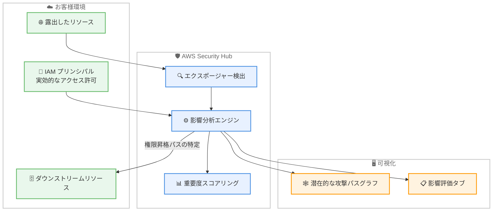

# AWS Security Hub - エクスポージャー検出結果の影響分析

**リリース日**: 2026 年 7 月 6 日
**サービス**: AWS Security Hub
**機能**: エクスポージャー検出結果に対する影響分析 (Impact Analysis for Exposure Findings)

📊 [このアップデートのインフォグラフィックを見る](https://takech9203.github.io/aws-news-summary/20260706-impact-analysis-aws-security-hub.html)

## 概要

AWS Security Hub は、エクスポージャー (exposure) の検出結果に対して影響分析機能を追加しました。この機能により、セキュリティチームはエクスポージャーが悪用された場合に攻撃者が到達できる範囲全体を把握できます。従来のエクスポージャー検出結果は、最初に露出したリソースそのものを特定するものでしたが、影響分析はそこから先に侵害される可能性のあるダウンストリームリソースをマッピングすることで、検出結果を拡張します。

Security Hub は、露出したリソースに関連付けられた IAM プリンシパルの実効的なアクセス許可を分析し、権限昇格のパスを特定します。これにより、最初に露出したリソースを起点として、攻撃者が横展開できる可能性のあるリソースの連鎖を可視化します。影響範囲は潜在的な攻撃パスグラフ (potential attack path graph) 上に表示されるほか、新しい影響評価 (Impact Assessment) タブでは、攻撃者がたどることのできるリソースの連鎖が優先度順に表示され、各ステップで必要となる具体的なアクセス許可も確認できます。

さらに Security Hub は、影響範囲をエクスポージャー検出結果の重要度スコアリングに反映します。ダウンストリームへの影響が広いエクスポージャーほど重要度が高く評価されるため、セキュリティチームは真にリスクの高い問題から優先的に対応できます。

**アップデート前の課題**

このアップデート以前は、エクスポージャー検出結果は最初に露出したリソースに焦点が当てられていました。

- 露出したリソースが悪用された場合に、そこから先にどのリソースまで到達されるのかを自動で把握できなかった
- IAM プリンシパルの実効的なアクセス許可をたどって権限昇格のパスを手動で調査する必要があり、時間と専門知識を要した
- エクスポージャーの重要度が、ダウンストリームへの影響範囲を十分に反映していなかったため、優先順位付けが難しかった

**アップデート後の改善**

今回のアップデートにより、エクスポージャーの影響範囲を自動で分析できるようになりました。

- 今回のアップデートにより、露出したリソースを起点に侵害される可能性のあるダウンストリームリソースを自動でマッピングできるようになった
- 今回のアップデートにより、IAM プリンシパルの実効的なアクセス許可を手動で追跡する作業が不要になった
- 今回のアップデートにより、影響範囲が重要度スコアリングに反映され、優先順位付けの精度が改善された

## アーキテクチャ図

Security Hub が露出したリソースと IAM プリンシパルの実効的なアクセス許可を分析し、ダウンストリームリソースへの権限昇格パスを特定して、攻撃パスグラフと影響評価タブで可視化する流れを示しています。

## サービスアップデートの詳細

### 主要機能

1. **ダウンストリームリソースのマッピング**
   - 最初に露出したリソースを起点として、そこから先に侵害される可能性のあるリソースを特定する
   - エクスポージャーの影響を単一のリソースにとどまらず、環境全体の観点で評価する
   - 攻撃者が到達できる範囲全体を把握できるようにする

2. **権限昇格パスの分析**
   - 露出したリソースに関連付けられた IAM プリンシパルの実効的なアクセス許可を分析する
   - アクセス許可をたどって、攻撃者が横展開できる権限昇格のパスを特定する
   - 各ステップで必要となる具体的なアクセス許可を明らかにする

3. **影響評価タブと攻撃パスグラフ**
   - 影響範囲を潜在的な攻撃パスグラフ上に表示する
   - 新しい影響評価タブで、攻撃者がたどるリソースの連鎖を優先度順に表示する
   - 各ステップで使用されるアクセス許可を連鎖とともに提示する

4. **重要度スコアリングへの反映**
   - 影響範囲をエクスポージャー検出結果の重要度スコアリングに組み込む
   - 影響範囲が特定または変化するのに応じて、既存のエクスポージャーの重要度を調整する
   - ダウンストリームへの影響が広いエクスポージャーほど高い重要度で優先付けする

## 技術仕様

### 影響分析の構成要素

| 項目 | 詳細 |
|------|------|
| 分析対象 | 露出したリソースと関連付けられた IAM プリンシパルの実効的なアクセス許可 |
| 出力 1 | 潜在的な攻撃パスグラフ上の影響範囲表示 |
| 出力 2 | 影響評価タブでの優先度順のリソース連鎖と各ステップのアクセス許可 |
| 重要度への反映 | 影響範囲を重要度スコアリングに組み込み、変化に応じて動的に調整 |

## メリット

### ビジネス面

- **リスクの正確な把握**: エクスポージャーが悪用された場合の影響範囲全体を可視化し、組織のリスクをより正確に評価できる
- **対応の優先順位付け**: 影響範囲が重要度スコアに反映されるため、真にリスクの高い問題から優先的にリソースを投下できる
- **調査コストの削減**: 権限昇格パスの手動調査が不要になり、セキュリティチームの作業負荷を軽減できる

### 技術面

- **権限昇格パスの自動特定**: IAM プリンシパルの実効的なアクセス許可を自動で分析し、横展開の経路を明らかにする
- **視覚的な把握**: 攻撃パスグラフと影響評価タブにより、複雑なリソース連鎖を直感的に理解できる
- **動的な重要度調整**: 影響範囲の特定や変化に応じて重要度が更新され、最新のリスク状態を反映する

## デメリット・制約事項

### 制限事項

- 影響分析はエクスポージャー検出結果を対象としており、Security Hub のエクスポージャー検出機能が有効になっている必要がある
- 分析対象は IAM プリンシパルの実効的なアクセス許可に基づくため、権限構成が正しく評価される前提となる

### 考慮すべき点

- 利用可能リージョンや料金の詳細は公式ドキュメントおよび料金ページで確認することを推奨する
- 影響範囲の可視化結果は、実際の運用環境の構成変更に応じて変化する

## ユースケース

### ユースケース1: インターネットに公開されたリソースのリスク評価

**シナリオ**: インターネットに露出した EC2 インスタンスや関連リソースが検出された際に、そのリソースが侵害された場合に攻撃者が到達できる範囲を把握したい。

**効果**: 影響評価タブで攻撃者がたどるリソースの連鎖を確認し、露出リソース単体ではなく到達範囲全体を踏まえて対応できる。

### ユースケース2: 権限昇格パスの特定と是正

**シナリオ**: 露出したリソースに紐づく IAM プリンシパルが過剰なアクセス許可を持っている場合に、権限昇格の経路を特定して最小権限化を進めたい。

**効果**: 各ステップで使用されるアクセス許可が明示されるため、不要な権限を特定し、権限昇格パスを断ち切ることができる。

### ユースケース3: 検出結果の優先順位付け

**シナリオ**: 多数のエクスポージャー検出結果の中から、事業への影響が大きいものを優先して対応したい。

**効果**: 影響範囲が重要度スコアに反映されるため、ダウンストリームへの影響が広いエクスポージャーを優先的に処理できる。

## 料金

影響分析の料金に関する詳細は、公式発表では明示されていません。AWS Security Hub の料金体系については、公式の料金ページで最新情報を確認してください。

## 利用可能リージョン

公式発表では、影響分析機能が利用可能な具体的なリージョンは列挙されていません。AWS Security Hub が利用可能なリージョンの一覧については、AWS リージョン別サービス一覧 (AWS Regional Services List) を参照してください。

## 関連サービス・機能

- **AWS Identity and Access Management (IAM)**: 影響分析は IAM プリンシパルの実効的なアクセス許可を分析して権限昇格パスを特定する
- **Amazon EC2 / Amazon S3 など**: 露出したリソースやダウンストリームリソースとして分析の対象になる
- **AWS Security Hub エクスポージャー検出**: 本機能は既存のエクスポージャー検出結果を拡張する形で提供される

## 参考リンク

- 📊 [インフォグラフィック](https://takech9203.github.io/aws-news-summary/20260706-impact-analysis-aws-security-hub.html)
- [公式発表 (What's New)](https://aws.amazon.com/about-aws/whats-new/2026/07/impact-analysis-aws-security-hub/)
- [AWS Security Hub 製品ページ](https://aws.amazon.com/security-hub/)
- [AWS Security Hub ユーザーガイド](https://docs.aws.amazon.com/securityhub/)

## まとめ

エクスポージャー検出結果に対する影響分析は、露出したリソース単体の検出から一歩進み、攻撃者が到達できる範囲全体を可視化する重要な機能強化です。権限昇格パスの自動特定と影響範囲を反映した重要度スコアリングにより、セキュリティチームはリスクの高い問題から効率的に対応できます。Security Hub を利用中のお客様は、影響評価タブと攻撃パスグラフを活用し、エクスポージャー対応の優先順位付けを見直すことを推奨します。
