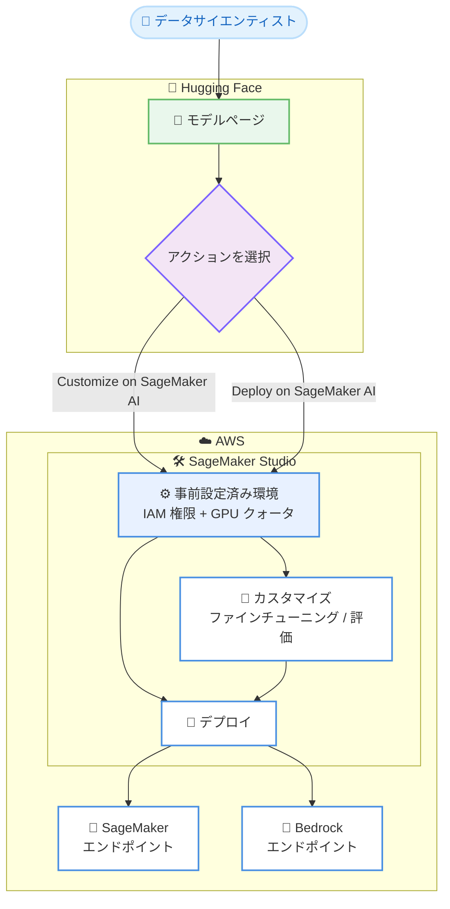

# Amazon SageMaker Studio - Hugging Face 統合によるワンクリックモデルデプロイとカスタマイズ

**リリース日**: 2026年07月06日
**サービス**: Amazon SageMaker Studio
**機能**: Hugging Face からのワンクリックモデルデプロイとカスタマイズ統合

📊 [このアップデートのインフォグラフィックを見る](https://takech9203.github.io/aws-news-summary/20260706-sagemaker-studio-hugging-face-integration.html)
<!-- INFOGRAPHIC_BASE_URL は環境変数から取得 -->

## 概要

Amazon SageMaker Studio が Hugging Face からの直接統合をサポートしました。これにより、モデルの発見から、完全に設定済みの Studio 環境内でそのモデルを扱うまでを、ワンクリックで実現できるようになりました。Hugging Face 上のサポート対象モデルのページで [Customize on SageMaker AI] または [Deploy on SageMaker AI] を選択すると、対象のモデルがあらかじめ読み込まれた状態で、対応するワークフローページに直接遷移します。

このアップデート以前は、モデルを扱い始めるまでに、AWS マネジメントコンソールの操作、環境の設定、IAM アクセス許可のセットアップ、GPU クォータ引き上げのリクエストなど、複数の手順が必要でした。今回の統合により、新規のお客様は標準的な AWS のサインアップを完了するだけで、サーバーレスのモデルカスタマイズジョブ向けにアクセス許可が事前設定された SageMaker Studio 環境を数秒で受け取ることができます。

サーバーレスのカスタマイズジョブには、強化学習 (RL) 向けのカスタム報酬関数を使用したファインチューニング、モデル評価、SageMaker または Bedrock エンドポイントへのデプロイが含まれます。この機能は、生成 AI モデルを迅速に評価し、本番環境に導入したいデータサイエンティストや ML エンジニアを主な対象としています。

**アップデート前の課題**

- モデルを扱い始めるまでに、AWS マネジメントコンソールを操作して SageMaker AI を探す必要があった
- 環境の設定と IAM アクセス許可のセットアップを手動で行う必要があった
- 最初のジョブを実行する前に、GPU クォータの引き上げをリクエストする必要があることが多かった
- Hugging Face でモデルを発見してから実際に SageMaker で利用開始するまでに、複数のステップと待ち時間が発生していた

**アップデート後の改善**

- Hugging Face のモデルページから [Customize on SageMaker AI] または [Deploy on SageMaker AI] を選ぶだけで、モデルが読み込まれた状態でワークフローに直接遷移できるようになった
- 新規のお客様は AWS サインアップの完了だけで、アクセス許可が事前設定された Studio 環境を数秒で取得できるようになった
- 検証済みのお客様は、クォータ引き上げをリクエストすることなく、G5、G6、G4dn インスタンスへの GPU アクセスをデフォルトで利用できるようになった
- ファインチューニング、モデル評価、SageMaker または Bedrock へのデプロイまでを、一貫した環境内で実行できるようになった

## アーキテクチャ図

Hugging Face のモデルページでアクションを選択すると、アクセス許可と GPU クォータが事前設定された SageMaker Studio 環境に遷移し、カスタマイズ (ファインチューニングやモデル評価) を経て、SageMaker または Bedrock のエンドポイントへデプロイできます。

## サービスアップデートの詳細

### 主要機能

1. **Hugging Face からのワンクリック連携**
   - Hugging Face 上のサポート対象モデルのページで [Customize on SageMaker AI] または [Deploy on SageMaker AI] を選択できる
   - 選択したモデルがあらかじめ読み込まれた状態で、対応するワークフローページに直接遷移する
   - 既存のお客様は、Hugging Face または SageMaker の製品ページからサインインし、環境を選択して、モデルが準備された状態の Studio に到達できる

2. **事前設定済みの Studio 環境**
   - 新規のお客様は、標準的な AWS サインアップの完了後、数秒で Studio 環境を受け取れる
   - サーバーレスのモデルカスタマイズジョブ向けにアクセス許可が事前設定されている
   - AWS マネジメントコンソールでの手動設定や IAM アクセス許可のセットアップが不要になる

3. **サーバーレスのモデルカスタマイズジョブ**
   - 強化学習 (RL) 向けのカスタム報酬関数を使用したファインチューニング
   - モデル評価
   - SageMaker または Bedrock エンドポイントへのデプロイ

4. **デフォルトの GPU アクセス**
   - 検証済みのお客様は、G5、G6、G4dn インスタンスへのデフォルトの GPU アクセスを受け取る
   - エンドポイントデプロイ、トレーニングジョブ、ノートブックで利用でき、クォータ引き上げのリクエストが不要
   - Studio 内で、インスタンスタイプごとのクォータ上限と使用率情報を確認できる

## 技術仕様

### サポート対象の GPU インスタンス

| インスタンスファミリー | 主な用途 |
|------|------|
| G5 | エンドポイントデプロイ、トレーニング、ノートブック |
| G6 | エンドポイントデプロイ、トレーニング、ノートブック |
| G4dn | エンドポイントデプロイ、トレーニング、ノートブック |

検証済みのお客様は、これらのインスタンスへのデフォルトの GPU アクセスを、クォータ引き上げのリクエストなしで利用できます。

### サポート対象のワークフロー

| ワークフロー | 説明 |
|------|------|
| カスタマイズ | 強化学習向けのカスタム報酬関数を使用したファインチューニング、モデル評価 |
| デプロイ | SageMaker エンドポイントまたは Bedrock エンドポイントへのデプロイ |

## 設定方法

### 前提条件

1. AWS アカウント (新規のお客様は標準的なサインアップを完了する)
2. Hugging Face のアカウント (モデルページからの連携を利用する場合)
3. デフォルトの GPU アクセスを受けるためのアカウント検証 (検証済みステータス)

### 手順

#### ステップ1: Hugging Face でモデルを選択

Hugging Face 上のサポート対象モデルのページを開き、[Customize on SageMaker AI] または [Deploy on SageMaker AI] を選択します。選択したモデルの情報が SageMaker のワークフローに引き継がれます。

#### ステップ2: SageMaker Studio 環境に遷移

新規のお客様は、標準的な AWS サインアップを完了すると、アクセス許可が事前設定された Studio 環境が数秒で作成されます。既存のお客様は、環境を選択して、モデルが読み込まれた状態の Studio に到達します。

#### ステップ3: カスタマイズまたはデプロイを実行

Studio 内で、ファインチューニングやモデル評価などのカスタマイズジョブを実行するか、SageMaker または Bedrock のエンドポイントへモデルをデプロイします。GPU インスタンスのクォータ上限と使用率は、インスタンスタイプごとに Studio 内で確認できます。

## メリット

### ビジネス面

- **市場投入までの時間短縮**: モデルの発見から利用開始までのステップが大幅に削減され、生成 AI の検証サイクルを高速化できる
- **参入障壁の低減**: 新規のお客様が複雑な初期設定なしで、数秒で ML 環境を利用開始できる
- **運用負荷の軽減**: IAM 設定やクォータ管理といった初期セットアップ作業が不要になる

### 技術面

- **環境構築の自動化**: アクセス許可が事前設定された環境が自動で用意されるため、設定ミスのリスクが減る
- **柔軟なデプロイ先**: SageMaker と Bedrock の両方のエンドポイントへデプロイでき、ユースケースに応じて選択できる
- **高度なカスタマイズ**: 強化学習向けのカスタム報酬関数を使用したファインチューニングに対応する

## デメリット・制約事項

### 制限事項

- デフォルトの GPU アクセス (G5、G6、G4dn) は検証済みのお客様が対象となる
- 利用可能なリージョンは、SageMaker Studio がサポートされている AWS 商用リージョンに限定される
- ワンクリック連携は Hugging Face のサポート対象モデルが対象となる

### 考慮すべき点

- GPU インスタンスのクォータ上限と使用率を、インスタンスタイプごとに事前に把握しておく必要がある
- 本番環境へのデプロイ前に、モデル評価を通じて性能とコストの妥当性を確認することが望ましい

## ユースケース

### ユースケース1: 生成 AI モデルの迅速な検証

**シナリオ**: データサイエンティストが Hugging Face 上で見つけた新しいオープンソースの大規模言語モデルを、自社のユースケースで評価したい。

**効果**: モデルページから [Deploy on SageMaker AI] を選択するだけで、事前設定済みの Studio 環境にモデルが読み込まれ、数分でエンドポイントへのデプロイと評価を開始できます。

### ユースケース2: カスタム報酬関数を使用したファインチューニング

**シナリオ**: ML エンジニアが、特定ドメインのタスクに最適化するため、強化学習を用いてベースモデルをファインチューニングしたい。

**効果**: サーバーレスのカスタマイズジョブで、カスタム報酬関数を使用した強化学習ベースのファインチューニングを実行でき、インフラ管理の負担なくモデルを最適化できます。

### ユースケース3: Bedrock を活用した本番運用

**シナリオ**: ファインチューニング済みのモデルを、既存の Bedrock ベースのアプリケーションに統合したい。

**効果**: Studio から Bedrock エンドポイントへ直接デプロイできるため、カスタマイズしたモデルをスムーズに本番アプリケーションへ組み込めます。

## 料金

今回の発表では、統合機能そのものに関する個別の料金情報は提供されていません。実際のコストは、利用する SageMaker のカスタマイズジョブ、エンドポイントのホスティング、使用する GPU インスタンス (G5、G6、G4dn など) の稼働時間に基づいて発生します。詳細は SageMaker の料金ページを参照してください。

## 利用可能リージョン

Amazon SageMaker Studio がサポートされているすべての AWS 商用リージョンで利用できます。

## 関連サービス・機能

- **Amazon SageMaker AI**: モデルのカスタマイズ、トレーニング、デプロイを行う基盤サービス
- **Amazon Bedrock**: カスタマイズしたモデルのデプロイ先の 1 つとして利用できる基盤モデルサービス
- **Hugging Face**: モデルの発見と連携の起点となるオープンソースモデルのハブ

## 参考リンク

- 📊 [インフォグラフィック](https://takech9203.github.io/aws-news-summary/20260706-sagemaker-studio-hugging-face-integration.html)
- [公式発表 (What's New)](https://aws.amazon.com/about-aws/whats-new/2026/07/sagemaker-studio-hugging-face-integration/)
- [Amazon SageMaker AI ドキュメント](https://docs.aws.amazon.com/sagemaker/)
- [Amazon SageMaker 料金ページ](https://aws.amazon.com/sagemaker/pricing/)

## まとめ

今回のアップデートにより、Hugging Face でのモデル発見から SageMaker Studio でのカスタマイズ、デプロイまでがワンクリックで完結するようになり、生成 AI の導入プロセスが大幅に簡素化されました。特に、事前設定済みの環境とデフォルトの GPU アクセスにより、初期セットアップの手間が解消される点は大きな価値があります。生成 AI モデルの評価や本番導入を検討しているチームは、この統合を活用して検証サイクルを高速化することを推奨します。
