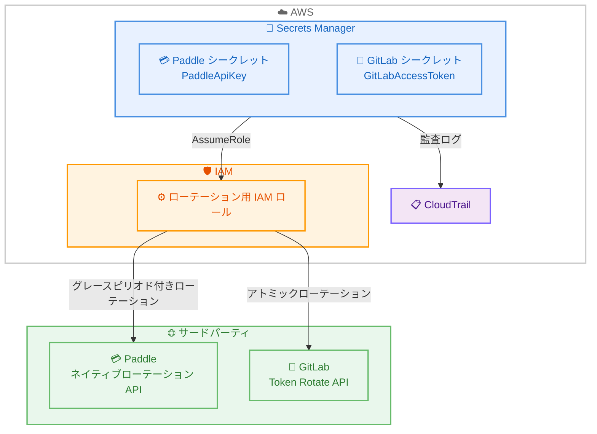

# AWS Secrets Manager - Paddle および GitLab 向けマネージド外部シークレットサポート

**リリース日**: 2026 年 7 月 6 日
**サービス**: AWS Secrets Manager
**機能**: Managed External Secrets (Paddle API Keys / GitLab Access Tokens)

📊 [このアップデートのインフォグラフィックを見る](https://takech9203.github.io/aws-news-summary/20260706-secrets-manager-managed-external-secrets-paddle-gitlab.html)

## 概要

AWS Secrets Manager のマネージド外部シークレット機能に、Paddle API キーおよび GitLab アクセストークンのサポートが追加された。これにより、サードパーティサービスの認証情報を AWS Secrets Manager から直接自動ローテーションでき、カスタム Lambda 関数の作成・維持が不要になる。

マネージド外部シークレットは、サードパーティアプリケーションの認証情報を各パートナーが定義した事前定義フォーマットで保存し、自動的にローテーションする機能である。Paddle については、Paddle ネイティブのローテーション API を使用し、設定可能な猶予期間によってアプリケーションが中断なく新しいキーへ移行できる。GitLab については、Personal Access Token、Group Access Token、Project Access Token の 3 種類のアクセストークンを、GitLab のアトミックなローテーションメカニズムでローテーションできる。

今回の発表により、既存の BigID、Confluent Cloud、Datadog、MongoDB Atlas、Salesforce、Snowflake に加え、Paddle と GitLab が新たにサポートされた。

**アップデート前の課題**

- Paddle API キーや GitLab アクセストークンのローテーションにカスタム Lambda 関数の開発・維持が必要だった
- サードパーティごとに異なるローテーションロジックを実装する必要があった
- トークン更新時のダウンタイムを防ぐための猶予期間管理を独自に実装する必要があった

**アップデート後の改善**

- Lambda 関数不要でマネージドローテーションが自動的に実行される
- Paddle では設定可能な猶予期間により中断なくキーを移行できる
- GitLab ではアトミックなローテーションにより新旧トークンの一貫性が保証される

## アーキテクチャ図



Secrets Manager がサービスプリンシパルとして IAM ロールを引き受け、Paddle のネイティブローテーション API や GitLab の Token Rotate API に対してローテーション操作を直接実行する。Lambda 関数はアカウント内にデプロイされない。

## サービスアップデートの詳細

### 主要機能

1. **Paddle API キーのマネージドローテーション**
   - シークレットタイプ `PaddleApiKey` として単一シークレットアーキテクチャで管理 (管理用シークレット不要)
   - Paddle のネイティブローテーション API を使用し、API キーが自身をローテーション
   - 設定可能な猶予期間 (`gracePeriodSeconds`: 0-86400 秒、デフォルト 300 秒) で旧キーを段階的に無効化
   - ローテーション後、新キーは AWSPENDING として保存され、`/check/whoami` エンドポイントで検証後に AWSCURRENT へ昇格

2. **GitLab アクセストークンのマネージドローテーション**
   - シークレットタイプ `GitLabAccessToken` として、3 種類のトークンをサポート
     - Personal Access Token: `projectId` と `groupId` の両方が未指定の場合
     - Project Access Token: `projectId` を指定した場合
     - Group Access Token: `groupId` を指定した場合
   - GitLab の Token Rotate API を使用し、新トークンの作成と旧トークンの無効化をアトミックに実行
   - 単一シークレット (自己ローテーション) と 2 シークレット (管理者アシスト) の両アーキテクチャに対応

3. **Lambda 不要のマネージドローテーション**
   - カスタム Lambda 関数の作成・デプロイ・管理が一切不要
   - コンソールでシークレット作成時にローテーションが自動的に有効化
   - AWS CloudTrail による全操作の完全な監査証跡

## 技術仕様

### サポートされるシークレットタイプ

| インテグレーションパートナー | シークレットタイプ | 用途 |
|------|----------|----------|
| Paddle | PaddleApiKey | Paddle API キーの自動ローテーション |
| GitLab | GitLabAccessToken | Personal / Group / Project アクセストークンの自動ローテーション |

### Paddle API キーのシークレットフォーマット

**シークレット値:**

```json
{
  "api_key": "{{Paddle API キー値}}"
}
```

`api_key` は `pdl_live_`、`pdl_test_`、または `pdl_sdbx_` で始まり、`apikey_` とキー本体が続く。このフィールドがローテーション対象となる。

**ローテーションメタデータ:**

```json
{
  "gracePeriodSeconds": "300"
}
```

| パラメータ | 説明 | デフォルト値 | 範囲 |
|------|----------|----------|----------|
| gracePeriodSeconds | ローテーション後に旧 API キーが有効なままとなる秒数。0 に設定すると即時失効 | 300 | 0-86400 |

猶予期間のカウントダウンは、新しいキーが初めて正常に使用された時点で開始される。

### GitLab アクセストークンのシークレットフォーマット

**シークレット値:**

```json
{
  "token": "{{GitLab アクセストークン値}}",
  "tokenId": "{{数値のトークン ID}}",
  "gitlabUrl": "{{GitLab インスタンス URL}}",
  "projectId": "{{プロジェクト ID (オプション)}}",
  "groupId": "{{グループ ID (オプション)}}"
}
```

| フィールド | 説明 |
|------|----------|
| token | GitLab アクセストークン値 (`glpat-` で始まる)。ローテーション対象 |
| tokenId | 数値のトークン ID。ローテーションごとに新トークンの ID に更新される |
| gitlabUrl | GitLab インスタンスの URL (例: `https://gitlab.com`)。HTTPS 必須 |
| projectId | (オプション) 数値のプロジェクト ID。Project アクセストークンの場合のみ指定 |
| groupId | (オプション) 数値のグループ ID。Group アクセストークンの場合のみ指定 |

**ローテーションメタデータ:**

```json
{
  "adminSecretArn": "arn:aws:secretsmanager:us-east-1:111122223333:secret:GitLabAdmin",
  "daysToExpiry": "30"
}
```

| パラメータ | 説明 | 範囲 |
|------|----------|----------|
| adminSecretArn | (オプション) このシークレットをローテーションするために使用する、`api` スコープの GitLab アクセストークンを含む `GitLabAccessToken` タイプのシークレット ARN。省略した場合はトークンが自己ローテーションする | - |
| daysToExpiry | (オプション) 新トークンの有効期限までの日数。GitLab ローテーション API の `expires_at` にマッピングされる。省略時はインスタンスのデフォルト有効期限を継承 | 1-365 |

自己ローテーションの場合はトークンに `api` または `self_rotate` スコープが必要。管理者アシストローテーションの場合、Project トークンには管理者トークンにプロジェクトの Maintainer ロール、Group トークンには グループの Owner ロールが必要となる。

### API 変更履歴

今回のアップデートに関連する API 変更は awsapichanges.com で確認された範囲内では検出されなかった。既存の `CreateSecret` API および `RotateSecret` API のシークレットタイプパラメータとして、新しい値 (PaddleApiKey、GitLabAccessToken) が追加される形で実装されている。

### IAM 権限設定

**ローテーション用 IAM ポリシー例 (Paddle):**

```json
{
  "Version": "2012-10-17",
  "Statement": [
    {
      "Sid": "AllowRotationAccess",
      "Action": [
        "secretsmanager:DescribeSecret",
        "secretsmanager:GetSecretValue",
        "secretsmanager:PutSecretValue",
        "secretsmanager:UpdateSecretVersionStage"
      ],
      "Resource": "*",
      "Effect": "Allow",
      "Condition": {
        "StringEquals": {
          "secretsmanager:resource/Type": "PaddleApiKey"
        }
      }
    }
  ]
}
```

**信頼ポリシー例:**

```json
{
  "Version": "2012-10-17",
  "Statement": [
    {
      "Sid": "SecretsManagerPrincipalAccess",
      "Effect": "Allow",
      "Principal": {
        "Service": "secretsmanager.amazonaws.com"
      },
      "Action": "sts:AssumeRole",
      "Condition": {
        "StringEquals": {
          "aws:SourceAccount": "111122223333"
        },
        "ArnLike": {
          "aws:SourceArn": "arn:aws:secretsmanager:us-east-1:111122223333:secret:*"
        }
      }
    }
  ]
}
```

GitLab の管理者アシストローテーションを使用する場合、管理用シークレット (同じく `GitLabAccessToken` タイプ) の ARN にスコープされたステートメントをロールポリシーに明示的に追加する必要がある。

## 設定方法

### 前提条件

1. AWS Secrets Manager へのアクセス権限を持つ IAM ロールまたはユーザー
2. Paddle の場合: Paddle ダッシュボードで「rotatable」オプションを有効化して作成した API キー (ローテーション不可のキーはエラーで拒否される)
3. GitLab の場合: 自己ローテーションには `api` または `self_rotate` スコープ、管理者アシストローテーションには対象トークンをローテーションできる権限を持つ管理用トークン

### 手順

#### ステップ 1: Paddle API キーシークレットの作成とローテーション設定

```bash
# シークレット作成
aws secretsmanager create-secret \
  --name "paddle/api-key" \
  --secret-string '{
    "api_key": "pdl_live_apikey_your-key-content"
  }' \
  --secret-type PaddleApiKey

# ローテーション設定 (30 日ごと、猶予期間 300 秒)
aws secretsmanager rotate-secret \
  --secret-id "paddle/api-key" \
  --rotation-rules '{"AutomaticallyAfterDays": 30}' \
  --rotation-metadata '{"gracePeriodSeconds": "300"}' \
  --role-arn "arn:aws:iam::111122223333:role/SecretsManagerRotationRole"
```

Paddle API キーのシークレットを作成し、30 日ごとの自動ローテーションを設定する。管理用シークレットは不要で、API キーが自身をローテーションする。

#### ステップ 2: GitLab Project アクセストークンシークレットの作成とローテーション設定

```bash
# シークレット作成 (Project アクセストークン: projectId を指定)
aws secretsmanager create-secret \
  --name "gitlab/project-token" \
  --secret-string '{
    "token": "glpat-your-token-value",
    "tokenId": "12345",
    "gitlabUrl": "https://gitlab.com",
    "projectId": "67890"
  }' \
  --secret-type GitLabAccessToken

# ローテーション設定 (自己ローテーション、有効期限 30 日)
aws secretsmanager rotate-secret \
  --secret-id "gitlab/project-token" \
  --rotation-rules '{"AutomaticallyAfterDays": 25}' \
  --rotation-metadata '{"daysToExpiry": "30"}' \
  --role-arn "arn:aws:iam::111122223333:role/SecretsManagerRotationRole"
```

GitLab の Project アクセストークンのシークレットを作成する。`projectId` を指定することで Project アクセストークンとして認識される。25 日ごとにローテーションし、新トークンの有効期限を 30 日に設定する。

#### ステップ 3: GitLab 管理者アシストローテーションの設定 (オプション)

```bash
# 管理用トークン (api スコープ) のシークレットを作成
aws secretsmanager create-secret \
  --name "gitlab/admin-token" \
  --secret-string '{
    "token": "glpat-admin-token-value",
    "tokenId": "10000",
    "gitlabUrl": "https://gitlab.com"
  }' \
  --secret-type GitLabAccessToken

# 対象トークンのローテーションに管理用シークレットを指定
aws secretsmanager rotate-secret \
  --secret-id "gitlab/group-token" \
  --rotation-rules '{"AutomaticallyAfterDays": 25}' \
  --rotation-metadata '{
    "adminSecretArn": "arn:aws:secretsmanager:us-east-1:111122223333:secret:gitlab/admin-token-AbCdEf",
    "daysToExpiry": "30"
  }' \
  --role-arn "arn:aws:iam::111122223333:role/SecretsManagerRotationRole"
```

対象トークン自体にローテーション権限がない場合、`api` スコープを持つ管理用トークンを `adminSecretArn` で指定することでローテーションを実行できる。この場合、ロールポリシーに管理用シークレット ARN へのアクセスを明示的に付与する必要がある。

## メリット

### ビジネス面

- **運用コスト削減**: カスタム Lambda 関数の開発・テスト・維持にかかる工数を排除
- **セキュリティ態勢の強化**: 定期的な自動ローテーションにより認証情報の漏洩リスクを低減
- **コンプライアンス対応の簡素化**: CloudTrail による完全な監査証跡で認証情報管理の追跡が容易

### 技術面

- **ゼロダウンタイムローテーション**: Paddle の猶予期間や GitLab のアトミックローテーションにより中断なしでの更新が可能
- **統一的な管理インターフェース**: AWS SDK、CLI、コンソールから複数のサードパーティ認証情報を一元管理
- **最小権限の原則**: シークレットタイプごとに条件キーでスコープダウンされた IAM ポリシーの適用が可能

## デメリット・制約事項

### 制限事項

- Paddle API キーは Paddle ダッシュボードで「rotatable」オプションを有効化して作成したものに限定される (ローテーション不可のキーはエラーで拒否される)
- GitLab の `gitlabUrl` は HTTPS を使用する必要がある
- GitLab の管理者アシストローテーションでは、Project トークンに Maintainer ロール、Group トークンに Owner ロールを持つ管理用トークンが必要

### 考慮すべき点

- Paddle の猶予期間のカウントダウンは新しいキーが初めて正常に使用された時点で開始されるため、キーがしばらく使用されない場合は旧キーが想定より長く有効なままとなる
- GitLab では `daysToExpiry` (トークン有効期限) をローテーションスケジュールより長い値に設定する必要がある (ローテーション間隔 < トークン有効期限)
- Secrets Manager のキャッシュライブラリを使用するアプリケーションは、次回のリフレッシュ時に新しいトークンを自動的に取得する

## ユースケース

### ユースケース 1: SaaS 決済プラットフォームの API キー管理

**シナリオ**: Paddle を決済プロバイダーとして利用する SaaS 企業。本番環境の Paddle API キーをアプリケーションから利用しており、セキュリティポリシーにより定期的なキーローテーションが求められている。

**実装例**:
```bash
# Paddle 本番 API キーを Secrets Manager で管理
aws secretsmanager create-secret \
  --name "billing/paddle-live-key" \
  --secret-string '{"api_key": "pdl_live_apikey_..."}' \
  --secret-type PaddleApiKey

# 30 日ごとのローテーション、猶予期間 600 秒
aws secretsmanager rotate-secret \
  --secret-id "billing/paddle-live-key" \
  --rotation-rules '{"AutomaticallyAfterDays": 30}' \
  --rotation-metadata '{"gracePeriodSeconds": "600"}' \
  --role-arn "arn:aws:iam::111122223333:role/PaddleRotationRole"
```

**効果**: 600 秒の猶予期間により、稼働中の決済処理が新旧キーの切り替えタイミングで中断されることなく、セキュリティ要件を満たしたローテーションを実現

### ユースケース 2: CI/CD パイプラインの GitLab プロジェクトトークン管理

**シナリオ**: GitLab を利用する開発チームが、CI/CD パイプラインや外部連携で Project アクセストークンを使用している。トークンの有効期限管理と定期ローテーションを自動化したい。

**実装例**:
```bash
# Project アクセストークンを管理
aws secretsmanager create-secret \
  --name "cicd/gitlab-project-token" \
  --secret-string '{
    "token": "glpat-...",
    "tokenId": "54321",
    "gitlabUrl": "https://gitlab.com",
    "projectId": "98765"
  }' \
  --secret-type GitLabAccessToken

# 60 日ごとのローテーション、有効期限 90 日
aws secretsmanager rotate-secret \
  --secret-id "cicd/gitlab-project-token" \
  --rotation-rules '{"AutomaticallyAfterDays": 60}' \
  --rotation-metadata '{"daysToExpiry": "90"}' \
  --role-arn "arn:aws:iam::111122223333:role/GitLabRotationRole"
```

**効果**: トークンの有効期限切れによるパイプライン障害を防ぎ、アトミックローテーションにより新旧トークンの一貫性を保証

### ユースケース 3: 中央管理トークンによる複数 GitLab グループトークンのローテーション

**シナリオ**: 多数の GitLab グループを運用する組織が、各グループの Group アクセストークンを中央の管理用トークンで一括ローテーションしたい。個々のトークンに自己ローテーション権限を付与したくない。

**実装例**:
```bash
# 各グループの Group アクセストークンを管理
aws secretsmanager create-secret \
  --name "org/gitlab-group-a-token" \
  --secret-string '{
    "token": "glpat-group-a-token",
    "tokenId": "20001",
    "gitlabUrl": "https://gitlab.com",
    "groupId": "3001"
  }' \
  --secret-type GitLabAccessToken

# 中央の管理用トークンを参照してローテーション
aws secretsmanager rotate-secret \
  --secret-id "org/gitlab-group-a-token" \
  --rotation-rules '{"AutomaticallyAfterDays": 30}' \
  --rotation-metadata '{
    "adminSecretArn": "arn:aws:secretsmanager:us-east-1:111122223333:secret:org/gitlab-admin-token-AbCdEf",
    "daysToExpiry": "45"
  }' \
  --role-arn "arn:aws:iam::111122223333:role/GitLabGroupRotationRole"
```

**効果**: 各グループトークンに広範な権限を付与せず、Owner ロールを持つ中央の管理用トークンでローテーションを一元管理。最小権限の原則を維持しつつ運用を効率化

## 料金

AWS Secrets Manager の標準料金が適用される。マネージド外部シークレットやローテーション機能に対する追加料金はない。

### 料金例

| 項目 | 月額料金 (概算) |
|--------|------------------|
| シークレット保存 (1 シークレットあたり) | $0.40 |
| API コール (10,000 回あたり) | $0.05 |
| Paddle 1 シークレット + GitLab 3 シークレット = 4 シークレット | $1.60 |
| ローテーション関連 API コール (月 4 回 x 4 シークレット) | $0.05 未満 |

ローテーションによる新バージョン作成には追加のシークレット保存料金は発生しない。

## 利用可能リージョン

AWS Secrets Manager のマネージド外部シークレットがサポートされているすべての AWS リージョンで利用可能。

## 関連サービス・機能

- **AWS Secrets Manager ローテーション**: Lambda ベースのカスタムローテーションと比較して、マネージド外部シークレットは Lambda 不要で動作
- **AWS CloudTrail**: マネージド外部シークレットの全ローテーション操作が自動的に記録される
- **AWS IAM**: シークレットタイプごとの条件キーによるきめ細かなアクセス制御
- **AWS KMS**: カスタマーマネージドキーによるシークレット値の暗号化

## 参考リンク

- 📊 [インフォグラフィック](https://takech9203.github.io/aws-news-summary/20260706-secrets-manager-managed-external-secrets-paddle-gitlab.html)
- [公式発表 (What's New)](https://aws.amazon.com/about-aws/whats-new/2026/07/secrets-manager-managed-external-secrets-paddle-gitlab/)
- [マネージド外部シークレット ドキュメント](https://docs.aws.amazon.com/secretsmanager/latest/userguide/managed-external-secrets.html)
- [インテグレーションパートナー一覧](https://docs.aws.amazon.com/secretsmanager/latest/userguide/mes-partners.html)
- [Paddle API Key パートナードキュメント](https://docs.aws.amazon.com/secretsmanager/latest/userguide/mes-partner-PaddleApiKey.html)
- [GitLab Access Token パートナードキュメント](https://docs.aws.amazon.com/secretsmanager/latest/userguide/mes-partner-GitLabAccessToken.html)
- [セキュリティと権限](https://docs.aws.amazon.com/secretsmanager/latest/userguide/mes-security.html)
- [料金ページ](https://aws.amazon.com/secrets-manager/pricing/)

## まとめ

AWS Secrets Manager のマネージド外部シークレットに Paddle と GitLab が追加されたことで、決済プラットフォームや DevOps ツールチェーンの認証情報のライフサイクル管理がさらに簡素化された。Paddle の設定可能な猶予期間と GitLab のアトミックローテーションにより、中断なくセキュアなローテーションを実現できる。Paddle や GitLab を利用している組織は、既存の認証情報管理をマネージド外部シークレットに移行することを推奨する。
