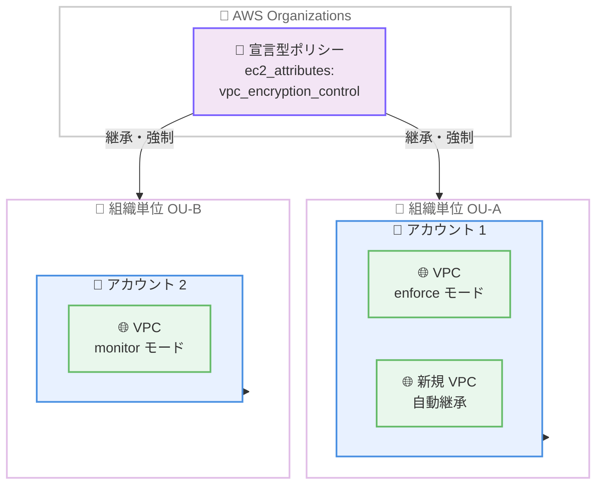

# Amazon VPC - VPC Encryption Controls の宣言型ポリシー対応

**リリース日**: 2026 年 7 月 6 日
**サービス**: Amazon Virtual Private Cloud (Amazon VPC)
**機能**: 宣言型ポリシー (Declarative Policies) による VPC Encryption Controls の一元管理

📊 [このアップデートのインフォグラフィックを見る](https://takech9203.github.io/aws-news-summary/20260706-vpc-encryption-controls-declarative-controls.html)
<!-- INFOGRAPHIC_BASE_URL は環境変数から取得 -->

## 概要

AWS は、AWS Organizations の宣言型ポリシー (Declarative Policies) を利用して、環境内のすべての VPC に対して VPC Encryption Controls をモニターモードまたは強制モードで有効化できる機能を発表しました。これにより、お客様は希望する VPC Encryption Controls の設定を一元的に定義および管理し、環境全体に適用できるようになります。

VPC Encryption Controls は、Amazon VPC 内および VPC 間の転送中の暗号化 (encryption in transit) を監査および強制するためのツールを提供します。また、HIPAA、FedRAMP、PCI などの暗号化標準への準拠を証明するためにも役立ちます。今回のアップデートにより、これらの制御をアカウント、組織、または特定の組織単位 (OU) 単位で行使できます。

本機能は、VPC Encryption Controls をサポートするすべての AWS リージョンで利用可能です。AWS Organizations における宣言型ポリシーの利用に追加料金は発生しません。

**アップデート前の課題**

これまで、お客様は VPC ごとに個別に対応する必要がありました。

- 以前は、各 VPC で個別に Encryption Controls をモニターモードまたは強制モードで有効化する必要がありました
- 以前は、除外設定 (exclusions) を各 VPC で個別に構成する必要がありました
- 以前は、新規に作成される VPC に対して設定が自動的に引き継がれず、都度手動で対応する必要がありました

**アップデート後の改善**

今回のアップデートにより、単一のポリシーで環境全体を管理できるようになりました。

- 今回のアップデートにより、単一の宣言型ポリシーで既存および将来のすべての VPC に希望する暗号化制御設定を強制できるようになりました
- 今回のアップデートにより、VPC ごとの個別設定が不要になり、一元的な定義と維持が可能になりました
- 今回のアップデートにより、組織に新規参加したアカウントや新規作成された VPC にも設定が自動的に継承されるようになりました

## アーキテクチャ図



宣言型ポリシーを組織のルート、OU、またはアカウントにアタッチすると、スコープ内のすべての既存 VPC および将来作成される VPC に暗号化制御設定が継承・強制されます。

## サービスアップデートの詳細

### 主要機能

1. **宣言型ポリシーによる一元管理**
   - AWS Organizations の EC2 宣言型ポリシー (`ec2_attributes`) の `vpc_encryption_control` 属性を使用して設定を定義します
   - 組織全体、特定の OU、または個別アカウントにポリシーをアタッチできます
   - 組織に参加した新規アカウントは、組織にアタッチされたポリシーを自動的に継承します

2. **モニターモードと強制モードの選択**
   - `attempt_monitor`: スコープ内のすべての VPC をモニターモードへ移行します。モニターモードはトラフィックフローの暗号化状態を監査し、暗号化されていないトラフィックを許可するリソースを特定します
   - `attempt_enforce`: スコープ内のすべての VPC を強制モードへ移行します。強制モードは、常に転送中のトラフィックを暗号化するサービスのみを VPC で許可します
   - `unmanaged`: VPC Encryption Controls を無効化します

3. **リソースタイプ単位の除外設定**
   - 転送中の暗号化をサポートしないリソースタイプを除外 (exclusions) として指定できます
   - 除外可能なリソースタイプ: `internet_gateway`、`nat_gateway`、`vpc_lattice`、`vpc_peering`、`lambda`、`egress_only_internet_gateway`、`elastic_file_system`、`virtual_private_gateway`
   - 除外の優先順位は、組織 → OU → アカウント → VPC の順です

## 技術仕様

### mode 属性の値

| 値 | 説明 |
|------|------|
| `unmanaged` | VPC Encryption Controls を無効化。ポリシーをデタッチすると、アカウントレベルの設定は以前の状態にロールバック |
| `attempt_monitor` | スコープ内のすべての VPC をモニターモードへ移行。新規 VPC もモニターモードで作成 |
| `attempt_enforce` | スコープ内のすべての VPC を強制モードへ移行。移行前にまずモニターモードに配置し、その後自動的に強制モードへ遷移 |

### API変更履歴

| 日付 | サービス | 変更内容 |
|------|----------|----------|
| 2026/07/01 | [Amazon Elastic Compute Cloud](https://awsapichanges.com/archive/changes/3f2954-ec2.html) | 2 new 4 updated api methods - 宣言型ポリシーによる VPC Encryption Controls の有効化などに対応 |

### ポリシー設定例

```json
{
  "ec2_attributes": {
    "vpc_encryption_control": {
      "mode": {
        "@@assign": "attempt_enforce"
      },
      "exclusions": {
        "@@assign": ["internet_gateway", "nat_gateway", "vpc_lattice"]
      }
    }
  }
}
```

## 設定方法

### 前提条件

1. AWS Organizations で組織を設定し、すべての機能 (all features) が有効になっていること
2. 宣言型ポリシー (Declarative Policies) が組織で有効化されていること
3. VPC Encryption Controls をサポートするリージョンで利用していること

### 手順

#### ステップ1: モニターモードで全体を検証する

まず組織全体で `attempt_monitor` を適用し、暗号化されていないトラフィックを許可しているリソースを特定します。強制モードへ移行する前に、アカウントステータスレポートで各 VPC に除外できない非準拠リソースが存在しないことを確認します。

#### ステップ2: 除外設定を構成する

転送中の暗号化をサポートしないリソース (インターネットゲートウェイ、NAT ゲートウェイ、Amazon VPC Lattice など) について、リージョンごとに `exclusions` を設定します。これにより、強制モードへの移行時にこれらのリソースが原因で移行が失敗することを防ぎます。

#### ステップ3: 強制モードへ移行する

準拠状況を確認した後、`mode` を `attempt_enforce` に変更してポリシーを更新します。サービスは対象 VPC を一度モニターモードに配置してから、自動的に強制モードへ遷移させます。移行が失敗した場合は、`DescribeVpcEncryptionControls` で失敗した VPC を特定し、`GetVpcResourcesBlockingEncryptionEnforcement` で違反リソースを確認します。

## メリット

### ビジネス面

- **コンプライアンスの証明**: HIPAA、FedRAMP、PCI などの暗号化標準への準拠を組織全体で一貫して証明できます
- **運用負荷の削減**: VPC ごとの個別設定が不要になり、単一のポリシーで管理できるため、運用コストが削減されます
- **ガバナンスの強化**: アカウント、OU、組織単位で暗号化制御を一元的に適用でき、セキュリティガバナンスが向上します

### 技術面

- **設定の自動維持**: 宣言型ポリシーはサービスのコントロールプレーンで強制されるため、新機能や新規 API が追加されても設定が維持されます
- **新規リソースへの自動適用**: 新規に作成される VPC や組織に参加した新規アカウントにも設定が自動的に継承されます
- **柔軟な除外制御**: リソースタイプ単位、リージョン単位で除外を設定でき、段階的な強制展開が可能です

## デメリット・制約事項

### 制限事項

- ポリシーを使用すると、対象 VPC の所有者は VPC レベルで `ModifyVpcEncryptionControl`、`DeleteVpcEncryptionControl`、`CreateVpcEncryptionControl` などの操作を実行できなくなります
- 強制モードへの移行は、VPC に除外でカバーされない非準拠リソースが含まれている場合に失敗し、これらの VPC はモニターモードのまま enforce-failed 状態になります
- VPC Encryption Controls をサポートするリージョンでのみ利用可能です

### 考慮すべき点

- ポリシーをデタッチすると、アカウントレベルの暗号化制御設定はアタッチ前の状態にロールバックされます
- 除外の優先順位は組織 → OU → アカウント → VPC の順であり、上位レベルの設定が下位レベルを上書きします。トップダウンで展開計画を立てる必要があります
- VPC ピアリングの除外は、強制モードの VPC をモニターモードに戻す前に削除する必要があります

## ユースケース

### ユースケース1: 規制対象ワークロードのコンプライアンス強制

**シナリオ**: HIPAA 対象の医療データを扱う組織が、すべての VPC で転送中の暗号化を強制し、監査に備えたい。

**実装例**:
```json
{
  "ec2_attributes": {
    "vpc_encryption_control": {
      "mode": { "@@assign": "attempt_enforce" }
    }
  }
}
```

**効果**: 組織全体で転送中の暗号化が一元的に強制され、コンプライアンス要件を満たすことを継続的に証明できます。

### ユースケース2: 段階的な暗号化制御の展開

**シナリオ**: 大規模なマルチアカウント環境で、まず暗号化状態を可視化してから強制モードへ段階的に移行したい。

**実装例**:
```json
{
  "ec2_attributes": {
    "vpc_encryption_control": {
      "mode": { "@@assign": "attempt_monitor" }
    }
  }
}
```

**効果**: モニターモードで非準拠リソースを特定した後、除外設定を整備してから強制モードへ安全に移行できます。

### ユースケース3: 特定 OU への限定適用

**シナリオ**: 本番環境の OU にのみ厳格な暗号化強制を適用し、開発環境の OU では監査のみにとどめたい。

**実装例**:
```
本番 OU: mode = attempt_enforce
開発 OU: mode = attempt_monitor
```

**効果**: 環境の特性に応じて暗号化制御のレベルを OU 単位で柔軟に使い分けられます。

## 料金

AWS Organizations における宣言型ポリシーの利用に追加料金は発生しません。VPC Encryption Controls 自体の利用にも追加料金はかかりません。

## 利用可能リージョン

VPC Encryption Controls をサポートするすべての AWS リージョンで利用可能です。

## 関連サービス・機能

- **AWS Organizations**: 宣言型ポリシーの定義・アタッチ・継承管理を担う基盤サービスです
- **Amazon VPC**: 暗号化制御の対象となるネットワーク基盤です
- **AWS Control Tower**: 宣言型ポリシーをコンソールやガードレールとして展開する際に連携できます

## 参考リンク

- 📊 [インフォグラフィック](https://takech9203.github.io/aws-news-summary/20260706-vpc-encryption-controls-declarative-controls.html)
- [公式発表 (What's New)](https://aws.amazon.com/about-aws/whats-new/2026/07/vpc-encryption-controls-declarative-controls/)
- [宣言型ポリシー (AWS Organizations ドキュメント)](https://docs.aws.amazon.com/organizations/latest/userguide/orgs_manage_policies_declarative.html)
- [EC2 ポリシー構文と例](https://docs.aws.amazon.com/organizations/latest/userguide/orgs_manage_policies_ec2_syntax.html)
- [VPC Encryption Controls (Amazon VPC ドキュメント)](https://docs.aws.amazon.com/vpc/latest/userguide/vpc-encryption-controls.html)

## まとめ

このアップデートは、VPC 単位で個別に行っていた転送中の暗号化制御を、宣言型ポリシーによって組織全体で一元管理できるようにする重要な機能強化です。まずモニターモードで環境全体の暗号化状態を可視化し、除外設定を整備した上で強制モードへ段階的に移行することを推奨します。HIPAA、FedRAMP、PCI などの規制要件を持つ組織は、本機能を活用してコンプライアンスの継続的な証明と運用負荷の削減を実現できます。
