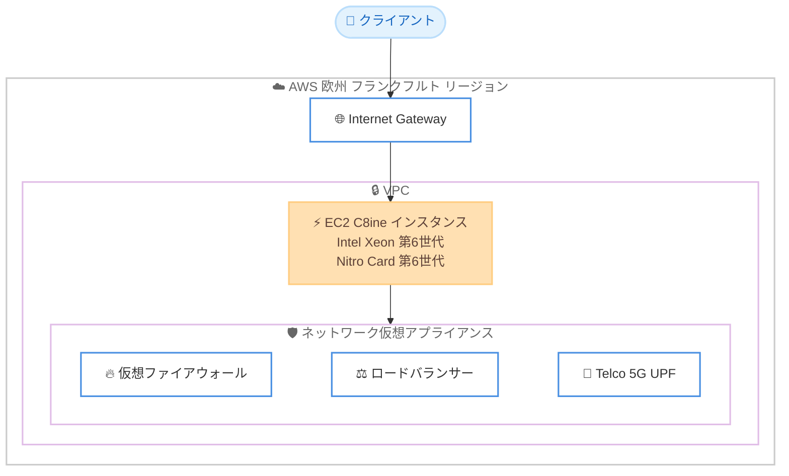

# Amazon EC2 C8ine インスタンス - 欧州 (フランクフルト) リージョンで提供開始

**リリース日**: 2026 年 7 月 7 日
**サービス**: Amazon EC2
**機能**: C8ine インスタンス (ネットワーク最適化) のリージョン拡大

📊 [このアップデートのインフォグラフィックを見る](https://takech9203.github.io/aws-news-summary/20260707-amazon-ec2-c8ine-aws-frankfurt.html)
<!-- INFOGRAPHIC_BASE_URL は環境変数から取得 -->

## 概要

Amazon EC2 C8ine インスタンスが、AWS 欧州 (フランクフルト) リージョンで利用可能になりました。C8ine インスタンスは、AWS でのみ利用可能なカスタム第 6 世代 Intel Xeon Scalable プロセッサを搭載したネットワーク最適化インスタンスです。最新の第 6 世代 AWS Nitro カードを搭載し、前世代の C6in インスタンスと比較して最大 43% 高いパフォーマンスを提供します。

C8ine インスタンスは、vCPU あたり最大 2.5 倍のパケットパフォーマンスを実現し、インターネットゲートウェイを経由するトラフィックにおいて C6in と比較して最大 2 倍のネットワークスループットを提供します。仮想ファイアウォール、ロードバランサー、Telco 5G UPF (User Plane Function) ワークロードなど、セキュリティおよびネットワーク仮想アプライアンスのために設計されています。

今回のリージョン拡大により、フランクフルトを含む欧州でデータレジデンシー要件やレイテンシー要件を持つお客様が、高性能なネットワーク最適化インスタンスを活用できるようになりました。

**アップデート前の課題**

- C8ine インスタンスは限られたリージョンでのみ利用可能で、欧州リージョンでは利用できなかった
- 欧州でネットワーク集約型ワークロードを実行する際、前世代の C6in インスタンスに依存する必要があった
- データレジデンシー要件を持つ欧州のお客様が、最新世代のネットワーク最適化インスタンスを選択できなかった

**アップデート後の改善**

- 欧州 (フランクフルト) リージョンで最新世代のネットワーク最適化インスタンスが利用可能になった
- 欧州のワークロードでも C6in と比較して最大 43% のパフォーマンス向上を得られるようになった
- データレジデンシー要件を満たしながら、高スループットのネットワーク仮想アプライアンスを実行できるようになった

## アーキテクチャ図

C8ine インスタンスは、インターネットゲートウェイ経由のトラフィックを高スループットで処理し、仮想ファイアウォールやロードバランサーなどのネットワーク仮想アプライアンスを実行するための基盤となります。

## サービスアップデートの詳細

### 主要機能

1. **カスタム第 6 世代 Intel Xeon Scalable プロセッサ**
   - AWS でのみ利用可能なカスタムプロセッサを搭載
   - 全コア持続ターボ周波数 3.9 GHz を実現
   - 常時オンのメモリ暗号化に対応
   - C6in 世代と比較して 8.8 倍大きい L3 キャッシュ

2. **第 6 世代 AWS Nitro カード**
   - 最新の Nitro カードによりネットワーク処理性能を強化
   - vCPU あたり最大 2.5 倍のパケットパフォーマンスを実現
   - インターネットゲートウェイ経由のトラフィックで C6in 比最大 2 倍のネットワークスループット

3. **ネットワーク集約型ワークロードへの最適化**
   - 仮想ファイアウォール、ロードバランサー向けに設計
   - Telco 5G UPF (User Plane Function) ワークロードに対応
   - 全インスタンスサイズで固定ネットワーク帯域幅を提供し、一貫したパフォーマンスを実現

## 技術仕様

### インスタンス仕様

| 項目 | 詳細 |
|------|------|
| プロセッサ | カスタム第 6 世代 Intel Xeon Scalable (AWS 専用) |
| 持続ターボ周波数 | 3.9 GHz (全コア) |
| Nitro Card | 第 6 世代 |
| パフォーマンス向上 | C6in 比最大 43% |
| パケットパフォーマンス | vCPU あたり最大 2.5 倍 (C6in 比) |
| ネットワークスループット | インターネットゲートウェイ経由で最大 2 倍 (C6in 比) |
| メモリ暗号化 | 常時オン |

### 利用可能なインスタンスサイズ

| インスタンスサイズ | vCPU | メモリ (GiB) | ストレージ | ネットワーク帯域幅 (Gbps) | EBS 帯域幅 (Gbps) |
|------|------|------|------|------|------|
| c8ine.large | 2 | 4 | EBS のみ | 3.125 | 最大 10 |
| c8ine.xlarge | 4 | 8 | EBS のみ | 6.25 | 最大 10 |
| c8ine.2xlarge | 8 | 16 | EBS のみ | 12.5 | 最大 10 |
| c8ine.4xlarge | 16 | 32 | EBS のみ | 25 | 最大 10 |
| c8ine.8xlarge | 32 | 64 | EBS のみ | 50 | 10 |
| c8ine.12xlarge | 48 | 96 | EBS のみ | 75 | 15 |

## メリット

### ビジネス面

- **欧州でのデータレジデンシー対応**: フランクフルトリージョンで利用可能になったことで、欧州のデータレジデンシー要件を満たしながら高性能なネットワークワークロードを実行できる
- **コスト最適化**: Savings Plans を活用することで、ネットワーク集約型ワークロードのコストを削減できる
- **パフォーマンス向上**: C6in と比較して最大 43% のパフォーマンス向上により、同じコストでより多くの処理を実行できる

### 技術面

- **高パケットパフォーマンス**: vCPU あたり最大 2.5 倍のパケットパフォーマンスにより、パケット処理集約型のアプライアンスを効率的に実行できる
- **高ネットワークスループット**: インターネットゲートウェイ経由で最大 2 倍のスループットにより、大量のトラフィックを処理できる
- **セキュリティ強化**: 常時オンのメモリ暗号化により、機密性の高いネットワークワークロードを保護できる

## デメリット・制約事項

### 制限事項

- C8ine のインスタンスサイズは 12xlarge までで、他の C8i バリアントのような大規模サイズ (96xlarge など) は提供されていない
- スポットインスタンスや専用ホストなどの購入オプションは、提供状況を確認する必要がある (現時点では Savings Plans とオンデマンドで提供)
- ローカルインスタンスストレージは提供されず、EBS のみのストレージ構成となる

### 考慮すべき点

- 既存の C6in ワークロードから移行する場合、アーキテクチャ (x86) は同一だが、パフォーマンス特性の検証を推奨
- ネットワーク最適化インスタンスであるため、コンピューティング集約型ワークロードには C8i など他のバリアントの方が適している場合がある

## ユースケース

### ユースケース 1: 仮想ファイアウォール

**シナリオ**: 欧州のデータレジデンシー要件を満たしながら、大量のネットワークトラフィックを検査する次世代仮想ファイアウォールを運用する必要がある。

**効果**: vCPU あたり最大 2.5 倍のパケットパフォーマンスにより、高スループットを維持しながらディープパケットインスペクションを実行でき、セキュリティ機能と性能を両立できる。

### ユースケース 2: ロードバランサー

**シナリオ**: サードパーティ製の仮想ロードバランサーを使用して、大規模なトラフィックを複数のバックエンドに分散する必要がある。

**効果**: インターネットゲートウェイ経由で最大 2 倍のネットワークスループットにより、より多くの同時接続とトラフィックを処理でき、スケーラビリティが向上する。

### ユースケース 3: Telco 5G UPF ワークロード

**シナリオ**: 通信事業者が 5G ネットワークの User Plane Function (UPF) をクラウドで運用し、低レイテンシーで大量のユーザートラフィックを処理する必要がある。

**効果**: 固定ネットワーク帯域幅と高いパケット処理能力により、一貫した性能で 5G ユーザープレーントラフィックを処理でき、通信品質を維持できる。

## 料金

C8ine インスタンスは、オンデマンドインスタンスおよび Savings Plans で購入できます。料金はリージョンとインスタンスサイズによって異なります。

詳細な料金については、[Amazon EC2 料金ページ](https://aws.amazon.com/ec2/pricing/) を参照してください。

## 利用可能リージョン

C8ine インスタンスは、以下の AWS リージョンで利用可能です。

- US East (N. Virginia)
- US West (Oregon)
- Asia Pacific (Tokyo)
- Europe (Frankfurt)

## 関連サービス・機能

- **Amazon EC2 C8i / C8i-flex**: 同じ第 6 世代 Intel Xeon プロセッサを搭載した汎用コンピューティング最適化インスタンス
- **AWS Nitro System**: EC2 インスタンスに高パフォーマンス、高セキュリティを提供する基盤
- **Amazon EBS**: EC2 インスタンス向けの高性能ブロックストレージ
- **AWS Savings Plans**: 柔軟な料金モデルでコンピューティングコストを削減する購入オプション

## 参考リンク

- 📊 [インフォグラフィック](https://takech9203.github.io/aws-news-summary/20260707-amazon-ec2-c8ine-aws-frankfurt.html)
- [公式発表 (What's New)](https://aws.amazon.com/about-aws/whats-new/2026/07/amazon-ec2-c8ine-aws-frankfurt/)
- [Amazon EC2 C8i インスタンス](https://aws.amazon.com/ec2/instance-types/c8i/)
- [Amazon EC2 料金ページ](https://aws.amazon.com/ec2/pricing/)

## まとめ

Amazon EC2 C8ine インスタンスが欧州 (フランクフルト) リージョンで提供開始されたことで、欧州のお客様もデータレジデンシー要件を満たしながら最新世代のネットワーク最適化インスタンスを活用できるようになりました。仮想ファイアウォールやロードバランサー、Telco 5G UPF などのネットワーク集約型ワークロードを運用している場合は、C6in からの移行を検討し、パフォーマンスとコストの最適化を実現してください。
