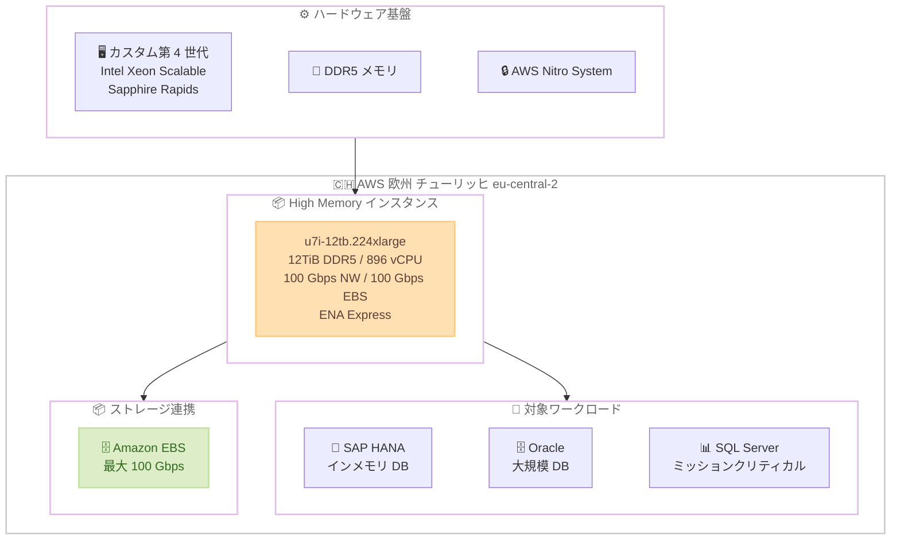

# Amazon EC2 - High Memory U7i インスタンスが欧州 (チューリッヒ) リージョンで利用可能に

**リリース日**: 2026年07月07日
**サービス**: Amazon EC2
**機能**: High Memory U7i-12TB インスタンスの欧州 (チューリッヒ) リージョン展開

📊 [このアップデートのインフォグラフィックを見る](https://takech9203.github.io/aws-news-summary/20260707-amazon-ec2-u7i-aws-europe-zurich.html)

## 概要

Amazon EC2 High Memory U7i-12TB インスタンス (u7i-12tb.224xlarge) が AWS 欧州 (チューリッヒ) リージョン (eu-central-2) で利用可能になりました。これにより、スイスおよび欧州地域のデータレジデンシー要件を持つお客様が、12TiB のメモリを必要とする大規模なインメモリデータベースワークロードをチューリッヒリージョンで直接実行できるようになります。

U7i インスタンスは AWS 第 7 世代のインスタンスファミリーに属し、カスタム第 4 世代 Intel Xeon Scalable Processors (Sapphire Rapids) を搭載しています。DDR5 メモリテクノロジーを採用し、急速に増大するデータ環境においてトランザクション処理のスループットをスケールできます。SAP HANA、Oracle、SQL Server などのミッションクリティカルなインメモリデータベースワークロードに最適化されたインスタンスです。

**アップデート前の課題**

- 欧州 (チューリッヒ) リージョンで U7i-12TB インスタンスが利用できず、12TiB のメモリを必要とするワークロードを他のリージョンに配置する必要があった
- スイスの厳格なデータレジデンシー規制に準拠しつつ、大規模インメモリデータベースを運用する選択肢が限られていた
- チューリッヒリージョンのユーザーが大容量メモリワークロードを実行する場合、リージョン外のインフラに依存する必要があった

**アップデート後の改善**

- 欧州 (チューリッヒ) リージョンで u7i-12tb.224xlarge (12TiB DDR5 メモリ、896 vCPU、100 Gbps ネットワーク) が利用可能になった
- スイスのデータ主権要件を満たしながら、高性能なインメモリデータベース環境を構築できるようになった
- 急成長するデータ環境において、トランザクション処理のスループットをチューリッヒリージョン内でスケールできるようになった

## アーキテクチャ図



U7i-12TB インスタンスがチューリッヒリージョンで提供され、SAP HANA、Oracle、SQL Server などのミッションクリティカルなインメモリデータベースワークロードに最適化されています。

## サービスアップデートの詳細

### 主要機能

1. **U7i-12TB インスタンス (u7i-12tb.224xlarge)**
   - 12TiB の DDR5 メモリを搭載し、大規模なインメモリデータベースに対応
   - 896 vCPU による高い並列処理能力
   - 100 Gbps のネットワーク帯域幅
   - 100 Gbps の EBS 帯域幅により、高速なデータロードとバックアップを実現
   - ENA Express による低レイテンシーネットワーキング

2. **トランザクション処理のスケーラビリティ**
   - 急速に増大するデータ環境でトランザクション処理のスループットをスケール
   - 大容量 DDR5 メモリによるインメモリ処理性能の向上
   - Sapphire Rapids プロセッサによる演算性能の向上

3. **スイスリージョンでのデータ主権対応**
   - 欧州 (チューリッヒ) リージョン (eu-central-2) での直接実行
   - スイスおよび欧州のデータレジデンシー要件への対応

## 技術仕様

### インスタンス仕様

| 項目 | 詳細 |
|------|------|
| インスタンスサイズ | u7i-12tb.224xlarge |
| メモリ | 12 TiB DDR5 |
| vCPU | 896 |
| プロセッサ | カスタム第 4 世代 Intel Xeon Scalable (Sapphire Rapids) |
| ネットワーク帯域幅 | 最大 100 Gbps |
| EBS 帯域幅 | 最大 100 Gbps |
| ENA Express | 対応 |
| インスタンス世代 | AWS 第 7 世代 |

### プロセッサアーキテクチャ

| 項目 | 詳細 |
|------|------|
| プロセッサ世代 | カスタム第 4 世代 Intel Xeon Scalable |
| コードネーム | Sapphire Rapids |
| メモリ規格 | DDR5 |
| インスタンス世代 | AWS 第 7 世代 |
| 仮想化基盤 | AWS Nitro System |

## 設定方法

### 前提条件

1. AWS アカウントに High Memory インスタンスの起動権限があること
2. 十分な vCPU クォータが設定されていること (896 vCPU が必要)
3. 欧州 (チューリッヒ) リージョン (eu-central-2) へのアクセスが有効であること

### 手順

#### ステップ 1: vCPU クォータの確認と引き上げ

```bash
# 現在の Running On-Demand High Memory instances のクォータを確認
aws service-quotas get-service-quota \
  --service-code ec2 \
  --quota-code L-43DA4232 \
  --region eu-central-2
```

u7i-12tb.224xlarge は 896 vCPU を使用するため、クォータが不足している場合は引き上げリクエストを送信します。

#### ステップ 2: インスタンスの起動

```bash
# U7i-12TB インスタンスの起動
aws ec2 run-instances \
  --instance-type u7i-12tb.224xlarge \
  --image-id ami-xxxxxxxx \
  --subnet-id subnet-xxxxxxxx \
  --security-group-ids sg-xxxxxxxx \
  --region eu-central-2
```

対応する AMI (SAP HANA 用 SUSE Linux Enterprise Server、Red Hat Enterprise Linux など) を選択してインスタンスを起動します。

#### ステップ 3: EBS ボリュームの最適化

```bash
# 高スループット EBS ボリュームのアタッチ (io2 Block Express 推奨)
aws ec2 create-volume \
  --volume-type io2 \
  --size 16384 \
  --iops 256000 \
  --throughput 4000 \
  --availability-zone eu-central-2a \
  --region eu-central-2
```

100 Gbps の EBS 帯域幅を最大限活用するために、io2 Block Express ボリュームの使用を推奨します。

## メリット

### ビジネス面

- **データ主権の確保**: スイスおよび EU のデータレジデンシー要件を満たしながら、大規模インメモリデータベースを運用可能
- **レイテンシー削減**: チューリッヒリージョンでの直接実行により、スイスおよび中央欧州のエンドユーザーへのレイテンシーを削減
- **事業継続性**: ミッションクリティカルなデータベースをリージョン内で完結して運用でき、規制対応と可用性を両立

### 技術面

- **DDR5 メモリ**: DDR4 比で高いメモリ帯域幅を実現し、インメモリデータベースのスループットが向上
- **高い EBS 帯域幅**: 100 Gbps の EBS 帯域幅により、大規模データのロードやバックアップ/リストアが高速化
- **ENA Express**: P99 テールレイテンシーの削減により、トランザクション処理の安定性が向上

## デメリット・制約事項

### 制限事項

- 提供されるのは u7i-12tb.224xlarge (12TiB) の単一サイズのみ
- オンデマンドの場合、高額なインスタンスコスト (時間課金)
- 896 vCPU の大きなクォータが必要で、新規アカウントではクォータ引き上げリクエストが必要

### 考慮すべき点

- SAP HANA ワークロードの場合、SAP 認定 AMI の使用が推奨される
- インスタンスの起動に時間がかかる場合がある (大規模メモリの初期化)
- 可用性を確保するため、Capacity Reservation の事前予約を検討すべき

## ユースケース

### ユースケース 1: SAP HANA のスイス国内運用

**シナリオ**: スイスに本社を置く金融・製造企業が、スイスのデータ保護規制および EU の GDPR 要件を満たしつつ、SAP S/4HANA を大規模に運用する必要がある。

**実装例**:
```bash
# SAP HANA 認定 AMI で U7i-12TB を起動
aws ec2 run-instances \
  --instance-type u7i-12tb.224xlarge \
  --image-id ami-sap-hana-sles15 \
  --region eu-central-2
```

**効果**: 12TiB のメモリで大規模な SAP HANA データベースをスイス国内で運用でき、データ主権要件を満たしながらミッションクリティカルなワークロードを実行可能。

### ユースケース 2: Oracle Database のインメモリ処理

**シナリオ**: 保険会社が Oracle Database のインメモリオプションを使用して、リアルタイム分析とトランザクション処理を同一インスタンスで実行する。

**実装例**:
```bash
# U7i-12TB で Oracle Database を実行
aws ec2 run-instances \
  --instance-type u7i-12tb.224xlarge \
  --image-id ami-oracle-linux-8 \
  --region eu-central-2 \
  --block-device-mappings '[{"DeviceName":"/dev/sda1","Ebs":{"VolumeType":"io2","VolumeSize":4096,"Iops":64000}}]'
```

**効果**: 12TiB メモリと 100 Gbps の EBS 帯域幅により、大規模データセットのインメモリ分析と高速バックアップ/リストアを同時に実現。

### ユースケース 3: SQL Server の大規模 OLTP/OLAP 統合

**シナリオ**: 大規模な EC サイトを運営する企業が SQL Server で OLTP と OLAP を統合し、リアルタイムなビジネスインテリジェンスを実現する。

**実装例**:
```bash
# U7i-12TB で SQL Server Enterprise を実行
aws ec2 run-instances \
  --instance-type u7i-12tb.224xlarge \
  --image-id ami-windows-sql-enterprise \
  --region eu-central-2 \
  --placement "GroupName=cluster-placement-group"
```

**効果**: 12TiB メモリで SQL Server のインメモリ OLTP テーブルとカラムストアインデックスを大規模に活用し、リアルタイム分析基盤を構築。

## 料金

High Memory U7i インスタンスの料金は、オンデマンド、リザーブドインスタンス、Savings Plans で利用可能です。具体的な料金はリージョンとインスタンスタイプにより異なります。

### 料金の考え方

| 購入オプション | 特徴 |
|----------------|------|
| オンデマンド | 時間単位課金、コミットメント不要 |
| リザーブドインスタンス (1 年/3 年) | 最大 60% 以上の割引 |
| Savings Plans | 柔軟なコミットメントベースの割引 |
| Dedicated Host | ライセンス持ち込み (BYOL) に最適 |

**注意**: 具体的な料金については [EC2 料金ページ](https://aws.amazon.com/ec2/pricing/) を参照してください。SAP HANA や Oracle のライセンスコストは別途発生します。

## 利用可能リージョン

今回のアップデートで U7i-12TB インスタンスが利用可能になったリージョンは以下の通りです。

| リージョン | u7i-12tb.224xlarge |
|------------|--------------------|
| 欧州 (チューリッヒ) eu-central-2 | 利用可能 |

その他のリージョンでの提供状況については [EC2 High Memory インスタンスページ](https://aws.amazon.com/ec2/instance-types/u7i/) を参照してください。

## 関連サービス・機能

- **Amazon EBS io2 Block Express**: 100 Gbps の EBS 帯域幅を活用するための高性能ブロックストレージ
- **ENA Express**: シングルフローのレイテンシーを削減し、トランザクション処理の P99 レイテンシーを改善
- **EC2 Capacity Reservations**: 大規模インスタンスの可用性を事前に確保するための機能
- **AWS Nitro System**: セキュリティ、パフォーマンス、信頼性を提供する仮想化基盤

## 参考リンク

- 📊 [インフォグラフィック](https://takech9203.github.io/aws-news-summary/20260707-amazon-ec2-u7i-aws-europe-zurich.html)
- [公式発表 (What's New)](https://aws.amazon.com/about-aws/whats-new/2026/07/amazon-ec2-u7i-aws-europe-zurich/)
- [EC2 High Memory U7i インスタンスタイプ](https://aws.amazon.com/ec2/instance-types/u7i/)
- [EC2 料金ページ](https://aws.amazon.com/ec2/pricing/)

## まとめ

Amazon EC2 High Memory U7i-12TB インスタンスが欧州 (チューリッヒ) リージョンで利用可能になったことで、スイスおよび欧州のデータレジデンシー要件を持つお客様が大規模インメモリデータベースをより近くで運用できるようになりました。12TiB の DDR5 メモリと 896 vCPU を活用することで、SAP HANA、Oracle、SQL Server などのミッションクリティカルなワークロードのトランザクション処理を効率的にスケールできます。スイス国内でのデータ主権対応が求められるお客様は、チューリッヒリージョンへのワークロード配置を検討することを推奨します。
