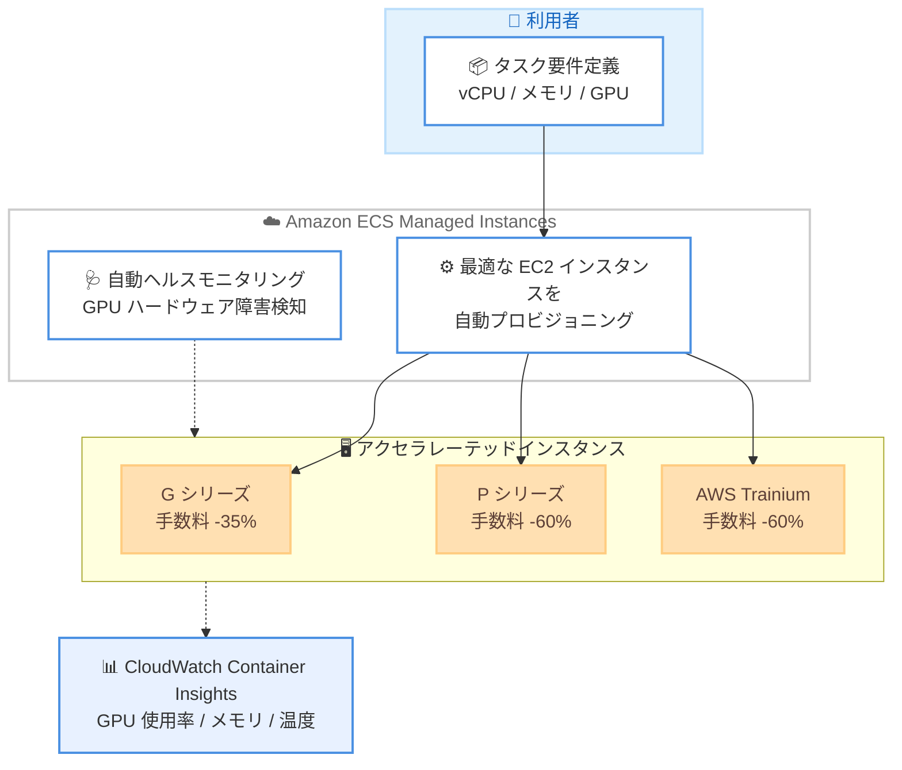

# Amazon ECS Managed Instances - GPU 管理手数料の引き下げ

**リリース日**: 2026 年 7 月 7 日
**サービス**: Amazon Elastic Container Service (Amazon ECS)
**機能**: ECS Managed Instances の GPU 管理手数料引き下げ

📊 [このアップデートのインフォグラフィックを見る](https://takech9203.github.io/aws-news-summary/20260707-amazon-ecs-managed-instances-gpu-price.html)
<!-- INFOGRAPHIC_BASE_URL は環境変数から取得 -->

## 概要

Amazon ECS Managed Instances は、GPU およびアクセラレーテッドインスタンスタイプに対する管理手数料を大幅に引き下げました。2026 年 7 月 1 日より、G シリーズの ECS 管理手数料は 35% 引き下げられ、P シリーズおよび AWS Trainium の管理手数料は 60% 引き下げられます。

この引き下げは自動的に適用されるため、すでに ECS Managed Instances で GPU インスタンスを利用しているお客様は、追加の対応を行う必要はありません。ECS Managed Instances は、タスクの要件 (vCPU、メモリ、CPU アーキテクチャ) に基づいて最適な Amazon EC2 インスタンスを自動的にプロビジョニングおよび運用するフルマネージドのコンピューティングオプションです。

このアップデートは、機械学習の推論やトレーニング、生成 AI ワークロードなど、GPU やアクセラレーターを活用するコンテナワークロードを運用するお客様の総所有コスト (TCO) を削減します。あわせて、Amazon EKS も EKS Auto Mode における GPU インスタンスに対して同一の管理手数料引き下げを実施しています。

**アップデート前の課題**

- GPU および P シリーズ、Trainium などのアクセラレーテッドインスタンスは単価が高く、管理手数料も相対的に大きなコスト要因となっていた
- 高コストな GPU ワークロードを ECS Managed Instances で運用する場合、マネージドの利便性とコストのバランスを慎重に検討する必要があった
- セルフマネージドなインフラ運用と比べて、マネージドサービスの手数料が導入判断の障壁となる場合があった

**アップデート後の改善**

- G シリーズの管理手数料が 35% 引き下げられ、GPU ワークロードのコストが低減された
- P シリーズおよび AWS Trainium の管理手数料が 60% 引き下げられ、大規模なトレーニングや推論ワークロードのコスト効率が向上した
- 引き下げは自動的に適用されるため、既存のお客様は設定変更なしでコスト削減の恩恵を受けられる

## アーキテクチャ図

ECS Managed Instances がタスク要件に基づいてアクセラレーテッドインスタンスを自動プロビジョニングし、CloudWatch Container Insights による GPU メトリクスの収集と自動ヘルスモニタリングを提供する構成を示しています。

## サービスアップデートの詳細

### 主要機能

1. **管理手数料の引き下げ**
   - G シリーズの ECS 管理手数料を 35% 引き下げ
   - P シリーズおよび AWS Trainium の管理手数料を 60% 引き下げ
   - 2026 年 7 月 1 日より適用開始

2. **自動適用**
   - 引き下げは自動的に適用される
   - すでに GPU インスタンスを ECS Managed Instances で利用しているお客様は追加の対応が不要

3. **GPU メトリクスの可視化**
   - Amazon CloudWatch Container Insights を通じて、GPU の使用率、メモリ、温度のメトリクスを取得可能

4. **自動ヘルスモニタリング**
   - GPU 固有のハードウェア障害を検知し、正常でないインスタンスを自動的に置き換えることで、ワークロードの中断を最小限に抑える

## 技術仕様

### 管理手数料の引き下げ率

| インスタンスタイプ | 引き下げ率 | 代表的な用途 |
|------|------|------|
| G シリーズ | 35% | グラフィックス処理、機械学習推論 |
| P シリーズ | 60% | 大規模な機械学習トレーニング、HPC |
| AWS Trainium | 60% | 深層学習モデルのトレーニング |

### インスタンスプロビジョニングの仕組み

| 項目 | 詳細 |
|------|------|
| プロビジョニング方式 | タスク要件 (vCPU、メモリ、CPU アーキテクチャ) に基づく自動選択 |
| インスタンスタイプ指定 | GPU アクセラレーテッド、ネットワーク最適化、バースト可能パフォーマンスなど優先タイプを指定可能 |
| GPU メトリクス | CloudWatch Container Insights で使用率、メモリ、温度を収集 |
| ヘルスモニタリング | GPU ハードウェア障害の検知と自動インスタンス置き換え |

## メリット

### ビジネス面

- **コスト削減**: G シリーズで 35%、P シリーズおよび Trainium で 60% の管理手数料削減により、GPU ワークロードの TCO を低減
- **設定不要**: 引き下げが自動適用されるため、既存ワークロードの変更なしでコストメリットを享受
- **予算の最適化**: 高コストなアクセラレーテッドコンピューティングの運用コストが下がり、より多くのワークロードで採用を検討可能

### 技術面

- **運用負荷の軽減**: ECS Managed Instances による最適な EC2 インスタンスの自動プロビジョニングと運用
- **可視性の向上**: CloudWatch Container Insights による GPU メトリクスの取得で、リソース利用状況を把握しやすい
- **可用性の向上**: GPU 固有のハードウェア障害の自動検知と置き換えにより、ワークロードの中断を最小化

## デメリット・制約事項

### 制限事項

- 引き下げの対象は ECS Managed Instances の管理手数料であり、EC2 インスタンスの利用料金自体は対象外
- ECS Managed Instances が利用可能なリージョンでのみ提供される

### 考慮すべき点

- コスト削減効果は、GPU ワークロードの規模やインスタンスタイプの構成によって異なる
- 管理手数料は総コストの一部であり、実際の削減額は EC2 の利用料金や稼働時間とあわせて評価する必要がある

## ユースケース

### ユースケース1: 機械学習推論ワークロードのコスト最適化

**シナリオ**: G シリーズインスタンスを用いた機械学習推論をコンテナで運用している。マネージドな運用は維持しつつ、コストを削減したい。

**効果**: G シリーズの管理手数料が 35% 引き下げられ、運用の利便性を保ったまま推論ワークロードのコストを削減できます。

### ユースケース2: 大規模モデルトレーニングの TCO 削減

**シナリオ**: P シリーズや AWS Trainium を用いて深層学習モデルの大規模トレーニングを実行している。高コストなアクセラレーテッドインスタンスの運用コストを抑えたい。

**効果**: P シリーズおよび Trainium の管理手数料が 60% 引き下げられ、トレーニングワークロードのコスト効率が大きく向上します。

### ユースケース3: GPU リソースの安定運用

**シナリオ**: 生成 AI アプリケーションを ECS Managed Instances 上で運用しており、GPU ハードウェア障害による中断を抑えたい。

**効果**: 自動ヘルスモニタリングが GPU 固有の障害を検知し、正常でないインスタンスを自動置き換えすることで、ワークロードの中断を最小限に抑えます。

## 料金

2026 年 7 月 1 日より、アクセラレーテッドインスタンスタイプに対する ECS Managed Instances の管理手数料が以下のとおり引き下げられました。

| インスタンスタイプ | 管理手数料の引き下げ率 |
|--------|------------------|
| G シリーズ | 35% |
| P シリーズ | 60% |
| AWS Trainium | 60% |

引き下げは自動的に適用され、既存のお客様による対応は不要です。更新後の詳細な料金体系は、ECS Managed Instances の料金ページで確認できます。なお、この引き下げは管理手数料に適用されるものであり、EC2 インスタンスの利用料金は別途発生します。

## 利用可能リージョン

ECS Managed Instances が利用可能なすべての AWS リージョンで提供されます。

## 関連サービス・機能

- **Amazon EKS (EKS Auto Mode)**: EKS Auto Mode の GPU インスタンスに対して同一の管理手数料引き下げを実施
- **Amazon EC2**: G シリーズ、P シリーズ、AWS Trainium などのアクセラレーテッドインスタンスを提供
- **Amazon CloudWatch Container Insights**: GPU の使用率、メモリ、温度メトリクスの収集と可視化
- **AWS Trainium**: 深層学習トレーニング向けの AWS 独自アクセラレーター

## 参考リンク

- 📊 [インフォグラフィック](https://takech9203.github.io/aws-news-summary/20260707-amazon-ecs-managed-instances-gpu-price.html)
- [公式発表 (What's New)](https://aws.amazon.com/about-aws/whats-new/2026/07/amazon-ecs-managed-instances-gpu-price/)
- [Amazon ECS ドキュメント](https://docs.aws.amazon.com/ecs/)
- [Amazon ECS 料金ページ](https://aws.amazon.com/ecs/pricing/)

## まとめ

今回のアップデートは、GPU およびアクセラレーテッドインスタンスを ECS Managed Instances で運用するお客様にとって、大きなコストメリットをもたらします。引き下げは自動的に適用されるため、既存ワークロードの変更は不要です。GPU ワークロードのコスト構造を見直し、機械学習や生成 AI ワークロードの ECS Managed Instances への集約を検討する好機と言えます。
