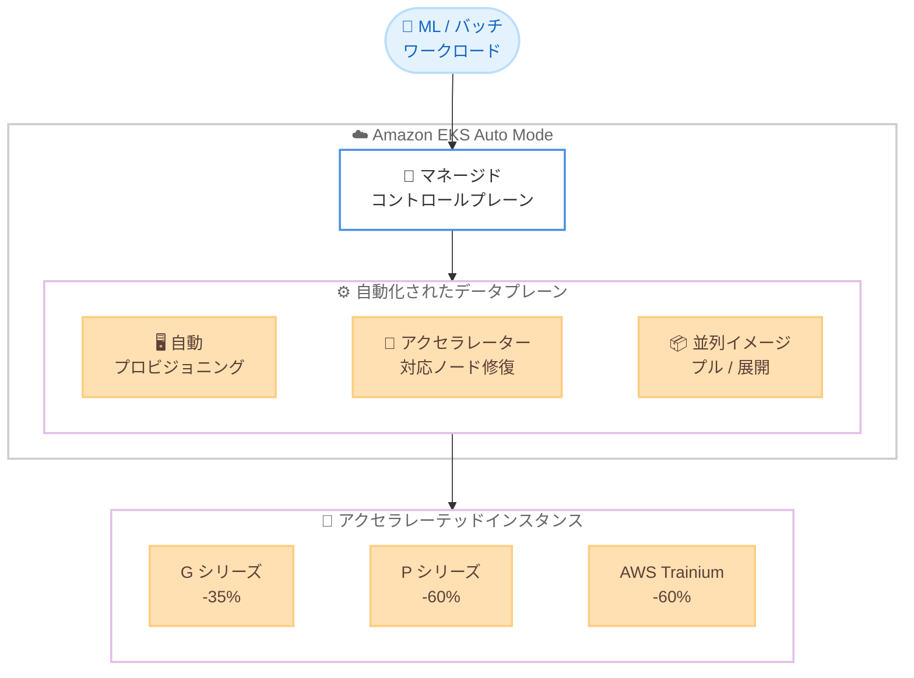

# Amazon EKS Auto Mode - GPU 管理料金の引き下げ

**リリース日**: 2026 年 7 月 7 日
**サービス**: Amazon Elastic Kubernetes Service (Amazon EKS)
**機能**: EKS Auto Mode の GPU / アクセラレーテッドインスタンス管理料金引き下げ

📊 [このアップデートのインフォグラフィックを見る](https://takech9203.github.io/aws-news-summary/20260707-amazon-eks-auto-mode-gpu-price.html)
<!-- INFOGRAPHIC_BASE_URL は環境変数から取得 -->

## 概要

Amazon EKS Auto Mode において、GPU およびアクセラレーテッドインスタンスタイプに対する管理料金が大幅に引き下げられました。2026 年 7 月 1 日以降、G シリーズの Auto Mode 管理料金は 35% 引き下げられ、P シリーズおよび AWS Trainium の管理料金は 60% 引き下げられます。

この料金引き下げは、すべての EKS Auto Mode クラスターに自動的に適用されます。すでに Auto Mode で GPU インスタンスを利用しているお客様は、追加の操作を行う必要はありません。

EKS Auto Mode は、機械学習の推論、ファインチューニング、レンダリング、バッチ処理といったワークロード向けに、インフラストラクチャのプロビジョニングと管理を自動化することで Kubernetes の運用を簡素化します。今回の料金引き下げにより、アクセラレーテッドワークロードを Kubernetes 上で運用する際のコスト効率がさらに向上します。あわせて、Amazon ECS も ECS Managed Instances において同一の管理料金引き下げを実施します。

**アップデート前の課題**

- GPU や AWS Trainium などのアクセラレーテッドインスタンスは単価が高く、Auto Mode の管理料金がワークロード全体のコストに与える影響が大きかった
- ML 推論やファインチューニングなどの大規模なアクセラレーテッドワークロードでは、運用の自動化によるメリットと管理料金のコストのバランスを検討する必要があった
- コスト最適化のために、Auto Mode の利用を GPU ワークロードで見送るケースがあった

**アップデート後の改善**

- G シリーズの管理料金が 35% 引き下げられ、GPU ワークロードのコストが削減された
- P シリーズおよび AWS Trainium の管理料金が 60% 引き下げられ、大規模なアクセラレーテッドワークロードのコスト効率が大幅に向上した
- 料金引き下げが自動的に適用されるため、既存クラスターで追加の設定変更を行うことなくコスト削減の恩恵を受けられる

## アーキテクチャ図

EKS Auto Mode のマネージドコントロールプレーンがワークロードを受け付け、自動化されたデータプレーンが GPU / アクセラレーテッドインスタンスをプロビジョニングします。今回のアップデートで、これらのインスタンスに対する管理料金が引き下げられました。

## サービスアップデートの詳細

### 主要機能

1. **管理料金の引き下げ**
   - 2026 年 7 月 1 日以降、G シリーズの Auto Mode 管理料金を 35% 引き下げ
   - P シリーズおよび AWS Trainium の管理料金を 60% 引き下げ
   - すべての EKS Auto Mode クラスターに自動適用され、お客様側での操作は不要

2. **並列イメージプルと展開**
   - ローカル NVMe ストレージを備えた GPU インスタンス上で、コンテナイメージの並列プルと展開を自動的に実行
   - 大規模なコンテナイメージやモデルイメージの起動を高速化

3. **アクセラレーター対応ノード修復**
   - GPU ハードウェアの障害を検出し、異常なノードを自動的に置き換え
   - アクセラレーテッドワークロードの可用性を維持

## 技術仕様

### 管理料金引き下げの内容

| インスタンスタイプ | 引き下げ率 | 適用開始日 |
|------|------|------|
| G シリーズ | 35% | 2026 年 7 月 1 日 |
| P シリーズ | 60% | 2026 年 7 月 1 日 |
| AWS Trainium | 60% | 2026 年 7 月 1 日 |

### 適用条件

| 項目 | 詳細 |
|------|------|
| 対象 | すべての EKS Auto Mode クラスター |
| 必要な操作 | なし (自動適用) |
| 対象リージョン | EKS Auto Mode が利用可能なすべての AWS リージョン |
| 関連サービス | Amazon ECS Managed Instances でも同一の引き下げを実施 |

## メリット

### ビジネス面

- **アクセラレーテッドワークロードのコスト削減**: P シリーズや AWS Trainium で最大 60%、G シリーズで 35% の管理料金削減により、ML / AI ワークロードの総所有コストが低減される
- **設定変更不要**: 料金引き下げが自動適用されるため、移行作業やクラスターの再構成なしでコストメリットを享受できる
- **Kubernetes 運用の簡素化**: Auto Mode によるインフラ自動管理と料金引き下げの組み合わせにより、コストと運用負荷の両面で最適化が進む

### 技術面

- **高速な起動**: ローカル NVMe ストレージ上での並列イメージプルにより、大規模なモデルイメージやコンテナの起動時間を短縮
- **高い可用性**: アクセラレーター対応ノード修復により、GPU 障害時に自動でノードを置き換え、ワークロードの中断を最小化
- **幅広い適用範囲**: ML 推論、ファインチューニング、レンダリング、バッチ処理など多様なアクセラレーテッドワークロードに対応

## デメリット・制約事項

### 制限事項

- 料金引き下げは EKS Auto Mode を利用している場合に限られ、セルフマネージドのノードグループには適用されない
- 対象は G シリーズ、P シリーズ、AWS Trainium などのアクセラレーテッドインスタンスタイプに限定される
- EKS Auto Mode がサポートされていないリージョンでは利用できない

### 考慮すべき点

- 具体的な料金は Amazon EKS 料金ページの最新のレート表で確認する必要がある
- Auto Mode の管理料金は EC2 インスタンス自体の料金とは別に発生する点に留意する

## ユースケース

### ユースケース1: 大規模 ML 推論の運用コスト最適化

**シナリオ**: P シリーズインスタンスを用いた大規模な機械学習推論サービスを EKS Auto Mode 上で運用している。

**効果**: 管理料金が 60% 引き下げられることで、推論基盤の運用コストを削減しつつ、Auto Mode による自動スケーリングと運用簡素化のメリットを維持できる。

### ユースケース2: AWS Trainium を用いたモデルのファインチューニング

**シナリオ**: AWS Trainium インスタンスを使用してモデルのファインチューニングを定期的に実行している。

**効果**: 60% の管理料金引き下げにより、トレーニングジョブごとのコストが低減される。並列イメージプルによって大規模なトレーニングイメージの起動も高速化される。

### ユースケース3: G シリーズによるレンダリング / バッチ処理

**シナリオ**: G シリーズインスタンスでレンダリングや GPU バッチ処理ワークロードを実行している。

**効果**: 管理料金が 35% 引き下げられ、アクセラレーター対応ノード修復により GPU 障害時にも処理を継続できるため、コストと信頼性の両立が可能になる。

## 料金

2026 年 7 月 1 日以降、EKS Auto Mode の GPU / アクセラレーテッドインスタンスに対する管理料金が以下のとおり引き下げられます。

| インスタンスタイプ | 管理料金の引き下げ率 |
|--------|------------------|
| G シリーズ | 35% 引き下げ |
| P シリーズ | 60% 引き下げ |
| AWS Trainium | 60% 引き下げ |

引き下げ後の具体的なレートは、Amazon EKS 料金ページで確認してください。なお、Auto Mode の管理料金は、EC2 インスタンスの利用料金とは別に発生します。

## 利用可能リージョン

EKS Auto Mode が利用可能なすべての AWS リージョンで、今回の料金引き下げが適用されます。

## 関連サービス・機能

- **Amazon ECS Managed Instances**: ECS でも同一の GPU 管理料金引き下げを実施。詳細は ECS の What's New で確認できる
- **AWS Trainium**: 機械学習トレーニング向けの AWS 独自アクセラレーター。60% の引き下げ対象
- **Amazon EC2 G / P シリーズ**: GPU を搭載したアクセラレーテッドインスタンスファミリー

## 参考リンク

- 📊 [インフォグラフィック](https://takech9203.github.io/aws-news-summary/20260707-amazon-eks-auto-mode-gpu-price.html)
- [公式発表 (What's New)](https://aws.amazon.com/about-aws/whats-new/2026/07/amazon-eks-auto-mode-gpu-price)
- [Amazon EKS 料金ページ](https://aws.amazon.com/eks/pricing/)
- [Amazon EKS ドキュメント (Auto Mode)](https://docs.aws.amazon.com/eks/latest/userguide/automode.html)

## まとめ

今回のアップデートは、EKS Auto Mode で GPU やアクセラレーテッドインスタンスを利用する際のコストを大幅に削減する重要な変更です。P シリーズと AWS Trainium で最大 60%、G シリーズで 35% の管理料金引き下げが自動適用されるため、ML / AI ワークロードを運用しているお客様は追加の操作なしでコストメリットを享受できます。EKS Auto Mode を利用中のお客様は、最新の料金ページでレートを確認し、コスト最適化の効果を評価することを推奨します。
