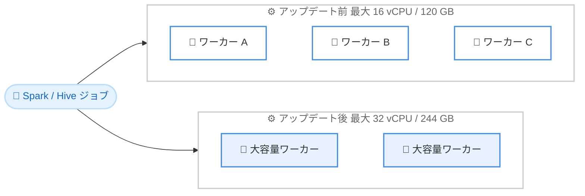

# Amazon EMR Serverless - 大容量ワーカーサイズのサポート

**リリース日**: 2026 年 7 月 7 日
**サービス**: Amazon EMR Serverless
**機能**: より大きなワーカー構成 (最大 32 vCPU / 244 GB メモリ) のサポート

📊 [このアップデートのインフォグラフィックを見る](https://takech9203.github.io/aws-news-summary/20260707-amazon-emr-serverless.html)
<!-- INFOGRAPHIC_BASE_URL は環境変数から取得 -->

## 概要

Amazon EMR Serverless は、より大きなワーカー構成のサポートを開始しました。新しい構成では、最大 32 vCPU と最大 244 GB のメモリを 1 つのワーカーに割り当てることができます。これにより、これまでよりも計算負荷やメモリ負荷の高いワークロードを EMR Serverless 上で実行できるようになります。

これまで、EMR Serverless の最大ワーカー構成は 16 vCPU / 最大 120 GB メモリでした。今回のアップデートによって利用可能なワーカーのサイズが実質的に 2 倍になり、大規模なデータ処理を行う Spark や Hive のジョブでランタイムパフォーマンスとコストプロファイルの双方を改善できる可能性があります。

大容量ワーカーは、シャッフルが多いワークロード、データスキュー (データの偏り) が発生するジョブ、大量のデータをメモリにキャッシュするジョブなどで特に効果を発揮します。データエンジニアやデータ分析基盤を運用するチームにとって、インフラ管理を行わずに大規模ワークロードを効率的に処理できる選択肢が増えることになります。

**アップデート前の課題**

- 以前は 1 ワーカーあたり最大 16 vCPU / 120 GB メモリという上限があり、計算負荷やメモリ負荷の高いワークロードに対応しにくい場合があった
- シャッフルが多いワークロードでは、エグゼキュータ間のデータ転送が多くなり、効率が低下していた
- データスキューが発生するジョブでは、特定のワーカーでメモリ不足 (out-of-memory) による失敗が発生しやすかった
- 大量のデータをメモリにキャッシュするジョブでは、ワーカーのメモリ容量が制約となっていた

**アップデート後の改善**

- 今回のアップデートにより、1 ワーカーあたり最大 32 vCPU / 244 GB メモリの構成が利用可能になった
- 大容量ワーカーによって、シャッフルが多いワークロードにおけるエグゼキュータ間の非効率なデータ転送を削減できるようになった
- データスキューが発生するジョブでも、メモリ不足による失敗の可能性を低減できるようになった
- より多くのデータをメモリに保持できるため、キャッシュを多用するジョブのパフォーマンスが向上する

## アーキテクチャ図



シャッフルが多いワークロードやメモリを多用するジョブでは、少数の大容量ワーカーに処理を集約することで、エグゼキュータ間のデータ転送やメモリ不足のリスクを低減できます。

## サービスアップデートの詳細

### 主要機能

1. **大容量ワーカー構成のサポート**
   - 1 ワーカーあたり最大 32 vCPU を割り当て可能
   - 1 ワーカーあたり最大 244 GB のメモリを割り当て可能
   - 従来の最大構成 (16 vCPU / 120 GB) からリソース上限が拡大

2. **シャッフルが多いワークロードの効率化**
   - より大きなワーカーに処理を集約することで、エグゼキュータ間の非効率なデータ転送を削減
   - ネットワーク経由のシャッフルが減ることでランタイムパフォーマンスが向上

3. **データスキューとキャッシュ処理への対応**
   - データスキューが発生するジョブでメモリ不足による失敗の可能性を低減
   - キャッシュを多用するジョブで、より多くのデータをメモリに保持しパフォーマンスを向上

## 技術仕様

### ワーカー構成の比較

| 項目 | アップデート前 | アップデート後 |
|------|----------------|----------------|
| 最大 vCPU 数 | 16 vCPU | 32 vCPU |
| 最大メモリ | 120 GB | 244 GB |
| 対象ワークロード | 一般的な Spark / Hive ジョブ | 計算負荷・メモリ負荷の高い Spark / Hive ジョブ |

### 想定される効果

| ワークロードの種類 | 大容量ワーカーによる効果 |
|--------------------|--------------------------|
| シャッフルが多いワークロード | エグゼキュータ間の非効率なデータ転送を削減 |
| データスキューが発生するジョブ | メモリ不足 (out-of-memory) による失敗の可能性を低減 |
| キャッシュを多用するジョブ | より多くのデータをメモリに保持しパフォーマンスを向上 |

## 設定方法

### 前提条件

1. EMR Serverless アプリケーションを利用できる AWS アカウント
2. EMR Serverless のジョブを実行するための IAM ロール
3. 実行するアプリケーションが Spark または Hive のワークロードであること

### 手順

#### ステップ 1: ジョブ実行時にワーカーリソースを指定

EMR Serverless では、ジョブ実行時に Spark のパラメータでエグゼキュータ (ワーカー) の vCPU 数とメモリを指定します。新しい上限に合わせて、より大きな値を設定できます。

```bash
aws emr-serverless start-job-run \
  --application-id <APPLICATION_ID> \
  --execution-role-arn <EXECUTION_ROLE_ARN> \
  --job-driver '{
    "sparkSubmit": {
      "entryPoint": "s3://<BUCKET>/scripts/job.py",
      "sparkSubmitParameters": "--conf spark.executor.cores=32 --conf spark.executor.memory=200g"
    }
  }'
```

上記コマンドは、エグゼキュータあたり 32 vCPU と大容量のメモリを割り当てて Spark ジョブを実行する例です。実際に指定できるメモリ量には Spark のオーバーヘッド分を考慮する必要があるため、割り当て可能な範囲内で値を調整してください。

#### ステップ 2: パフォーマンスとコストの確認

ジョブ実行後、EMR Serverless のアプリケーションモニタリングや Amazon CloudWatch のメトリクスで、ランタイムとリソース使用状況を確認します。大容量ワーカーによってジョブ時間が短縮され、全体のコストプロファイルが改善されるかを検証してください。

## メリット

### ビジネス面

- **大規模ワークロードへの対応**: インフラ管理を行わずに、より大規模で負荷の高いデータ処理を EMR Serverless で実行できる
- **コスト最適化の余地**: ランタイムパフォーマンスが向上することで、ジョブ全体のコストプロファイルを改善できる可能性がある
- **運用負荷の軽減**: サーバーレスの特性を維持したまま、キャパシティの上限を引き上げられる

### 技術面

- **シャッフルの効率化**: エグゼキュータ間のデータ転送を削減し、ネットワークのボトルネックを緩和
- **安定性の向上**: データスキューによるメモリ不足の失敗を低減し、ジョブの成功率を高める
- **キャッシュ性能の向上**: より多くのデータをメモリに保持でき、反復的な処理を高速化

## デメリット・制約事項

### 制限事項

- 大容量ワーカーは 1 ワーカーあたり最大 32 vCPU / 244 GB という上限の範囲内で利用する
- 実際に Spark アプリケーションへ割り当て可能なメモリは、システムのオーバーヘッド分を差し引いた値となる

### 考慮すべき点

- ワーカーを大きくすることが常に最適とは限らず、ワークロードの特性に応じたサイジングが重要
- 大容量ワーカーは 1 ワーカーあたりのリソース消費が大きくなるため、並列度とのバランスを検討する必要がある

## ユースケース

### ユースケース 1: シャッフルが多い大規模集計ジョブ

**シナリオ**: 大量のデータに対する結合 (JOIN) や集約 (GROUP BY) を含む Spark ジョブで、エグゼキュータ間のシャッフルがボトルネックになっている。

**効果**: 大容量ワーカーに処理を集約することで、エグゼキュータ間の非効率なデータ転送を削減し、ジョブのランタイムを短縮できる。

### ユースケース 2: データスキューによる失敗が発生するジョブ

**シナリオ**: 特定のキーにデータが偏っており、一部のワーカーでメモリ不足による失敗が繰り返し発生している。

**効果**: メモリ容量の大きいワーカーを利用することで、メモリ不足による失敗の可能性を低減し、ジョブの安定性を向上できる。

### ユースケース 3: 大量データをキャッシュする反復処理

**シナリオ**: 機械学習の前処理や反復的なクエリで、同じデータセットを繰り返しメモリにキャッシュして利用したい。

**効果**: より多くのデータをメモリに保持できるため、ディスクへのスピルを減らし、反復処理のパフォーマンスを向上できる。

## 料金

Amazon EMR Serverless は、ジョブ実行中に使用した vCPU、メモリ、ストレージのリソース量に基づく従量課金です。大容量ワーカーを利用する場合も課金モデル自体は変わらず、割り当てたリソース量と実行時間に応じて料金が発生します。詳細は EMR Serverless の料金ページを参照してください。

## 利用可能リージョン

Amazon EMR Serverless が提供されているすべての AWS リージョンで利用可能です。

## 関連サービス・機能

- **Amazon EMR**: Hadoop / Spark エコシステムによるビッグデータ処理サービス。EMR Serverless はそのサーバーレス実行オプション
- **Amazon S3**: EMR Serverless の入出力データの主要なストレージ
- **Amazon CloudWatch**: ジョブのメトリクスやログを監視し、パフォーマンスとリソース使用状況を確認

## 参考リンク

- 📊 [インフォグラフィック](https://takech9203.github.io/aws-news-summary/20260707-amazon-emr-serverless.html)
- [公式発表 (What's New)](https://aws.amazon.com/about-aws/whats-new/2026/07/amazon-emr-serverless/)
- [Amazon EMR Serverless ドキュメント](https://docs.aws.amazon.com/emr/latest/EMR-Serverless-UserGuide/emr-serverless.html)
- [Amazon EMR 料金ページ](https://aws.amazon.com/emr/pricing/)

## まとめ

今回のアップデートにより、Amazon EMR Serverless のワーカーは最大 32 vCPU / 244 GB メモリまで拡張され、計算負荷・メモリ負荷の高い Spark や Hive のワークロードをサーバーレス環境で効率的に実行できるようになりました。シャッフルが多いジョブ、データスキューが発生するジョブ、キャッシュを多用するジョブを運用しているチームは、大容量ワーカーへの移行によるパフォーマンスとコストの改善効果を検証することを推奨します。
