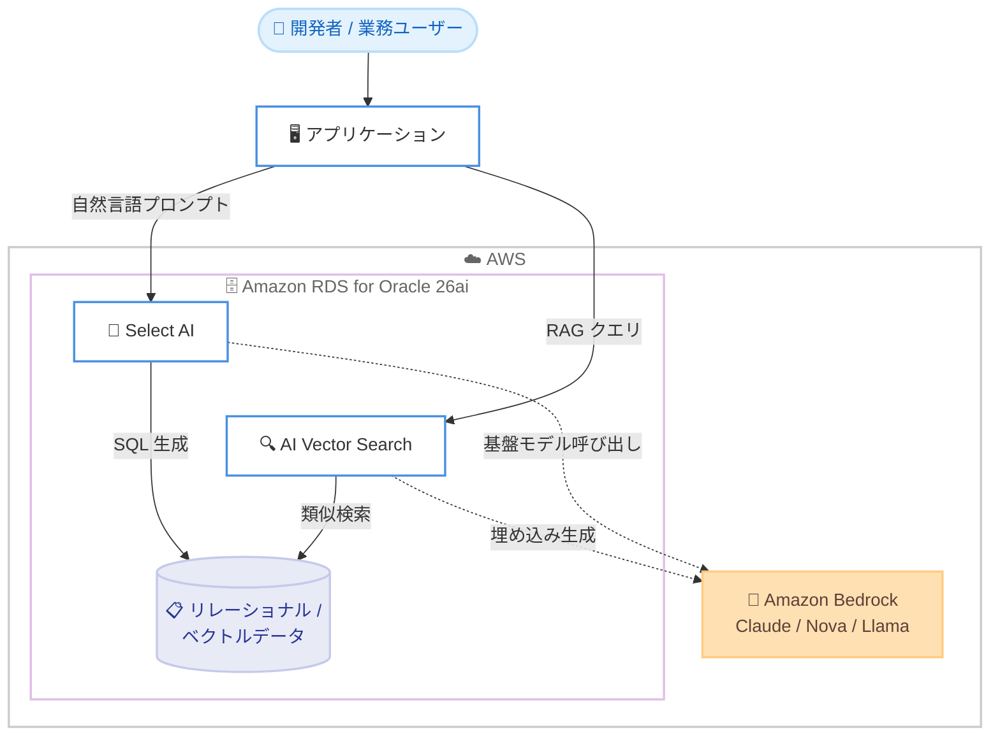

# Amazon RDS for Oracle - Oracle Database 26ai サポート

**リリース日**: 2026 年 7 月 7 日
**サービス**: Amazon RDS for Oracle
**機能**: Oracle Database 26ai サポート

📊 [このアップデートのインフォグラフィックを見る](https://takech9203.github.io/aws-news-summary/20260707-amazon-rds-oracle-database-26ai.html)
<!-- INFOGRAPHIC_BASE_URL は環境変数から取得 -->

## 概要

Amazon RDS for Oracle が、Oracle 社の最新の長期サポートリリース (Long Term Support Release) である Oracle Database 26ai をサポートしました。このリリースの最大の特徴は、Amazon Bedrock との統合により、Anthropic Claude、Amazon Nova、Meta Llama といった基盤モデルにデータベースから直接アクセスできる点にあります。

Oracle Database 26ai では、自然言語のプロンプトから SQL クエリを生成して実行する Select AI 機能を利用できます。また、Oracle AI Vector Search を使用することで、データをデータベースの外に移動させることなく、SQL から直接 RAG (Retrieval Augmented Generation) を実装できます。さらに、リレーショナルデータと並べてベクトル埋め込みを格納する AI Vector Search、同一データを JSON ドキュメントとリレーショナルテーブルの両方として扱える JSON Relational Duality Views、データベース内でのグラフ分析を可能にする SQL Property Graphs など、AI とアナリティクスを強化する機能が含まれています。

新規に Oracle Database 26ai を実行する DB インスタンスを作成できるほか、既存の Oracle Database 19c または 21c のコンテナデータベース (CDB) からアップグレードすることも可能です。本機能は Enterprise Edition でのみ利用でき、すべての商用 AWS リージョンおよび AWS GovCloud (US) リージョンで提供されます。

**アップデート前の課題**

- 生成 AI をデータベースのデータと組み合わせて活用するには、データを外部のベクトルデータベースや AI サービスへ移動させる必要があった
- 自然言語からの SQL 生成や RAG の実装には、アプリケーション層で追加の連携基盤を構築する必要があった
- ベクトル検索を行うために、リレーショナルデータとは別のベクトル専用データベースを運用する必要があった

**アップデート後の改善**

- Amazon Bedrock との統合により、Claude や Nova などの基盤モデルへデータベースから直接アクセスできるようになった
- Select AI により、自然言語プロンプトから SQL クエリを生成・実行できるようになった
- AI Vector Search により、専用のベクトルデータベースなしで、リレーショナルデータと同じ場所でセマンティック検索やハイブリッド検索、RAG を実現できるようになった

## アーキテクチャ図



自然言語プロンプトは Select AI が SQL に変換し、RAG クエリは AI Vector Search がデータベース内のベクトルデータに対して類似検索を実行します。いずれも Amazon Bedrock の基盤モデルをデータベースから直接呼び出します。

## サービスアップデートの詳細

### 主要機能

1. **Amazon Bedrock 統合**
   - Anthropic Claude、Amazon Nova、Meta Llama などの基盤モデルへデータベースからアクセス可能
   - データを外部へ移動させることなく、生成 AI 機能をデータベース内で利用できる

2. **Select AI**
   - 自然言語のプロンプトから SQL クエリを生成して実行できる
   - 開発者や業務ユーザーの生産性向上に寄与する

3. **AI Vector Search**
   - リレーショナルデータと並べてベクトル埋め込みを格納できる
   - 専用のベクトルデータベースなしで、セマンティック類似検索やハイブリッド検索を実行できる
   - SQL から直接 RAG を実装でき、データをデータベースの外に移動させる必要がない

4. **JSON Relational Duality Views**
   - 同一の基盤データを JSON ドキュメントとしても、リレーショナルテーブルとしてもアクセスできる

5. **SQL Property Graphs**
   - データベース内でのグラフ分析 (in-database graph analytics) を可能にする

## 技術仕様

### エンジンバージョンと構成

| 項目 | 詳細 |
|------|------|
| エンジンバージョン | Oracle 26.0.0.0 |
| リリース種別 | 長期サポートリリース (Long Term Support Release) |
| 対応エディション | Enterprise Edition のみ |
| データベースアーキテクチャ | コンテナデータベース (CDB) |
| 新規作成 | AWS Management Console、AWS CLI、AWS SDK から可能 |
| アップグレード元 | Oracle Database 19c または 21c の CDB |

### アップグレードに関する注意

- 既存の 19c または 21c の CDB は、Modify DB Instance ワークフローで 26.0.0.0 バージョンを選択してアップグレードできる
- Non-CDB 構成の 19c インスタンスは、アップグレード前に CDB アーキテクチャへの変換が必要

## 設定方法

### 前提条件

1. Oracle Database Enterprise Edition のライセンスまたは License Included モデルの利用
2. 新規作成またはアップグレード対象の RDS for Oracle 環境
3. Amazon Bedrock 連携機能を使用する場合、対象の基盤モデルへのアクセス権限

### 手順

#### ステップ1: 新規 DB インスタンスの作成

```bash
aws rds create-db-instance \
    --db-instance-identifier my-oracle-26ai \
    --engine oracle-ee \
    --engine-version 26.0.0.0.ru-2026-04.rur-2026-04.r1 \
    --db-instance-class db.r8i.large \
    --allocated-storage 100 \
    --master-username admin \
    --master-user-password <YOUR_PASSWORD>
```

Oracle 26.0.0.0 のエンジンバージョンを指定して、新しい Oracle Database 26ai の DB インスタンスを作成します。エンジンバージョンの正確な値は `aws rds describe-db-engine-versions` で確認してください。

#### ステップ2: 既存インスタンスのアップグレード

```bash
aws rds modify-db-instance \
    --db-instance-identifier my-existing-oracle \
    --engine-version 26.0.0.0.ru-2026-04.rur-2026-04.r1 \
    --allow-major-version-upgrade \
    --apply-immediately
```

既存の 19c または 21c の CDB インスタンスを、Modify DB Instance 操作で 26.0.0.0 バージョンへアップグレードします。メジャーバージョンアップグレードを許可するため `--allow-major-version-upgrade` を指定します。

#### ステップ3: Non-CDB 構成の変換

Non-CDB 構成の 19c インスタンスをアップグレードする場合は、事前に CDB アーキテクチャへの変換を実施してください。変換後に 26ai へのアップグレードが可能になります。

## メリット

### ビジネス面

- **生成 AI 活用の加速**: データベースのデータをそのまま活用して、生成 AI アプリケーションを迅速に構築できる
- **開発生産性の向上**: 自然言語から SQL を生成できるため、開発者や業務ユーザーがより少ない労力でデータを扱える
- **運用コストの削減**: 専用のベクトルデータベースを別途運用する必要がなくなる

### 技術面

- **データ移動の排除**: RAG やベクトル検索をデータベース内で完結でき、データを外部へ移動させる必要がない
- **柔軟なデータアクセス**: JSON Relational Duality Views により、同一データを JSON とリレーショナルの両形式で扱える
- **グラフ分析の統合**: SQL Property Graphs により、データベース内で直接グラフ分析を実行できる

## デメリット・制約事項

### 制限事項

- Enterprise Edition でのみ利用可能で、Standard Edition では利用できない
- アップグレード対象は CDB 構成に限られ、Non-CDB 構成の 19c は事前変換が必要
- メジャーバージョンアップグレードとなるため、アップグレード前の十分な検証が必要

### 考慮すべき点

- Amazon Bedrock 連携機能の利用には、対象基盤モデルへのアクセス設定と、Bedrock 側の料金が別途発生する
- 長期サポートリリースであるため、既存の 19c / 21c 環境からの移行計画を検討する価値がある

## ユースケース

### ユースケース1: 自然言語による業務データ照会

**シナリオ**: 業務担当者が SQL の知識なしに、売上データや在庫データを自然言語で照会したい。

**実装例**:
```sql
SELECT AI '先月の地域別売上トップ 5 を教えて';
```

**効果**: Select AI が自然言語を SQL に変換して実行し、非エンジニアでもデータを活用できる。

### ユースケース2: データベース内での RAG による問い合わせ対応

**シナリオ**: 社内ドキュメントを格納したデータベースに対して、意味的に関連する情報を検索し、生成 AI で回答を生成したい。

**実装例**:
```sql
-- ベクトル埋め込みを用いた類似検索と基盤モデルによる回答生成を SQL 内で実行
SELECT content
FROM documents
ORDER BY VECTOR_DISTANCE(embedding, :query_vector)
FETCH FIRST 5 ROWS ONLY;
```

**効果**: 専用ベクトルデータベースを用意せず、データをデータベース内に保持したまま RAG を実現できる。

### ユースケース3: JSON とリレーショナルの統合利用

**シナリオ**: アプリケーションは JSON ドキュメントとしてデータを扱いたいが、分析基盤ではリレーショナル形式で集計したい。

**実装例**:
```sql
-- JSON Relational Duality View 経由で同一データを JSON として取得
SELECT data FROM customer_duality_view WHERE data.id = 100;
```

**効果**: 同一データを二重管理することなく、アプリケーションと分析の双方の要件を満たせる。

## 料金

Amazon RDS for Oracle の料金は、DB インスタンスクラス、ストレージ、ライセンスモデル (License Included または Bring Your Own License) に基づきます。Oracle Database 26ai のサポート自体に追加料金は発生しませんが、Amazon Bedrock の基盤モデルを利用する場合は、Bedrock の利用量に応じた料金が別途発生します。詳細な料金は公式の料金ページを参照してください。

## 利用可能リージョン

すべての商用 AWS リージョンおよび AWS GovCloud (US) リージョンで利用可能です。

## 関連サービス・機能

- **Amazon Bedrock**: Claude、Nova、Llama などの基盤モデルを提供し、Select AI や RAG の実行基盤となる
- **Oracle AI Vector Search**: ベクトル埋め込みの格納とセマンティック検索を担う Oracle Database 26ai の中核機能
- **AWS GovCloud (US)**: 規制要件の厳しいワークロード向けに本機能を提供

## 参考リンク

- 📊 [インフォグラフィック](https://takech9203.github.io/aws-news-summary/20260707-amazon-rds-oracle-database-26ai.html)
- [公式発表 (What's New)](https://aws.amazon.com/about-aws/whats-new/2026/07/amazon-rds-oracle-database-26ai/)
- [Amazon RDS for Oracle ドキュメント](https://docs.aws.amazon.com/AmazonRDS/latest/UserGuide/CHAP_Oracle.html)
- [Amazon RDS for Oracle 料金ページ](https://aws.amazon.com/rds/oracle/pricing/)

## まとめ

Oracle Database 26ai のサポートにより、Amazon RDS for Oracle は Amazon Bedrock と統合された生成 AI 機能をデータベース内で直接利用できるようになりました。Select AI や AI Vector Search を活用することで、データを外部に移動させずに RAG やセマンティック検索を実現できます。長期サポートリリースであるため、既存の 19c / 21c 環境を運用しているユーザーは、Enterprise Edition での移行計画の検討をおすすめします。
