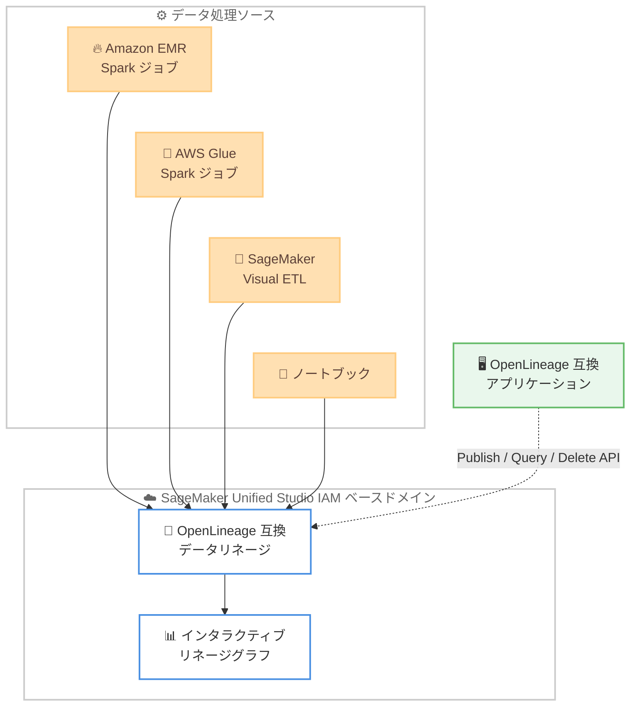

# Amazon SageMaker - IAM ベースドメインでのデータリネージサポート

**リリース日**: 2026 年 7 月 7 日
**サービス**: Amazon SageMaker (SageMaker Unified Studio)
**機能**: IAM ベースドメインにおける OpenLineage 互換データリネージ

📊 [このアップデートのインフォグラフィックを見る](https://takech9203.github.io/aws-news-summary/20260707-amazon-sagemaker-data-lineage-iam-domain.html)
<!-- INFOGRAPHIC_BASE_URL は環境変数から取得 -->

## 概要

Amazon SageMaker Unified Studio が、IAM ベースドメインで OpenLineage 互換のデータリネージ機能をサポートするようになりました。この機能により、Amazon EMR、AWS Glue、SageMaker Visual ETL、およびノートブック上で実行される Apache Spark ジョブから、リネージイベントを自動的にキャプチャできます。

データリネージは、データがソースから消費に至るまでどのように移動するかを可視化する機能です。これまで IAM Identity Center ベースのドメインでのみ利用可能でしたが、今回のアップデートにより IAM ベースドメインでも同じ機能を利用できるようになり、両方の認証方式でデータの流れを一貫して追跡できます。

インタラクティブなリネージグラフは、データの移動を集約したビジュアル表現として提供されます。グラフの深さを設定可能なほか、詳細な列レベルのリネージを確認できるイベントタイムスタンプモード、可視化を簡素化するデータセットのみの表示に対応しています。

**アップデート前の課題**

- IAM ベースドメインでは OpenLineage 互換のデータリネージを利用できず、認証方式によって利用できる機能に差があった
- IAM Identity Center ベースドメインに移行しなければ、リネージグラフによるデータフローの可視化ができなかった
- 公開済みのリネージイベントを削除する手段が限られていた

**アップデート後の改善**

- IAM ベースドメインでも IAM Identity Center ベースドメインと同等の OpenLineage 互換データリネージが利用可能になった
- EMR、Glue、SageMaker Visual ETL、ノートブックの Apache Spark ジョブからリネージイベントを自動的にキャプチャできるようになった
- 新しい DeleteLineageEvent API により、公開済みのリネージイベントを削除できるようになった

## アーキテクチャ図

各データ処理ソースの Apache Spark ジョブから OpenLineage 互換のリネージイベントがキャプチャされ、インタラクティブなリネージグラフとして可視化されます。OpenLineage 互換アプリケーションからは API を通じてイベントの公開、クエリ、削除が可能です。

## サービスアップデートの詳細

### 主要機能

1. **IAM ベースドメインでのデータリネージサポート**
   - IAM ベースドメインで OpenLineage 互換のデータリネージが利用可能になった
   - IAM Identity Center ベースドメインで既に提供されていた機能を IAM ベースドメインにも拡張
   - 両方の認証方式で一貫したデータフローの追跡が可能

2. **複数ソースからのリネージイベントキャプチャ**
   - Amazon EMR 上の Apache Spark ジョブ
   - AWS Glue 上の Apache Spark ジョブ
   - SageMaker Visual ETL
   - ノートブック

3. **インタラクティブなリネージグラフ**
   - データがソースから消費に至るまでの移動を集約して可視化
   - グラフの深さを設定可能 (configurable graph depth)
   - 詳細な列レベルのリネージを確認できるイベントタイムスタンプモード
   - 可視化を簡素化するデータセットのみの表示 (dataset-only view)

4. **プログラムによるリネージ管理**
   - IAM ベースドメインと IAM Identity Center ベースドメインの両方で、OpenLineage 互換アプリケーションからリネージを公開、クエリ、管理可能
   - 新しい DeleteLineageEvent API により公開済みのイベントを削除可能

## 技術仕様

### 主な仕様

| 項目 | 詳細 |
|------|------|
| リネージ標準 | OpenLineage 互換 |
| 対応ドメイン | IAM ベースドメイン、IAM Identity Center ベースドメイン |
| 対応データソース | Amazon EMR、AWS Glue、SageMaker Visual ETL、ノートブック (Apache Spark ジョブ) |
| グラフ機能 | グラフ深さ設定、イベントタイムスタンプモード (列レベルリネージ)、データセットのみ表示 |
| リネージ管理 API | 公開、クエリ、管理、DeleteLineageEvent (削除) |

### 主要な API 操作

- **Publish**: OpenLineage 互換アプリケーションからリネージイベントを公開
- **Query**: 公開済みのリネージイベントを照会
- **DeleteLineageEvent**: 公開済みのリネージイベントを削除 (今回追加)

## メリット

### ビジネス面

- **データガバナンスの強化**: データがソースから消費に至るまでの流れを可視化し、監査やコンプライアンス対応を支援
- **認証方式に依存しない一貫性**: IAM ベースドメインでも同等のリネージ機能を利用でき、環境間の機能差を解消
- **データ信頼性の向上**: データの出所と変換過程を追跡でき、分析結果の信頼性を高める

### 技術面

- **OpenLineage 標準への準拠**: 業界標準の OpenLineage に準拠し、互換アプリケーションとの連携が容易
- **列レベルの詳細な追跡**: イベントタイムスタンプモードにより列レベルのリネージを確認でき、詳細な影響分析が可能
- **柔軟な可視化**: グラフ深さの設定やデータセットのみ表示により、目的に応じた可視化を実現

## デメリット・制約事項

### 制限事項

- リネージイベントのキャプチャは Apache Spark ジョブ (Amazon EMR、AWS Glue、SageMaker Visual ETL、ノートブック) が対象
- 利用には SageMaker Unified Studio が利用可能なリージョンである必要がある

### 考慮すべき点

- プログラムによるリネージの公開には OpenLineage 互換アプリケーションが必要
- 列レベルのリネージを確認するにはイベントタイムスタンプモードを利用する

## ユースケース

### ユースケース1: データガバナンスと監査対応

**シナリオ**: 規制業界の企業が、分析基盤で利用するデータの出所と変換過程を証跡として残す必要がある。

**効果**: リネージグラフによりデータの移動を可視化し、監査時にデータの出所と変換の流れを提示できる。

### ユースケース2: データ品質問題の影響分析

**シナリオ**: あるソーステーブルで品質問題が発見され、その影響を受ける下流のデータセットを特定したい。

**効果**: 列レベルのリネージを確認することで、影響を受けるデータセットや列を迅速に特定し、修正範囲を絞り込める。

### ユースケース3: IAM ベースドメインでの統合されたデータ管理

**シナリオ**: IAM ベースドメインで SageMaker Unified Studio を運用しており、これまで利用できなかったデータリネージを導入したい。

**効果**: ドメインの認証方式を変更することなく、既存の IAM ベースドメインでリネージ機能を利用でき、データフローの追跡を統合できる。

## 料金

本アップデートに関する追加料金の詳細は、Amazon SageMaker の料金ページを参照してください。データリネージのキャプチャに利用する Amazon EMR、AWS Glue、SageMaker Visual ETL、ノートブックなど、各サービスの利用に応じた料金が適用されます。

## 利用可能リージョン

Amazon SageMaker Unified Studio が利用可能なすべての AWS リージョンで提供されます。

## 関連サービス・機能

- **Amazon EMR**: Apache Spark ジョブからリネージイベントをキャプチャする対象サービス
- **AWS Glue**: Apache Spark ジョブからリネージイベントをキャプチャする対象サービス
- **SageMaker Visual ETL**: ビジュアル ETL ジョブのリネージをキャプチャ
- **OpenLineage**: データリネージの業界標準仕様。互換アプリケーションとの連携を実現

## 参考リンク

- 📊 [インフォグラフィック](https://takech9203.github.io/aws-news-summary/20260707-amazon-sagemaker-data-lineage-iam-domain.html)
- [公式発表 (What's New)](https://aws.amazon.com/about-aws/whats-new/2026/07/amazon-sagemaker-data-lineage-iam-domain)
- [Amazon SageMaker Unified Studio ドキュメント](https://docs.aws.amazon.com/sagemaker-unified-studio/)
- [OpenLineage 公式サイト](https://openlineage.io/)

## まとめ

このアップデートにより、IAM ベースドメインでも OpenLineage 互換のデータリネージが利用可能になり、認証方式による機能差が解消されました。データガバナンスやデータ品質の影響分析を強化したい組織は、SageMaker Unified Studio でリネージグラフを活用し、データフローの可視化と追跡を検討してください。
