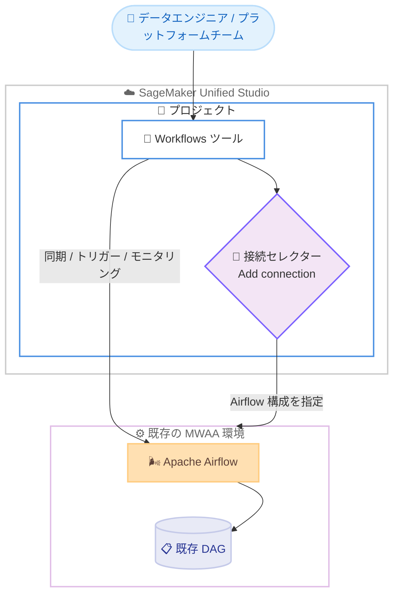

# Amazon SageMaker Unified Studio - 既存 MWAA 環境のインポートサポート

**リリース日**: 2026年7月7日
**サービス**: Amazon SageMaker Unified Studio
**機能**: 既存の Amazon Managed Workflows for Apache Airflow (MWAA) 環境のインポート

📊 [このアップデートのインフォグラフィックを見る](https://takech9203.github.io/aws-news-summary/20260707-amazon-sagemaker-unified-studio-import-existing-mwaa-environments.html)
<!-- INFOGRAPHIC_BASE_URL は環境変数から取得 -->

## 概要

Amazon SageMaker Unified Studio が、既存の Amazon Managed Workflows for Apache Airflow (MWAA) 環境をプロジェクトに接続できるようになりました。すでに MWAA 環境を運用しているデータエンジニアやプラットフォームチームは、分析や機械学習に利用しているのと同じインターフェイスから、Airflow ワークフローを管理できるようになります。

これまでは、Airflow ワークフローの管理と、Unified Studio 上での分析や機械学習の作業が別々のインターフェイスに分かれていました。今回のアップデートにより、構成を再作成したり DAG を移行したりすることなく、既存の MWAA 環境をそのまま Unified Studio のプロジェクトに接続できます。接続後は、プロジェクトメンバーが SageMaker Unified Studio から直接ワークフローを同期 (sync)、トリガー (trigger)、モニタリング (monitor) できます。

さらに、Apache Airflow 3 以降を実行している環境では、ドラッグアンドドロップエディターによる新しいワークフローのビジュアルオーサリング機能も利用できます。これにより、コードを直接記述することなく、視覚的にワークフローを作成できます。

**アップデート前の課題**

- Airflow ワークフローの管理と、Unified Studio 上での分析や機械学習の作業が別々のインターフェイスに分かれていた
- 既存の MWAA 環境を Unified Studio で活用するには、構成の再作成や DAG の移行が必要になる懸念があった
- ワークフローの実行状況を確認するために、複数のツールを行き来する必要があった

**アップデート後の改善**

- 既存の MWAA 環境を構成の再作成や DAG の移行なしにプロジェクトへ接続できるようになった
- 分析、機械学習、ワークフロー管理を同一のインターフェイスから操作できるようになった
- Apache Airflow 3 以降の環境では、ドラッグアンドドロップによるビジュアルオーサリングで新しいワークフローを作成できるようになった

## アーキテクチャ図



Unified Studio プロジェクトの Workflows ツールから既存の MWAA 環境を接続し、DAG の移行なしにワークフローを同期、トリガー、モニタリングする構成を示しています。

## サービスアップデートの詳細

### 主要機能

1. **既存 MWAA 環境の接続**
   - すでに運用中の MWAA 環境をプロジェクトに接続できる
   - 構成の再作成や DAG の移行が不要
   - Workflows ツールの接続セレクターから「Add connection」を選択して接続する

2. **統合されたワークフロー管理**
   - 分析や機械学習と同じインターフェイスから Airflow ワークフローを管理できる
   - プロジェクトメンバーがワークフローを同期、トリガー、モニタリングできる
   - ツール間を移動することなく、ワークフローの実行状況を確認できる

3. **ビジュアルオーサリング (Apache Airflow 3 以降)**
   - Apache Airflow 3 以降を実行している環境で利用できる
   - ドラッグアンドドロップエディターで新しいワークフローを作成できる
   - コードを直接記述せずに視覚的にワークフローを設計できる

## 技術仕様

### 接続方式と対応機能

| 項目 | 詳細 |
|------|------|
| 接続対象 | 既存の Amazon MWAA 環境 |
| 接続方法 | Workflows ツールの接続セレクターで「Add connection」を選択 |
| 指定する情報 | ドメインとプロジェクトを参照する Airflow の構成オプション |
| 接続後の操作 | ワークフローの同期 (sync)、トリガー (trigger)、モニタリング (monitor) |
| DAG の移行 | 不要 (既存 DAG をそのまま利用) |
| ビジュアルオーサリング | Apache Airflow 3 以降の環境で利用可能 |

### API変更履歴

今回のアップデートに直接関連する公開 API の変更は確認されていません。既存 MWAA 環境の接続は、Workflows ツールの接続セレクターから構成します。

## 設定方法

### 前提条件

1. Amazon SageMaker Unified Studio のドメインとプロジェクトへのアクセス権限
2. 接続対象となる既存の Amazon MWAA 環境
3. MWAA 環境へアクセスするための適切な IAM 権限
4. ビジュアルオーサリングを利用する場合は Apache Airflow 3 以降を実行する環境

### 手順

#### ステップ1: Workflows ツールを開く

SageMaker Unified Studio のプロジェクトで Workflows ツールを開きます。ここからプロジェクトに関連付けられたワークフローを管理します。

#### ステップ2: 接続を追加する

接続セレクターで「Add connection」を選択し、ドメインとプロジェクトを参照する Airflow の構成オプションを指定します。これにより既存の MWAA 環境がプロジェクトに接続されます。

#### ステップ3: ワークフローを操作する

接続後は、プロジェクトメンバーが SageMaker Unified Studio から直接ワークフローを同期、トリガー、モニタリングできます。Apache Airflow 3 以降の環境では、ドラッグアンドドロップエディターで新しいワークフローを作成することも可能です。

## メリット

### ビジネス面

- **移行コストの削減**: 構成の再作成や DAG の移行が不要なため、既存の MWAA 資産をそのまま活用できる
- **運用の統合**: 分析、機械学習、ワークフロー管理を同一のインターフェイスに集約でき、ツールの分散を防げる
- **生産性の向上**: ワークフローの実行状況を一元的に把握でき、複数のツールを行き来する手間を削減できる

### 技術面

- **既存環境の再利用**: すでに運用している MWAA 環境と DAG をそのまま接続して利用できる
- **視覚的なワークフロー作成**: Apache Airflow 3 以降ではドラッグアンドドロップでワークフローを作成でき、コード記述の負担を軽減できる
- **一元的な監視**: 同期、トリガー、モニタリングを Unified Studio から統合的に実行できる

## デメリット・制約事項

### 制限事項

- ビジュアルオーサリング機能は Apache Airflow 3 以降を実行している環境でのみ利用できる
- 接続には、ドメインとプロジェクトを参照する適切な Airflow 構成オプションの指定が必要
- MWAA 環境へのアクセスには適切な IAM 権限が求められる

### 考慮すべき点

- Apache Airflow 2 以前の環境では既存ワークフローの管理は可能だが、ビジュアルオーサリングは利用できないため、ビジュアル機能が必要な場合は Airflow 3 以降へのアップグレードを検討する必要がある
- 接続後のワークフロー操作はプロジェクトメンバーに開放されるため、権限設計を確認しておくことが望ましい

## ユースケース

### ユースケース1: 既存 MWAA 資産の統合

**シナリオ**: すでに MWAA でデータパイプラインを運用しているチームが、分析や機械学習の作業と同じ環境でワークフローを管理したい。

**実装例**:
```
Workflows ツールの接続セレクターで「Add connection」を選択し、既存の MWAA 環境を接続する
```

**効果**: DAG の移行なしに既存資産を活用でき、運用インターフェイスを統合できる。

### ユースケース2: ビジュアルによる新規ワークフロー作成

**シナリオ**: Airflow のコード記述に不慣れなメンバーが、新しいデータパイプラインを視覚的に作成したい。

**実装例**:
```
Apache Airflow 3 以降の MWAA 環境を接続し、ドラッグアンドドロップエディターでワークフローを作成する
```

**効果**: コーディングの負担を軽減し、パイプライン設計のスピードを向上できる。

### ユースケース3: ワークフローの一元的なモニタリング

**シナリオ**: 分析や機械学習の作業と並行して、データパイプラインの実行状況を同じ画面で監視したい。

**実装例**:
```
接続済みの MWAA 環境のワークフローを Unified Studio から同期し、トリガーと実行状況を監視する
```

**効果**: ツール間の移動を減らし、パイプラインの状態を素早く把握できる。

## 料金

今回のアップデート自体に追加の料金は発生しません。接続した MWAA 環境の利用に対しては、Amazon Managed Workflows for Apache Airflow の料金体系が適用されます。詳細は MWAA の料金ページを参照してください。

## 利用可能リージョン

Amazon SageMaker Unified Studio が利用可能なすべての AWS リージョンで利用できます。

## 関連サービス・機能

- **Amazon Managed Workflows for Apache Airflow (MWAA)**: 今回接続対象となるマネージド Airflow サービス。既存環境をそのまま Unified Studio に接続できる
- **Apache Airflow**: ワークフローのオーケストレーションを行う OSS。Airflow 3 以降でビジュアルオーサリングに対応する
- **Amazon SageMaker Unified Studio**: 分析、機械学習、ワークフロー管理を統合するインターフェイス

## 参考リンク

- 📊 [インフォグラフィック](https://takech9203.github.io/aws-news-summary/20260707-amazon-sagemaker-unified-studio-import-existing-mwaa-environments.html)
- [公式発表 (What's New)](https://aws.amazon.com/about-aws/whats-new/2026/07/amazon-sagemaker-unified-studio-import-existing-mwaa-environments/)
- [Amazon Managed Workflows for Apache Airflow (MWAA)](https://aws.amazon.com/managed-workflows-for-apache-airflow/)
- [Amazon SageMaker Unified Studio ドキュメント](https://docs.aws.amazon.com/sagemaker-unified-studio/latest/userguide/what-is-sagemaker-unified-studio.html)

## まとめ

Amazon SageMaker Unified Studio が既存の MWAA 環境のインポートに対応したことで、データエンジニアやプラットフォームチームは、DAG の移行なしに既存の Airflow ワークフローを分析や機械学習と同じインターフェイスで管理できるようになりました。特に Apache Airflow 3 以降の環境ではビジュアルオーサリングも利用できます。MWAA を運用しているチームは、Workflows ツールから既存環境の接続を試すことをお勧めします。
