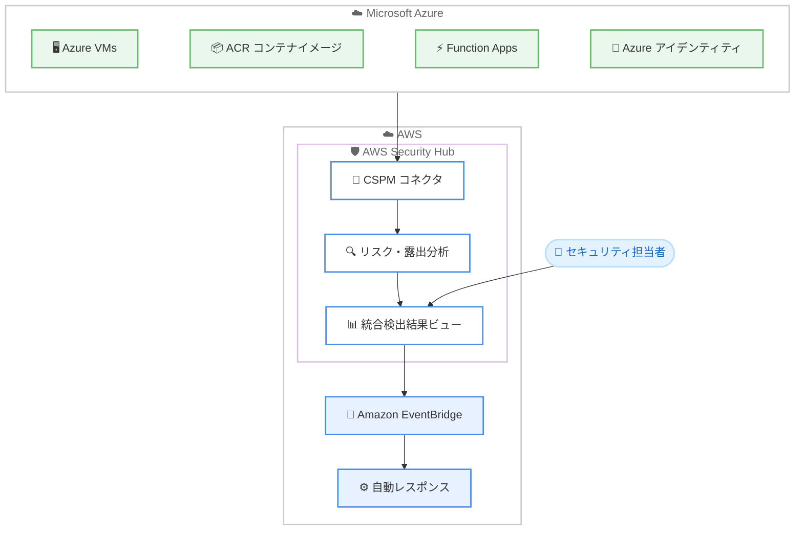

# AWS Security Hub - Microsoft Azure リソースの統合セキュリティ管理

**リリース日**: 2026 年 7 月 7 日
**サービス**: AWS Security Hub
**機能**: Microsoft Azure リソースのモニタリング (マルチクラウド統合)

📊 [このアップデートのインフォグラフィックを見る](https://takech9203.github.io/aws-news-summary/20260707-aws-security-hub-supports-monitoring-microsoft-azure.html)
<!-- INFOGRAPHIC_BASE_URL は環境変数から取得 -->

## 概要

AWS Security Hub が Microsoft Azure リソースのモニタリングに対応しました。これにより、リスク分析、クラウドセキュリティポスチャ管理 (CSPM)、脆弱性管理、セキュリティレスポンス管理を、AWS と Azure の両方のクラウドにまたがって提供できるようになりました。従来はクラウドごとに個別のツールを使い分ける必要がありましたが、今回のアップデートによって単一の統合された画面でリスクの検出と対応を実施できます。

Security Hub は Azure リソースを自動的に検出します。対象となるのは Azure Virtual Machines (VMs)、Azure Container Registry (ACR) のコンテナイメージ、Azure Function Apps、Azure のアイデンティティです。これらのリソースを、設定ミス、インターネットへの露出、ソフトウェアの脆弱性という観点で評価します。

AWS と Azure の検出結果 (findings) は、同一の優先度付けされたビューに、同じ検出結果フォーマットと同じ自動化ワークフローで表示されます。これにより、マルチクラウド環境全体のセキュリティリスクを一貫した方法で把握し、対応できます。

**アップデート前の課題**

- 以前は AWS と Azure のセキュリティ状態を統合的に把握できず、クラウドごとに別々のツールを使う必要があった
- 以前はクラウドごとに検出結果のフォーマットや優先度付けの基準が異なり、リスクの横断的な比較が困難だった
- 以前は Azure リソースの設定ミスや脆弱性を Security Hub の自動化ワークフローに組み込めなかった

**アップデート後の改善**

- 今回のアップデートにより AWS と Azure の検出結果を単一の優先度付けビューで確認できるようになった
- 今回のアップデートにより Azure リソースが自動的に検出され、設定ミス、インターネット露出、脆弱性の評価が可能になった
- 今回のアップデートにより既存の Amazon EventBridge 連携を通じて Azure の検出結果にも自動対応できるようになった

## アーキテクチャ図

CSPM コネクタを介して Azure リソースを Security Hub に取り込み、リスク分析を経て統合ビューに集約し、EventBridge で自動レスポンスにつなげる流れを示しています。

## サービスアップデートの詳細

### 主要機能

1. **Azure リソースの自動検出**
   - Azure Virtual Machines (VMs) を検出し評価する
   - Azure Container Registry (ACR) のコンテナイメージを検出し評価する
   - Azure Function Apps および Azure のアイデンティティを検出する
   - 設定ミス、インターネットへの露出、ソフトウェアの脆弱性を評価する

2. **セキュリティ標準に対するポスチャチェック**
   - CIS Benchmarks for Microsoft Azure Foundations に対する評価を提供する
   - 統合されたリソースインベントリを提供する
   - リスクと露出の分析を実施する

3. **統合された検出結果と自動レスポンス**
   - AWS と Azure の検出結果を同一の優先度付けビューに表示する
   - 同じ検出結果フォーマットと自動化ワークフローを共有する
   - 既存の Amazon EventBridge 連携を通じて自動レスポンスを実行する

## 技術仕様

### 検出対象の Azure リソースと評価観点

| 項目 | 詳細 |
|------|------|
| Azure Virtual Machines (VMs) | 設定ミス、インターネット露出、ソフトウェア脆弱性を評価 |
| Azure Container Registry (ACR) | コンテナイメージの脆弱性を評価 |
| Azure Function Apps | 設定ミス、インターネット露出を評価 |
| Azure アイデンティティ | アイデンティティ関連のリスクを評価 |
| セキュリティ標準 | CIS Benchmarks for Microsoft Azure Foundations |

### API 変更履歴

| 日付 | サービス | 変更内容 |
|------|----------|----------|
| 2026/07/07 | [securityhub](https://awsapichanges.com/archive/changes/f6d4b3-securityhub.html) | 7 new 31 updated api methods - Azure とのマルチクラウド統合をリリース |

Azure 連携の中核となる新規 API メソッドは、サードパーティクラウドプロバイダとの接続を管理するコネクタ関連の操作です。

| API メソッド | 説明 |
|--------------|------|
| `CreateConnector` | Security Hub CSPM とサードパーティクラウドプロバイダ間の接続を確立 |
| `GetConnector` | コネクタ ID を指定して詳細を取得 |
| `UpdateConnector` | コネクタの設定 (スコープ、リージョン) を変更 |
| `DeleteConnector` | コネクタを削除しデータ取り込みを停止 |
| `ListConnectors` | アカウント内のコネクタ一覧とメタデータを取得 |
| `EnableSecurityHubFeatureV2` / `DisableSecurityHubFeatureV2` | オプトイン機能の有効化・無効化 |

`BatchEnableStandards` および `BatchDisableStandards` には `Provider` フィールド (`AWS` または `Azure`) が追加されています。

## 設定方法

### 前提条件

1. AWS Security Hub が利用可能なリージョンで有効化されていること
2. モニタリング対象となる Microsoft Azure のテナントおよびサブスクリプションへのアクセス権があること
3. Azure 連携を設定する権限 (Security Hub のコネクタ操作権限) を持っていること

### 手順

#### ステップ 1: Azure 連携の作成

AWS Security Hub のコンソールまたは `CreateConnector` API を使用して、Microsoft Azure との連携を作成します。この操作により Security Hub CSPM と Azure プロバイダ間の接続が確立され、Azure リソースの自動検出が開始されます。連携作成時に、対象とする Azure のテナント/サブスクリプションのスコープとリージョンを指定します。

#### ステップ 2: 検出結果の確認

連携が確立されると、Azure リソースが自動的に検出され評価が開始されます。AWS と Azure の検出結果が同一の優先度付けビューに表示されるため、統合された画面でリスクを確認します。

#### ステップ 3: 自動レスポンスの設定

既存の Amazon EventBridge 連携を利用して、Azure の検出結果に対する自動レスポンスワークフローを設定します。AWS リソースと同じ自動化ワークフローを Azure リソースにも適用できます。

## メリット

### ビジネス面

- **マルチクラウドの一元管理**: AWS と Azure のセキュリティ状態を単一の統合ビューで管理でき、運用の複雑さとツールの分散を削減できる
- **リスク対応の迅速化**: 優先度付けされた統合ビューにより、クラウドを横断してリスクを迅速に把握し対応できる
- **無料トライアルによる低リスク導入**: Azure モニタリング専用の 30 日間無料トライアルにより、コストをかけずに評価を開始できる

### 技術面

- **自動リソース検出**: Azure リソースを手動で登録することなく自動的に検出し評価できる
- **既存ワークフローの再利用**: 同じ検出結果フォーマットと EventBridge 連携を利用でき、新たな自動化基盤を構築する必要がない
- **標準準拠の可視化**: CIS Benchmarks for Microsoft Azure Foundations に対するポスチャチェックにより、コンプライアンス状況を把握できる

## デメリット・制約事項

### 制限事項

- 一部のリージョン (中東 (UAE)、中東 (バーレーン)、アジアパシフィック (台北)、アジアパシフィック (ニュージーランド)) では Azure 連携を作成できない
- 検出対象の Azure リソースは Azure VMs、ACR コンテナイメージ、Azure Function Apps、Azure アイデンティティに限定される
- 30 日間の無料トライアル終了後は Azure リソースのモニタリングに課金が発生する

### 考慮すべき点

- 無料トライアルは Microsoft Azure との連携を作成した時点で開始されるため、評価期間の計画が必要
- トライアル終了後の料金は、同等の AWS リソースのモニタリング料金と同額となるため、対象リソース数に応じたコスト試算が必要

## ユースケース

### ユースケース 1: マルチクラウド環境の統合ポスチャ管理

**シナリオ**: AWS と Azure の両方でワークロードを運用している企業が、クラウドごとに異なるセキュリティツールを使っており、リスクの全体像を把握しにくい状況にある。

**効果**: Security Hub の単一ビューで両クラウドの設定ミスや露出を横断的に把握でき、セキュリティ運用を一元化できる。

### ユースケース 2: Azure コンテナイメージの脆弱性管理

**シナリオ**: Azure Container Registry で管理しているコンテナイメージの脆弱性を、既存の AWS 脆弱性管理プロセスと統合したい。

**効果**: ACR のコンテナイメージが自動的に評価され、AWS リソースと同じ検出結果フォーマットで脆弱性を管理できる。

### ユースケース 3: クラウド横断の自動インシデント対応

**シナリオ**: Azure リソースで検出された重大なリスクに対し、既存の EventBridge ベースの自動対応ワークフローを活用したい。

**効果**: Azure の検出結果を既存の EventBridge 連携に流し込み、AWS と同じ自動化ワークフローでインシデント対応を実行できる。

## 料金

AWS Security Hub には、Azure リソースをモニタリングするための独立した 30 日間無料トライアルが用意されています。トライアルは Microsoft Azure との連携を作成した時点で開始されます。

トライアル終了後は、Azure リソースのモニタリング料金は、同等の AWS リソースのモニタリング料金と同額となります。詳細な料金は AWS Security Hub の料金ページを参照してください。

## 利用可能リージョン

AWS Security Hub が利用可能なすべての AWS リージョンで Azure 連携を作成できます。ただし、以下のリージョンは対象外です。

- 中東 (UAE)
- 中東 (バーレーン)
- アジアパシフィック (台北)
- アジアパシフィック (ニュージーランド)

なお、Azure 連携は AWS Security Hub CSPM (ポスチャ管理) および Amazon Inspector (脆弱性管理) 向けに個別に設定することも可能です。

## 関連サービス・機能

- **AWS Security Hub CSPM**: クラウドセキュリティポスチャ管理を提供し、Azure 連携の設定対象となる
- **Amazon Inspector**: 脆弱性管理を提供し、Azure 連携の設定対象となる
- **Amazon EventBridge**: 検出結果に対する自動レスポンスワークフローを実現する連携基盤
- **Azure Container Registry (ACR)**: モニタリング対象となる Azure のコンテナイメージレジストリ

## 参考リンク

- 📊 [インフォグラフィック](https://takech9203.github.io/aws-news-summary/20260707-aws-security-hub-supports-monitoring-microsoft-azure.html)
- [公式発表 (What's New)](https://aws.amazon.com/about-aws/whats-new/2026/06/aws-security-hub-supports-monitoring-microsoft-azure/)
- [AWS Security Hub ドキュメント](https://docs.aws.amazon.com/securityhub/)
- [AWS Security Hub 料金ページ](https://aws.amazon.com/security-hub/pricing/)

## まとめ

今回のアップデートにより、AWS Security Hub は AWS と Microsoft Azure を横断した統合セキュリティ管理を実現します。マルチクラウド環境を運用する組織にとって、単一の優先度付けビューと共通の自動化ワークフローによってセキュリティ運用を大幅に簡素化できる重要な機能拡張です。まずは 30 日間の無料トライアルを活用し、Azure 連携を作成して自組織のリソースに対する検出結果を評価することを推奨します。
