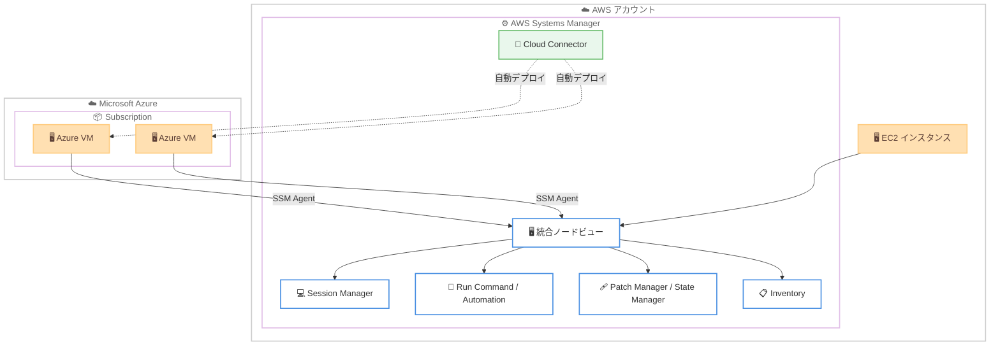

# AWS Systems Manager - Azure VM 管理とハイブリッドノード料金の簡素化

**リリース日**: 2026 年 7 月 7 日
**サービス**: AWS Systems Manager
**機能**: Cloud Connector による Azure Virtual Machines 管理と Advanced Instances Tier の廃止

📊 [このアップデートのインフォグラフィックを見る](https://takech9203.github.io/aws-news-summary/20260707-aws-systems-manager-multicloud-vm.html)
<!-- INFOGRAPHIC_BASE_URL は環境変数から取得 -->

## 概要

AWS Systems Manager が、Azure Virtual Machines (VM) の接続と管理を大幅に簡素化する新機能を発表しました。新しく追加された Cloud Connector を作成することで、手動でのエージェントインストールやインスタンスごとの階層料金を必要とせず、Azure VM を Systems Manager に接続できます。Cloud Connector は SSM Agent を Azure VM に大規模かつ自動的にデプロイします。

接続後、Azure VM は EC2 インスタンスと並んで統合ビューに表示されます。お客様は AWS と Azure の両方に対して、Session Manager による接続、Automation ランブックの実行、Run Command、State Manager、Patch Manager、Inventory を単一のワークフローから利用できます。これにより、マルチクラウド環境の運用管理を 1 つのコンソールに集約できます。

さらに、このリリースでは Advanced Instances Tier が完全に廃止されました。これにより、前払いのノードごとの料金なしで、任意の数のハイブリッドノードおよびマルチクラウドノードを Systems Manager に接続できるようになります。2026 年 9 月 30 日以降は、EC2 以外のノードに対する Session Manager セッションと Run Command 呼び出しに従量課金制の料金が適用されます。

**アップデート前の課題**

- Azure VM を Systems Manager で管理するには、各 VM に手動で SSM Agent をインストールする必要があった
- ハイブリッドノードやマルチクラウドノードを高度な機能で管理するには、Advanced Instances Tier のインスタンスごとの前払い料金が必要だった
- AWS と Azure の両環境を管理する際、統合されたビューやワークフローがなく、運用が分断されていた

**アップデート後の改善**

- Cloud Connector により SSM Agent を Azure VM に大規模かつ自動的にデプロイできるようになった
- Advanced Instances Tier が廃止され、前払いのノードごとの料金なしで任意の数の非 EC2 ノードを接続できるようになった
- Azure VM が EC2 インスタンスと同じ統合ビューに表示され、単一のワークフローから両環境を管理できるようになった

## アーキテクチャ図



Cloud Connector が Azure Subscription 内の VM に SSM Agent を自動デプロイし、接続された Azure VM は EC2 インスタンスと同じ統合ビューから各種 Systems Manager 機能で管理されます。

## サービスアップデートの詳細

### 主要機能

1. **Cloud Connector による Azure VM のオンボーディング**
   - Cloud Connector を作成し、Azure の Tenant と Subscription を指定して VM を接続する
   - SSM Agent を Azure VM に大規模かつ自動的にデプロイし、手動インストールが不要
   - `ValidateCloudConnector` により接続構成の検証やアクセス可否の確認ができる

2. **AWS と Azure の統合管理ビュー**
   - Azure VM が EC2 インスタンスと並んで統合ビューに表示される
   - `SourceType` として `Microsoft.Compute/virtualMachines` が識別され、ノード一覧やフィルタリングで区別できる
   - 単一のワークフローから両クラウドのノードを一元的に運用できる

3. **横断的な運用機能の利用**
   - Session Manager による安全なシェルアクセス
   - Automation ランブック、Run Command による自動化・コマンド実行
   - State Manager、Patch Manager による構成管理・パッチ適用
   - Inventory によるソフトウェアインベントリの収集

4. **Advanced Instances Tier の廃止**
   - インスタンスごとの前払い料金 (Advanced Instances Tier) が完全に廃止された
   - 任意の数のハイブリッドノードおよびマルチクラウドノードを前払い料金なしで接続できる
   - 2026 年 9 月 30 日以降、非 EC2 ノードに対して従量課金制へ移行する

## 技術仕様

### Cloud Connector の構成要素

| 項目 | 詳細 |
|------|------|
| 対応クラウド | Microsoft Azure (Azure Virtual Machines) |
| 認証 | Azure の Tenant ID、Application ID を用いたフェデレーション |
| 管理対象範囲 | 指定した Azure Subscription 配下の VM |
| エージェント配布 | SSM Agent を大規模かつ自動的にデプロイ |
| ノード識別 | `SourceType` = `Microsoft.Compute/virtualMachines` |

### API 変更履歴

| 日付 | サービス | 変更内容 |
|------|----------|----------|
| 2026/07/07 | [ssm](https://awsapichanges.com/archive/changes/f6d4b3-ssm.html) | 6 new 8 updated - Azure VM オンボーディング向けの Cloud Connector を追加 |

**新規追加された主な API メソッド**

- `CreateCloudConnector`: Azure 構成を指定して Cloud Connector を作成
- `GetCloudConnector`: Cloud Connector の詳細を取得
- `ListCloudConnectors`: Cloud Connector の一覧を取得 (Subscription ID / Tenant ID でフィルタ可能)
- `UpdateCloudConnector`: Cloud Connector の構成を更新
- `DeleteCloudConnector`: Cloud Connector を削除
- `ValidateCloudConnector`: 接続構成を検証し、アクセス可否や警告を確認

**更新された主な API メソッド**

- `DescribeInstanceInformation`、`DescribeInstanceProperties`、`ListNodes`、`ListNodesSummary`: `Microsoft.Compute/virtualMachines` を `SourceType` として認識
- `AddTagsToResource`、`RemoveTagsFromResource`、`ListTagsForResource`: `CloudConnector` リソースタイプに対応
- `ListAssociations`: `CloudConnectorId` によるフィルタリングに対応

### Cloud Connector 作成の設定例

```json
{
  "DisplayName": "azure-prod-connector",
  "RoleArn": "arn:aws:iam::123456789012:role/SSMCloudConnectorRole",
  "Description": "Azure production subscription connector",
  "Configuration": {
    "AzureConfiguration": {
      "TenantId": "00000000-0000-0000-0000-000000000000",
      "ApplicationId": "11111111-1111-1111-1111-111111111111",
      "Targets": {
        "Subscriptions": [
          {
            "Id": "22222222-2222-2222-2222-222222222222",
            "DisplayName": "Production"
          }
        ]
      }
    }
  }
}
```

## 設定方法

### 前提条件

1. AWS Systems Manager を利用する AWS アカウントと適切な IAM 権限
2. 管理対象の Azure VM が属する Azure Tenant および Subscription へのアクセス権
3. Azure 側で Cloud Connector が VM を検出・管理するための認証構成 (Application 登録など)

### 手順

#### ステップ 1: IAM ロールの準備

```bash
# Cloud Connector が使用する IAM ロールの ARN を確認
aws iam get-role --role-name SSMCloudConnectorRole
```

Cloud Connector が Azure との連携に使用する IAM ロールを準備します。このロールは SSM Agent のデプロイやノード管理に必要な権限を持ちます。

#### ステップ 2: Cloud Connector の作成

```bash
# Azure 構成を指定して Cloud Connector を作成
aws ssm create-cloud-connector \
  --display-name "azure-prod-connector" \
  --role-arn "arn:aws:iam::123456789012:role/SSMCloudConnectorRole" \
  --configuration '{"AzureConfiguration":{"TenantId":"<TENANT_ID>","ApplicationId":"<APP_ID>","Targets":{"Subscriptions":[{"Id":"<SUB_ID>","DisplayName":"Production"}]}}}'
```

Azure の Tenant ID、Application ID、対象 Subscription を指定して Cloud Connector を作成します。作成後、SSM Agent が対象 VM に自動的にデプロイされます。

#### ステップ 3: 接続の検証とノードの確認

```bash
# Cloud Connector の構成を検証
aws ssm validate-cloud-connector --cloud-connector-id <CONNECTOR_ID>

# 統合ビューで Azure VM を含むノードを確認
aws ssm list-nodes \
  --filters "Key=SourceType,Values=Microsoft.Compute/virtualMachines,Type=Equal"
```

`validate-cloud-connector` で接続構成やアクセス可否を確認し、`list-nodes` で Azure VM が管理ノードとして表示されることを確認します。以降は Session Manager や Run Command などの機能を利用できます。

## メリット

### ビジネス面

- **前払いコストの削減**: Advanced Instances Tier の廃止により、ノードごとの前払い料金なしで任意の数の非 EC2 ノードを接続できる
- **運用の一元化**: AWS と Azure のノードを単一コンソール・単一ワークフローで管理でき、運用チームの効率が向上する
- **マルチクラウド戦略の推進**: 規模に応じたコスト障壁が取り除かれ、大規模なマルチクラウド環境でも導入しやすくなる

### 技術面

- **エージェント管理の自動化**: SSM Agent の手動インストールが不要になり、大規模なデプロイを自動化できる
- **既存機能の再利用**: Session Manager、Patch Manager、Automation など、EC2 で使い慣れた機能を Azure VM にもそのまま適用できる
- **統一されたガバナンス**: パッチ適用、インベントリ収集、構成管理を両クラウドで統一的に実施できる

## デメリット・制約事項

### 制限事項

- 現時点で対応するマルチクラウドプロバイダーは Microsoft Azure (Azure Virtual Machines) である
- 2026 年 9 月 30 日以降、非 EC2 ノードに対する Session Manager セッションと Run Command 呼び出しに従量課金が発生する
- 公式発表では利用可能リージョンの明示的な記載がないため、利用前に対応リージョンの確認が必要

### 考慮すべき点

- Azure 側の認証構成 (Application 登録、権限付与) が正しく設定されている必要がある
- 従量課金への移行時期 (2026 年 9 月 30 日) を踏まえ、コスト試算を事前に行うことが望ましい
- ネットワーク経路や SSM Agent の通信要件を満たすよう Azure 環境を構成する必要がある

## ユースケース

### ユースケース 1: マルチクラウド環境の統合パッチ管理

**シナリオ**: AWS 上の EC2 と Azure 上の VM を運用する企業が、両環境のパッチ適用状況を一元的に把握・管理したい。

**実装例**:
```
1. Cloud Connector を作成して Azure VM をオンボーディング
2. Patch Manager のパッチベースラインを両環境に適用
3. 統合ビューでコンプライアンス状況を確認
```

**効果**: AWS と Azure のパッチ適用を単一のワークフローで統一でき、セキュリティコンプライアンスの可視性が向上する。

### ユースケース 2: Azure VM への安全なリモートアクセス

**シナリオ**: 踏み台サーバーや SSH キーの管理を避けつつ、Azure VM へ安全にアクセスしたい。

**実装例**:
```
aws ssm start-session --target <AZURE_VM_MANAGED_INSTANCE_ID>
```

**効果**: Session Manager を通じて、インバウンドポートを開けずに監査ログ付きで Azure VM にアクセスできる。

### ユースケース 3: 大規模ハイブリッド環境のコスト最適化

**シナリオ**: 数千台規模のオンプレミス・マルチクラウドノードを管理する組織が、前払い料金を抑えて Systems Manager を導入したい。

**実装例**:
```
1. Advanced Instances Tier 廃止により前払い料金なしで全ノードを接続
2. 必要な機能 (Session Manager、Run Command) のみを利用
3. 2026/09/30 以降は利用量に応じた従量課金でコストを管理
```

**効果**: 初期の前払いコストなしで大規模ノードを管理でき、実際の利用量に基づいたコスト最適化が可能になる。

## 料金

Advanced Instances Tier が完全に廃止され、ハイブリッドノードおよびマルチクラウドノードを前払いのノードごとの料金なしで接続できます。

2026 年 9 月 30 日以降、EC2 以外のノードに対する以下の操作に従量課金制の料金が適用されます。

| 対象 | 課金モデル |
|------|------------|
| 非 EC2 ノードの Session Manager セッション | 従量課金 (2026/09/30 以降) |
| 非 EC2 ノードの Run Command 呼び出し | 従量課金 (2026/09/30 以降) |
| ノードの接続・オンボーディング | 前払い料金なし |

正確な単価については、AWS Systems Manager の料金ページを確認してください。

## 利用可能リージョン

公式発表では利用可能リージョンの明示的な記載はありません。機能は発表日 (2026 年 7 月 7 日) 時点で利用可能とされています。利用前に AWS Systems Manager のドキュメントおよびリージョン別提供状況を確認してください。

## 関連サービス・機能

- **AWS Systems Manager Session Manager**: Azure VM を含む管理ノードへの安全なシェルアクセスを提供
- **AWS Systems Manager Patch Manager**: AWS と Azure の両ノードに対するパッチ適用とコンプライアンス管理
- **AWS Systems Manager Fleet Manager**: 統合ビューで EC2 と Azure VM を含むノードを一元管理
- **Amazon EC2**: 統合ビューで Azure VM と並んで管理される既存のコンピュートリソース

## 参考リンク

- 📊 [インフォグラフィック](https://takech9203.github.io/aws-news-summary/20260707-aws-systems-manager-multicloud-vm.html)
- [公式発表 (What's New)](https://aws.amazon.com/about-aws/whats-new/2026/06/aws-systems-manager-multicloud-vm/)
- [AWS Systems Manager](https://aws.amazon.com/systems-manager/)
- [AWS Systems Manager ドキュメント](https://docs.aws.amazon.com/systems-manager/)
- [AWS Systems Manager 料金ページ](https://aws.amazon.com/systems-manager/pricing/)
- [SSM API 変更履歴 (awsapichanges.com)](https://awsapichanges.com/archive/changes/f6d4b3-ssm.html)

## まとめ

このアップデートは、Cloud Connector による Azure VM の自動オンボーディングと Advanced Instances Tier の廃止により、マルチクラウド運用のコストと手間を大きく削減する重要な変更です。AWS と Azure を併用する組織は、Session Manager や Patch Manager など使い慣れた Systems Manager 機能を Azure VM にも拡張できます。2026 年 9 月 30 日からの非 EC2 ノードへの従量課金開始を見据え、早めに導入検証とコスト試算を進めることを推奨します。
